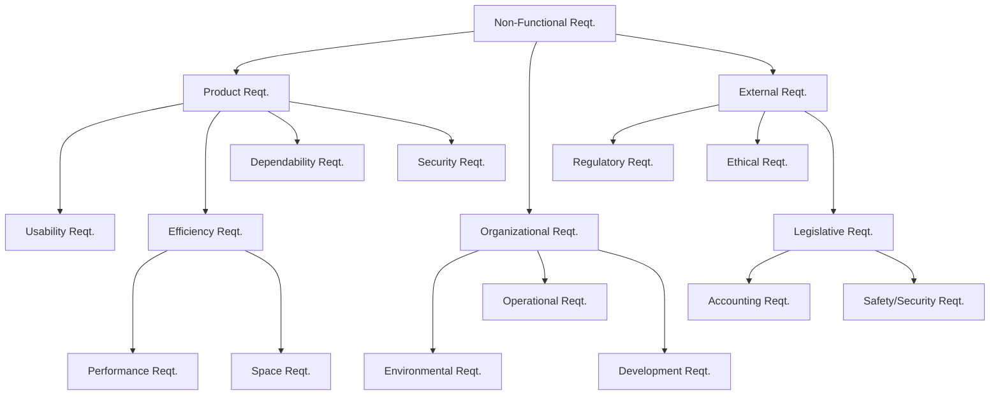
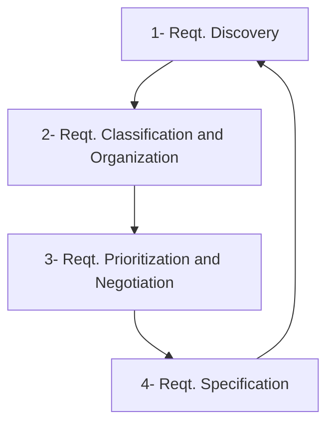
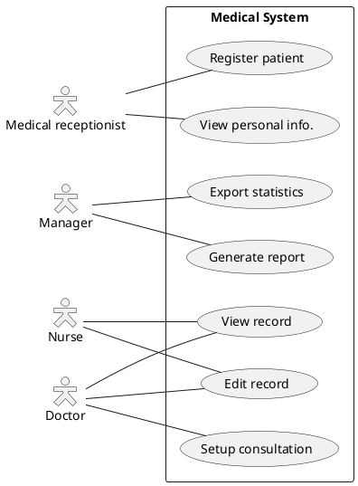

# Requirement engineering

**本章重點**
> * 何謂需求工程？他為什麼重要？
> * 需求的種類為何？
> * 使用者需求和系統需求的差異為何？
> * 功能性需求與非功能性需求的差異為何？
> * 非功能性需求包含哪些？

---

[Slide](
https://docs.google.com/presentation/d/17drPflem_2jq_6JBynaP7qkHcIwD8p5b/edit?usp=sharing&ouid=109022309423128079509&rtpof=true&sd=true)

---

## 1. Requirements engineering
* The process of establishing the services that acustomer requires from a system and the constraints under which it operates and is developed.
* The system requirements are the descriptions of the system services and constraints that are generated during the requirements engineering process.

---

**What is a requirement?**

* It may range from a **high-level** abstract statement of a service or of a system constraint to a **detailed** mathematical functional specification.
* This is inevitable as requirements may serve a dual function
    * May be the basis for a **bid for a contract** - therefore must be open to interpretation;
    * May be the basis for the **contract** itself - therefore must be defined in detail;
* Both these statements may be called requirements.

---

### Requirements abstraction

> If a company wishes to let a **contract** for a large software development project, it must define its needs in a abstract way that a solution is not pre-defined. The requirements must be written so that several contractors can bid for the contract, offering, perhaps, different ways of meeting the client organization’s needs. 

> Once a **contract** has been awarded, the contractor must write a system definition for the client in more detail so that the client understands and can validate what the software will do. Both of these documents may be called the **requirements document** for the system.

--- 

### User and System Requirement

* **User requirements**
    * Statements in **natural** language plus diagrams of the services the system provides and its operational constraints. Written for customers.
* **System requirements**
    * A **structured** document setting out detailed descriptions of the system’s functions, services and operational constraints. Defines what should be implemented so may be part of a contract between client and contractor.

**User Requirement Definition**

> **1.** The MHC-PMS shall generate monthly management reports showing the cost of drugs prescribed by each clinic during that month.

**System Requirements Specification**

* **1.1** On the last working day of each month, a summary of the drugs prescribed, their cost, and the prescribing clinics shall be generated.
* **1.2** The system shall automatically generate the report for printing after 17:30 on the last working day of the month.
* **1.3** A report shall be created for each clinic and shall list the individual drug names, the total number of prescriptions, the number of doses prescribed, and the total cost of the prescribed drugs.
* **1.4** If drugs are available in different dose units (e.g., 10 mg, 20 mg) separate reports shall be created for each dose unit. 
* **1.5** Access to all cost reports shall be restricted to authorized users listed on a management access control list.

---

#### System stakeholders
* Any person or organization who is affected by the system in some way and so who has a legitimate interest
* Stakeholder types
    * End users
    * System managers
    * System owners
    * External stakeholders

> 👍 與系統相關的利害關係人 (stakeholder) 都可能是成敗關鍵。

---

#### Examples: 🏥 Mentcare system 
* **👤 Patients** whose information is recorded in the system.
* **👤 Doctors** who are responsible for assessing and treating patients.
* **👤 Nurses** who coordinate the consultations with doctors and administer some treatments.
* **👤 Medical receptionists** who manage patients’ appointments.
* **👤 IT staff** who are responsible for installing and maintaining the system.
* **👤 A medical ethics manager** who must ensure that the system meets current ethical guidelines for patient care.
* **👤 Health care managers** who obtain management information from the system.
* **👤 Medical records staff** who are responsible for ensuring that system information can be maintained and preserved, and that record keeping procedures have been properly implemented.

---

> 💡💬 選擇一個系統，描述該系統的 Stakeholder
> * Ace 網球會員管理系統
> * HappyBear 訂餐系統
> * ezGo 旅遊規劃系統
> * 喀嚓 相機租借系統
> * ShowShow 電影訂位系統
> * 逢大 選課系統

---

## 2. Type of Requirements

* **1️⃣ Functional** requirements
    * Statements of services the system should provide, how the system should **react** to particular inputs and how the system should behave in particular situations.
    * May state what the system should not do.
* **2️⃣ Non-functional** requirements
    * **Constraints** on the services or functions offered by the system such as timing **constraints**, constraints on the development process, standards, etc.
    * Often apply to the system as a **whole** rather than individual features or services.
* **3️⃣ Domain** requirements
    * Constraints on the system from the domain of operation

---

### Functional requirements
* Describe **functionality** or system services.
* Depend on the type of software, expected users and the type of system where the software is used.
* Functional **user** requirements may be high-level statements of what the system should do.
* Functional **system** requirements should describe the system services in detail.

---

**Example: 🏥 Mentcare system**
* A user **shall** be able to search the appointments lists for all clinics.
* The system **shall** generate each day, for each clinic, a list of patients who are expected to attend appointments that day. 
* Each staff member using the system **shall** be uniquely identified by his or her 8-digit employee number. 

---

#### Requirements imprecision

* Problems arise when functional requirements are not precisely stated.
* **Ambiguous** requirements may be interpreted in different ways by developers and users.
* Consider the term **‘search’** in requirement 1
    * User intention – search for a patient name across all appointments in all clinics;
    * Developer interpretation – search for a patient name in an individual clinic. User chooses clinic then search.

---

#### Requirements completeness and consistency
* In principle, requirements should be both **complete** and **consistent**.
* **Complete**: They should include descriptions of all facilities required.
* **Consistent**: There should be no conflicts or contradictions in the descriptions of the system facilities.
* In practice, because of system and environmental complexity, it is impossible to produce a complete and consistent requirements document.

---

> 💡💬 選擇一個系統，描述該系統內 FR，並互相找出模糊/相衝突的需求
> * Ace 網球會員管理系統
> * HappyBear 訂餐系統
> * ezGo 旅遊規劃系統
> * 喀嚓 相機租借系統
> * ShowShow 電影訂位系統
> * 逢大 選課系統

---

### Non-functional requirements
* These define system **properties** and **constraints** e.g. reliability, response time and storage requirements. Constraints are I/O device capability, system representations, etc.
* Process requirements may also be specified mandating a particular IDE, programming language or development method.
* Non-functional requirements may be more critical than functional requirements. If these are not met, the system may be useless.

---

#### Types of nonfunctional requirement 

<!--  -->

#### Non-functional requirements implementation
* Non-functional requirements may affect the **overall** architecture of a system rather than the individual components. 
    * For example, to ensure that performance requirements are met, you may have to organize the system to minimize **communications** between components.
* A single non-functional requirement, such as a **security** requirement, may generate a number of related functional requirements that define system services that are required. 
    * It may also generate requirements that restrict existing requirements. 

---

#### Non-functional classifications
* **Product** requirements
    * Requirements which specify that the delivered product must behave in a particular way e.g. execution speed, reliability, etc.
* **Organisational** requirements
    * Requirements which are a consequence of organisational policies and procedures e.g. process standards used, implementation requirements, etc.
* **External** requirements
    * Requirements which arise from factors which are external to the system and its development process e.g. interoperability requirements, legislative requirements, etc.

---

**Examples**

* The Mentcare system shall be **available** to all clinics during normal working hours (Mon–Fri, 0830–17.30). 
    * Downtime within normal working hours shall not exceed **five seconds** in any one day.
* Organizational requirement
    * Users of the Mentcare system shall authenticate themselves using their **health authority identity card**.
* External requirement
    * The system shall implement patient privacy provisions as set out in **HStan-03-2006-priv**. 

---

#### Goals and requirements

* Non-functional requirements may be very **difficult to state precisely** and imprecise requirements may be difficult to verify. 
* Goal
    * A general intention of the user such as ease of use.
* **Verifiable** non-functional requirement
    * A statement using some measure that can be objectively tested.
* Goals are helpful to developers as they convey the intentions of the system users.

---

> 👍 汽車等交通工具的要求目標是「安全舒適」，不是一定要有方向盤腳踏板。

---

**Usability requirements**
* The system should be easy to use by medical staff and should be organized in such a way that user errors are minimized. (Goal)
* Medical staff shall be able to use all the system functions after four hours of training. After this training, the average number of errors made by experienced users shall not exceed two per hour of system use. (Testable non-functional requirement)

> Goal-Question-Metric (GQM approach)

---

**設計一個好用的醫療系統：**

* **Goal (目標)**: 我們要設計一個**新版醫療系統**，確保**使用者能高效且準確地完成任務**，從而**提升醫療人員的工作效率與病患照護品質**。這個目標不僅定義了系統的用途，也說明了其最終的價值。

* **Questions (問題)**: 為了達成這個目標，我們需要問一些關鍵問題來引導設計與評估：
  * 1.  **效率問題**：使用者完成關鍵任務需要花多少時間？
      * 例如：醫生開立一張處方籤或護士錄入一份病歷，所需時間是否比舊系統更短？
      * 例如：新進員工是否能在短時間內學會使用系統並順利上手？
  * 2.  **準確性問題**：使用者在操作過程中出錯的機率有多高？
    * 例如：在填寫病歷或開立藥物時，系統是否能有效減少人為輸入錯誤？
    * 例如：系統在數據傳輸或顯示上是否會出現錯誤，導致資訊不一致？
  * 3.  **滿意度問題**：使用者對系統的整體感受如何？
    * 例如：醫療人員是否認為系統界面直觀、好用？
    * 例如：使用者是否會因為系統的某些功能感到沮喪或困惑？

* **Metrics (指標)**: 根據這些問題，我們可以定義具體的、可衡量的**指標**來評估系統的可用性：
  * 1.  **效率指標 (來自「效率問題」)**：
    * **任務完成時間 (Task Completion Time)**：記錄不同使用者完成特定任務（如：開立處方籤）所需的時間，並與舊系統做比較。
    * **學習曲線時間 (Time-to-learn)**：統計新使用者學會使用系統基本功能所需的時間。
  * 2.  **準確性指標 (來自「準確性問題」)**：
    * **錯誤率 (Error Rate)**：記錄使用者在執行任務過程中發生錯誤（如：點擊錯誤按鈕、輸入錯誤數據）的次數。
    * **數據一致性比率 (Data Consistency Ratio)**：檢查系統中不同頁面或模組的數據是否保持一致。
  * 3.  **滿意度指標 (來自「滿意度問題」)**：
    * **使用者滿意度問卷 (User Satisfaction Survey)**：透過問卷（例如：SUS, System Usability Scale）來量化使用者對系統的滿意度。
    * **淨推薦值 (Net Promoter Score, NPS)**：詢問使用者是否願意向同事推薦這個新系統，以評估其整體滿意度與忠誠度。

---

#### Metrics for specifying nonfunctional requirements

Property and Measure

* Speed
    * Processed transactions/second
    * User/event response time
    * Screen refresh time
* Size
    * Mbytes
    * Number of ROM chips
* Ease of use
    * Training time
    * Number of help frames
* Reliability
    * Mean time to failure
    * Probability of unavailability
    * Rate of failure occurrence
    * Availability
* Robustness
    * Time to restart after failure
    * Percentage of events causing failure
    * Probability of data corruption on failure
* Portability
    * Percentage of target dependent statements
    * Number of target systems

---

> 💡💬 選擇一個系統，描述該系統內 NFR
> * Ace 網球會員管理系統
> * HappyBear 訂餐系統
> * ezGo 旅遊規劃系統
> * 喀嚓 相機租借系統
> * ShowShow 電影訂位系統
> * 逢大 選課系統

---

[參考作答](https://docs.google.com/document/d/10agH0sTjFIRmYzCsYkvKNhb5Lu3cpRnJQbqd9FN78W4/edit?usp=sharing)

---

## 3. Requirement Engineering processes

👉 Elicitation analysis process

---

> 🤔🤔 簽約後開始進行專案開發，所以開發需求規格-- 但規格都還不清楚怎麼能夠簽訂合約？

---

### A. Requirements elicitation

* Requirements elicitation and analysis
* Sometimes called **requirements elicitation** or **requirements discovery**.
* Involves technical staff working with customers to find out about the application domain, the services that **the system should provide and the system’s operational constraints.**
* May involve end-users, managers, engineers involved in maintenance, domain experts, trade unions, etc. These are called **stakeholders**.

---

#### Requirements elicitation
* Software engineers work with a range of system stakeholders to find out about the application domain, the services that the system should provide, the required system performance, hardware constraints, other systems, etc.
* Stages include:
    * Requirements discovery,
    * Requirements classification and organization,
    * Requirements prioritization and negotiation,
    * Requirements specification.

---

<!--  -->

👉 Reqt elicitation and analysis process

---

> 互動與挖掘、分類與組織、排序與協商、文件化

---

##### Requirements discovery
* The process of **gathering** information about the required and existing systems and distilling the user and system requirements from this information.
* **Interaction** with system stakeholders from managers to external regulators.
* Systems normally have a range of **stakeholders**.

---

##### Interviewing
* **Formal** or **informal** interviews with stakeholders are part of most RE processes.
* Types of interview
    * **Closed interviews** based on pre-determined list of questions
    * **Open interviews** where various issues are explored with stakeholders.
* Effective interviewing
    * Be **open-minded**, avoid pre-conceived ideas about the requirements and are willing to listen to stakeholders. 
    * **Prompt** the interviewee to get discussions going using a springboard question, a requirements proposal, or by working together on a prototype system. 

---

##### Interviews in practice
* Normally a **mix** of closed and open-ended interviewing.
* Interviews are good for getting an **overall understanding** of what stakeholders do and how they might interact with the system.
* Interviewers need to be **open-minded** without pre-conceived ideas of what the system should do
* You need to **prompt** the use to talk about the system by suggesting requirements rather than simply asking them what they want.

---

##### Problems with interviews
* Application **specialists** may use language to describe their work that isn’t easy for the requirements engineer to understand.
* Interviews are not good for understanding **domain** requirements
    * Requirements engineers cannot understand specific domain **terminology**;
    * Some domain knowledge is so **familiar** that people find it hard to articulate or think that it isn’t worth articulating.

---

##### Ethnography (民族誌; 用戶觀察法)
* A social scientist spends a considerable time **observing** and analysing how people actually work.
* People do not have to explain or articulate their work.
* Social and organisational factors of importance may be observed.
* Ethnographic studies have shown that work is usually **richer** and more **complex** than suggested by simple system models.

> 技術民族誌之所以使用「民族誌」這個詞，是因為它採用了民族誌研究的方法，例如觀察、參與、訪談等。這些方法可以幫助研究者深入瞭解研究群體的行為和需求。

> 因此，技術民族誌可以理解為一種應用民族誌方法的研究技術，它可以用於研究任何群體，包括軟體使用者、工程師、設計師等。其目的是透過觀察和參與，以深入了解研究群體的工作方式和需求。

> 👍 透過實際觀察，找出隱性需求

---

##### Stories and scenarios

* **Scenarios** and user stories are real-life examples of how a system can be used.
* Stories and scenarios are a description of how a system may be **used** for a particular task.
* Because they are based on a **practical** situation, stakeholders can relate to them and can comment on their situation with respect to the story.

---

##### Photo sharing in the classroom (iLearn)

> *Jack* is a primary school teacher in **Ullapool** (a village in northern Scotland). He has decided that a class project should be focused around the fishing industry in the area, looking at the history, development and economic impact of fishing. 
> As part of this, pupils are asked to gather and share reminiscences from relatives, use newspaper archives and collect old photographs related to fishing and fishing communities in the area. Pupils use an **iLearn** wiki to gather together fishing stories and **SCRAN** (a history resources site) to access newspaper archives and photographs. 
> However, *Jack* also needs a photo sharing site as he wants pupils to take and comment on each others’ photos and to upload scans of old photographs that they may have in their families. 
> *Jack* sends an email to a primary school teachers group, which he is a member of to see if anyone can recommend an appropriate system. Two teachers reply and both suggest that he uses **KidsTakePics**, a photo sharing site that allows teachers to check and moderate content. As **KidsTakePics** is not integrated with the iLearn authentication service, he sets up a teacher and a class account. He uses the **iLearn** setup service to add KidsTakePics to the services seen by the pupils in his class so that when they log in, they can immediately use the system to upload photos from their mobile devices and class computers.
>> 傑克是阿勒浦（蘇格蘭北部的一個村莊）的小學老師。他決定課程專題計畫應專注於該地區的漁業，研究漁業的歷史、發展和經濟影響。作為其中的一部分，學生被要求收集和分享親戚的回憶，使用報紙檔案並收集與該地區漁業和漁業社區有關的舊照片。學生使用 iLearn wiki 收集釣魚故事，並使用 SCRAN（歷史資源網站）存取報紙檔案和照片。然而，傑克還需要一個照片分享網站，因為他希望學生拍攝和評論彼此的照片，並上傳他們家裡可能有的舊照片的掃描件。傑克向他所屬的小學教師小組發送了一封電子郵件，看看是否有人可以推薦合適的系統。兩位老師回覆並建議他使用 **KidsTakePics**，這是一個照片分享網站，允許老師檢查和審核內容。由於 KidsTakePics 未與 iLearn 身份驗證服務集成，因此他設定了教師帳戶和班級帳戶。他使用 iLearn 設定服務將 KidsTakePics 新增到班級學生看到的服務中，以便他們登入後可以立即使用該系統從行動裝置和班級電腦上傳照片。

##### Scenarios
* A structured form of user story
* Scenarios should include
    * A description of the **starting** situation;
    * A description of the **normal** flow of events;
    * A description of what can go **wrong**;
    * Information about other concurrent **activities**;
    * A description of the **state** when the scenario finishes.

##### Uploading photos (iLearn)

* **Initial assumption**: A user or a group of users have one or more digital photographs to be uploaded to the picture sharing site. These are saved on either a tablet or laptop computer. They have successfully logged on to KidsTakePics.
* **Normal**:  The user chooses upload photos and they are prompted to select the photos to be uploaded on their computer and to select the project name under which the photos will be stored. They should also be given the option of inputting keywords that should be associated with each uploaded photo. Uploaded photos are named by creating a conjunction of the user name with the filename of the photo on the local computer.
* **On completion of the upload**, the system automatically sends an email to the project moderator asking them to check new content and generates an on-screen message to the user that this has been done. 
* **What can go wrong:** 
    - **No moderator** is associated with the selected project. An email is automatically generated to the school administrator asking them to nominate a project moderator. Users should be informed that there could be a delay in making their photos visible.
    - Photos with the **same name** have already been uploaded by the same user. The user should be asked if they wish to re-upload the photos with the same name, rename the photos or cancel the upload. If they chose to re-upload the photos, the originals are overwritten. If they chose to rename the photos, a new name is automatically generated by adding a number to the existing file name.
* **Other activities**:  The moderator may be logged on to the system and may approve photos as they are uploaded.
* **System state on completion**: User is logged on. The selected photos have been uploaded and assigned a status ‘awaiting moderation’.  Photos are visible to the moderator and to the user who uploaded them.

**Scenario:**
用故事敘事方式擷取需求
* 開始的情境
* 先考慮正常的使用情境、完成後的狀態
* 再考慮可能出錯的點、處理的方式

---

#### Requirements specification
* The process of **writing down** the user and system requirements in a requirements document.
* User requirements have to be **understandable** by end-users and customers who do not have a technical background.
* System requirements are more **detailed** requirements and may include more technical information.
* The requirements may be part of a contract for the system development
* It is therefore important that these are as **complete** as possible.

#### Ways of writing a system requirements specification 

| Notation                        | Description                                                                                                                                                                                                                                                                                                                                                  |
| ------------------------------- | ------------------------------------------------------------------------------------------------------------------------------------------------------------------------------------------------------------------------------------------------------------------------------------------------------------------------------------------------------------ |
| Natural language                | The requirements are written using numbered sentences in natural language. Each sentence should express one requirement.                                                                                                                                                                                                                                     |
| Structured natural language     | The requirements are written in natural language on a **standard form** or template. Each field provides information about an aspect of the requirement.                                                                                                                                                                                                     |
| Design description languages    | This approach uses a language like a **programming** language, but with more abstract features to specify the requirements by defining an operational model of the system. This approach is now rarely used although it can be useful for interface specifications.                                                                                          |
| Graphical notations             | Graphical models, supplemented by text annotations, are used to define the functional requirements for the system; **UML** use case and sequence diagrams are commonly used.                                                                                                                                                                                 |
| **Mathematical** specifications | These notations are based on mathematical concepts such as finite-state machines or **sets**. Although these unambiguous specifications can reduce the ambiguity in a requirements document, most customers don’t understand a formal specification. They cannot check that it represents what they want and are reluctant to accept it as a system contract |

> 表達技巧：自然語言、圖、表、模組圖、數學式

#### Requirements and design
* In principle, requirements should state what the system should do and the design should describe how it does this.
* In practice, requirements and design are **inseparable**
    * A system architecture may be designed to structure the requirements;
    * The system may inter-operate with other systems that generate design requirements;
    * The use of a specific architecture to satisfy non-functional requirements may be a domain requirement.
    * This may be the consequence of a regulatory requirement.

> 規格書難免會描述到一些設計

#### Natural language specification
* Requirements are written as natural language sentences supplemented by **diagrams** and **tables**.
* Used for writing requirements because it is expressive, intuitive and universal. This means that the requirements  can be understood by users and customers.

---

##### 💡 Guidelines for writing requirements
* Invent a **standard format** and use it for all requirements.
* Use language in a **consistent** way. Use **shall** for mandatory requirements, **should** for desirable requirements.
* Use text **highlighting** to identify key parts of the requirement.
* Avoid the use of computer jargon.
* Include an explanation (rationale) of **why** a requirement is necessary.

---

##### Problems with natural language
* **Lack of clarity**: Precision is difficult without making the document difficult to read.
* **Requirements confusion**: Functional and non-functional requirements tend to be mixed-up.
* **Requirements amalgamation**: Several different requirements may be expressed together.

---

#### 🏥 Example requirements for the insulin pump software system 
* **3.2** The system shall measure the blood sugar and deliver insulin, if required, every 10 minutes. (Changes in blood sugar are relatively slow so more frequent measurement is unnecessary; less frequent measurement could lead to unnecessarily high sugar levels.)
* **3.6** The system shall run a self-test routine every minute with the conditions to be tested and the associated actions defined in Table 1. (A self-test routine can discover hardware and software problems and alert the user to the fact the normal operation may be impossible.)

---

#### Structured specifications
* An approach to writing requirements where the freedom of the requirements writer is limited and requirements are written in a **standard** way.

* This works well for some types of requirements e.g. requirements for embedded control system but is sometimes too rigid for writing business system requirements.

---

##### Form-based specifications
* Definition of the **function** or **entity**.
* Description of **inputs** and where they come from.
* Description of **outputs** and where they go to.
* Information about the information needed for the **computation** and other entities used.
* Description of the **action** to be taken.
* **Pre** and **post** conditions (if appropriate).
* The **side effects** (if any) of the function.

---

#### 🏥 A structured specification of a requirement for an insulin pump:

***Insulin Pump/Control Software/SRS/3.3.2***
- **Function Compute**: insulin dose: (in safe sugar level) 
- **Description**: Computes the dose of insulin to be delivered when the current measured sugar level is in the safe zone between 3 and 7 units. 
- **Inputs**: Current sugar reading (r2); the previous two readings (r0 and r1). 
- **Source**: Current sugar reading from sensor. Other readings from memory. 
- **Outputs**: CompDose the dose in insulin to be delivered.
- **Destination**: Main control loop.
- **Action**: *CompDose* is zero if the sugar level is stable or falling or if the level is increasing but the rate of increase is decreasing. If the level is increasing and the rate of increase is increasing, then *CompDose* is computed by dividing the difference between the current sugar level and the previous level by 4 and rounding the result. If the result, is rounded to zero then *CompDose* is set to the minimum dose that can be delivered. 
- **Requirements**: Two previous readings so that the rate of change of sugar level can be computed. 
- **Pre-condition**: The insulin reservoir contains at least the maximum allowed single dose of insulin. 
- **Post-condition**: *r0* is replaced by *r1* then *r1* is replaced by *r2*. 
- **Side effects**: None.

---

##### Tabular specification 

* Used to supplement natural language.
* Particularly useful when you have to define a number of possible alternative courses of action.
* For example, the insulin pump systems bases its computations on the rate of change of blood sugar level and the tabular specification explains how to calculate the insulin requirement for different scenarios.

**🏥 Tabular Specification of the insulin pump system**

---

| Condition                                                                           | Action                                                                      |
| ----------------------------------------------------------------------------------- | --------------------------------------------------------------------------- |
| Sugar level falling (r2 <r1)                                                        | CompDose = 0                                                                |
| Sugar level stable (r2 = r1)                                                        | CompDose = 0                                                                |
| Sugar level increasing and the rate of increasse decreasing (r2-r1)<(r1-r0)         | CompDose = 0                                                                |
| Sugar level increasing and rate of increase stable or increasing ((r2-r1)>=(r1-r0)) | CompDos= round ((r2-r1)/4) If rounded result = 0 then CompDose Minimum Dose |

---

#### Graphic notation: Use cases
* Use-cases are a kind of scenario that are included in the UML. 
* Use cases identify the **actors** in an interaction and which describe the interaction itself.
* A set of use cases should describe all possible interactions with the system.
* High-level graphical model supplemented by more detailed tabular description.
* UML **sequence diagrams** may be used to add detail to use-cases by showing the sequence of event processing in the system.

<!--  -->
  

---

### B. Requirements validation

[nlh slide- how to write requirements specification](https://docs.google.com/presentation/d/1JYeKCF3w_T1AfgAIoTwjmzLfn_S2wfu6jWZh85lJnG8/edit?usp=sharing)

#### Requirements validation
* Concerned with demonstrating that the requirements define the system that the customer really wants.
* Requirements error costs are high so validation is very important
    * Fixing a requirements error after delivery may cost up to 100 times the cost of fixing an implementation error.

#### Requirements checking
* **Validity**. Does the system provide the functions which best support the customer’s needs?
* **Consistency**. Are there any requirements conflicts?
* **Completeness**. Are all functions required by the customer included?
* **Realism**. Can the requirements be implemented given available budget and technology
* **Verifiability**. Can the requirements be checked?

> 正確嗎？一致嗎？完整嗎？實際嗎？可檢驗嗎？

#### Requirements validation techniques
* **Requirements reviews**: Systematic manual analysis of the requirements.
* **Prototyping**: Using an executable model of the system to check requirements.
* **Test-case generation**: Developing tests for requirements to check testability.

#### Requirements reviews
* Regular reviews should be held while the requirements definition is being formulated.
* Both client and contractor staff should be involved in reviews.
* Reviews may be formal (with completed documents) or informal. 
* Good communications between developers, customers and users can resolve problems at an early stage.

---

#### Review checks
* **Verifiability**: Is the requirement realistically testable?
* **Comprehensibility**: Is the requirement properly understood?
* **Traceability**: Is the origin of the requirement clearly stated?
* **Adaptability**: Can the requirement be changed without a large impact on other requirements?

---
### C. Requirements change and management

#### Changing requirements
* The business and technical environment of the system always changes after installation. 
    * New hardware may be introduced, it may be necessary to interface the system with other systems, business priorities may change (with consequent changes in the system support required), and new legislation and regulations may be introduced that the system must necessarily abide by. 
* The people who pay for a system and the users of that system are rarely the same people. 
    * System customers impose requirements because of organizational and budgetary constraints. These may conflict with end-user requirements and, after delivery, new features may have to be added for user support if the system is to meet its goals.

:::info
付錢的並不一定是使用的
:::

#### Changing requirements
* Large systems usually have a diverse user community, with many users having different requirements and priorities that may be conflicting or contradictory. 
* The final system requirements are inevitably a compromise between them and, with experience, it is often discovered that the balance of support given to different users has to be changed.

#### Requirements management
* Requirements management is the process of managing changing requirements during the requirements engineering process and system development.
* New requirements emerge as a system is being developed and after it has gone into use.
* You need to keep track of individual requirements and maintain links between dependent requirements so that you can assess the impact of requirements changes. You need to establish a formal process for making change proposals and linking these to system requirements. 

:::info
變更審查委員會！
:::

#### Requirements management planning
* Establishes the level of requirements management detail that is required.
* Requirements management decisions:
    * **Requirements identification**: Each requirement must be uniquely identified so that it can be cross-referenced with other requirements. 
    * **A change management process** This is the set of activities that assess the impact and cost of changes. I discuss this process in more detail in the following section.
    * **Traceability policies** These policies define the relationships between each requirement and between the requirements and the system design that should be recorded. 
    * **Tool support** Tools that may be used range from specialist requirements management systems to spreadsheets and simple database systems.

> 變了這個，影響了哪些？

#### Requirements change management
* Deciding if a requirements change should be accepted
    * Problem analysis and change specification 
        * During this stage, the problem or the change proposal is analyzed to check that it is valid. This analysis is fed back to the change requestor who may respond with a more specific requirements change proposal, or decide to withdraw the request.
    * Change analysis and costing 
        * The effect of the proposed change is assessed using traceability information and general knowledge of the system requirements. Once this analysis is completed, a decision is made whether or not to proceed with the requirements change.
    * Change implementation 
        * The requirements document and, where necessary, the system design and implementation, are modified. Ideally, the document should be organized so that changes can be easily implemented.

---

### D. The software requirements document
* The software requirements document is the official statement of what is required of the system developers.
* Should include both a definition of user requirements and a specification of the system requirements.
* It is NOT a design document. As far as possible, it should set of WHAT the system should do rather than HOW it should do it.

#### Users of a requirements document 

| Who                          | Goal                                                                                                                       |
| ---------------------------- | -------------------------------------------------------------------------------------------------------------------------- |
| System Customers             | Specify the requirements and read them to check that they meet their needs. Customers specify changes to the requirements. |
| Manager                      | Use the requirements document to plan a bid for the system and to plan the system development process.                     |
| System engineer              | Use the requirements to understand what system is to be developed.                                                         |
| System test engineer         | Use the requirements to develop validation tests for the system.                                                           |
| System maintenance engineers | Use the requirements to understand the system and the relationships between its parts.                                     |

#### Requirements document variability
* Information in requirements document depends on type of system and the approach to development used.
* Systems developed incrementally will, typically, have less detail in the requirements document.
* Requirements documents standards have been designed e.g. IEEE standard. These are mostly applicable to the requirements for large systems engineering projects.

#### The structure of a requirements document 

:::info

| Chapter                           | Description                                                                                                                                                                                                                                                                                                                                                           |
| --------------------------------- | --------------------------------------------------------------------------------------------------------------------------------------------------------------------------------------------------------------------------------------------------------------------------------------------------------------------------------------------------------------------- |
| Preface                           | This should define the expected readership of the document and describe its version history, including a rationale for the creation of a new version and a summary of the changes made in each version.                                                                                                                                                               |
| Introduction                      | This should describe the need for the system. It should briefly describe the system’s functions and explain how it will work with other systems. It should also describe how the system fits into the overall business or strategic objectives of the organization commissioning the software.                                                                        |
| Glossary                          | This should define the technical terms used in the document. You should not make assumptions about the experience or expertise of the reader.                                                                                                                                                                                                                         |
| User requirements definition      | Here, you describe the services provided for the user. The nonfunctional system requirements should also be described in this section. This description may use natural language, diagrams, or other notations that are understandable to customers. Product and process standards that must be followed should be specified.                                         |
| System architecture               | This chapter should present a high-level overview of the anticipated system architecture, showing the distribution of functions across system modules. Architectural components that are reused should be highlighted.                                                                                                                                                |
| System requirements specification | This should describe the functional and nonfunctional requirements in more detail. If necessary, further detail may also be added to the nonfunctional requirements. Interfaces to other systems may be defined.                                                                                                                                                      |
| System models                     | This might include graphical system models showing the relationships between the system components and the system and its environment. Examples of possible models are object models, data-flow models, or semantic data models.                                                                                                                                      |
| System evolution                  | This should describe the fundamental assumptions on which the system is based, and any anticipated changes due to hardware evolution, changing user needs, and so on. This section is useful for system designers as it may help them avoid design decisions that would constrain likely future changes to the system.                                                |
| Appendices                        | These should provide detailed, specific information that is related to the application being developed; for example, hardware and database descriptions. Hardware requirements define the minimal and optimal configurations for the system. Database requirements define the logical organization of the data used by the system and the relationships between data. |
| Index                             | Several indexes to the document may be included. As well as a normal alphabetic index, there may be an index of diagrams, an index of functions, and so on.                                                                                                                                                                                                           |
:::

More 
* [Use case as specification](https://hackmd.io/@nlhsueh/H1DMCgvao/https%3A%2F%2Fhackmd.io%2F%40nlhsueh%2FHJP7Tuwpo#UML-%E4%BD%9C%E7%82%BA%E9%9C%80%E6%B1%82%E8%A6%8F%E6%A0%BC%E6%9B%B8)
* [宜蘭縣政府-R01_軟體需求規格參考範本](https://ws.e-land.gov.tw/Download.ashx?u=LzAwMS8yMDE1eWlsYW4vMjA3L3JlbGZpbGUvOTM0MS8xMDQ5NTIvNzYxMzM2NWMtNjIzYy00NTc4LWI5YmQtYjE1NjQzNWFkNDdjLnBkZg%3D%3D&n=6Luf6auU6ZyA5rGC6KaP5qC85Y%2BD6ICD56%2BE5pysLnBkZg%3D%3D&icon=..pdf)

---

## Key points
* Requirements for a software system set out what the system should do and define constraints on its operation and implementation.
* Functional requirements are statements of the services that the system must provide or are descriptions of how some computations must be carried out. 
* Non-functional requirements often constrain the system being developed and the development process being used. 
* They often relate to the emergent properties of the system and therefore apply to the system as a whole.
* The requirements engineering process is an iterative process that includes requirements elicitation, specification and validation.
* Requirements elicitation is an iterative process that can be represented as a spiral of activities – requirements discovery, requirements classification and organization, requirements negotiation and requirements documentation. 
* You can use a range of techniques for requirements elicitation including interviews and ethnography. User stories and scenarios may be used to facilitate discussions.
* Requirements specification is the process of formally documenting the user and system requirements and creating a software requirements document.
* The software requirements document is an agreed statement of the system requirements. It should be organized so that both system customers and software developers can use it.
* Requirements validation is the process of checking the requirements for validity, consistency, completeness, realism and verifiability. 
* Business, organizational and technical changes inevitably lead to changes to the requirements for a software system. Requirements management is the process of managing and controlling these changes.