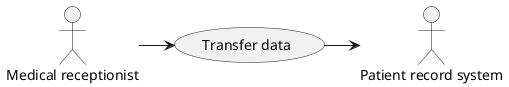
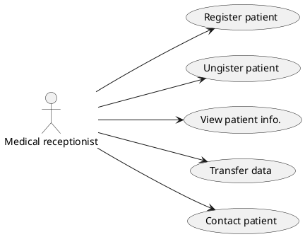
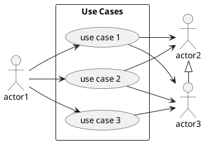
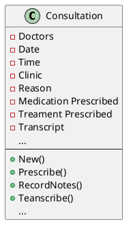
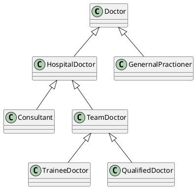

# System modeling

[Slide](https://docs.google.com/presentation/d/1rV74y_b4OMAj6amXETRWJnahGUeP2fWZ/edit?usp=sharing&ouid=109022309423128079509&rtpof=true&sd=true)

:::success
本章重點

* 什麼是系統塑模 (modeling)？為什麼需要？
* 環境塑模 (context model) 描述系統與外在的實體的交互關係；
* 互動塑模 (interaction model) 描述使用者的目標，及與系統的互動模式；
* 結構塑模 (structural model) 描述系統的概念模型、資料模型與物件模型；
* 行為塑模 (behavioral model) 描述系統或物件的行為- 包含狀態及對事件的反應；
:::

## System modeling
* **System modeling** is the process of developing **abstract** models of a system, with each model presenting a different view or perspective of that system. 
* System modeling has now come to mean representing a system using some kind of **graphical notation**, which is now almost always based on notations in the Unified Modeling Language (**UML**). 
* System modelling helps the analyst to understand the functionality of the system and models are used to **communicate** with customers.

> [Introduction to UML (nlh)](https://hackmd.io/@nlhsueh/HJP7Tuwpo)

#### Existing and planned system models
* Models of the existing system are used during **requirements** engineering. They help clarify what the existing system does and can be used as a **basis** for discussing its strengths and weaknesses. These then lead to requirements for the new system.
* Models of the new system are used during requirements engineering to help **explain** the proposed requirements to other system stakeholders. Engineers use these models to discuss **design** proposals and to document the system for implementation. 
* In a model-driven engineering process, it is possible to generate a complete or partial system **implementation** from the system model. 

> 塑模過去系統，塑模未來系統


#### System perspectives
* An **external** perspective, where you model the context or environment of the system.
* An **interaction** perspective, where you model the interactions between a system and its environment, or between the components of a system.
* A **structural** perspective, where you model the organization of a system or the structure of the data that is processed by the system.
* A **behavioral** perspective, where you model the dynamic behavior of the system and how it responds to events. 


>> A system may have many perspectives


> 環境、互動、結構、行為 
> :point_right: 
> 系統處在的環境、系統與環境的互動、元件間的互動、系統的結構、系統對事件的反應


#### UML diagram types
* **Activity diagram 活動圖**, which show the activities involved in a process or in data processing .
* **Use case diagrams 用例圖**, which show the interactions between a system and its environment. 
* **Sequence diagrams 循序圖**, which show interactions between actors and the system and between system components.
* **Class diagrams 類別圖**, which show the object classes in the system and the associations between these classes.
* **State diagrams 狀態**, which show how the system reacts to internal and external events. 


#### Use of graphical models
* As a means of facilitating **discussion** about an existing or proposed system
* Incomplete and incorrect models are OK as their role is to support **discussion**.
* As a way of **documenting** an existing system
* **Models** should be an accurate representation of the system but need not be complete.
* As a detailed system description that can be used to generate a system **implementation**


## Context models

環境塑模
* Context models are used to illustrate the operational context of a system - they show what lies **outside** the system **boundaries**.
* **Architectural** models show the system and its relationship with other systems.

#### System boundaries
* System boundaries are established to define what is **inside** and what is **outside** the system.
* They show other systems that are **used** or **depend** on the system being developed.
* The position of the system boundary has a profound effect on the system **requirements**. 

:::info
Context diagram 是建立系統模型的重要步驟，以下是繪製 context diagram 的重點：
1. **識別外部實體 (External Entities)**：
   - 識別系統與外部世界之間的交互對象，這些對象可以是人、其他系統、硬體裝置等。這些外部實體可以影響系統的行為或接收系統的輸出。
2. **確定系統邊界 (System Boundary)**：
   - 確定系統的邊界，明確指出系統與外部實體之間的界限。這有助於理解系統的範圍和目的，並且在設計和開發過程中提供了清晰的方向。
3. **定義資訊流 (Information Flow)**：
   - 理解系統中資訊的流動方式是非常重要的。確定哪些資訊是從外部實體進入系統，以及系統如何處理這些資訊並向外部實體發送資訊。
4. **保持簡潔清晰 (Keep it Simple and Clear)**：
   - Context diagram 應該保持簡單和清晰，不要包含過多細節。它應該提供高層次的概覽，以便於理解系統與外部世界的關係，而不是詳細的系統內容。
5. **使用適當的符號和標籤 (Use Appropriate Symbols and Labels)**：
   - 使用標準的符號和清晰的標籤來表示外部實體、資訊流和系統邊界。這有助於確保任何閱讀者都能夠理解 diagram 的內容，並且使它易於理解和分享。
:::


> Context diagram of the Mentcare system (no data flow)

#### Data Flow Diagram

* [Introduction to DFD (lucidchart)](https://www.lucidchart.com/pages/data-flow-diagram)


> Level 0 diagram


>> Level 1 diagram

:::success
:basketball: 練習

針對 訂餐系統 繪製情境圖 (context diagram)
* 哪些外部實體與系統有互動？
* 外部實體對系統的輸入輸出為何？
* 若系統過大，可限制在訂餐子系統（不考慮店家結算、菜色設定等子系統）。
:::


:::success
:basketball: 練習

針對訂餐系統之訂餐流程，繪製第一階的資料流程圖 (level 1 DFD)
* 每個 process 都至少有一個輸入與輸出
* 每個資料儲存體 (data store) 都至少有一個輸入與輸出
* 儲存在資料儲存體的資料應該都通過至少一個 process
* Level 之間要資料平衡
:::

#### Process perspective
* **Context** models simply show the other systems in the environment, not how the system being developed is used in that environment.
* **Process** models reveal how the system being developed is used in broader business processes.
* UML **activity diagrams** may be used to define business process models.

#### Process model of involuntary detention 


Fig: UML 活動圖描述流程

* [More activity diagram](https://www.javatpoint.com/uml-activity-diagram)
* [Swimlane activity diagram](https://www.edrawmax.com/article/swimlane-activity-diagram.html)

:::success
:basketball: 練習

針對訂餐系統之訂餐流程，繪製(UML)流程活動圖
* 著重在活動 (process)的順序、合併與分支
:::


## Interaction models

#### Interaction models
* Modeling user **interaction** is important as it helps to identify user requirements. 
* Modeling **system-to-system interaction** highlights the communication problems that may arise. 
* Modeling component interaction helps us understand if a proposed system structure is likely to deliver the required system performance and dependability. 
* **Use case diagrams** and **sequence diagrams** may be used for interaction modeling.


#### Use case modeling
* Use cases were developed originally to support **requirements elicitation** and now incorporated into the UML.
* Each use case represents a discrete task that involves external interaction with a system.
* **Actors** in a use case may be people or other systems.
* Represented diagramatically to provide an overview of the use case and in a more detailed textual form.

> [UML use case diagram (lucidchart)](https://www.lucidchart.com/pages/uml-use-case-diagram)


A use case in the Mentcare system:



> "Transfer-data" use case 

#### Source code of plantuml:
```
@startuml

"Medical receptionist" -> (Transfer data)
(Transfer data) -> "Patient record system"

@enduml
```
#### Tabular description of the ‘Transfer data’ use-case 

MHC-PMS: Transfer data


|Item |Description|
| -------- | -------- | 
| Actors | Medical receptionist, patient records system (PRS) | 
|Description |A receptionist may transfer data from the Mentcase system to a general patient record database that is maintained by a health authority. The information transferred may either be updated personal information (address, phone number, etc.) or a summary of the patient’s diagnosis and treatment.|
|Data|Patient’s personal information, treatment summary|
|Stimulus| User command issued by medical receptionist|
|Response| Confirmation that PRS has been updated|
|Comments| The receptionist must have appropriate security permissions to access the patient information and the PRS.|

#### Use cases in the Mentcare system involving the role ‘Medical Receptionist’ 



Using PlantUML:



```plantuml
  (us0) <.. (uc1): includes  
  (us0) <.. (uc2): includes  
    
  (uc4) <.. (uc3): extends  
```

#### Relationship between Use Cases
In UML (Unified Modeling Language), **extend** and **include** relationships are used to describe how use cases interact with each other:

1. **Include**:
   - Represents a **mandatory relationship** between two use cases.
   - The base use case **always** includes the behavior of the included use case.
   - It is used to **factor out common functionality** that is shared between multiple use cases to avoid duplication.
   - Example: In a banking system, a "Withdraw Cash" use case might include a "Authenticate User" use case, as authentication is a required step for withdrawing cash.

2. **Extend**:
   - Represents an **optional or conditional relationship** between two use cases.
   - The base use case can be extended by another use case **only under certain conditions**.
   - It is used to add additional behavior to a use case without modifying the original use case directly.
   - Example: A "Place Order" use case might be extended by a "Apply Discount" use case, which only happens if the customer has a valid discount.

These relationships help to model reusable and modular behaviors between use cases.


:::info
Use case diagram 重點

以下是描述 use case 的五個重點：

1. **明確定義每個 use case**：
   - 每個 use case 都應該有一個明確的名稱和描述，清楚地說明該案例代表的是系統中的什麼功能或行為。每個 use case 應該是一個完整的流程，讓使用者可以獲得利益。
2. **確定參與者 (Actors)**：
   - 確定參與每個 use case 的參與者，這些參與者可以是人、其他系統或外部實體。在 use case diagram 中使用 actor 來表示這些參與者。
3. **確定 use case 之間的關係**：
   - 確定每個 use case 之間的相互作用和關係，包括包含 (include)、擴展 (extend) 等。這有助於理解用例之間的流程和相互關係。
4. **設定 use case 的觸發事件**：
   - 確定每個 use case 的觸發事件，即導致該用例開始執行的事件或條件。這有助於確定系統如何與參與者互動以及何時執行相應的功能。
5. **保持簡潔並專注於核心功能**：
   - 用例圖應該保持簡潔，並且僅包含系統的核心功能。避免過度複雜或過於詳細的描述，專注於系統的主要功能和用戶需求。

這些重點有助於確保 use case diagram 清晰地描述了系統的功能和參與者之間的關係，並且對於系統的設計和開發提供了有價值的指導。
:::

* [Reference](https://hackmd.io/@nlhsueh/rkjyPnnAn)-> 使用案例圖

:::success
:basketball: Exercise
針對 FoodPanda 訂餐系統，繪製 use case diagram; 描述部分 use cases
:::


### Sequence diagrams
* Sequence diagrams are part of the UML and are used to model the interactions between the **actors** and the **objects** within a system.
* A sequence diagram shows the sequence of interactions that take place during a particular **use case** or use case instance.
* The objects and actors involved are listed along the top of the diagram, with a dotted line drawn vertically from these. 
* Interactions between objects are indicated by annotated arrows.  


👉 Sequence diagram for View patient information 


#### Sequence diagram for Transfer Data 


:::success
假設訂餐系統有以下的元件（或模組），請使用循序圖描繪訂餐流程

* 推薦模組（依據位置推薦餐廳）
* 媒合模組（媒合餐廳與司機）
* 點餐模組（選擇餐點）
* 付款模組（與第三方支付互動）
* 會計模組（計算分潤）
* 評鑑模組（管理使用者給系統的評鑑與回饋）
* 會員模組（管理會員資訊）
* 客服模組（管理客服事務）
* 餐廳管理（管理餐廳資訊）

ps. 依需求增刪
:::

## Structural models

#### Structural models
* Structural models of software display the organization of a system in terms of the **components** that make up that system and their relationships. 
* Structural models may be **static** models, which show the structure of the system design, or dynamic models, which show the organization of the system when it is executing. 
* You create structural models of a system when you are discussing and designing the system **architecture**. 

### Class diagrams
* Class diagrams are used when developing an **object-oriented system** model to show the classes in a system and the associations between these classes. 
* An object class can be thought of as a general definition of one kind of system object. 
* An **association** is a link between classes that indicates that there is some relationship between these classes. 
* When you are developing models during the early stages of the software engineering process, objects represent something in the real world, such as a patient, a prescription, doctor, etc. 


> 物件、屬性、功能、關聯 (Object, attribute, function, association)

#### UML classes and association 


#### Classes and associations in the MHC-PMS 


#### The Consultation class 



### Generalization

Generalization (一般化)：從「工程師」與「專案經理」一般化到「員工」

* **Generalization** is an everyday technique that we use to manage **complexity**. 
* Rather than learn the detailed characteristics of every entity that we experience, we place these entities in more **general** classes (animals, cars, houses, etc.) and learn the characteristics of these classes. 
* This allows us to infer that different members of these classes have some common characteristics e.g. squirrels and rats are rodents. 

> 遇到複雜，就分類

#### Generalization
* In modeling systems, it is often useful to examine the classes in a system to see if there is scope for **generalization**. If **changes** are proposed, then you do not have to look at all classes in the system to see if they are affected by the change. 
* In **object-oriented** languages, such as Java, generalization is implemented using the class inheritance mechanisms built into the language. 
* In a generalization, the **attributes** and **operations** associated with higher-level classes are also associated with the lower-level classes.
*  The lower-level classes are subclasses **inherit** the attributes and operations from their superclasses. These lower-level classes then add more **specific** attributes and operations. 

#### A generalization hierarchy 




👉 A generalization hierarchy with added detail 


:::success
:basketball: 分類
* 電影
* 食物
* 軟體工程師
:::

#### Object class aggregation models
* An aggregation model shows how classes that are collections are composed of other classes.
* Aggregation models are similar to the part-of relationship in semantic data models. 

#### The aggregation association 


:::success
:point_right: 降低複雜度的方法：封裝、分類、包含 (encapsulation, classification, whole-part)
:::


:::success
:basketball: Exercise
* 針對在大學修課系統進行結構性模組
* 針對 foodpanda 訂餐系統進行結構性模組
:::


## Behavioral models

#### Behavioral models
* Behavioral models are models of the dynamic behavior of a system as it is executing. They show what happens or what is supposed to happen when a system **responds** to a stimulus from its environment. 
* You can think of these stimuli as being of two types:
    * **Data**: Some data arrives that has to be processed by the system.
    * **Events**: Some event happens that triggers system processing. Events may have associated data, although this is not always the case.


#### Data-driven modeling
* Many business systems are data-processing systems that are primarily **driven by data**. They are controlled by the data input to the system, with relatively little external event processing. 
* Data-driven models show the **sequence of actions** involved in processing input data and generating an associated output. 
* They are particularly useful during the analysis of requirements as they can be used to show end-to-end processing in a system. 


#### An activity model of the insulin pump’s operation 

#### Order processing 

#### Event-driven modeling
* **Real-time systems** are often event-driven, with minimal data processing. For example, a landline phone switching system responds to events such as ‘receiver off hook’ by generating a dial tone. 
* Event-driven modeling shows how a system responds to external and internal events. 
* It is based on the assumption that a system has a finite number of states and that events (stimuli) may cause a transition from one state to another. 

### State machine models
* These model the behaviour of the system in response to external and internal events.
* They show the system’s responses to stimuli so are often used for modelling real-time systems.
* State machine models show system states as nodes and events as arcs between these nodes. When an event occurs, the system moves from one state to another.
* Statecharts are an integral part of the UML and are used to represent state machine models.

#### State diagram of a microwave oven 


#### Microwave oven operation 


States and stimuli for the microwave oven 

| State | Description | 
| -------- | -------- | 
| Waiting | The oven is waiting for input. The display shows the current time.|
|Half power|The oven power is set to 300 watts. The display shows ‘Half power’.|
|Full power|The oven power is set to 600 watts. The display shows ‘Full power’.|
|Set time|The cooking time is set to the user’s input value. The display shows the cooking time selected and is updated as the time is set.|
|Disabled |Oven operation is disabled for safety. Interior oven light is on. Display shows ‘Not ready’.|
|Enabled |Oven operation is enabled. Interior oven light is off. Display shows ‘Ready to cook’.|
|Operation |Oven in operation. Interior oven light is on. Display shows the timer countdown. On completion of cooking, the buzzer is sounded for five seconds. Oven light is on. Display shows ‘Cooking complete’ while buzzer is sounding.|
|Half power |The user has pressed the half-power button.|
|Full power |The user has pressed the full-power button.|
|Timer |The user has pressed one of the timer buttons.|
|Number|The user has pressed a numeric key.|
|Door open|The oven door switch is not closed.|
|Door closed |The oven door switch is closed.|
|Start|The user has pressed the Start button.|
|Cancel|The user has pressed the Cancel button.|

:::success
:basketball: 健康追蹤
一間公司想做一個網頁系統，讓人事行政人員登打同仁的身高體重，並計算及儲存其 BMI 資訊。對於 BMI 過高或過輕的同仁，可以個別給他們健康的資訊，並發送訊息給他們。
* 可以迴圈式的持續輸入同仁的資訊; 每輸入完一筆按儲存後，會呈現該筆資料以供確認，若需要修改則點選修改予以更正。
* 中途可以點選統計，會依據過輕、正常、過重等分類呈現員工資訊，也會呈現出各分類的數量。可以點選該筆資料進行修改，或進入建議畫面給予建議，然後發送。
* 下次進入系統後，會直接進入統計頁面呈現資料，如需要繼續編輯可以點選新增資料進入到新增資料的頁面。

1. 如上，請用活動圖表現
2. 如上，請用狀態圖表現
:::

:::success
:basketball: 傳統電子錶
傳統電子錶四方有按鈕，具備設定鬧鐘與調整時間的功能，請以狀態圖描繪電子錶的行為。

[參考 Casio 操作攻略](https://www.mencolorful.com/1977/)
:::

:::success
:basketball: 主動式跟車系統
ACC 主動式跟車系統已日漸普遍，請以狀態圖描繪汽車之行為
* 可能狀態：ACC 已啟動、ACC 未啟動、汽車提速中、汽車降速中
* 可能事件(條件)：距離內無車、距離內有車、已達設定速度、未達設定速度
:::

## Key points
* A **model** is an abstract view of a system that ignores system details. Complementary system models can be developed to show the system’s context, interactions, structure and behavior.
* **Context models** show how a system that is being modeled is positioned in an **environment** with other systems and processes. 
* **Use case diagrams** and **sequence diagrams** are used to describe the interactions between users and systems in the system being designed. Use cases describe interactions between a **system** and **external actors**; sequence diagrams add more information to these by showing interactions between system **objects**.
* **Structural models** show the organization and architecture of a system. **Class diagrams** are used to define the static structure of classes in a system and their associations.
* **Behavioral models** are used to describe the dynamic behavior of an executing system. This behavior can be modeled from the perspective of the data processed by the system, or by the **events** that stimulate responses from a system.
* **Activity diagrams** may be used to model the processing of data, where each activity represents one process step.
* **State diagrams** are used to model a system’s behavior in response to internal or external events. 
* Model-driven engineering is an approach to software development in which a system is represented as a set of models that can be automatically transformed to executable code. 