# Introduction to Software Engineering

**Lecture Outline & Key Concepts**
> * **1.1 Software Changes the World**: The four-decade evolution from mainframes to PCs, the Web, mobile cloud, and generative AI.
> * **1.2 The Genesis of Software Engineering & The "Software Crisis"**: NATO 1968 Garmisch conference, catastrophic failures (Nagoya Airbus, Mars Orbiter, Ariane 5), and why faster hardware cannot solve intellectual complexity.
> * **1.3 What is Software?**: Beyond source code (Programs, Data & Schemas, Operational Procedures, Documentation), the Software Iceberg Trap, and why the four pillars demand the Software Life Cycle (SDLC).
> * **1.4 What is Engineering?**: Theodore von Kármán's distinction, the three hallmarks of engineering, the Constraints vs. Resources equation, and the Healthcare Startup MVP case study (Satisficing).
> * **1.5 What is Software Engineering?**: Formal definition, the SE Process, four universal core activities (Specification, Design, Validation, Evolution), the Software Engineering Body of Knowledge (BOK), dispelling software myths (Brooks's Law, late change costs), and modern toolchains.
> * **1.6 Software Quality Model**: Why quality is more than "no bugs", ISO/IEC 25010 (SQuaRE) 8 product characteristics, operational sub-attributes, and architectural trade-off analysis.
> * **1.7 Professional Ethics, Social Responsibility & Dark Patterns**: The ACM/IEEE Code of Ethics 8 principles, real-world breaches (Volkswagen Dieselgate, Cambridge Analytica), and deceptive UI/UX Dark Patterns.
> * **1.8 AI in Software Engineering**: The paradigm shift (Software 1.0 $\rightarrow$ 2.0 $\rightarrow$ 3.0), Vibe Programming risks, empirical studies (GitClear, Purdue, NYU), real-world incidents, genuine productivity triumphs (Amazon Java migration, Accenture study), and engineering rigor in the AI era.
> * **1.9 Frequently Asked Questions (FAQ) in Software Engineering**.
> * **1.10 Concept Summary & Fill-in-the-Blank Quiz**.
> * **Appendix: Solutions & Detailed Explanations to Interactive Activities**.

---

## 1.1 Software Changes the World: From Mainframes to Ubiquitous AI

To understand why software engineering exists as a formal discipline, we must recognize that modern civilization does not merely use software—it is built upon it. Over the span of just four decades, software transitioned from an obscure academic tool into the invisible nervous system orchestrating global finance, transportation, healthcare, communication, and human thought.

### 1.1.1 The Four Eras of Software Evolution

1. **The Mainframe & Minicomputer Era (1950s–1970s)**
   * *The Technical Paradigm:* Massive computers (such as the IBM System/360) occupied dedicated, climate-controlled rooms. Programs and data were encoded onto punch cards and magnetic tapes, executed sequentially in batch processing runs.
   * *Human & Societal Impact:* For the first time, governments and large institutions could automate decennial censuses, national ballistic radar nets (e.g., SAGE), and core banking ledgers. Calculations that previously demanded tens of thousands of human ledger clerks over months were finished in hours.

2. **The Personal Computer (PC) Revolution (1980s)**
   * *The Technical Paradigm:* Silicon microprocessors (Intel x86, Motorola 68000) allowed computers to sit on individual office desks and living room tables. Graphical operating systems (Apple Macintosh, Microsoft Windows) and desktop applications emerged.
   * *Daily Convenience:* Desktop word processors and electronic spreadsheets (VisiCalc, Lotus 1-2-3, Microsoft Excel) revolutionized human commerce. The physical typewriter, carbon paper filing cabinets, and manual financial balance sheets were replaced by interactive digital worksheets, freeing billions of worker hours globally.

3. **The Connected World: The Web & Internet Revolution (1990s–2000s)**
   * *The Technical Paradigm:* Tim Berners-Lee invented HTTP and HTML, giving rise to the World Wide Web. Web browsers (Netscape Navigator, Internet Explorer) turned the global Internet into a clickable, interconnected hypertext network.
   * *Daily Convenience:*
     * **Knowledge Democratization:** Encyclopedias and academic libraries transformed into instantaneous global search queries via Yahoo and Google.
     * **Borderless Commerce & Communication:** Electronic mail (Email) and instant messaging obliterated international communication costs. 24/7 online banking, e-commerce storefronts (Amazon, eBay), and digital ticketing eradicated physical queues.

4. **The Pocket Revolution: Mobile & Cloud Everywhere (2010s)**
   * *The Technical Paradigm:* Multi-core smartphones (Apple iOS, Android) paired with cellular broadband (4G/5G), GPS, accelerometers, and elastic cloud infrastructure (AWS, Microsoft Azure).
   * *Daily Convenience:* Software became a physical extension of human anatomy. Over six billion people carry networked supercomputers in their pockets. Ride-hailing (Uber), food delivery, on-demand streaming (Netflix, Spotify), dynamic real-time traffic routing (Google Maps), and contactless mobile payments (Apple Pay, Line Pay) turned complex urban logistics into single-tap micro-interactions.

5. **The Cognitive Leap: Generative AI & Autonomous Systems (2020s–Present)**
   * *The Technical Paradigm:* Deep learning, Large Language Models (LLMs), and autonomous AI agents (ChatGPT, GitHub Copilot, Gemini) shifted software from deterministic if-else logic to probabilistic cognitive synthesis.
   * *Daily Convenience:* The marginal cost of cognitive synthesis collapsed toward zero. Software now drafts prose, writes code, synthesizes realistic media, translates languages in real-time, and navigates autonomous physical vehicles. In medicine and biology, AI predicts 3D protein structures (AlphaFold), compressing scientific research cycles from decades to weeks.

---

> 🏛️📜 **The Double-Edged Nature of Software**:
> 
> > *"The water that bears the boat is the same that swallows it up."*  
> > *(水能載舟，亦能覆舟 — Ancient Proverb)*
> 
> Software empowers our civilization to achieve miracles—yet without rigorous engineering discipline, its catastrophic failure can capsize entire societies.

---

## 1.2 The Genesis of Software Engineering and the "Software Crisis"

In the earliest days of computing, computer hardware was immensely expensive, scarce, and fragile, while software was considered a negligible afterthought. Programs were small and written in raw assembly language by individual scientists who treated code-writing as an artisanal craft or personal puzzle.

However, during the 1960s, hardware capabilities expanded exponentially while manufacturing costs plunged. Suddenly, society demanded software systems of staggering complexity: multi-national airline booking engines (SABRE), spacecraft navigation computers (Apollo Guidance Computer), and intercontinental ballistic missile defense systems.

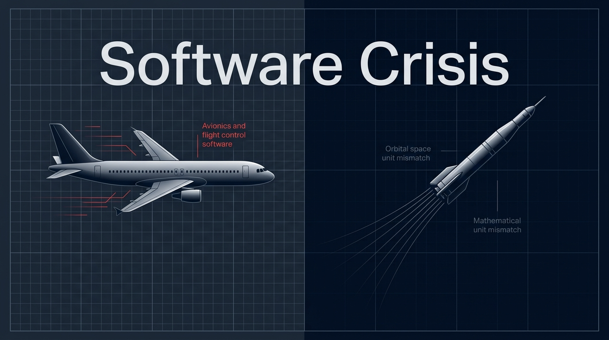

*Figure 1.2.1: The Software Crisis of the late 1960s—marked by chronic budget overruns, missed deadlines, fatal defects, and delivered systems that were completely impossible to maintain.*

### 1.2.1 Symptoms of the Crisis

By 1968, projects worldwide were collapsing under their own weight:
* **Runaway Budget Overruns:** Software costs regularly ballooned to three or four times initial estimates.
* **Severe Project Delays:** Critical projects slipped by years or were abandoned outright after spending tens of millions of dollars.
* **Unacceptable Reliability:** Production software frequently crashed, corrupted core data, or posed direct physical dangers to human operators.
* **Unmaintainability:** Codebases written without modular abstraction resembled tangled "spaghetti code"—fixing one bug inevitably spawned two new ones.

The fundamental epiphany was unmistakable: **informal, craft-like programming by isolated individuals does not scale to large teams building complex, long-lived software systems.**

### 1.2.2 The 1968 NATO Garmisch Conference

In October 1968, the NATO Science Committee assembled 50 of the world's foremost computer scientists, software pioneers, and industry directors in **Garmisch, Germany**.


*Figure 1.2.2: The historic 1968 NATO Software Engineering Conference in Garmisch, Germany, where the term "Software Engineering" was formally established.*

The conference convened with an explicit mandate: software development had to break free from undisciplined craftsmanship and establish itself as a **formal engineering discipline**—anchored by repeatable methodologies, mathematical foundations, systematic testing, accurate cost estimation, and structured project governance.

### 1.2.3 The High Cost of Software Failure

When software is built without engineering discipline, the consequences can be fatal:

* **Nagoya Airbus A300 Crash (1994):** During China Airlines Flight 140's approach to Nagoya Airport, the co-pilot accidentally triggered the Go-Around (TO/GA) mode. The pilot attempted to force the aircraft down by pushing the control column forward. However, the flight control software remained locked in Go-Around mode, fighting the pilot's manual input and automatically trimming the horizontal stabilizer into an extreme nose-up angle. The aircraft stalled and crashed, killing 264 people.
* **Mars Climate Orbiter (1999):** A $327 million spacecraft was vaporized in the Martian atmosphere due to an interface specification failure. Ground control software at Lockheed Martin computed engine impulse in imperial units (pound-force seconds, $lbf \cdot s$), while the onboard NASA trajectory navigation computer expected metric units (Newton-seconds, $N \cdot s$). The lack of interface type-checking caused the spacecraft to enter the atmosphere too steeply.
* **Ariane 5 Flight 501 (1996):** Just 37 seconds after launch, the European Space Agency's $500 million rocket self-destructed. A 64-bit floating-point value measuring horizontal velocity was converted into a 16-bit signed integer. The value exceeded 32,767, triggering an unhandled integer overflow exception. The primary and backup guidance computers crashed simultaneously, dumping diagnostic telemetry onto the bus which the flight computer misinterpreted as steering commands.

---

<!-- id: ase-ch01-ccq1 -->
#### 🙋 **Concept Check (CCQ 1) — The Software Crisis**

**Question**

Why couldn't the 1968 Software Crisis be resolved simply by purchasing faster computer hardware or larger memory?

* A) Computer hardware manufacturing and memory fabrication completely stagnated in the late 1960s, preventing computational speedups.
* B) The crisis was fundamentally an intellectual and organizational challenge of system complexity, which faster hardware only amplified.
* C) Programming languages of that era strictly lacked mathematical calculation primitives and compiler memory allocation capabilities.
* D) Early mainframe computers were physically incompatible with shared telecommunication networks and multi-terminal architectures.

[Interactive Activity (線上作答)](https://nlhsueh.github.io/nickedupocket/#/student/ase-ch01-ccq1)

<a href="https://nlhsueh.github.io/nickedupocket/#/student/ase-ch01-ccq1" target="_blank"></a>

<details>
<summary>Click to view Answer & Explanation</summary>

Correct Answer: B
Explanation: The crisis was fundamentally an intellectual and organizational failure in managing system complexity. Increasing hardware capacity allowed organizations to build systems of unprecedented scale, which human programmers using ad-hoc, informal techniques could not manage. Faster CPU chips do not fix missing requirements, tangled spaghetti dependencies, or miscommunicated interface contracts.
</details>

---

## 1.3 What is Software? Beyond Source Code

Novices and short-sighted managers often equate software strictly with visible source code lines. However, the IEEE formal engineering definition reveals that executable programs are merely one element of a four-pillar structure.

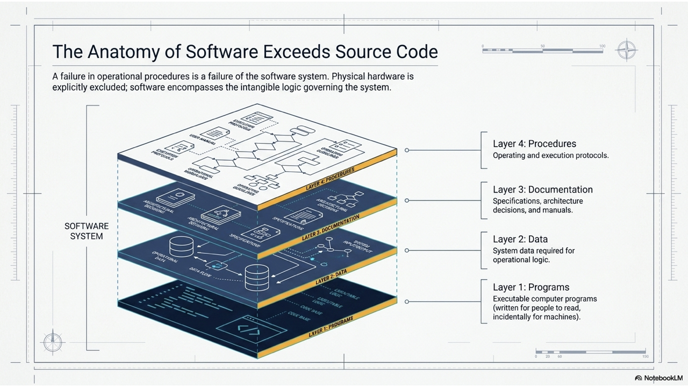

*Figure 1.3.1: The IEEE Anatomy of Software—comprising Programs, Data & Schemas, Operational Procedures, and Documentation.*

### 1.3.1 The IEEE Standard Definition

> **Software (IEEE Standard Definition):** Computer programs, procedures, and possibly associated documentation and data pertaining to the operation of a computer system.

1. **Programs (The Execution Engine):** The source code files (Python, Java, TypeScript, C++) and compiled binaries that instruct the CPU.
2. **Data & Schemas (The State):** Database structures, migrations, relational tables, persistent records, and runtime configuration settings.
3. **Operational Procedures (The Execution Protocols):** Automated deployment pipelines, CI/CD configurations, backup schedules, and disaster recovery runbooks.
4. **Documentation (The Knowledge & Contracts):** Architecture Decision Records (ADRs), API interface contracts (OpenAPI/Swagger), requirements specifications, and user manuals.

### 1.3.2 The Software Iceberg Trap

In production systems, **over 80% of total engineering effort, complexity, and catastrophic downtime** originates below the surface in Data, Procedures, and Documentation:

* *Knight Capital ($440 Million Lost in 45 Minutes):* The underlying trading algorithms were mathematically sound. However, a flawed manual deployment **procedure** missed deploying code to one of eight production servers, while legacy configuration **data** repurposed an old operational flag. When the market opened, the orphaned server entered an infinite loop of buying high and selling low, causing bankruptcy in under an hour.
* *GitLab Database Outage (2017):* While production code was functioning normally, human operators accidentally deleted the primary production database directory. When attempting to restore from backups, five different automated backup **procedures** were discovered to be broken, unverified, or misconfigured.
* *Therac-25 Radiation Accidents:* A medical linear accelerator administered massive lethal radiation overdoses to cancer patients. The root cause was a subtle race condition in software; however, the fatal flaw was the complete lack of architectural **documentation**, which prevented new engineers from understanding that the software safety interlocks relied on fragile timing assumptions.

```
                  THE SOFTWARE ICEBERG
                          ▲
                         / \
                        /LOC\     ◄── Programs / Source Code (Visible 20%)
           ~~~~~~~~~~~~/~~~~~\~~~~~~~~~~~~
                      /       \
                     /  DATA   \   ◄── Database Schemas, State, Configs (80% Below)
                    /PROCEDURES \  ◄── CI/CD, Deployment, Disaster Recovery
                   /DOCUMENTATION\ ◄── API Contracts, Architecture Decisions (ADRs)
                  ───────────────
```

### 1.3.3 Why the Four Pillars Demand the Software Life Cycle (SDLC)

* **Documentation $\longleftrightarrow$ Requirements & Architecture:** Code only documents *how* a system works; documentation captures *why* it was designed that way. Without architectural documentation, multi-year cross-functional collaboration is impossible.
* **Programs $\longleftrightarrow$ Implementation & Validation:** Writing code is only the initial spark. Engineering requires continuous automated testing, refactoring, and integration to prevent code rot and technical debt.
* **Data $\longleftrightarrow$ State Persistence & Long-Term Evolution:** Code can be re-deployed in seconds, but production data must endure for decades. This requires schema versioning, backward compatibility, and zero-downtime database migration strategies.
* **Procedures $\longleftrightarrow$ DevOps & Site Reliability Engineering (SRE):** Code running exclusively on `localhost` is a toy. Engineering requires containerization, automated rollback pipelines, canary deployments, and observability telemetry.

### 1.3.4 Practical Example: YouBike (Urban Bike-Sharing System)

1. **Programs:** Embedded firmware on bicycle smart locks, mobile mobile apps, and cloud backend microservices handling concurrent rental transactions.
2. **Data & Schemas:** Real-time dock availability, GPS bike coordinates, user wallet balances, and ACID-compliant transactional ride logs. Corrupted data results in "ghost bikes" and erroneous billing disputes.
3. **Operational Procedures:** Over-the-Air (OTA) firmware update protocols, field technician battery-replacement schedules, and payment gateway failover runbooks. A failed OTA deployment can brick thousands of outdoor locks, costing millions in field repairs.
4. **Documentation:** OpenAPI specifications and MQTT telemetry contracts ensuring hardware lock manufacturers, mobile teams, and municipal transit systems integrate seamlessly.

---

<!-- id: ase-ch01-ccq2 -->
#### 🙋 **Concept Check (CCQ 2) — The IEEE Definition of Software**

**Question**

According to the IEEE standard definition of software, which of the following is NOT considered a component of software?

* A) Executable computer programs and source code files.
* B) System database schemas and configuration files.
* C) CPU processor hardware and physical memory units.
* D) Software installation and deployment procedures.

[Interactive Activity (線上作答)](https://nlhsueh.github.io/nickedupocket/#/student/ase-ch01-ccq2)

<a href="https://nlhsueh.github.io/nickedupocket/#/student/ase-ch01-ccq2" target="_blank"></a>

<details>
<summary>Click to view Answer & Explanation</summary>

Correct Answer: C
Explanation: The IEEE standard defines software as computer programs, procedures, and possibly associated documentation and data. CPU hardware and physical memory are physical electronic devices (hardware) that execute software, rather than components of the software itself.
</details>

---

## 1.4 What is Engineering? Constraints, Resources & Pragmatic Optimization

Before defining software engineering, we must establish what makes any human activity an "engineering" discipline.

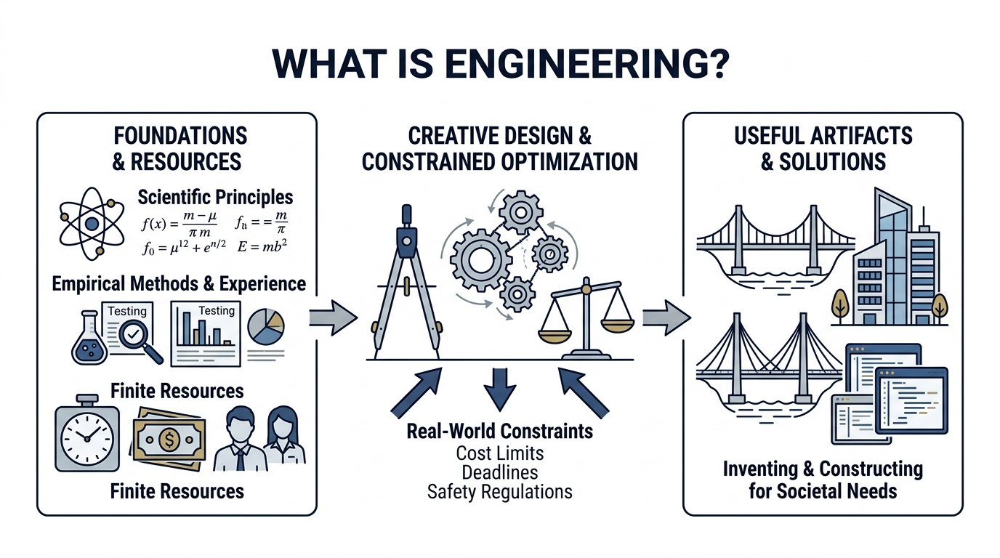

*Figure 1.4.1: The Nature of Engineering—transforming scientific principles and finite resources into useful societal artifacts under strict real-world constraints.*

> **Engineering:** The creative application of scientific principles, empirical methods, and practical experience to invent, design, and construct useful artifacts under **real-world constraints** with **finite resources**.

### 1.4.1 Scientists vs. Engineers

Aerospace pioneer **Theodore von Kármán** captured the fundamental philosophical distinction:
> *"Scientists discover the world that exists; engineers create the world that never was."*

* **Scientists** seek fundamental, universal truth through discovery and observation. They strive to understand how the universe functions regardless of immediate utility.
* **Engineers** seek practical utility, feasibility, and solutions to human problems. They must make decisions even when scientific theory is incomplete, relying on heuristics and safety margins.

### 1.4.2 The Three Hallmarks of Engineering Practice

1. **Goal-Driven Problem Solving:** Engineering exists to satisfy human, commercial, or societal needs (e.g., providing clean water, building bridges, processing healthcare records).
2. **Constrained Optimization:** Engineers never work in an unconstrained vacuum. Every system must balance competing trade-offs (cost vs. speed, safety vs. performance).
3. **Systematic Predictability:** Engineering replaces individual intuition with repeatable processes, standardized components, rigorous testing, and verified safety margins.

### 1.4.3 The Engineering Balancing Equation

Every engineering endeavor is a balancing act between **Constraints** and **Resources**:

$$\text{Engineering Solution} = \text{Optimize}(\text{Goals}) \quad \text{subject to} \quad \text{Resources} \le \text{Constraints}$$

* **Constraints (External Boundaries):** Hard deadlines, financial budgets, legacy database compatibility, computing hardware limitations, and legal regulations (e.g., GDPR, HIPAA, PCI-DSS).
* **Resources (Internal Assets):** Engineering staff, developer technical skill, automated toolchains, cloud compute credits, and domain business knowledge.

### 1.4.4 Case Study: Healthcare Startup MVP

* **The Problem:** A digital health startup must build and launch a HIPAA-compliant telemedicine application in **6 months** with a strict budget of **$80,000**.
* **The Engineering Solution:**
  1. *Scope Prioritization:* Focus the Minimum Viable Product (MVP) strictly on scheduled video calls and digital prescriptions; defer automated insurance billing to Phase 2.
  2. *Cross-Platform Tooling:* Build the client using Flutter or React Native to maintain a single codebase, saving 40% in developer hours compared to separate iOS/Android native apps.
  3. *Managed Backend:* Use a HIPAA-compliant Backend-as-a-Service (BaaS) and cloud video API (e.g., Twilio) rather than building real-time media streaming servers from scratch.
  4. *Automated CI/CD:* Enforce automated unit tests on every GitHub Pull Request, keeping QA costs minimal.
* **Why not the "theoretically perfect" technical architecture?**
  Writing native Swift/Kotlin apps backed by custom Kubernetes microservices is technically superior in raw performance, but it would take 14 months and $250,000—violating the constraints and bankrupting the startup before launch.
* **Satisficing:** Herbert Simon coined the term *satisficing* (satisfy + suffice). In engineering, the objective is not to find a mathematically idealized solution, but to identify a solution that **satisfies all critical constraints through pragmatic trade-offs**.
* **The Core Requirement:** Engineering requires **Requirements Engineering** to negotiate scope against finite resources, and **System Design** to architect trade-offs that hold within real-world constraints.

---

## 1.5 What is Software Engineering? Core Activities & Body of Knowledge

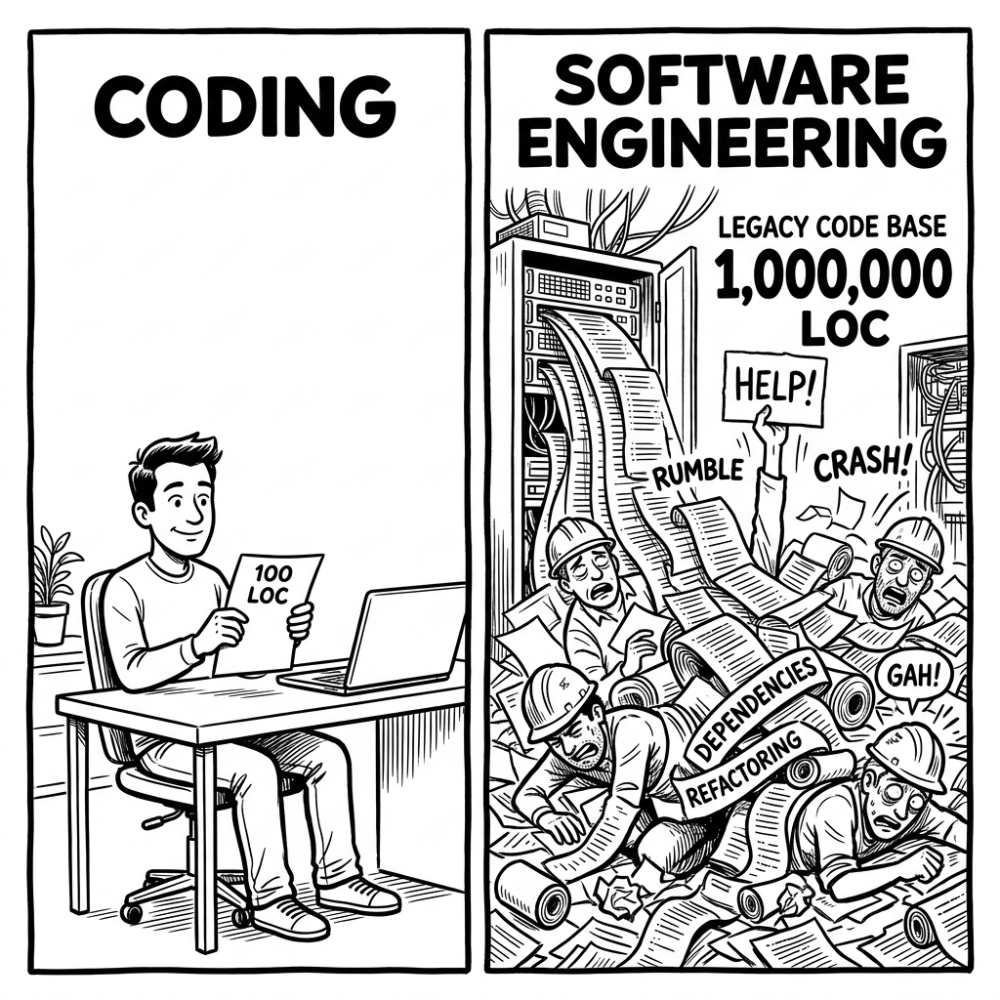

*Figure 1.5.1: Coding vs. Software Engineering—Coding is writing a few hundred lines of code in isolation; Software Engineering is governing millions of lines of code over decades with teams, dependencies, and continuous refactoring.*

> **Software Engineering:** An engineering discipline concerned with all aspects of software production—from initial specification through to system maintenance and evolution.

### 1.5.1 The Four Universal Activities of the Software Process

Regardless of whether a team follows Agile, Scrum, Kanban, or Waterfall, every software system must undergo four universal activities:

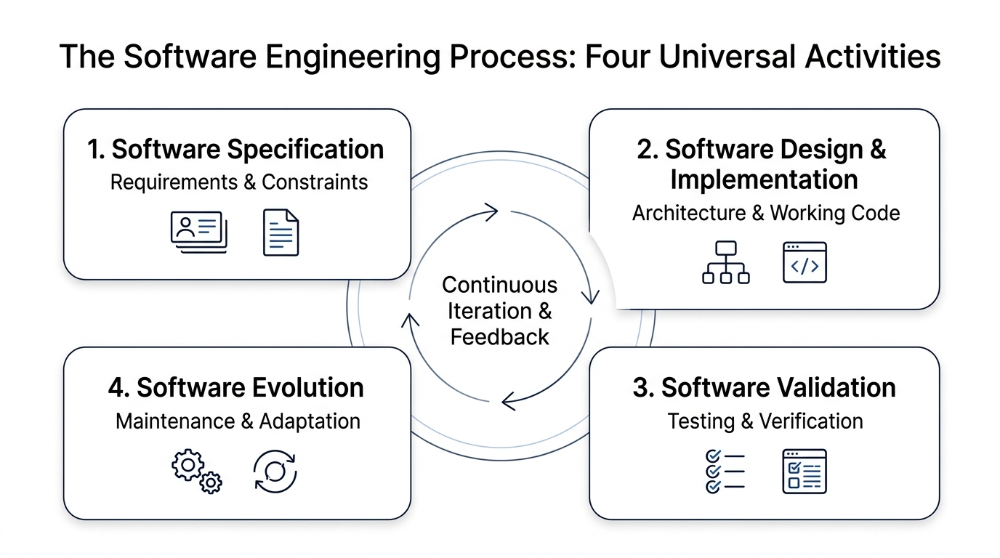

*Figure 1.5.2: The four universal lifecycle activities: Software Specification, Software Design & Implementation, Software Validation, and Software Evolution.*

#### 1. Software Specification (Requirements Engineering)
* **Mission:** Defining *what* the system must do and the operational *constraints* under which it must operate.
* **Key Sub-Activities:** Feasibility studies, stakeholder elicitation, requirements analysis, specification writing, and validation.
* **Key Deliverables:** User Stories, Given-When-Then Acceptance Criteria, Software Requirements Specifications (SRS).
* **The Risk of Skipping:** Building the wrong product. A requirement bug discovered after deployment costs **up to 100 times more** to fix than one caught during specification.

#### 2. Software Design & Implementation
* **Mission:** Translating specifications into structured, maintainable, and executable software systems.
* **Key Sub-Activities:** System architecture design, subsystem interface contracts (OpenAPI), database data modeling, component design, and unit implementation.
* **Key Deliverables:** Architecture Decision Records (ADRs), Entity-Relationship Diagrams (ERDs), clean and modular codebases.
* **The Risk of Skipping:** Spaghetti architecture, unmaintainable coupling, and crippling technical debt.

#### 3. Software Validation (Testing & Quality Assurance)
* **Mission:** Ensuring the software conforms to its specification and satisfies customer expectations.
* **Boehm's Twin Quality Pillars:**
  * *Verification:* "Are we building the product *right*?" (Conforming strictly to specifications).
  * *Validation:* "Are we building the *right* product?" (Solving the customer's actual problem).
* **Key Sub-Activities:** Unit testing, component testing, integration testing, system testing, automated regression testing, and peer code reviews.
* **Key Deliverables:** Automated test suites (PyTest, JUnit), continuous integration reports, test coverage metrics.
* **The Risk of Skipping:** Fatal production outages, catastrophic security breaches, data corruption, and corporate bankruptcy.

#### 4. Software Evolution (Maintenance)
* **Mission:** Modifying and evolving deployed software to meet changing business rules, new regulatory requirements, and growing user scale.
* **The Economic Reality:** Software is never finished. **Over 60% to 80% of total lifecycle costs** occur during evolution after initial launch.
* **The Four Maintenance Modes:**
  * *Corrective:* Patching production crashes and runtime defects.
  * *Adaptive:* Upgrading for new operating system releases, cloud environments, or compliance laws.
  * *Perfective:* Optimizing latency, improving UX workflows, and adding business features.
  * *Preventive:* Refactoring code to eliminate technical debt before defects occur.
* **Key Deliverables:** Database migration scripts, semantic versioned releases, post-mortem incident reports.

---

<!-- id: ase-ch01-ccq3 -->
#### 🙋 **Concept Check (CCQ 3) — Core Universal Activities of the Software Process**

**Question**

Which of the following pairs correctly matches a specific software engineering action with its corresponding universal core activity?

* A) Conducting stakeholder interviews to draft user stories $\rightarrow$ Software Specification
* B) Writing automated unit tests to mock database responses $\rightarrow$ Software Design & Implementation
* C) Refactoring database schemas to improve query speed $\rightarrow$ Software Validation
* D) Swapping a third-party payment API for a new gateway $\rightarrow$ Software Specification

[Interactive Activity (線上作答)](https://nlhsueh.github.io/nickedupocket/#/student/ase-ch01-ccq3)

<a href="https://nlhsueh.github.io/nickedupocket/#/student/ase-ch01-ccq3" target="_blank"></a>

<details>
<summary>Click to view Answer & Explanation</summary>

Correct Answer: A
Explanation: Eliciting and modeling requirements through stakeholder interviews is a direct action in Software Specification. Writing unit tests is part of Software Validation (specifically verification). Refactoring database schemas is Software Evolution (preventive/perfective maintenance). Swapping APIs is Design & Implementation or Evolution.
</details>

---

### 1.5.2 The Software Engineering Body of Knowledge (BOK)

Software engineering is governed by a structured **Body of Knowledge (BOK)**:

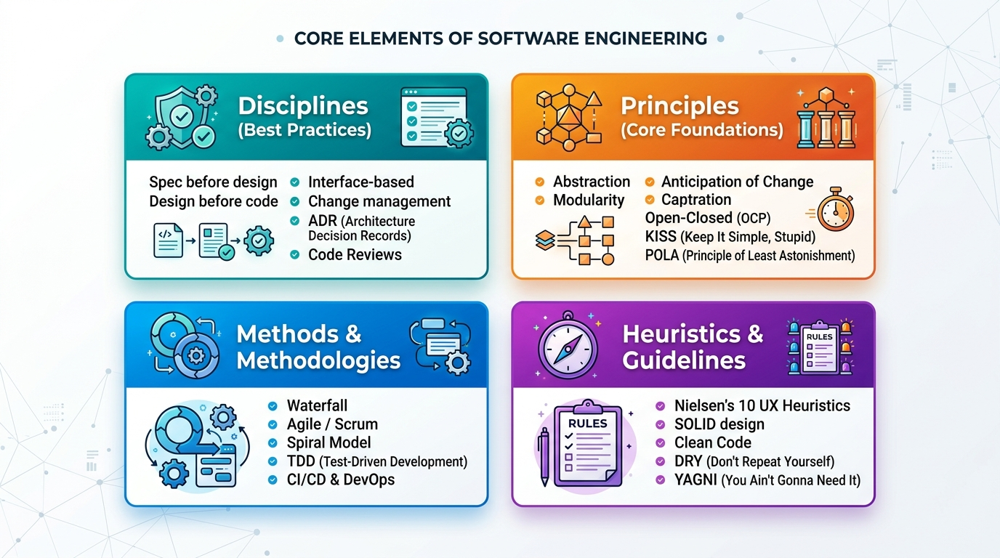

*Figure 1.5.3: The Software Engineering Body of Knowledge: Disciplines, Principles, Methods & Methodologies, and Heuristics & Guidelines.*

* **Disciplines (Rules of Practice):** Non-negotiable team habits and operational protocols (*"Spec before design", "Design before code", Architecture Decision Records, mandatory Code Reviews*).
* **Principles (Foundations):** Timeless, enduring engineering truths (*Abstraction, Modularity, Separation of Concerns, Anticipation of Change, Information Hiding*).
* **Methods & Methodologies:** Repeatable, structured frameworks (*Agile/Scrum, Extreme Programming, Test-Driven Development (TDD), CI/CD, DevOps*).
* **Heuristics & Guidelines:** Practical rules of thumb distilled from decades of industry lessons (*SOLID principles, Clean Code, DRY (Don't Repeat Yourself), KISS (Keep It Simple, Stupid), YAGNI (You Aren't Gonna Need It), POLA (Principle of Least Astonishment)*).

### 1.5.3 Dispelling Common Software Myths

When engineering principles are ignored, intuition leads to expensive fallacies:

* **Myth 1: "We are behind schedule—let's add 5 more developers to catch up."**
  * *Violates:* **Modularity & Communication Boundaries**.
  * *Reality (Brooks's Law):* Adding manpower to a late software project makes it later. New developers require onboarding by senior engineers, and communication channels grow quadratically:
    $$\text{Channels} = \frac{n(n-1)}{2}$$
* **Myth 2: "Software is digital and flexible, so changing requirements late is trivial."**
  * *Violates:* **"Spec Before Design" & Architectural Coupling**.
  * *Reality:* Late changes invalidate schemas, APIs, and tests. A requirement change that costs $1 during specification costs **$100 in production**.

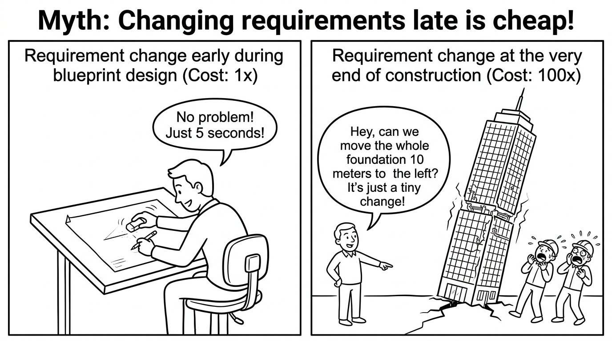

*Figure 1.5.4: The cost of changing requirements—cheap when redrawing a blueprint, catastrophic when moving the skyscraper's foundation after construction.*

* **Myth 3: "Outsource all coding to an external contractor and we won't need internal technical managers."**
  * *Violates:* **The Software Iceberg (Data, Procedures, Documentation)**.
  * *Reality:* Code without internal architectural governance results in unmaintainable technical debt and vendor lock-in.

---

<!-- id: ase-ch01-ccq4 -->
#### 🙋 **Concept Check (CCQ 4) — Brooks's Law and Project Dynamics**

**Question**

A project is 3 weeks behind schedule with 2 weeks remaining before release. The manager hires 4 junior programmers to speed up progress. What will happen according to Brooks's Law?

* A) The project will finish 1 week early.
* B) The project will be delayed further because senior engineers must spend time onboarding and mentoring new hires.
* C) The existing developers will code twice as fast.
* D) Communication complexity remains unchanged.

[Interactive Activity (線上作答)](https://nlhsueh.github.io/nickedupocket/#/student/ase-ch01-ccq4)

<a href="https://nlhsueh.github.io/nickedupocket/#/student/ase-ch01-ccq4" target="_blank"></a>

<details>
<summary>Click to view Answer & Explanation</summary>

Correct Answer: B
Explanation: Frederick Brooks demonstrated in The Mythical Man-Month that complex software development is not partitionable like manual labor. Adding people to a late project increases communication overhead quadratically according to n(n-1)/2, while senior engineers must stop productive coding to onboard newcomers.
</details>

---

<!-- id: ase-ch01-ccq5 -->
#### 🙋 **Concept Check (CCQ 5) — Fundamental Design Principles**

**Question**

An order-processing module directly handles HTTP requests, executes payment transactions, queries the SQL database, and generates HTML receipt emails. Which fundamental design principle is most severely violated?

* A) Separation of Concerns: Multiple distinct responsibilities are tightly tangled in a single module.
* B) YAGNI: Speculative future features are implemented before actual business requirements emerge.
* C) Brooks's Law: Adding developers to the order module increases communication complexity exponentially.
* D) Anticipation of Change: System configurations are hardcoded into compiled production binaries.

[Interactive Activity (線上作答)](https://nlhsueh.github.io/nickedupocket/#/student/ase-ch01-ccq5)

<a href="https://nlhsueh.github.io/nickedupocket/#/student/ase-ch01-ccq5" target="_blank"></a>

<details>
<summary>Click to view Answer & Explanation</summary>

Correct Answer: A
Explanation: Separation of Concerns (and the Single Responsibility Principle) dictates that a module should have only one reason to change and encapsulate a single coherent responsibility. Tangling HTTP routing, business payment processing, database access, and UI rendering in one module creates severe coupling and high fragility.
</details>

---

### 1.5.4 Enforcing Disciplines at Scale: The Modern Toolchain

Engineers cannot enforce disciplines by willpower alone. Modern software engineering automates the BOK using toolchains:
* **Version Control (Git):** Enforces peer code reviews, traceability, branch governance, and rollback capability.
* **CI/CD Pipelines (GitHub Actions):** Automatically executes builds, runs unit/integration tests, and enforces lint rules before code is merged.
* **Static Code Analysis (SonarQube):** Analyzes code without executing it, flagging code smells, circular dependencies, and CVE security vulnerabilities.
* **Automated Testing Suites (PyTest, Playwright):** Enforces automated regression safety nets across unit, API, and end-to-end user journeys.
* **Observability (OpenTelemetry, APM):** Collects live production metrics, logs, and distributed traces to provide continuous feedback for Software Evolution.

---

## 1.6 What is a Software Quality Model? The Modern ISO/IEC 25010 Standard

> **Software Quality:** The degree to which a software product satisfies stated and implied needs when used under specified conditions.

### 1.6.1 Why "Quality" Cannot Just Mean "No Bugs"

A system can compile cleanly and execute without throwing runtime exceptions while remaining completely useless:
* It may take 45 seconds to load a dashboard (violating **Performance Efficiency**).
* It may store user passwords in clear text (violating **Security**).
* It may break whenever an iOS version updates (violating **Portability**).
* It may have tightly coupled spaghetti code that takes three weeks to modify (violating **Maintainability**).

A **Software Quality Model** decomposes the abstract concept of quality into a structured hierarchy of **characteristics**, **sub-characteristics**, and **measurable metrics**.

### 1.6.2 The Modern Standard: ISO/IEC 25010 (SQuaRE)

ISO/IEC 25010 (Software product Quality Requirements and Evaluation) superseded the older ISO 9126 standard.

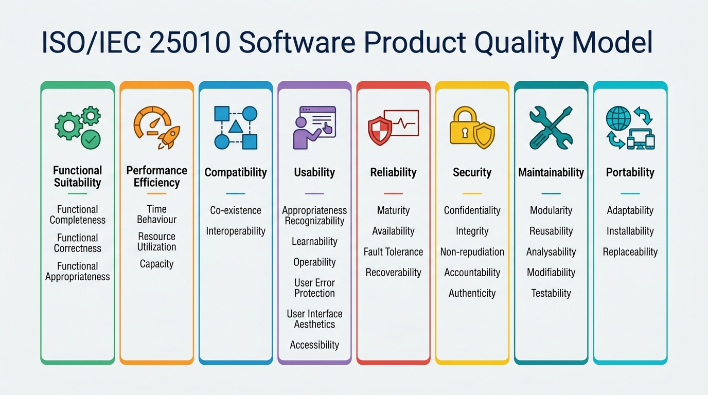

*Figure 1.6.1: The ISO/IEC 25010 Product Quality Model—defining 8 core characteristics and their sub-attributes.*

#### The Eight Product Quality Characteristics

1. **Functional Suitability:** The degree to which the functions meet stated and implied user needs.
   * *Sub-attributes:* Functional Completeness, Functional Correctness, Functional Appropriateness.
2. **Performance Efficiency:** Performance relative to the amount of resources consumed.
   * *Sub-attributes:* Time Behaviour (latency, response time), Resource Utilization (CPU, memory), Capacity (max concurrent users).
3. **Compatibility:** The degree to which a product can exchange information with other products and share environments.
   * *Sub-attributes:* Co-existence (running alongside other software without conflict), Interoperability (seamless API and data exchange).
4. **Usability (Interaction Capability):** The effectiveness, efficiency, and satisfaction with which users can achieve their goals.
   * *Sub-attributes:* Appropriateness Recognizability, Learnability, Operability, User Error Protection, UI Aesthetics, Accessibility.
5. **Reliability:** The ability of a system to maintain a specified level of performance over time.
   * *Sub-attributes:* Maturity (low failure rate), Availability (uptime percentage), Fault Tolerance (graceful degradation), Recoverability (restoration after failure).
6. **Security:** Protecting information and data so that unauthorized persons cannot access or modify them.
   * *Sub-attributes:* Confidentiality, Integrity, Non-repudiation, Accountability, Authenticity.
7. **Maintainability:** The ease with which software can be modified, corrected, or evolved.
   * *Sub-attributes:* Modularity, Reusability, Analyzability, Modifiability, Testability.
8. **Portability:** The ease with which a system can be transferred from one hardware, software, or operational environment to another.
   * *Sub-attributes:* Adaptability, Installability, Replaceability.

### 1.6.3 Practical Real-World Scenarios

* **Fault Tolerance (Reliability):** When a primary credit card processing gateway times out, the e-commerce system automatically retries a secondary gateway within 500ms without canceling the user's order.
* **Integrity & Authenticity (Security):** Microservices sign all inter-service REST requests using JWT tokens signed with asymmetric RS256 keys to prevent parameter tampering.
* **Time Behavior & Capacity (Performance Efficiency):** A flight search engine processes 15,000 queries per second with a 99th-percentile response latency below 80 milliseconds.
* **Testability & Modularity (Maintainability):** A backend service injects database dependencies through interfaces (Dependency Injection), allowing unit tests to substitute mock in-memory stores in milliseconds.
* **Installability (Portability):** A full microservices environment spins up on any developer machine in under 60 seconds using a single `docker compose up` command.

---

<!-- id: ase-ch01-ccq6 -->
#### 🙋 **Concept Check (CCQ 6) — Matching Real-World Issues to ISO 25010 Quality Characteristics**

**Question**

Which of the following matches a real-world software issue with its corresponding ISO 25010 quality characteristic?

* A) A database query taking 15 seconds to return results $\rightarrow$ Maintainability (Testability)
* B) A system crash occurring when a third-party API goes offline $\rightarrow$ Reliability (Fault Tolerance)
* C) Developers struggling to write unit tests due to tight coupling $\rightarrow$ Portability (Adaptability)
* D) An unencrypted session cookie allowing account takeover $\rightarrow$ Usability (Operability)

[Interactive Activity (線上作答)](https://nlhsueh.github.io/nickedupocket/#/student/ase-ch01-ccq6)

<a href="https://nlhsueh.github.io/nickedupocket/#/student/ase-ch01-ccq6" target="_blank"></a>

<details>
<summary>Click to view Answer & Explanation</summary>

Correct Answer: B
Explanation: A system's ability to cope with external service failures without crashing is the definition of Fault Tolerance (a sub-characteristic of Reliability). Slow query execution is Performance Efficiency (Time Behavior). Struggling to write unit tests is Maintainability (Testability). Unencrypted session cookies belong to Security (Confidentiality).
</details>

---

## 1.7 Professional Ethics, Social Responsibility & Deceptive Dark Patterns

Because software controls aviation, medical devices, financial markets, and democratic elections, software engineers hold a fiduciary duty to public welfare.

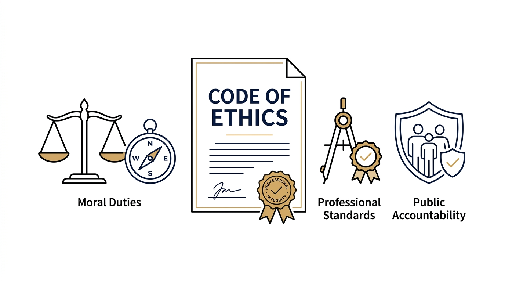

*Figure 1.7.1: A Code of Ethics is a formal covenant establishing moral duties, professional standards, and public accountability.*

> **Professional Code of Ethics:** A formal covenant establishing the moral duties, professional standards, and public accountability of a discipline. The public safety, health, and welfare must always take absolute precedence over employer loyalty.

### 1.7.1 The ACM/IEEE Code of Ethics: 8 Core Principles

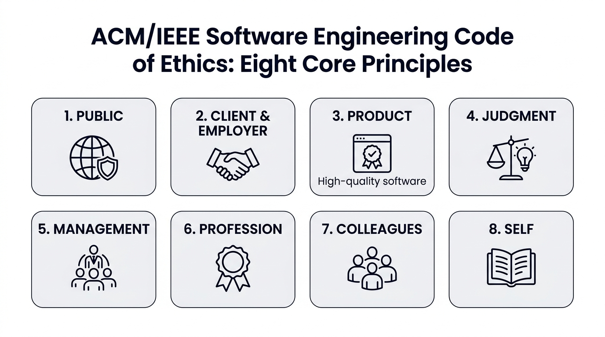

*Figure 1.7.2: The eight core principles of the ACM/IEEE Software Engineering Code of Ethics.*

1. **Public:** Act consistently with the public interest above all else.
2. **Client & Employer:** Act in their best interest, provided it does not conflict with public welfare.
3. **Product:** Ensure software deliverables meet the highest professional standards possible.
4. **Judgment:** Maintain integrity and independence in professional technical evaluations.
5. **Management:** Promote ethical management and realistic project estimates.
6. **Profession:** Advance the integrity, reputation, and public trust of the engineering discipline.
7. **Colleagues:** Be fair to, support, and mentor fellow engineers.
8. **Self:** Commit to lifelong professional learning and ethical practice.

### 1.7.2 High-Profile Ethical Failures

* **Volkswagen "Dieselgate" (2015):** Software engineers deliberately programmed engine control modules (ECMs) to recognize when the vehicle was undergoing emissions testing on a dynamometer. The software restricted emissions to pass legal standards, but disabled pollution controls during normal road driving, spewing up to 40 times the legal limit of toxic nitrogen oxides ($NO_x$). This resulted in tens of billions of dollars in criminal fines and widespread health damage.
* **Cambridge Analytica (2018):** Software and data engineers scraped the private profile data of 87 million Facebook users without explicit consent, building psychological targeting algorithms to covertly influence electoral campaigns.

### 1.7.3 Deceptive "Dark Patterns" in UI/UX Design

A **Dark Pattern** is a user interface maliciously crafted to trick or coerce users into making decisions they would not otherwise make:

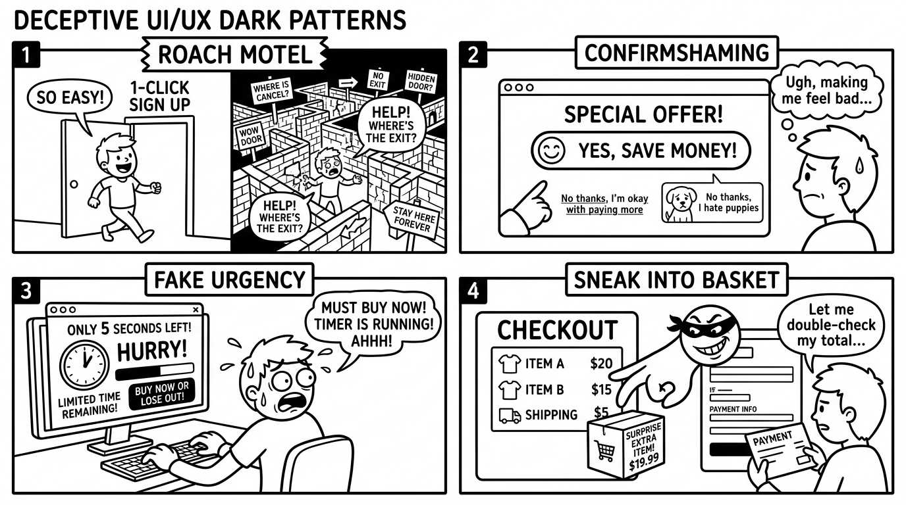

*Figure 1.7.3: Common deceptive dark patterns in digital interfaces: Roach Motel, Confirmshaming, Fake Urgency, and Sneak into Basket.*

1. **Roach Motel (Subscription Labyrinth):** Subscribing takes 1 click; cancelling requires navigating deep hidden sub-menus, navigating dead links, or making a phone call during specific business hours.
2. **Confirmshaming:** Manipulative emotional coercion in refusal buttons (e.g., clicking *"No thanks, I hate saving money"* to decline an email newsletter).
3. **Hidden Costs & Sneak into Basket:** Silently adding optional insurance or service fees at the final checkout step with pre-ticked checkboxes.
4. **Fabricated Urgency & Scarcity:** Artificial countdown timers (*"Only 2 minutes left to claim deal!"*) or fake scarcity notices (*"15 other people are looking at this hotel right now!"*) designed to trigger panic buying.

---

<!-- id: ase-ch01-ccq7 -->
#### 🙋 **Concept Check (CCQ 7) — Engineering Ethics and the Public Interest**

**Question**

Under the ACM/IEEE Code of Ethics, if an employer directs an engineer to implement an algorithm that falsifies safety compliance reports, what is the engineer's obligation?

* A) Comply, because the employer pays the engineer's salary.
* B) Refuse and escalate, because the Public Interest takes precedence over Employer loyalty.
* C) Implement the code but omit documentation.
* D) Outsource the code to an external vendor.

[Interactive Activity (線上作答)](https://nlhsueh.github.io/nickedupocket/#/student/ase-ch01-ccq7)

<a href="https://nlhsueh.github.io/nickedupocket/#/student/ase-ch01-ccq7" target="_blank"></a>

<details>
<summary>Click to view Answer & Explanation</summary>

Correct Answer: B
Explanation: Principle 1 of the ACM/IEEE Software Engineering Code of Ethics states that software engineers shall act consistently with the public interest, which takes absolute precedence over loyalty to an employer or client.
</details>

---

## 1.8 AI in Software Engineering: Paradigm Shift, Pitfalls & Rigor

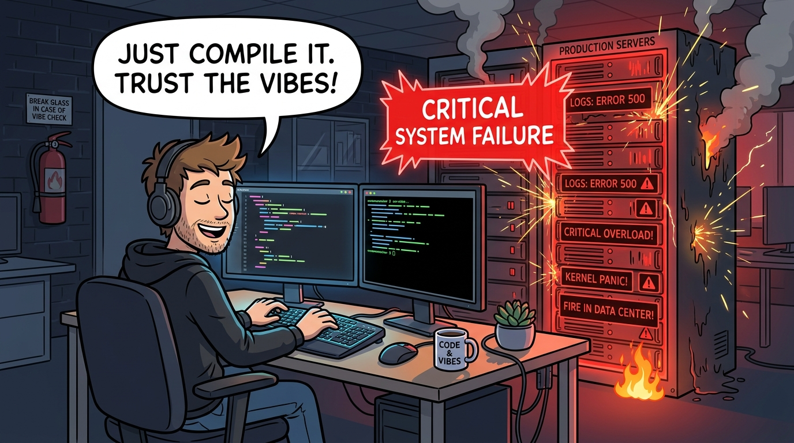

*Figure 1.8.1: The "Vibe Coding" Trap—compiling generated code on faith without understanding runtime causality, leading to catastrophic production failures.*

### 1.8.1 The Illusion of "Vibe Programming"

> **Vibe Coding (popularized by Andrej Karpathy):** A software workflow where developers prompt an AI to generate code, rarely inspecting or understanding the underlying logic, and "just vibe with whatever runs."

While vibe coding enables rapid weekend prototyping, it fundamentally violates software engineering rigor:
* **The Fragility Trap:** Code that runs on `localhost` often harbors critical concurrency race conditions, memory leaks, and CWE Top 25 vulnerabilities.
* **Unmaintainable Architecture:** When an AI-generated 25,000-line codebase crashes in production, no human on the team understands the causal relationships needed to debug and fix it.

### 1.8.2 Three Empirical Problems of AI Coding

Recent academic and industry studies reveal critical empirical risks:

1. **Maintainability Degradation & High Code Churn (GitClear Study of 150M Lines of Code):**
   * **Code Duplication Surges:** AI tools promote copy-paste code patterns rather than modular abstractions.
   * **Plummeting Refactoring:** The rate of "moved lines" (indicating active refactoring and cleanup) dropped significantly.
   * **Elevated Code Churn:** Code is pushed and subsequently deleted or rewritten within two weeks, accumulating massive **Maintainability Debt**.
2. **52% Error Rate & The Illusion of Security (Purdue University Empirical Study):**
   * Evaluating ChatGPT on 517 Stack Overflow questions revealed that **52% of AI-generated answers contained incorrect code or false premises**.
   * However, because the AI articulated its responses with confident formatting, authoritative reasoning, and polite prose, **39.3% of developers still preferred and accepted the flawed answers**.
3. **40% Known Security Weaknesses (New York University & Stanford Research):**
   * Automated scans of AI-generated code across common development tasks showed that approximately **40% introduced CWE Top 25 security vulnerabilities** (including SQL injection, buffer overflows, and hardcoded secrets) when safety constraints were not explicitly mandated.

### 1.8.3 Real-World Incidents of AI Coding Failures

* **Amazon Checkout Outage (2026):** An AI-generated update deployed without exhaustive regression verification introduced a subtle logical defect in checkout orchestration, causing checkout volume to drop by 99% and losing **6.3 million orders in hours**.
* **Slopsquatting (Package Hallucination):** LLMs frequently hallucinate plausible-sounding package names (e.g., `huggingface-cli`). Threat actors monitor AI hallucination trends, register those malicious packages on PyPI or npm, and poison developer build pipelines (resulting in over 30,000 malicious downloads).
* **Secrets Sprawl & Hardcoded API Credentials:** GitGuardian reports that AI-generated code introduces hardcoded API tokens, database passwords, and private keys at **twice the rate of human developers**.

### 1.8.4 The Other Side: Genuine Benefits & Real-World Triumphs

AI is not a hazard to be rejected; when governed with engineering discipline, it delivers unprecedented leaps in productivity:

* **Amazon's 30,000 Java Upgrades (Amazon Q Developer):** Amazon utilized AI coding agents to migrate over 30,000 production applications from legacy Java 8/11 to Java 17, saving an estimated **4,500 developer-years** of tedious manual labor and generating **$260 million in annual performance gains**.
* **Enterprise Flow Acceleration (Accenture & GitHub Copilot):** Across thousands of enterprise engineers, routine task delivery accelerated by **55%**, with 90% of developers reporting greater job fulfillment and reduced cognitive fatigue when paired with peer code review.
* **The Engineering Imperative:** **Harness and govern—neither blindly accept nor dogmatically reject!** The professional stance is to manage AI as a collaborative drafting assistant subject to strict verification.

### 1.8.5 The Paradigm Shift: Software 1.0 $\rightarrow$ 2.0 $\rightarrow$ 3.0

* **Software 1.0 (Code-Centric):** Humans write explicit, deterministic algorithms line-by-line ($f(x) \rightarrow y$).
* **Software 2.0 (Prompt-Driven):** Humans write natural language prompts; LLMs generate code, functions, and boilerplate.
* **Software 3.0 (Agentic Systems):** Humans specify high-level goals and architectural constraints; autonomous AI agents iteratively plan, execute terminal tools, run test suites, and refactor code.
* **The Engineer's Transformation:** As AI commoditizes boilerplate syntax typing, the engineer's value shifts to **System Architect, Specification Designer, and Ultimate Verification Authority**.

### 1.8.6 Engineering Rigor in the AI Era

> *"Never merge code you do not understand and cannot defend."*

1. **Specification-First (Contract-Driven):** Never prompt AI for code without formal interface definitions, type signatures, and clear acceptance criteria.
2. **Independent Verification Net ("Who tests the tester?"):** AI cannot be allowed to write both the implementation and its own test cases unchecked. Enforce deterministic CI regression suites.
3. **Human Professional Accountability:** The human engineer bears **100% of the legal, ethical, and architectural liability** for every line running in production.

---

<!-- id: ase-ch01-ccq8 -->
#### 🙋 **Concept Check (CCQ 8) — AI Coding & Code Churn**

**Question**

In empirical studies evaluating AI coding assistants (such as GitClear's analysis of 150M lines of code), "Code Churn" emerged as a major warning sign. What does high Code Churn indicate in an AI-assisted codebase?

* A) Code is rapidly rewritten, deleted, or patched shortly after commit, indicating brittle code accepted without sufficient verification.
* B) Compilers and bundlers are aggressively removing unreachable dead code from application binaries during automated deployment.
* C) Software engineering teams are switching programming languages frequently due to automated polyglot syntax translation.
* D) Automated test cases are executing too quickly and depleting available CI/CD pipeline virtual machine compute resources.

[Interactive Activity (線上作答)](https://nlhsueh.github.io/nickedupocket/#/student/ase-ch01-ccq8)

<a href="https://nlhsueh.github.io/nickedupocket/#/student/ase-ch01-ccq8" target="_blank"></a>

<details>
<summary>Click to view Answer & Explanation</summary>

Correct Answer: A
Explanation: Code churn measures the percentage of code that is modified, replaced, or deleted within two weeks of being committed. In AI coding environments, high code churn reveals that developers rapidly accept AI suggestions that compile on localhost but fail under real-world integration, forcing frequent rewrites and accumulating maintainability debt.
</details>

---

<!-- id: ase-ch01-ccq9 -->
#### 🙋 **Concept Check (CCQ 9) — AI Verification & Echo-Chamber Testing**

**Question**

An engineer prompts an AI to generate a complex payment calculation module, and then asks the same AI to write unit tests without providing a formal specification. All tests pass. What is the primary risk?

* A) Echo-chamber validation: The generated tests merely mirror the AI's internal flawed assumptions rather than actual business requirements.
* B) Performance bottleneck: AI-generated test assertions take significantly longer to execute than human-written assertions.
* C) Compilation failure: Testing frameworks cannot parse automated mock datasets generated by large language models.
* D) Version lock-in: The test suite becomes tightly coupled to a single specific cloud runtime environment.

[Interactive Activity (線上作答)](https://nlhsueh.github.io/nickedupocket/#/student/ase-ch01-ccq9)

<a href="https://nlhsueh.github.io/nickedupocket/#/student/ase-ch01-ccq9" target="_blank"></a>

<details>
<summary>Click to view Answer & Explanation</summary>

Correct Answer: A
Explanation: When AI writes both the implementation and its own test cases without an independent specification contract, it falls into "echo-chamber testing"—validating only what it assumed, rather than what the system is actually required to do. Independent verification is required ("Who tests the tester?").
</details>

---

## 1.9 Frequently Asked Questions (FAQ) in Software Engineering

**Q1: Why is programming not the same as software engineering?**
* **Answer**: Programming is the act of writing code to solve a specific algorithmic problem. Software engineering is programming integrated over time, managing team collaboration, organizational constraints (budget, schedule, regulations), multi-dimensional quality attributes (security, reliability, maintainability), and long-term evolution.

**Q2: Why do software projects fail even if the code itself is functionally correct and has 100% test coverage?**
* **Answer**: Software consists of four essential pillars: Programs, Data, Operational Procedures, and Documentation. A project fails when non-code pillars collapse—such as corrupt database states, unverified recovery procedures, or undocumented architectural boundaries. Furthermore, if the **Specification** activity fails, the team builds the wrong product: they verify the code conforms to specifications, but fail to validate that it solves the user's real-world problem.

**Q3: What is the difference between a "satisficing" solution and an "optimized" one?**
* **Answer**: Real-world projects operate under finite resources and tight constraints. A theoretically "optimized" architecture might be technically superior but rejected because it violates budget or schedule limits. A "satisficing" solution meets all constraints through pragmatic trade-offs, delivering maximum business value within boundaries.

**Q4: What is the greatest hazard of "Vibe Coding" with AI, and how do professional engineers prevent it?**
* **Answer**: The hazard is "automation bias"—blindly accepting fluent, plausible-looking AI code without understanding its runtime causality, concurrency behaviors, or security implications. Professional engineers prevent this by enforcing specification-first design, independent deterministic testing, peer code reviews, and treating AI outputs as unverified drafts.

---

## 1.10 Concept Summary & Fill-in-the-Blank Quiz

Test your mastery of Chapter 1 fundamentals:

1. According to the IEEE standard definition, software consists of computer programs, data & schemas, operational procedures, and **[ _________ ]**.
2. Adding manpower to a late software project makes it later is known as **[ _________ ]** Law.
3. The **[ _________ ]** standard defines 8 product quality characteristics, including Functional Suitability, Performance Efficiency, Security, and Maintainability.
4. Principle 1 of the ACM/IEEE Software Engineering Code of Ethics establishes that the **[ _________ ]** interest must take absolute precedence over employer loyalty.
5. In empirical AI software engineering studies, a high rate of **[ _________ ]** indicates that developers are accepting brittle, poorly-verified code that must be rewritten shortly after commit.

*(Answers: 1. Documentation; 2. Brooks's; 3. ISO/IEC 25010; 4. Public; 5. Code Churn)*

---

## Appendix: Solutions & Explanations to Interactive Activities

<details>
<summary>👉 Click to view Solution & Detailed Explanation for Concept Check 1</summary>

* **Correct Answer**: **B**
* **Detailed Explanation**: The crisis was fundamentally an intellectual and organizational challenge of system complexity. Increasing hardware capacity allowed organizations to dream up systems of unprecedented scale, which human programmers using ad-hoc, informal techniques could not manage. Faster CPU chips do not fix missing requirements, tangled spaghetti dependencies, or miscommunicated interface contracts.
* [⬆ Return to Section 1.2](#12-the-genesis-of-software-engineering-and-the-software-crisis)

</details>

<details>
<summary>👉 Click to view Solution & Detailed Explanation for Concept Check 2</summary>

* **Correct Answer**: **C**
* **Detailed Explanation**: The IEEE standard defines software as computer programs, procedures, and possibly associated documentation and data. CPU hardware and physical memory are physical electronic devices (hardware) that execute software, rather than components of the software itself.
* [⬆ Return to Section 1.3](#13-what-is-software-beyond-source-code)

</details>

<details>
<summary>👉 Click to view Solution & Detailed Explanation for Concept Check 3</summary>

* **Correct Answer**: **A**
* **Detailed Explanation**: Eliciting and modeling requirements through stakeholder interviews is a direct action in Software Specification. Writing unit tests is part of Software Validation (specifically verification). Refactoring database schemas is Software Evolution (preventive/perfective maintenance). Swapping APIs is Design & Implementation or Evolution.
* [⬆ Return to Section 1.5](#15-what-is-software-engineering-core-activities--body-of-knowledge)

</details>

<details>
<summary>👉 Click to view Solution & Detailed Explanation for Concept Check 4</summary>

* **Correct Answer**: **B**
* **Detailed Explanation**: Frederick Brooks demonstrated in *The Mythical Man-Month* that complex software tasks are not cleanly partitionable like manual labor. Adding people to a late project increases communication overhead quadratically according to $n(n-1)/2$, while senior engineers must stop productive coding to onboard newcomers.
* [⬆ Return to Section 1.5](#15-what-is-software-engineering-core-activities--body-of-knowledge)

</details>

<details>
<summary>👉 Click to view Solution & Detailed Explanation for Concept Check 5</summary>

* **Correct Answer**: **A**
* **Detailed Explanation**: Separation of Concerns (and the Single Responsibility Principle) dictates that a module should have only one reason to change and encapsulate a single coherent responsibility. Tangling HTTP routing, business payment processing, database access, and UI rendering in one module creates severe coupling and high fragility.
* [⬆ Return to Section 1.5](#15-what-is-software-engineering-core-activities--body-of-knowledge)

</details>

<details>
<summary>👉 Click to view Solution & Detailed Explanation for Concept Check 6</summary>

* **Correct Answer**: **B**
* **Detailed Explanation**: A system's ability to cope with external service failures without crashing is the definition of Fault Tolerance (a sub-characteristic of Reliability). Slow query execution is Performance Efficiency (Time Behavior). Struggling to write unit tests is Maintainability (Testability). Unencrypted session cookies belong to Security (Confidentiality).
* [⬆ Return to Section 1.6](#16-what-is-a-software-quality-model-the-modern-isoiec-25010-standard)

</details>

<details>
<summary>👉 Click to view Solution & Detailed Explanation for Concept Check 7</summary>

* **Correct Answer**: **B**
* **Detailed Explanation**: Principle 1 of the ACM/IEEE Software Engineering Code of Ethics states that software engineers shall act consistently with the public interest, which takes absolute precedence over loyalty to an employer or client.
* [⬆ Return to Section 1.7](#17-professional-ethics-social-responsibility--deceptive-dark-patterns)

</details>

<details>
<summary>👉 Click to view Solution & Detailed Explanation for Concept Check 8</summary>

* **Correct Answer**: **A**
* **Detailed Explanation**: Code churn measures the percentage of code that is modified, replaced, or deleted within two weeks of being committed. In AI coding environments, high code churn reveals that developers rapidly accept AI suggestions that compile on localhost but fail under real-world integration, forcing frequent rewrites and accumulating maintainability debt.
* [⬆ Return to Section 1.8](#18-ai-in-software-engineering-paradigm-shift-pitfalls--rigor)

</details>

<details>
<summary>👉 Click to view Solution & Detailed Explanation for Concept Check 9</summary>

* **Correct Answer**: **A**
* **Detailed Explanation**: When AI writes both the implementation and its own test cases without an independent specification contract, it falls into "echo-chamber testing"—validating only what it assumed, rather than what the system is actually required to do. Independent verification is required ("Who tests the tester?").
* [⬆ Return to Section 1.8](#18-ai-in-software-engineering-paradigm-shift-pitfalls--rigor)

</details>

---

## References & Further Reading

* Sommerville, Ian. *Software Engineering* (10th Edition). Pearson. [Official Website](https://software-engineering-book.com/)
* Brooks, Frederick P. *The Mythical Man-Month: Essays on Software Engineering*. Addison-Wesley.
* ISO/IEC 25010:2011. *Systems and software engineering — Systems and software Quality Requirements and Evaluation (SQuaRE) — System and software quality models*.
* ACM/IEEE Joint Task Force on Software Engineering Ethics. *Software Engineering Code of Ethics*. [IEEE CS](https://www.computer.org/education/code-of-ethics)
* Brignull, Harry. *Deceptive Patterns: Exposing the Tricks Tech Companies Use to Control You*.
* GitClear. *Coding on Copilot: 2024 Developer Research*.
* Purdue University. *An Empirical Study of the Characteristics of ChatGPT Answers to Stack Overflow Questions*.
* New York University. *Asleep at the Keyboard? Assessing the Security of GitHub Copilot's Code Contributions*.
