# Software Development Processes & Methodologies

**Lecture Outline & Key Concepts**
> * **2.1 Process and Process Models**: The fundamental definition of a software process (ISO/IEC 12207), the human-algorithm concept, the four universal activities (Specification, Design/Implementation, Validation, Evolution), and the spectrum from predictive to adaptive lifecycle models.
> * **2.2 Plan-Driven Paradigms — Waterfall & the V-Model**: Historical roots, Winston Royce's original 1970 paper, 5 sequential stages, document-centric handoffs, late integration risks, the V-Model dual-track architecture, horizontal requirements traceability, and applicability in safety-critical systems.
> * **2.3 The Mechanics of Change — Incremental & Iterative Development**: Vertical functional slicing, staged value delivery, the Sculptor metaphor, Jeff Patton's Mona Lisa analogy, Henrik Kniberg's Skateboard-to-Car MVP evolution, and food delivery system case study.
> * **2.4 The Mindset Shift — Agile Philosophy**: The 1990s software crisis, analysis paralysis, Chaos Report empirical findings, empirical process control (Transparency, Inspection, Adaptation), the 4 Agile Manifesto values, and the 12 Principles.
> * **2.5 Agile Project Management — Scrum & Kanban**: Project coordination vs. technical execution, Scrum roles (PO, Scrum Master, Developers), artifacts (Product Backlog, Sprint Backlog, Increment, DoD), 4 ceremonies, Kanban pull flow, WIP limits ("Stop starting, start finishing"), and architectural comparison matrix.
> * **2.6 The Hidden Cost of Speed — Technical Debt**: Ward Cunningham's loan metaphor, principal vs. compounding interest, the Technical Debt Quadrant, Martin Fowler's "Flaccid Scrum" warning, and the four stages of architectural erosion.
> * **2.7 Technical Rigor — Extreme Programming (XP)**: Kent Beck's philosophy of pushing good practices to extremes, Test-Driven Development (TDD) Red-Green-Refactor cycle, Continuous Refactoring, 4 rules of Simple Design, Pair Programming dynamics (Driver & Navigator), and Collective Code Ownership.
> * **2.8 Systems & Culture — DevOps**: Breaking the "Wall of Confusion", the CALMS framework, trunk-based Continuous Integration (CI), Continuous Delivery vs. Continuous Deployment, Infrastructure as Code (IaC), Observability, and Google's 4 DORA metrics.
> * **2.9 The Modern Frontier — AI Specification-Driven Engineering**: Generative AI shift, the dangers of "Vibe Coding" and code churn, comparative matrix (Vibe vs. Spec-Driven), the 3-step Agentic Feedback Loop, and 4 golden principles for AI software engineering.
> * **2.10 Concept Summary, Review Quiz & References**: Comprehensive recap, 10 fill-in-the-blank questions, FAQ, and foundational literature.
> * **Appendix: Solutions & Detailed Explanations to All 14 Interactive Concept Checks (CCQ 1–14)**.

[Slide Deck: Ch2 Software Processes (16:9 Widescreen)](file:///Users/nlh/Library/CloudStorage/GoogleDrive-nlhsueh@gmail.com/我的雲端硬碟/gTeach/gTeachASE/Slide/pdf-en/slide02e_process.pdf)

---

## 2.1 Process and Process Models

Before an engineering team writes a single line of executable code or configures automated build tooling, it must establish the operational environment in which software construction takes place. Software development is rarely an individual pursuit; in commercial and industrial settings, it is an intellectually demanding, collaborative undertaking spanning weeks, months, or years, involving multidisciplinary specialists including product managers, domain analysts, systems architects, security specialists, quality assurance engineers, and site reliability teams.

```
+-----------------------------------------------------------------------------------+
|                            THE SOFTWARE PROCESS                                   |
|                                                                                   |
|  [Inputs]                                                         [Outputs]       |
|  * User Needs          +------------------------------------+     * Running Code  |
|  * Market Demands  --->|   Interrelated Technical,          |---> * Documentation |
|  * Constraints         |   Collaborative & Management       |     * Verified      |
|  * Resources           |   Activities (ISO/IEC 12207)       |       Releases      |
|                        +------------------------------------+                     |
+-----------------------------------------------------------------------------------+
```

### 2.1.1 What is a Software Process?

A **software process** is a structured set of technical, collaborative, and managerial activities carried out to develop, deploy, evolve, and maintain a software system. 

Formal definitions from international standards and foundational literature underscore this transformation:
* **ISO/IEC 12207 International Standard:** *"A set of interrelated or interacting activities which transforms inputs into outputs."*
* **Ian Sommerville (*Software Engineering*):** *"A structured set of activities required to develop a software system."*
* **The "Human Algorithm" Metaphor:** A software process can be conceptualized as an *algorithm executed by human beings*. Just as a computer algorithm transforms raw input data into computed output through deterministic steps, a software development process transforms ambiguous customer desires and market requirements into reliable, maintainable software products through coordinated human engineering.

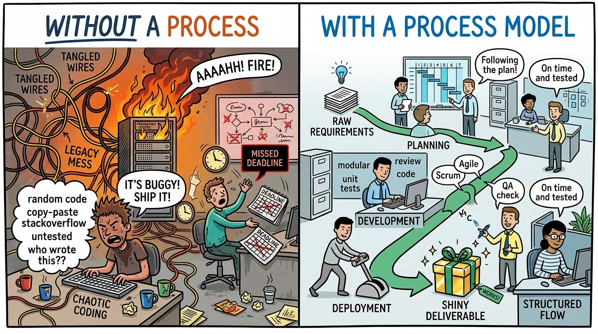

*Figure 2.1.1: Without an established process model, engineering teams degenerate into panic, ad-hoc patching, and unrepeatable heroics. A disciplined process provides an organized, repeatable path to sustainable software delivery.*

### 2.1.2 What is a Software Process Model?

While a *process* consists of the actual, ground-level activities that engineers perform every day, a **software process model** is an abstract, simplified architectural representation of that process. 

Think of a process model as a **city road map**:
* A city map does not display every individual building brick, pothole, tree, or streetlight. If it did, the map would be as large as the city itself and completely useless for navigation.
* Instead, the map abstracts away minor noise to clearly delineate major highways, transit arteries, intersections, and municipal districts.
* Similarly, a software process model abstracts away the minute details of daily coding syntax to define the **macro-structure**: the strategic sequencing of phases, transition criteria (entry/exit gates), formal milestones, deliverables, roles, and risk management policies.

### 2.1.3 Universal Process Activities: The 4 Pillars of SDLC

Regardless of whether a team follows an ultra-rigid military Waterfall model, a two-week Scrum cadence, an Extreme Programming regimen, or an autonomous AI agent workflow, **all software processes encompass four universal activities**:

```
+------------------------------------------------------------------------------------+
|                      THE 4 UNIVERSAL PROCESS ACTIVITIES                            |
+--------------------------+---------------------------------------------------------+
| Activity                 | Core Engineering Focus                                  |
+--------------------------+---------------------------------------------------------+
| 1. Software              | Eliciting, analyzing, negotiating, and documenting      |
|    Specification         | functional requirements, system constraints, user       |
|    (Requirements)        | stories, and formal acceptance criteria.                |
+--------------------------+---------------------------------------------------------+
| 2. Software Design &     | Establishing system architecture, interface contracts,   |
|    Implementation        | database schemas, and writing executable source code.   |
+--------------------------+---------------------------------------------------------+
| 3. Software Validation   | Verifying that code meets formal specifications and      |
|    (V&V / Testing)       | validating that the running system satisfies customer   |
|                          | operational needs in real-world environments.           |
+--------------------------+---------------------------------------------------------+
| 4. Software Evolution    | Modifying, refactoring, patching, and scaling software   |
|    (Maintenance)         | in response to bugs, architectural decay, and new       |
|                          | competitive market demands over years or decades.       |
+--------------------------+---------------------------------------------------------+
```

> 💡 **Core Insight**: The four activities above are *time-agnostic*. Every piece of software must be specified, designed, validated, and evolved. **Software process models differ fundamentally not in *what* activities they perform, but in *WHEN* and *HOW OFTEN* these activities occur!**
> * In Waterfall, each activity occurs once in a monumental, multi-month sequential block.
> * In Agile/XP, all four activities are interleaved and repeated dozens of times every single day.

### 2.1.4 The Process Model Landscape: From Predictive to Adaptive

Software processes exist along a continuous spectrum ranging from highly predictive (plan-driven) to highly adaptive (evolutionary and continuous):

```
Predictive (Plan-Driven) <=================================> Adaptive (Continuous)
[Waterfall] ---------> [V-Model] ---------> [Scrum/Kanban/XP] ---------> [DevOps / AI Spec]
Strict Upfront Plans   Symmetrical V&V      Short Iterations / MVP       Continuous Pipelines
Document Gates         Traceability         Refactoring & Flow           Automated Gates
```

1. **Plan-Driven / Sequential Models (Waterfall & V-Model):** Prioritize predictable budgets, fixed timelines, exhaustive upfront specifications, formal phase-gate sign-offs, and audit traceability.
2. **Evolutionary & Iterative Models (Spiral & Prototyping):** Prioritize explicit risk assessment, iterative refinement, and user mockups to resolve requirements ambiguity.
3. **Agile & Empirical Models (Scrum, Kanban, XP):** Prioritize working software, face-to-face team collaboration, rapid empirical feedback, and welcoming late-breaking requirement changes.
4. **Continuous & Spec-Driven Paradigms (DevOps & AI Specification-Driven):** Prioritize continuous integration/deployment automation, cloud infrastructure as code, and autonomous AI agents governed by deterministic verification gates.

---

## 2.2 Plan-Driven Paradigms — Waterfall & the V-Model

Plan-driven approaches represent the earliest formal software lifecycle methodologies. Originating in the late 1960s and early 1970s, they borrowed their organizational philosophy directly from traditional heavy engineering disciplines—such as civil infrastructure, bridge construction, and aerospace manufacturing.

```
+-----------------------------------------------------------------------------------+
|                        THE CIVIL ENGINEERING ANALOGY                              |
|                                                                                   |
|  Civil Engineering (Skyscraper / Bridge):                                         |
|  * Blueprints must be 100% complete before excavation begins.                     |
|  * Modifying foundation specifications after pouring concrete costs millions.     |
|                                                                                   |
|  Plan-Driven Software Engineering:                                                |
|  * Software requirements must be 100% frozen before coding begins.                |
|  * Modifying architecture after code implementation is assumed to be catastrophic.|
+-----------------------------------------------------------------------------------+
```

### 2.2.1 The Waterfall Model: 5 Sequential Stages

First formally described by **Winston W. Royce in 1970** in his landmark paper *"Managing the Development of Large Software Systems"*, the classic Waterfall model arranges development into distinct, sequential, cascading phases:

```
[ Requirements Definition ]
            |
            v  (Signed SRS Document)
      [ System & Software Design ]
                  |
                  v  (Architecture & Interface Specs)
            [ Implementation & Unit Testing ]
                        |
                        v  (Compiled Modules & Unit Test Runs)
                  [ Integration & System Testing ]
                              |
                              v  (Validated Production Release)
                        [ Operations & Maintenance ]
```

1. **Requirements Definition:** Systems analysts interact with stakeholders to document the entire scope of system capabilities, constraints, and non-functional goals in a legally binding *Software Requirements Specification (SRS)*.
2. **System & Software Design:** System architects map requirements into hardware allocations, multi-tier software architectures, data schemas, and component interface contracts, codified in a *Software Architecture Document (SAD)*.
3. **Implementation & Unit Testing:** Programmers translate design specifications into executable source code modules, verifying individual subroutines using isolated unit tests.
4. **Integration & System Testing:** The individually developed modules are integrated into a single unified system and tested against functional requirements, performance thresholds, and security benchmarks.
5. **Operations & Maintenance:** The software is deployed to the customer's production site. Ongoing maintenance involves patching defects and supporting operational upgrades.

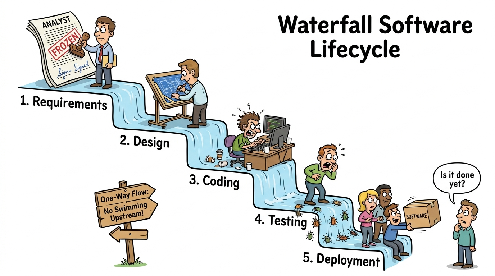

*Figure 2.2.1: The Waterfall Model. Progress cascades downward like water over rocks. Reversing direction to fix a requirements defect uncovered during integration requires climbing upstream against a crushing current of documentation and rework.*

### 2.2.2 Historical Irony: Royce's Original Warning

A profound historical irony surrounds the Waterfall model:
* In his original 1970 paper, Winston W. Royce presented the single-pass, sequential waterfall diagram on page 2.
* However, directly underneath the diagram, Royce wrote: **"I believe in this concept, but the implementation described above is risky and invites failure."**
* Royce explicitly warned that unless a project incorporated at least two full design iterations, exploratory prototypes, and continuous feedback between adjacent steps, major flaws discovered in testing would inevitably cause catastrophic project collapse.
* Tragically, bureaucratic procurement agencies (including the United States Department of Defense in DoD-STD-2167) adopted only the simplistic 1-pass waterfall diagram while ignoring Royce's warnings, canonizing rigid sequential handoffs as a mandatory contractual standard for decades.

### 2.2.3 Strengths, Limitations, and Failure Modes of Waterfall

**When Waterfall Excels (Applicability):**
* **Well-Understood, Frozen Requirements:** When requirements are physically bounded and virtually guaranteed not to change (e.g., rewriting an existing compiler for a new processor instruction set, or implementing a standardized cryptographic protocol).
* **Mission-Critical / Safety-Critical Systems:** Systems where software defects threaten human life (aviation fly-by-wire avionics DO-178C, spaceflight navigation, medical infusion pumps FDA Class III) and require exhaustive, documentable verification audits.
* **Large Multi-Contractor Consortia:** When a prime defense or infrastructure contractor must coordinate dozens of sub-contractors across different countries, fixed interface contracts and rigid milestone gates provide contractual clarity.

**Fatal Weaknesses in Commercial Software:**
* **Intolerance to Requirements Volatility:** In commercial business, customer needs and market conditions change continually. In Waterfall, accommodating a requirement change during integration requires renegotiating contracts, rewriting specifications, revising architecture, and discarding implemented code.
* **The "Big-Bang Integration" Nightmare:** Because components are developed independently over months and brought together only during the late testing phase, subtle interface mismatches and architectural bottlenecks explode into view simultaneously weeks before the scheduled release date.
* **Delayed Value Realization:** Customers must wait through 80–90% of the project duration before seeing or touching executable software, leading to "expectation mismatch" where the delivered system faithfully implements the outdated initial document but fails to solve the customer's current business problem.

---

<!-- id: ase-ch02-ccq1 -->
#### 🙋 **Concept Check (CCQ 1) — Operational Drawbacks of the Waterfall Model**

**Question**

What is the primary operational drawback of the traditional Waterfall model?

* A) It produces inadequate documentation for external auditing and compliance.
* B) It makes accommodating changing requirements extremely difficult and costly once underway.
* C) It eliminates the need for component and system testing during execution.
* D) It cannot be deployed across large-scale multi-site engineering organizations.

[Interactive Activity (線上作答)](https://nlhsueh.github.io/nickedupocket/#/student/ase-ch02-ccq1)


<details>
<summary>Click to view Answer & Explanation</summary>

Correct Answer: B
Explanation: The Waterfall model rigidly partitions activities into sequential stages with formal handoffs. Accommodating changing user needs requires costly backward iterations, contract renegotiation, and massive specification rework.
</details>

---

### 2.2.4 The V-Model: Proactive Verification & Validation

The **V-Model (Verification and Validation Model)** is an architectural extension of the Waterfall model designed specifically to conquer Waterfall's most dangerous flaw: treating testing as an afterthought delayed until the final project stages.

The V-Model bends the linear waterfall downward and upward into a symmetrical "V" shape, enforcing **dual-track engineering**:

```
      DECOMPOSITION & SPECIFICATION                       INTEGRATION & VALIDATION
      (Left Downward Arm)                                 (Right Upward Arm)

  User Requirements -------------------------------------> Acceptance Testing
         \                                                    ^
          v                                                  /
    System Architecture -------------------------> System Integration Testing
           \                                              ^
            v                                            /
      Detailed Component Design -------------> Unit / Component Testing
             \                                        ^
              v                                      /
             +--------------------------------------+
             |   Source Code Implementation (Tip)   |
             +--------------------------------------+
```

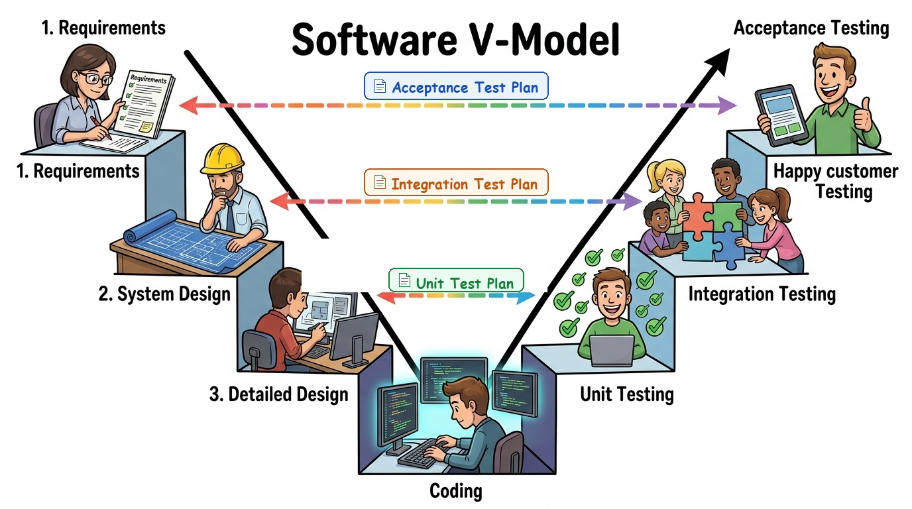

*Figure 2.2.2: The V-Model. The left downward arm specifies and decomposes the system; the right upward arm integrates and validates components. Horizontal arrows illustrate that test suites are designed concurrently with specifications.*

### 2.2.5 The 3 Symmetrical Verification Levels

The power of the V-Model lies in the **horizontal dashed lines** linking each decomposition phase on the left with its corresponding verification phase on the right:

1. **User Requirements $\longleftrightarrow$ Acceptance Testing:**
   * *Core Question:* *"Are we building the right system?"* (Validation).
   * *Mechanism:* While requirements engineers define business workflows and user stories on the left, quality assurance leads simultaneously author the **User Acceptance Test (UAT) Plan** on the right.
2. **System Architecture $\longleftrightarrow$ System Integration Testing:**
   * *Core Question:* *"Are subsystems and microservices communicating correctly?"* (Verification).
   * *Mechanism:* While architects define network protocols, database schemas, and API contracts on the left, integration engineers concurrently author automated integration test suites verifying inter-service boundaries.
3. **Detailed Component Design $\longleftrightarrow$ Unit / Component Testing:**
   * *Core Question:* *"Do individual algorithms and classes execute correctly without crashing?"* (Verification).
   * *Mechanism:* While software engineers specify class interfaces, data structures, and edge-case behaviors on the left, they write unit test specifications verifying algorithms before writing production code.

### 2.2.6 Requirements Traceability & Defect Prevention

By linking specification directly to test design, the V-Model introduces the **Requirements Traceability Matrix (RTM)**:
* Every requirement in the SRS maps to at least one acceptance test case.
* Every test case links back to an explicit business requirement.
* **Proactive Defect Prevention:** Writing test cases during specification exposes ambiguities, contradictions, and omissions in the requirements *before* code is ever implemented. If an engineer cannot determine how to test a requirement, the requirement is ambiguous and must be rewritten immediately.

---

<!-- id: ase-ch02-ccq2 -->
#### 🙋 **Concept Check (CCQ 2) — V-Model Proactive Test Planning**

**Question**

What is the primary engineering advantage of the V-Model over the classic Waterfall model?

* A) It produces working software increments in short two-week sprint iterations.
* B) It enforces test planning and acceptance criteria design concurrently with early specification phases.
* C) It eliminates the need for detailed architecture design and interface contracts.
* D) It allows customers to dynamically modify requirements at zero cost during implementation.

[Interactive Activity (線上作答)](https://nlhsueh.github.io/nickedupocket/#/student/ase-ch02-ccq2)


<details>
<summary>Click to view Answer & Explanation</summary>

Correct Answer: B
Explanation: The V-Model's definitive breakthrough is horizontal symmetry: test suites are authored concurrently with their corresponding specification phases (e.g., acceptance tests designed during requirements analysis), front-loading defect discovery.
</details>

---

### 🗣️ Classroom Interactive Activity 1 — Process Model Matchmaker (Pair Discussion)

> 💡 **Pair Discussion Scenario: Selecting the Right Software Process Model**
> 
> You are senior software engineering consultants advising three different client organizations. Analyze each system's risk profile, regulatory compliance constraints, and requirement volatility:
> 
> * **System A (Deep-Brain Neurostimulator Firmware)**: An implantable life-critical medical device requiring strict FDA Class III pre-market approval. A single software runtime defect can cause fatal patient injury, and firmware updates post-implantation require surgical intervention.
> * **System B (Campus Viral Food Delivery & Group-Buying App)**: A student startup developing a localized food delivery application. Competitor services launch features weekly, consumer preferences fluctuate rapidly, and business survival depends on launching an MVP in 30 days and iterating based on real user feedback.
> * **System C (National Corporate Tax Calculation Engine Overhaul)**: Modernizing a 20-year-old government legacy tax system. The tax statutes, accounting equations, and calculation rules are mathematically fixed by statutory law, with an immutable national filing deadline of May 1st.
> 
> **Discussion Questions for Pairs/Groups**:
> 1. **Model Selection**: Which process model (Linear Waterfall, Symmetrical V-Model, Agile Scrum, or Spiral/Risk-Driven) would your team recommend for System A, System B, and System C? Justify your architectural reasoning.
> 2. **Failure Analysis**: What specific catastrophe would happen if an inexperienced engineering team used "Agile/Vibe coding with minimal upfront testing" on System A, or "Pure Waterfall with frozen 6-month specifications" on System B?
> 3. **Hybrid Strategies**: For System C, how can a team blend plan-driven rigor (for the core tax calculation logic) with agile delivery (for the taxpayer web portal and accountant UI)?

---

## 2.3 The Mechanics of Change — Incremental and Iterative Development

As the software industry entered the 1980s and 1990s, the fatal integration risks of plan-driven sequential models sparked a fundamental engineering re-evaluation. Software systems were growing too dynamic, and commercial markets too volatile, to tolerate 18-month sequential delivery schedules.

The solution emerged in two distinct but complementary mechanisms: **Incremental Delivery** and **Iterative Refinement**.

```
+-----------------------------------------------------------------------------------+
|                        INCREMENTAL vs. ITERATIVE AT A GLANCE                      |
+------------------------------------+----------------------------------------------+
| Dimension                          | Incremental Development                      |
+------------------------------------+----------------------------------------------+
| Engineering Focus                  | "Breadth & Partitioning" (Adding pieces)     |
| Architectural Action               | Deliver vertical functional slice A, then B. |
| Metaphor                           | Building a brick wall layer by layer.        |
+------------------------------------+----------------------------------------------+
| Dimension                          | Iterative Development                        |
+------------------------------------+----------------------------------------------+
| Engineering Focus                  | "Depth & Polish" (Refining the whole)        |
| Architectural Action               | Create a rough draft of the whole, polish it.|
| Metaphor                           | A sculptor chiseling a rough marble block.   |
+------------------------------------+----------------------------------------------+
```

### 2.3.1 Incremental Delivery: Vertical Functional Slicing

An **incremental** process partitions a large system into smaller, self-contained functional components called **increments**. 

Rather than horizontal slicing (e.g., building 100% of the database in Month 1, 100% of the backend API in Month 2, and 100% of the frontend in Month 3), incremental engineering demands **vertical slicing**:
* Each increment encompasses a thin, fully operational slice cutting across all architectural layers: user interface, business logic, validation rules, and persistent storage.
* **Increment 1:** Basic User Registration & Authentication (Fully functional, deployed to production, logging real user metrics).
* **Increment 2:** Core Product Browsing & Search (Deployed on top of Increment 1).
* **Increment 3:** Shopping Cart & Checkout (Deployed on top of Increments 1 and 2).

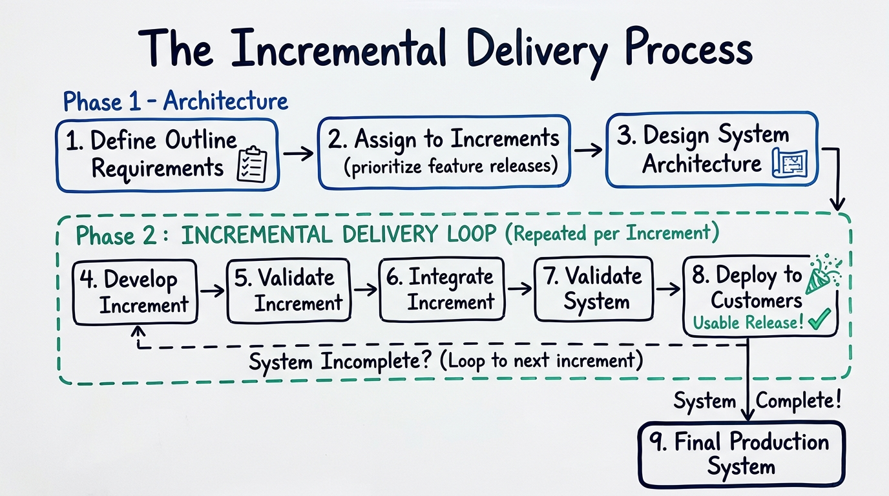

*Figure 2.3.1: Incremental Delivery. High-priority functional slices are designed, implemented, tested, and shipped in sequential increments, delivering early business value while establishing an operational baseline.*

### 2.3.2 Iterative Development & The Sculptor Analogy

An **iterative** process focuses on **continuous progressive refinement of the whole system**. Instead of delivering finished functional chunks one by one, an incomplete, rough version of the *entire* system is constructed first, and then repeatedly revised, deepened, and polished through successive feedback loops.

The classic analogy is **The Sculptor**:
* **Iteration 1 (Rough Silhouette):** The sculptor takes a raw block of marble and chisels the rough outline of a human form. The statue has no fingers, no eyes, and no fine curves, but the overall height, posture, and proportions are established.
* **Iteration 2 (Proportions & Limbs):** The arms, legs, and torso are defined. The sculptor steps back, assesses balance, and corrects anatomical alignment.
* **Iteration 3 (Features & Musculature):** Facial features, hands, and muscular definitions are carved into the stone.
* **Iteration 4 (Fine Polish):** Sanding, surface texturing, and polishing produce the finished masterpiece.

```
[Raw Marble Block] ---> [Rough Silhouette] ---> [Defined Limbs] ---> [Polished Masterpiece]
    (Start)               (Iteration 1)           (Iteration 2)          (Final Iteration)
```

> 💡 **The Sculptor's Lesson**: A sculptor **never** carves a 100% perfect, polished left ear out of raw marble while leaving the rest of the block completely untouched! If they did, discovering later that the head was five inches too low would force them to throw the entire block away.

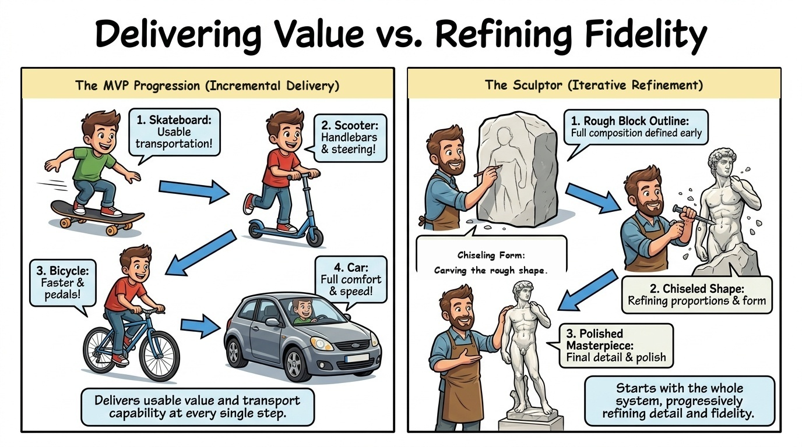

*Figure 2.3.2: Iterative Refinement. Starting from an end-to-end walking skeleton, iterative cycles progressively increase fidelity, capability, and performance across the entire system.*

### 2.3.3 The Mona Lisa Analogy (Jeff Patton)

Agile leader Jeff Patton created the famous **Mona Lisa painting analogy** to illustrate why pure incremental development without iteration can lead to commercial failure:

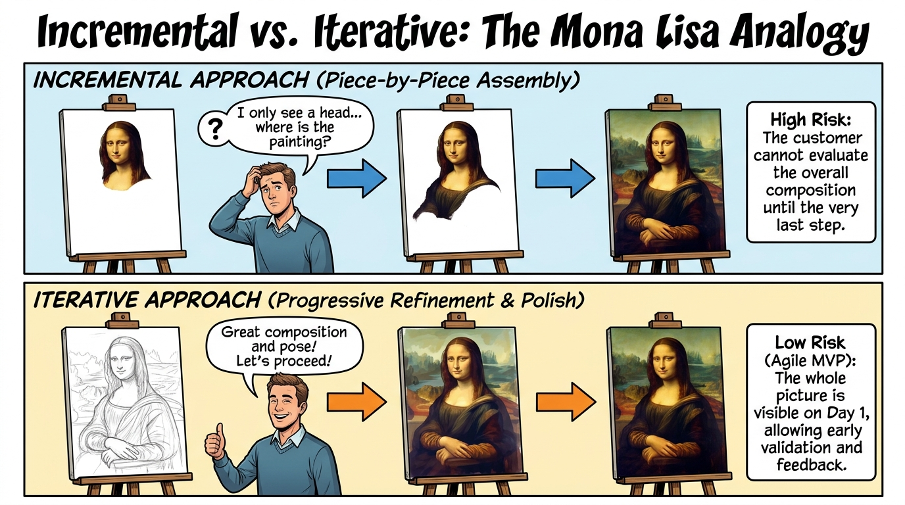

*Figure 2.3.3: Pure Incremental vs. Iterative Development (Jeff Patton). In pure incremental (top), a quarter of the canvas is finished to photo-realism while three-quarters remains blank. In iterative (bottom), a full sketch is established first, allowing early feedback on composition before detailed painting.*

* **Top Row (Pure Incremental without Iteration):** The artist paints the top-left background with 100% photorealistic oil paint. The rest of the canvas is dead white. If the client runs out of money or needs to verify the portrait's subject in Month 2, the painting is useless.
* **Bottom Row (Iterative + Incremental):** The artist sketches a pencil silhouette of the entire portrait. In pass two, color blocking establishes lighting and mood. In pass three, fine details, glazing, and textures bring the portrait to lifelike perfection. At any point in time, the client can evaluate the entire painting and guide its evolution.

### 2.3.4 The Combined Model & The Minimum Viable Product (MVP)

In modern software engineering, high-performing teams **combine both dimensions**: they deliver functional slices incrementally, while iteratively refining existing capabilities based on user analytics and telemetry.

This synthesis gives birth to the **Minimum Viable Product (MVP)**. Consultant Henrik Kniberg formalized this through his world-famous transportation metaphor:

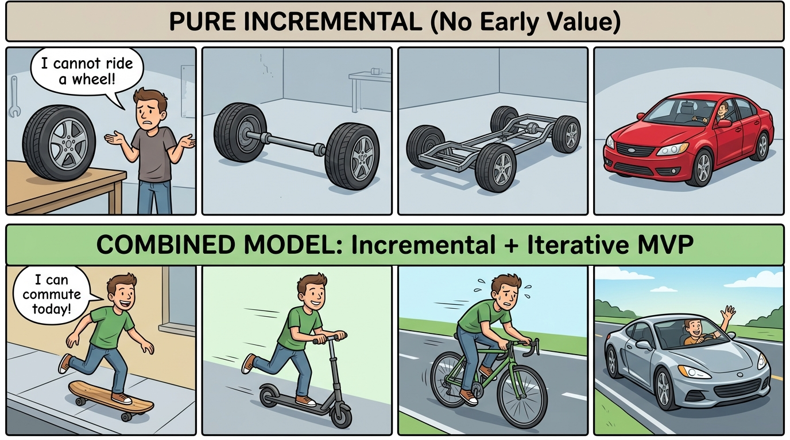

*Figure 2.3.4: The Henrik Kniberg MVP Metaphor. Delivering an isolated wheel, axle, and chassis (top) provides zero transportation value to an unhappy user. Delivering a skateboard, scooter, bicycle, motorcycle, and car (bottom) solves the core mobility problem from day one, gathering real user feedback at every step.*

* **Top Row (What NOT to do — Component Staging):** The customer wants a car. In Month 1, you deliver an isolated tire. Can the customer drive to work? No. In Month 2, you deliver two tires and an axle. Can they drive? No. The customer is frustrated throughout the entire lifecycle until the final car assembly.
* **Bottom Row (What TO do — True Agile MVP):** The customer's underlying problem is: *"I need to travel from Point A to Point B faster than walking."*
  1. **Release 1 (Skateboard):** Cheap, simple, but functional. The user can roll to work. You learn: *Do they like open-air travel? Is the terrain smooth?*
  2. **Release 2 (Kick Scooter):** Add a handlebar for steering control. User satisfaction increases.
  3. **Release 3 (Bicycle):** Add pedals and gears for distance and speed.
  4. **Release 4 (Motorcycle):** Add an internal combustion engine.
  5. **Release 5 (Car):** Add an enclosed cabin, air conditioning, and safety airbags.
  * **The Critical Discovery:** The team might discover at Release 3 that a lightweight bicycle perfectly solves the customer's urban commuting problem for 5% of the cost of building a car, saving millions of dollars in unneeded engineering!

### 2.3.5 Real-World Case Study: Food Delivery System

To understand how incremental and iterative engineering combine in commercial practice, consider building a food ordering platform (e.g., UberEats):

```
+------------------------------------------------------------------------------------+
|                FOOD DELIVERY PLATFORM: INCREMENTAL + ITERATIVE                     |
+---------------------+--------------------------------------------------------------+
| Phase               | Implementation & Strategy                                    |
+---------------------+--------------------------------------------------------------+
| Sprint 1: MVP       | * Simple text-based menu (HTML).                             |
| (End-to-End Core)   | * Cash-on-delivery only (no payment gateway).                |
|                     | * Manual phone dispatch to restaurant and drivers.           |
|                     | --> Result: Complete vertical order flow functions on Day 1! |
+---------------------+--------------------------------------------------------------+
| Sprint 2:           | * Add Online Credit Card & Apple Pay integration.            |
| Incremental Slice   | * Automated merchant notification tablet app.                |
|                     | --> Result: New functional capability added to stable base.  |
+---------------------+--------------------------------------------------------------+
| Sprint 3:           | * Upgrade plain driver text notification to real-time GPS    |
| Iterative Polish    |   mapping, dynamic routing, and driver location tracking.    |
|                     | --> Result: Deepens and polishes existing delivery workflow. |
+---------------------+--------------------------------------------------------------+
```

---

<!-- id: ase-ch02-ccq3 -->
#### 🙋 **Concept Check (CCQ 3) — Incremental vs. Iterative Distinction**

**Question**

In software process engineering, what is the fundamental conceptual difference between "Incremental" and "Iterative" development?

* A) Incremental focuses on automated testing; Iterative focuses on UI design.
* B) Incremental delivers finished functional slices stage-by-stage; Iterative refines an end-to-end working draft over repeated cycles.
* C) Incremental is managed by product owners; Iterative is managed exclusively by external regulators.
* D) Incremental follows waterfall rules; Iterative produces no documentation.

[Interactive Activity (線上作答)](https://nlhsueh.github.io/nickedupocket/#/student/ase-ch02-ccq3)


<details>
<summary>Click to view Answer & Explanation</summary>

Correct Answer: B
Explanation: Incremental builds software piece by piece by vertical functional slices; iterative starts with a rough draft of the entire system and progressively refines depth, fidelity, and polish through repeated cycles.
</details>

---

<!-- id: ase-ch02-ccq4 -->
#### 🙋 **Concept Check (CCQ 4) — MVP Skateboard Analogy Anti-Pattern**

**Question**

In Henrik Kniberg's famous Minimum Viable Product (MVP) analogy (Skateboard to Car), why is delivering a standalone car wheel in the first release considered an anti-pattern?

* A) Because manufacturing an isolated wheel is significantly more expensive than building a skateboard.
* B) Because an isolated wheel provides zero end-to-end transportation value, preventing users from validating core problem assumptions.
* C) Because modern vehicle designs prohibit upgrading wheels into scooters.
* D) Because software engineering standards mandate that all early increments must be rectangular.

[Interactive Activity (線上作答)](https://nlhsueh.github.io/nickedupocket/#/student/ase-ch02-ccq4)


<details>
<summary>Click to view Answer & Explanation</summary>

Correct Answer: B
Explanation: An MVP must deliver standalone, end-to-end usable value that solves a real user problem. A single wheel cannot transport a person, leaving the user dissatisfied and generating zero empirical feedback on transportation needs.
</details>

---

### 🗣️ Classroom Interactive Activity 2 — Slicing a Chess App (Group Discussion)

> 💡 **Group Discussion Scenario: Incremental Delivery vs. Iterative Refinement**
> 
> Your team has been tasked with designing and implementing a modern Web-Based Chess Platform from scratch during a single academic semester. To prevent project failure, your team must carefully distinguish between **Incremental Development** (delivering distinct functional slices of value) and **Iterative Refinement** (deepening and polishing existing capabilities through feedback).
> 
> **Discussion Questions for Groups**:
> 1. **Incremental Feature Slices (Horizontal & Functional Breadth)**:
>    * Propose 4 sequential releases that each provide immediate, end-to-end usable value to chess players:
>      * *Increment 1*: Local 2-player pass-and-play chessboard on a single screen with basic piece movement rules.
>      * *Increment 2*: Check/checkmate validation, move history notation (PGN export), captured piece displays, and a chess clock timer.
>      * *Increment 3*: Single-player mode with an AI engine opponent (heuristic Minimax or Stockfish web worker integration).
>      * *Increment 4*: Real-time online multiplayer lobby via WebSockets with Elo matchmaking and user ratings.
> 2. **Iterative Refinement Cycles (Vertical & Qualitative Depth)**:
>    * Select the **Chessboard & Piece UI** component and demonstrate how it evolves iteratively across releases:
>      * *Iteration 1 (Functional Baseline / Rough Prototype)*: A lightweight HTML table or ASCII console grid that validates board coordinates and piece arrays.
>      * *Iteration 2 (Usability Refinement)*: A 2D responsive canvas board with SVG vector pieces, valid move dot indicators, and turn highlight overlays.
>      * *Iteration 3 (Production Delight & Polish)*: Smooth piece drag-and-drop animations, audio sound effects for captures/checks, premove queuing, and accessibility screen-reader support.
> 3. **The MVP Anti-Pattern**:
>    * Explain why a team that spends 8 weeks building a photorealistic 3D piece rendering engine before the board can even calculate a valid Pawn move has committed the "standalone car wheel" anti-pattern.

---

## 2.4 The Mindset Shift — Agile Philosophy

By the late 1990s, the software industry had reached an inflection point. Corporate software development was paralyzed by **heavyweight methodologies** (such as Rational Unified Process, SSADM, and military standard documentation).

The Standish Group's landmark 1994 *CHAOS Report* documented an appalling reality:
* **Only 16.2%** of enterprise software projects were completed on time and within budget.
* **31.1%** of projects were cancelled outright before ever delivering a single line of code to production.
* **52.7%** were severely impaired—exceeding budgets by an average of 189% and delivering less than half of the originally specified features.

The fundamental culprit was **"Analysis Paralysis"**: teams spent 12 months writing massive, 500-page specification documents, only to discover that by the time the software was compiled, the underlying business environment, regulatory framework, and customer expectations had completely transformed.

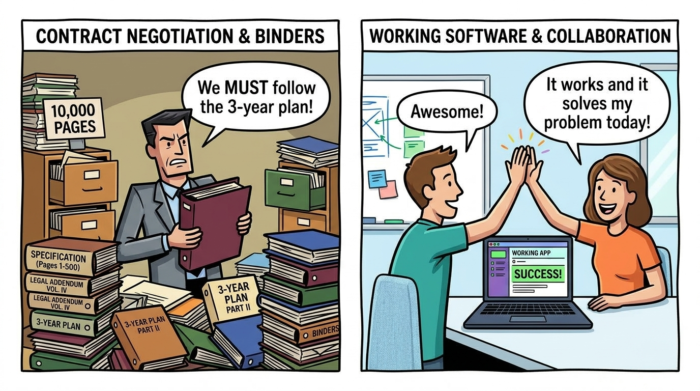

*Figure 2.4.1: Traditional Bureaucracy vs. Agile Collaboration. Heavy documentation, rigid contracts, and change-control boards stifle human ingenuity. Agile shifts focus toward working software, human collaboration, and rapid response to change.*

### 2.4.1 Empirical Process Control: The Agile Bedrock

Traditional plan-driven processes assume a **Defined Process Control model** (appropriate for chemical refining or car assembly): every input, step, and output can be completely predicted and mathematically modeled in advance.

Agile pioneers recognized that software development is an intrinsically creative, non-linear human endeavor governed by **Empirical Process Control (經驗主義過程控制)**, anchored by three fundamental pillars:

```
+-----------------------------------------------------------------------------------+
|                     THE 3 PILLARS OF EMPIRICAL PROCESS CONTROL                    |
+------------------+----------------------------------------------------------------+
| Pillar           | Operational Definition                                         |
+------------------+----------------------------------------------------------------+
| 1. Transparency  | Significant aspects of the process, codebase, bottlenecks, and |
|    (透明性)      | true project progress must be visible to all stakeholders.    |
+------------------+----------------------------------------------------------------+
| 2. Inspection    | Teams must frequently inspect progress toward sprint goals,    |
|    (檢驗性)      | software quality, and architectural integrity.                 |
+------------------+----------------------------------------------------------------+
| 3. Adaptation    | If inspection reveals deviation or defects, the team must      |
|    (調適性)      | adjust its process, backlog, or code immediately.              |
+------------------+----------------------------------------------------------------+
```

### 2.4.2 The Agile Manifesto: 4 Core Values

In February 2001, seventeen software pioneers (including Kent Beck, Ward Cunningham, Martin Fowler, Robert C. Martin, Jeff Sutherland, and Ken Schwaber) gathered at the Snowbird ski resort in Utah. Despite promoting competing methods (Extreme Programming, Scrum, DSDM, Adaptive Software Development, Crystal), they synthesized their shared philosophy into **The Agile Manifesto (敏捷軟體開發宣言)**:

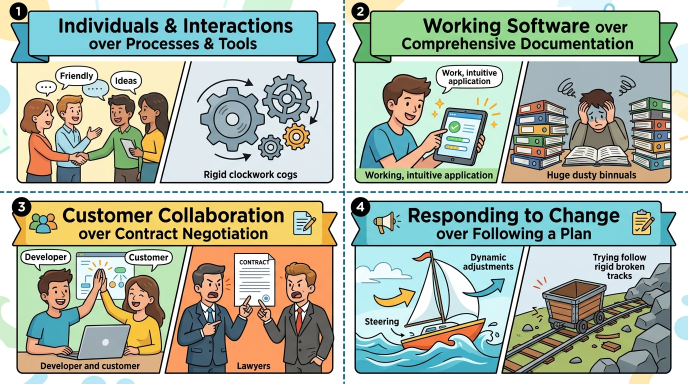

*Figure 2.4.2: The Agile Manifesto Balance Scale. While there is value in the items on the right, Agile places significantly greater weight and priority on the human and adaptive items on the left.*

1. **Individuals and interactions** over processes and tools
   * *Meaning:* The best tools and strictest processes in the world cannot compensate for poor communication, lack of psychological safety, or unmotivated engineers. Face-to-face dialogue solves problems faster than Jira ticket ping-pong.
2. **Working software** over comprehensive documentation
   * *Meaning:* The only unambiguous, objective proof of project progress is running, tested software delivering value. Documentation is useful as a supporting artifact, but delivering a 200-page architecture spec without running code equals zero progress.
3. **Customer collaboration** over contract negotiation
   * *Meaning:* Traditional procurement treats customers and developers as adversaries bound by rigid legal contracts. Agile treats customers as daily collaborative partners discovering requirements together.
4. **Responding to change** over following a plan
   * *Meaning:* A project plan is a working hypothesis, not a religious dogma. When market realities change, rigidly sticking to an outdated plan guarantees delivery of an obsolete system.

### 2.4.3 The 12 Principles of Agile Software

```
+------------------------------------------------------------------------------------+
|                        THE 12 AGILE PRINCIPLES SUMMARY                             |
+------------------------------------------------------------------------------------+
| 1. Satisfy the Customer: Early and continuous delivery of valuable software.      |
| 2. Welcome Changing Requirements: Harness change for customer competitive edge.    |
| 3. Deliver Working Software Frequently: From couple of weeks to couple of months.  |
| 4. Daily Collaboration: Business stakeholders and developers must work together.   |
| 5. Motivated Individuals: Build projects around motivated people; give trust.      |
| 6. Face-to-Face Conversation: The most efficient and effective communication mode. |
| 7. Working Software as Primary Metric: The ultimate measure of project progress.   |
| 8. Sustainable Development: Maintain a constant, unhurried pace indefinitely.      |
| 9. Technical Excellence: Continuous attention to good design enhances agility.     |
| 10. Simplicity: The art of maximizing the amount of work NOT done is essential.    |
| 11. Self-Organizing Teams: Best architectures, requirements, and designs emerge.   |
| 12. Regular Reflection: Team tunes and adjusts behavior at regular intervals.      |
+------------------------------------------------------------------------------------+
```

---

<!-- id: ase-ch02-ccq5 -->
#### 🙋 **Concept Check (CCQ 5) — Working Software over Comprehensive Documentation**

**Question**

The Agile Manifesto states: *"Working software over comprehensive documentation."* What does this value primarily advocate in practice?

* A) Engineering teams are completely prohibited from writing architecture blueprints or API specifications.
* B) While documentation has value, delivering working, tested, and validated software is the primary measure of progress and customer value.
* C) Projects should be evaluated solely on executive PowerPoint presentations.
* D) Source code comments must be erased before deployment to production.

[Interactive Activity (線上作答)](https://nlhsueh.github.io/nickedupocket/#/student/ase-ch02-ccq5)


<details>
<summary>Click to view Answer & Explanation</summary>

Correct Answer: B
Explanation: The Agile Manifesto emphasizes that running, tested software delivering actual business value takes precedence over generating exhaustive paperwork. Documentation is authored when it serves an essential communicative purpose, but never at the expense of working software.
</details>

---

<!-- id: ase-ch02-ccq6 -->
#### 🙋 **Concept Check (CCQ 6) — Sustainable Pace**

**Question**

Agile Principle 8 states: *"Agile processes promote sustainable development. The sponsors, developers, and users should be able to maintain a constant pace indefinitely."* What is the primary engineering motivation?

* A) To prevent code quality degradation, accumulated defects, and developer burnout caused by chronic overtime and crunch periods.
* B) To mandate that developers submit at least 50 pull requests per day.
* C) To eliminate the need for software upgrades after initial system launch.
* D) To restrict development teams to working only on legacy systems.

[Interactive Activity (線上作答)](https://nlhsueh.github.io/nickedupocket/#/student/ase-ch02-ccq6)


<details>
<summary>Click to view Answer & Explanation</summary>

Correct Answer: A
Explanation: Chronic overtime causes severe cognitive fatigue, multiplying defect injection rates and accelerating developer burnout. A sustainable, predictable pace produces higher quality code and predictable delivery velocity over years.
</details>

---

## 2.5 Agile Project Management — Scrum & Kanban

The Agile Manifesto established values and principles, but intentionally refrained from specifying daily operational rules. To translate philosophy into daily practice, organizations adopt **Agile Project Management Frameworks**.

> ⚠️ **Critical Architectural Boundary**: Management frameworks govern **HOW WORK IS COORDINATED, PRIORITIZED, AND TRACKED**. They are deliberately silent on **HOW CODE IS ENGINEERED**. Adopting Scrum or Kanban without technical engineering rigor produces what Martin Fowler terms "Flaccid Scrum".

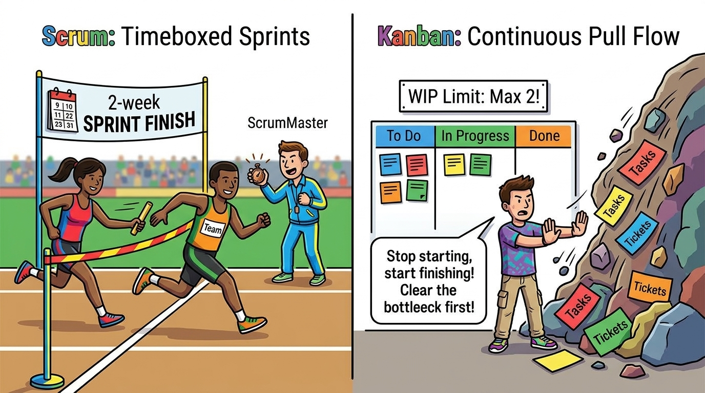

*Figure 2.5.1: Scrum vs. Kanban. Scrum relies on fixed timeboxed cadences (sprints) with batch planning and retrospectives; Kanban optimizes continuous pull-based flow by strictly limiting Work In Progress (WIP).*

### 2.5.1 The Scrum Framework

Scrum, created by Ken Schwaber and Jeff Sutherland, is an iterative, timeboxed management framework based on cross-functional self-organizing teams.

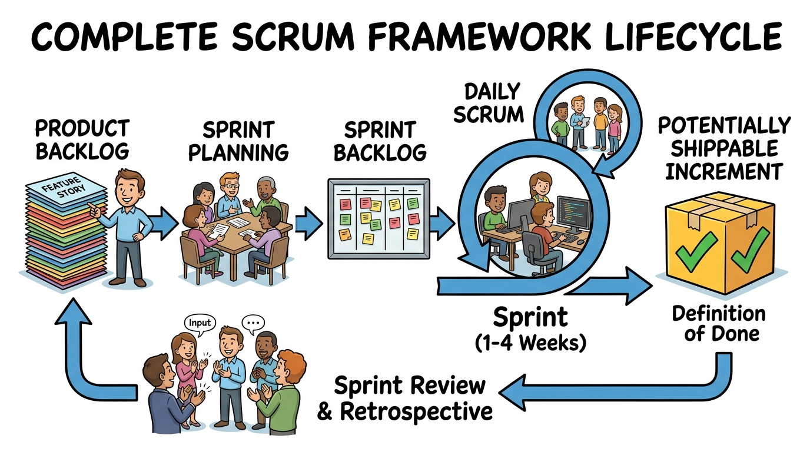

*Figure 2.5.2: The Complete Scrum Framework Lifecycle. The Product Owner prioritizes the Product Backlog. During Sprint Planning, the team selects items into the Sprint Backlog. Across a 1–4 week timebox, the team synchronizes daily, producing a Potentially Shippable Increment verified in the Sprint Review and reflected upon in the Sprint Retrospective.*

#### Scrum Roles: The Triangle of Balance
1. **Product Owner (PO):** The single voice of business value. Owns the Product Backlog, writes user stories, sets acceptance criteria, prioritizes features, and maximizes Return on Investment (ROI). The PO decides *WHAT* gets built and *IN WHAT ORDER*.
2. **Scrum Master (SM):** The servant leader and process facilitator. Does not manage people or assign tasks; instead, coaches the team in Scrum practices, shields the team from external distractions, and ruthlessly removes operational impediments (roadblocks).
3. **The Developers (Engineering Team):** A cross-functional, self-organizing group of professionals (architects, coders, testers, UX designers) who own the technical execution. The developers decide *HOW* to build the backlog items and *HOW MUCH* work they can commit to in a sprint.

#### Scrum Artifacts & The Definition of Done (DoD)
* **Product Backlog:** An emergent, ordered list of everything that might be needed in the product. Single source of requirements.
* **Sprint Backlog:** The subset of Product Backlog items selected for the current sprint, paired with the engineering plan for delivering them.
* **Increment & Definition of Done (DoD):** The sum of all backlog items completed during a sprint that meet the team's formal **Definition of Done (DoD)**. A story is not "done" when the developer finishes coding; it is done only when it is coded, unit-tested, peer-reviewed, merged to main, automated CI passed, deployed to staging, and verified against acceptance criteria.

#### The 4 Scrum Ceremonies
1. **Sprint Planning:** Team inspects the backlog, defines a unifying **Sprint Goal**, and selects backlog items into the sprint backlog.
2. **Daily Scrum (Daily Standup):** A 15-minute daily synchronization meeting for developers to align on the Sprint Goal: *What did I accomplish yesterday? What will I work on today? Are there any blockers in my way?*
3. **Sprint Review:** End-of-sprint live demonstration of the working increment to stakeholders to gather empirical feedback. (No PowerPoint allowed—only real software!).
4. **Sprint Retrospective:** End-of-sprint internal team reflection focused purely on *people, relationships, processes, and tools*: *What went well? What caused friction? What single actionable improvement will we commit to implementing in the next sprint?*

### 2.5.2 The Kanban Framework: Continuous Flow & Pull Systems

Originating from Taiichi Ohno's **Toyota Production System (TPS)** in lean automotive manufacturing, Kanban abandons fixed timeboxes in favor of optimizing **Continuous Flow** through a **Pull System**.

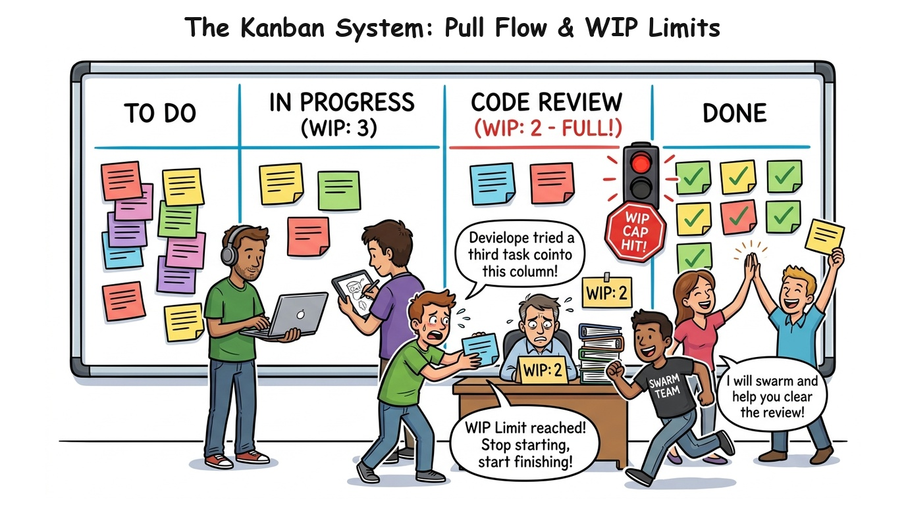

*Figure 2.5.3: The Kanban Board with WIP Limits. Limiting Work in Progress (WIP) on columns forces developers to swarm on bottlenecks rather than starting new tickets, living by the motto: "Stop starting, start finishing!"*

#### The 4 Core Practices of Kanban
1. **Visualize the Workflow:** All work items are mapped onto visual cards across vertical columns representing workflow states: `[Backlog]` -> `[Ready]` -> `[In Progress]` -> `[Code Review]` -> `[Testing]` -> `[Deployed]`.
2. **Limit Work In Progress (WIP Limits):** Strict numeric caps are enforced on individual columns (e.g., `Code Review [Max: 2]`). If a column reaches its limit, **no upstream worker is permitted to push new cards into it**. Developers must stop starting new code and swarm to help review existing tickets.
3. **Manage and Measure Flow:** Teams monitor **Lead Time** (elapsed time from ticket creation to production release) and **Cycle Time** (time spent actively working on a ticket).
4. **Make Process Policies Explicit:** Clear, unambiguous entry/exit criteria define when a card is allowed to transition between columns.

### 2.5.3 Scrum vs. Kanban: Comprehensive Comparison

```
+---------------------+-------------------------------+-------------------------------+
| Dimension           | Scrum                         | Kanban                        |
+---------------------+-------------------------------+-------------------------------+
| Cadence & Iteration | Fixed timeboxed sprints (1–4w)| Continuous, unbroken flow     |
+---------------------+-------------------------------+-------------------------------+
| Release Mechanism   | At sprint boundary or on-demand| Continuous per-ticket delivery |
+---------------------+-------------------------------+-------------------------------+
| Change Policy       | Scope locked during sprint;   | Changes pulled anytime column |
|                     | changes deferred to next plan | has capacity under WIP limit  |
+---------------------+-------------------------------+-------------------------------+
| Limiting Work       | Indirectly via sprint velocity| Directly via numeric WIP caps |
+---------------------+-------------------------------+-------------------------------+
| Prescribed Roles    | Strict: PO, SM, Developers    | None: Overlaid on existing org|
+---------------------+-------------------------------+-------------------------------+
| Primary Metrics     | Velocity, Burndown Charts     | Lead Time, Cycle Time, CFD    |
+---------------------+-------------------------------+-------------------------------+
```

---

<!-- id: ase-ch02-ccq7 -->
#### 🙋 **Concept Check (CCQ 7) — Kanban WIP Limits**

**Question**

In the Kanban process framework, what is the primary operational purpose of enforcing strict "Work In Progress" (WIP) limits on columns?

* A) To prevent developers from modifying automated unit test scripts.
* B) To expose bottlenecks, reduce multitasking context-switching waste, and maximize delivery flow throughput.
* C) To mandate that every team member attends daily 15-minute standup meetings.
* D) To ensure all software increments are packaged into fixed 2-week sprint iterations.

[Interactive Activity (線上作答)](https://nlhsueh.github.io/nickedupocket/#/student/ase-ch02-ccq7)


<details>
<summary>Click to view Answer & Explanation</summary>

Correct Answer: B
Explanation: By restricting WIP limits, teams prevent hidden queues, eliminate context-switching waste, and immediately highlight process bottlenecks where cards pile up.
</details>

---

<!-- id: ase-ch02-ccq8 -->
#### 🙋 **Concept Check (CCQ 8) — Sprint Retrospective Objective**

**Question**

In the Scrum framework, what is the primary operational objective of the **Sprint Retrospective** held at the end of each sprint?

* A) To demonstrate working software increments to external business stakeholders.
* B) To inspect internal team collaboration, engineering practices, and tools, and identify actionable process improvements for the next sprint.
* C) To assign individual performance ratings and conduct annual salary reviews.
* D) To rewrite the entire product backlog and discard unfinished user stories.

[Interactive Activity (線上作答)](https://nlhsueh.github.io/nickedupocket/#/student/ase-ch02-ccq8)


<details>
<summary>Click to view Answer & Explanation</summary>

Correct Answer: B
Explanation: While the Sprint Review focuses on inspecting the product with stakeholders, the Sprint Retrospective focuses inward on the team's processes, collaboration dynamics, and engineering practices to implement continuous self-improvement.
</details>

---

## 2.6 The Hidden Cost of Speed — Technical Debt

In the quest for commercial velocity, teams frequently face a seductive temptation: cut engineering corners, skip automated testing, hardcode business logic, and bypass architectural reviews to ship features ahead of competitors.

In 1992, software pioneer **Ward Cunningham** (co-author of the Agile Manifesto and inventor of the Wiki) coined the financial metaphor of **Technical Debt (技術債)** to explain the economic reality of this trade-off.

```
+-----------------------------------------------------------------------------------+
|                     THE FINANCIAL METAPHOR OF TECHNICAL DEBT                      |
|                                                                                   |
|  * The Principal (本金):                                                          |
|    The engineering shortcuts taken to ship early (e.g., hardcoded values, missing|
|    unit tests, duplicated copy-paste code, tightly coupled monolithic classes).   |
|                                                                                   |
|  * The Interest (利息):                                                           |
|    The extra friction, cognitive load, slowdown, and defect-fixing time imposed   |
|    on developers during EVERY future modification of that brittle codebase.      |
|                                                                                   |
|  * Technical Bankruptcy (技術破產):                                               |
|    When compounding interest consumes 100% of engineering capacity—all velocity  |
|    drops to zero as developers spend every working hour fighting regressions.     |
+-----------------------------------------------------------------------------------+
```

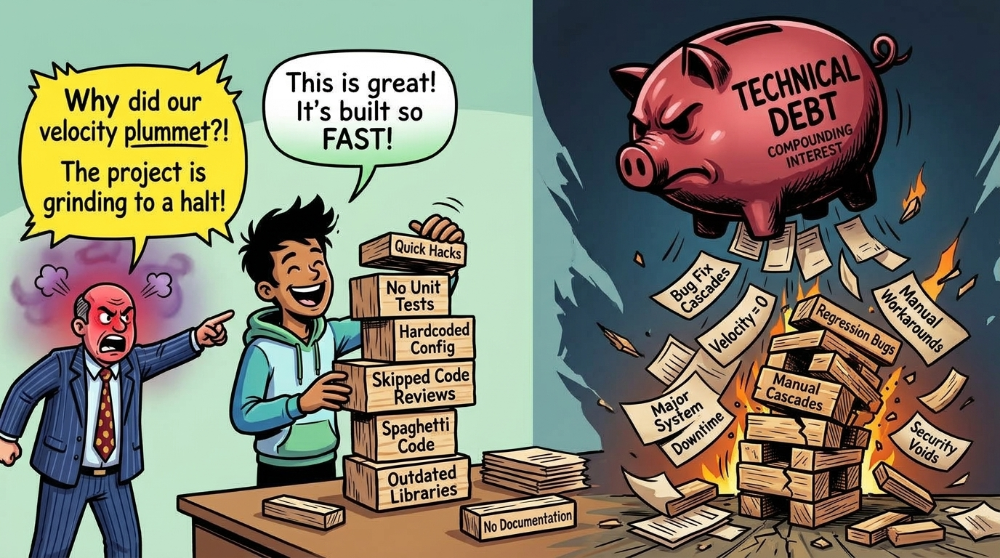

*Figure 2.6.1: Technical Debt. A gleaming, multi-story software application built on a crumbling, makeshift foundation of duct tape, rotting wood, and unmaintained code. Eventually, the foundation collapses under its own weight.*

### 2.6.1 The Technical Debt Compounding Cycle

When technical debt is ignored, organizations enter a deadly spiral:
1. **Shortcut Taken:** Team cuts corners to hit a marketing deadline.
2. **Velocity Drops:** Next sprint, adding a feature takes 30% longer because code is brittle and untestable.
3. **Pressure Mounts:** Management notices slower delivery and applies pressure.
4. **More Shortcuts Taken:** Under pressure, engineers take even dirtier shortcuts to hit the next release.
5. **Architectural Gridlock:** Velocity collapses asymptotically toward zero.

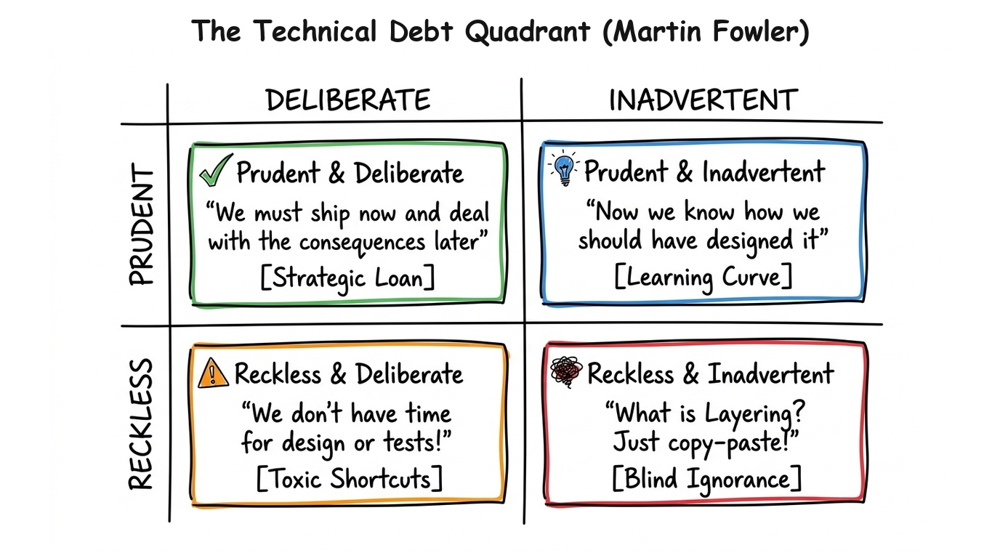

*Figure 2.6.2: Martin Fowler's Technical Debt Quadrant. Organizing technical debt along two dimensions: Deliberate vs. Inadvertent, and Prudent vs. Reckless. Only Prudent & Deliberate debt functions as a manageable strategic loan; Reckless debt inevitably causes architectural erosion and velocity collapse.*

### 2.6.2 Martin Fowler's Warning: "Flaccid Scrum"

Renowned author Martin Fowler issued a severe warning to organizations adopting agile: **"Flaccid Scrum"**:
* Many corporate agile adoptions adopt the superficial project management rituals (daily standups, sticky notes, Jira burndown charts, two-week sprints) while **completely abandoning technical engineering craftsmanship**.
* Teams become "feature factories," pumping out low-quality code sprint after sprint.
* Without automated unit testing, continuous integration, pair programming, and continuous refactoring, the codebase deteriorates into an unmaintainable swamp within 12 to 18 months.

### 2.6.3 The 4 Stages of Architectural Erosion

When technical debt goes unpaid, codebases succumb to **Architectural Erosion (架構侵蝕)**:
1. **The Big Ball of Mud:** Clean modular boundaries dissolve. Any module can reach directly into another module's internal state.
2. **Regression Testing Hell:** Fixing a bug in user billing breaks the inventory module and crashes the search engine.
3. **Fear of Change:** Developers become terrified of modifying core classes because no automated tests exist to warn them when something breaks.
4. **The Complete System Rewrite (The Doom Loop):** Management declares the system unmaintainable and spends $20M attempting a "ground-up rewrite," which inevitably accumulates the same technical debt all over again.

---

<!-- id: ase-ch02-ccq9 -->
#### 🙋 **Concept Check (CCQ 9) — Compounding Interest of Technical Debt**

**Question**

According to Ward Cunningham's Technical Debt metaphor, what represents the "compounding interest" paid by a software organization?

* A) The annual licensing fees paid for cloud hosting infrastructure and IDEs.
* B) The ongoing extra time, degraded velocity, and regression defects suffered during all future development.
* C) The bonus compensation paid to engineers who complete sprint tickets ahead of schedule.
* D) The legal costs of acquiring open-source third-party dependencies.

[Interactive Activity (線上作答)](https://nlhsueh.github.io/nickedupocket/#/student/ase-ch02-ccq9)


<details>
<summary>Click to view Answer & Explanation</summary>

Correct Answer: B
Explanation: The interest on technical debt is the extra friction and slowed velocity encountered every time engineers attempt to add new features or modify brittle, untested, poorly factored code.
</details>

---

<!-- id: ase-ch02-ccq10 -->
#### 🙋 **Concept Check (CCQ 10) — Martin Fowler's "Flaccid Scrum"**

**Question**

Martin Fowler coined the term **"Flaccid Scrum"** to describe which critical software engineering failure?

* A) Adopting Scrum management ceremonies (daily standups, sprints, story points) while completely neglecting technical engineering practices like TDD, refactoring, and CI.
* B) Refusing to use Jira or commercial issue tracking software in favor of physical sticky notes.
* C) Allowing product owners to adjust backlog priorities between sprint planning sessions.
* D) Enforcing automated test execution on every Git commit in the continuous integration pipeline.

[Interactive Activity (線上作答)](https://nlhsueh.github.io/nickedupocket/#/student/ase-ch02-ccq10)


<details>
<summary>Click to view Answer & Explanation</summary>

Correct Answer: A
Explanation: Flaccid Scrum occurs when organizations adopt agile project management rituals but ignore engineering craftsmanship. Without automated tests, refactoring, and clean architecture, code quickly becomes fragile and unmaintainable.
</details>

---

### 🗣️ Classroom Interactive Activity 3 — The Technical Debt Dilemma (Pair Discussion)

> 💡 **Pair Discussion Scenario: Balancing Commercial Velocity with Engineering Rigor**
> 
> You are the lead software engineer at a Series-A financial technology startup. In exactly three weeks, your executive team will conduct a high-stakes live product demonstration to top-tier venture capital investors to secure a $5,000,000 growth investment round. If the funding round fails, company cash reserves will be depleted within 60 days.
> 
> * **The Engineering Reality**: The core payment microservice was hastily hacked together during a weekend prototype hackathon. It has 0% automated test coverage, convoluted spaghetti dependencies, and suffers from intermittent race-condition database locks when concurrent transaction volume exceeds 20 requests/second.
> * **The Product Manager's Demand**: The Chief Product Officer insists: *"We must announce and demo a flashy new 'One-Click Multi-Currency Crypto Payment' feature during the VC pitch! If we don't wow them with crypto, our competitor will win the term sheet."*
> 
> **Discussion Questions for Pairs**:
> 1. **Strategic Decision-Making**: Which path should your engineering team take?
>    * *Option A (The Purist)*: Flatly refuse the new feature and dedicate the next 3 weeks entirely to refactoring the payment service, paying down technical debt, and writing test suites.
>    * *Option B (The Gambler)*: Hastily tack the crypto checkout code onto the existing unstable codebase, crossing your fingers that the demo won't trigger a race condition in front of investors.
>    * *Option C (The Pragmatic Architect)*: Engineer a sandbox/mock UI flow for the VC demo that isolates the crypto checkout from the core database, while securing an executive covenant to freeze new feature work for the next 2 sprints to pay down the architectural principal.
> 2. **Martin Fowler's Debt Quadrant**: Does incurring technical debt under these circumstances represent *Prudent & Deliberate Debt* or *Reckless Debt*? What engineering practices prevent deliberate debt from turning into permanent "Flaccid Scrum"?

---

## 2.7 Technical Rigor — Extreme Programming (XP)

To defeat technical debt and prevent Flaccid Scrum, software teams must look beyond project management to **software engineering discipline**.

In 1996, **Kent Beck** created **Extreme Programming (XP)** while leading the Chrysler Comprehensive Compensation system (C3). XP is an Agile method focused specifically on **coding discipline, technical excellence, and continuous refactoring**.

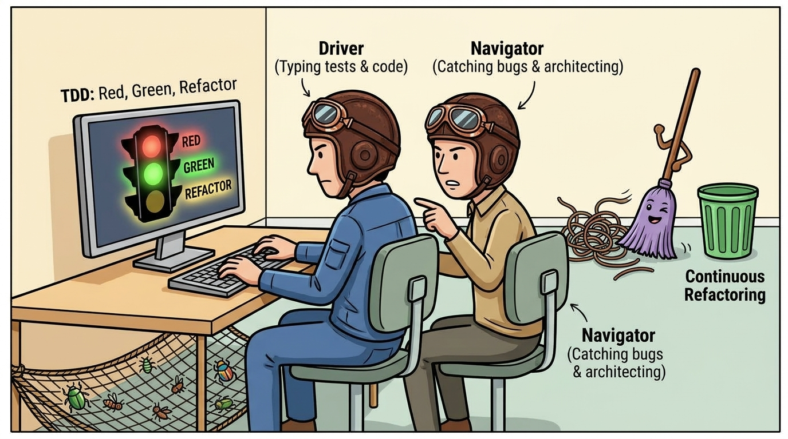

*Figure 2.7.1: Extreme Programming (XP). Engineering craftsmanship anchored by Test-Driven Development (TDD), Pair Programming, Continuous Refactoring, and Collective Code Ownership.*

### 2.7.1 Why Call It "Extreme"?

Beck's guiding philosophy was simple: **If a practice is good for software quality, take it to its extreme everyday level:**
* *If code reviews are good?* Don't wait weeks for a pull request; review code **every second** through **Pair Programming**.
* *If testing is good?* Don't test after coding; test **before writing a single line of production code** through **Test-Driven Development (TDD)**.
* *If integration is good?* Don't integrate once a month; integrate **multiple times a day** through **Continuous Integration (CI)**.
* *If simplicity is good?* Don't anticipate future hypothetical needs; design for the **simplest solution that passes current tests today** (**Simple Design**).

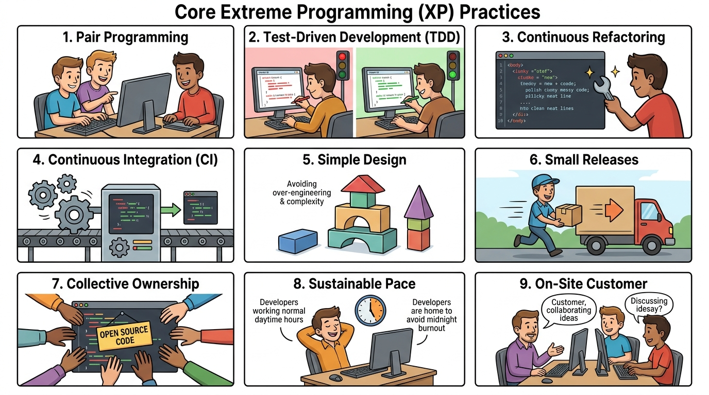

*Figure 2.7.2: Core XP Practices. Interlocking technical habits that reinforce one another to sustain rapid, defect-free software evolution.*

### 2.7.2 Test-Driven Development (TDD): Red-Green-Refactor

TDD inverts the traditional programming workflow: **never write a line of production code unless you have a failing automated test!**

Development proceeds in tight 3-to-5 minute cycles known as the **Red-Green-Refactor Cycle**:

```
        +-------------------------------------------------------+
        |                                                       |
        v                                                       |
  +------------+             +------------+             +---------------+
  |   1. RED   | ----------> |  2. GREEN  | ----------> |  3. REFACTOR  |
  +------------+             +------------+             +---------------+
  Write a failing            Write minimal code         Clean code without
  test that defines          to make the test           changing behavior;
  desired behavior           pass (even hardcoded)      all tests remain green!
```

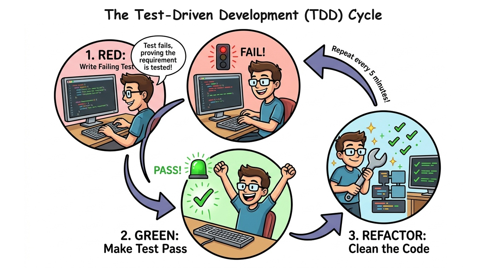

*Figure 2.7.3: The TDD Cycle. 1. Red: Write a failing unit test; 2. Green: Make it pass with minimal code; 3. Refactor: Eliminate duplication and improve structure while all tests stay green.*

1. 🔴 **Red Phase:** Write a tiny automated unit test for a capability that does not yet exist. Run it and watch it fail (compiler error or assertion failure). This forces the developer to think as a client of the API before implementing it.
2. 🟢 **Green Phase:** Write the absolute minimum amount of code required to make the test pass. Even returning a hardcoded constant is acceptable! The goal is rapid feedback.
3. 🔵 **Refactor Phase:** Now that the test is green, clean up the implementation. Remove duplicate code, extract helper methods, improve variable names, and simplify logic. The automated test suite acts as a safety net—if you break something during cleanup, the test turns red immediately.

### 2.7.3 Continuous Refactoring & Simple Design

* **Martin Fowler's Definition:** *"Refactoring is the process of changing a software system in such a way that it does not alter the external behavior of the code yet improves its internal structure."*
* **Kent Beck's 4 Rules of Simple Design (In Order of Priority):**
  1. **Passes all tests:** The system must be provably correct via automated test suites.
  2. **Reveals intention:** Code must be expressive and self-documenting; variable and method names clearly communicate what they do.
  3. **No duplication (DRY - Don't Repeat Yourself):** Every piece of knowledge must have a single, unambiguous representation in the system.
  4. **Fewest elements:** Contains the minimum number of classes and methods necessary. Eliminate speculative abstractions (**YAGNI — You Aren't Gonna Need It**).

### 2.7.4 Pair Programming: Driver and Navigator

In Pair Programming, two software engineers sit side-by-side at a single workstation, sharing one keyboard, mouse, and monitor:

```
+------------------------------------+------------------------------------+
| THE DRIVER (Tactical Execution)    | THE NAVIGATOR (Strategic Review)   |
+------------------------------------+------------------------------------+
| * Hands on keyboard & mouse.       | * Hands off keyboard.              |
| * Writes current lines of code.    | * Reviews code in real time.       |
| * Focuses on syntax, algorithms,   | * Thinks about edge cases, null    |
|   and passing the immediate test.  |   pointers, race conditions.       |
| * Tactical short-term focus.       | * Considers broader architecture.  |
+------------------------------------+------------------------------------+
              \                                /
               +------------------------------+
               | Role Switch Every 30 Minutes |
               +------------------------------+
```

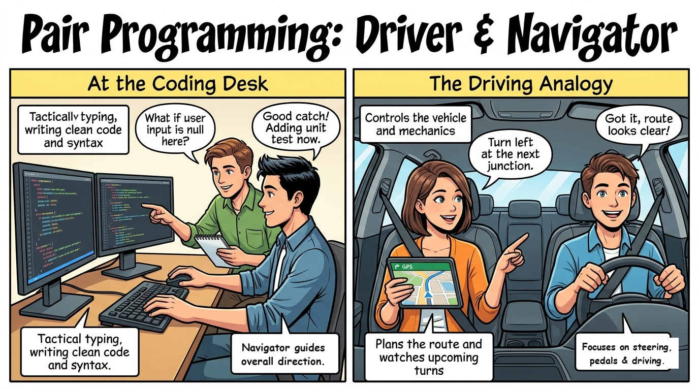

*Figure 2.7.4: Pair Programming in Action. The Driver focuses tactically on typing clean code, while the Navigator provides continuous strategic review, catching design flaws and edge cases in real time.*

**Empirical Benefits of Pair Programming:**
* **Continuous Instant Code Review:** Defect rates drop by 15% to 50% because bugs are caught within seconds of being typed.
* **Rapid Knowledge Dissemination:** Pairing junior developers with seniors rapidly accelerates mentoring and transfers domain knowledge.
* **Eliminating the "Bus Factor":** Collective ownership ensures that multiple engineers understand every line of code, so a project never grinds to a halt if a key developer falls ill.

---

<!-- id: ase-ch02-ccq11 -->
#### 🙋 **Concept Check (CCQ 11) — Extreme Programming: The Navigator Role**

**Question**

In Extreme Programming (XP), what is the primary role of the "Navigator" during a pair programming session?

* A) Typing out code syntax and executing local terminal commands.
* B) Thinking strategically, reviewing code in real time, considering edge cases, and looking at the broader architecture.
* C) Serving as the official sprint facilitator and managing Jira backlog ticket status.
* D) Negotiating customer contracts and approving annual engineering budgets.

[Interactive Activity (線上作答)](https://nlhsueh.github.io/nickedupocket/#/student/ase-ch02-ccq11)


<details>
<summary>Click to view Answer & Explanation</summary>

Correct Answer: B
Explanation: In pair programming, the Driver types the code while the Navigator thinks strategically, reviews code in real time, catches bugs, considers edge cases, and ensures the implementation aligns with overall architecture.
</details>

---

<!-- id: ase-ch02-ccq12 -->
#### 🙋 **Concept Check (CCQ 12) — TDD: The Refactor Step**

**Question**

In Extreme Programming's Test-Driven Development (TDD), what is the specific objective of the **"Refactor"** step in the Red-Green-Refactor cycle?

* A) Adding new functional capabilities and expanding the module's public API contract.
* B) Improving the internal structure and readability of the code while ensuring all existing automated tests continue to pass.
* C) Removing unit tests that take longer than one second to execute in the local test suite.
* D) Rewriting the application from an object-oriented language to a functional programming language.

[Interactive Activity (線上作答)](https://nlhsueh.github.io/nickedupocket/#/student/ase-ch02-ccq12)


<details>
<summary>Click to view Answer & Explanation</summary>

Correct Answer: B
Explanation: Refactoring strictly means altering the internal structure of software to make it easier to understand and cheaper to modify without changing its observable external behavior, protected by passing unit tests.
</details>

---

## 2.8 Systems & Culture — DevOps

As agile and XP accelerated software development inside the engineering team, a new bottleneck emerged at the boundary between development and production operations.

For decades, IT organizations suffered from the **"Wall of Confusion"**:
* **Development (Dev) Incentives:** Evaluated on shipping new features quickly ("Move fast and embrace change").
* **Operations (Ops) Incentives:** Evaluated on server uptime, reliability, and stability ("Keep things stable and avoid change").
* **The Result:** Developers tossed raw binary artifacts over the wall to Ops. When servers crashed at 2:00 AM due to unconfigured dependencies or missing database migrations, Dev blamed Ops for poor maintenance, and Ops blamed Dev for writing unstable code.

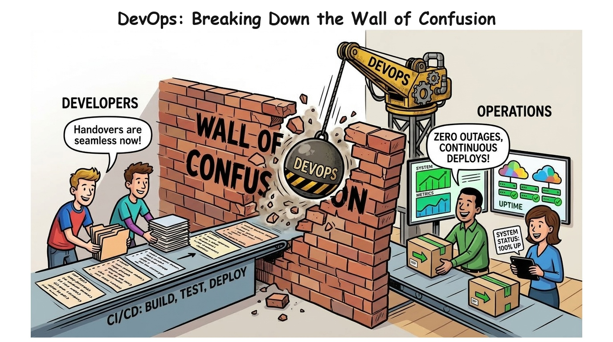

*Figure 2.8.1: The Wall of Confusion. Development throws code over the wall to Operations, triggering deployment failures, finger-pointing, and severe organizational friction.*

### 2.8.1 What is DevOps?

**DevOps** is a **cultural, organizational, and technical movement** that bridges the historical divide between Development and Operations. Its guiding principle was famously summarized by Amazon CTO **Werner Vogels**: *"You build it, you run it."*

The foundational pillars of DevOps are captured in the **CALMS Framework**:
* **Culture:** Shared responsibility, cross-functional empathy, and blameless postmortems.
* **Automation:** Automating build, test, infrastructure provisioning, and deployment pipelines.
* **Lean:** Small batch sizes, minimizing work-in-progress, and eliminating deployment waste.
* **Measurement:** Tracking deployment frequency, lead times, error rates, and system telemetry.
* **Sharing:** Open communication, transparency across engineering, security, and operations.

### 2.8.2 Continuous Integration (CI): Trunk-Based Development

**Continuous Integration (CI)** is an engineering discipline where developers merge their code changes into the shared mainline repository (**trunk**) multiple times a day:
* **Eliminating "Merge Hell":** Instead of keeping long-lived feature branches isolated for months, small commits are integrated continually.
* **Automated CI Pipeline (Triggered on Every Git Push):**
  1. *Checkout & Build:* Pull latest commit into an isolated container and compile.
  2. *Lint & Security Scan:* Run static analysis tools, code smell detectors, and vulnerability scanners (SAST).
  3. *Automated Unit & Integration Tests:* Run thousands of tests. If even one test fails, the build breaks (**Fail Fast**), and fixing the mainline becomes the team's top priority.
  4. *Artifact Packaging:* Package passing builds into immutable Docker container images.

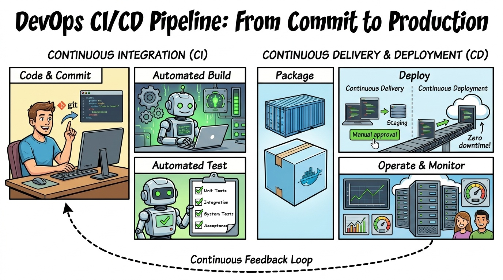

*Figure 2.8.2: End-to-End Automated CI/CD Pipeline. From local Git commit to cloud production deployment, automated testing, container packaging, and canary deployments create a smooth, reliable software factory.*

### 2.8.3 Continuous Delivery vs. Continuous Deployment

A crucial operational distinction separates Continuous Delivery from Continuous Deployment:

```
[ Git Push ] ---> [ Automated CI Build & Test ] ---> [ Staged in Production-like Env ]
                                                               |
                     +-----------------------------------------+
                     |
                     v
   [ Continuous Delivery (CD) ]              [ Continuous Deployment (CD) ]
   Requires manual business approval         Zero human gates! Every passing
   to release to production (click button)   build automatically deploys to live
   (e.g., waiting for marketing campaign)    production users within minutes.
```

### 2.8.4 Infrastructure as Code (IaC) & Production Observability

* **Infrastructure as Code (IaC):** Server configurations, cloud networks, load balancers, and Kubernetes clusters are defined using **declarative code files** stored in version control (e.g., Terraform, Ansible, Docker). Infrastructure can be audited, reviewed in pull requests, and recreated identically from scratch in minutes.
* **Observability (The 3 Pillars of Telemetry):**
  1. **Metrics:** Numeric time-series data measuring throughput, CPU, memory, and HTTP response latencies.
  2. **Logs:** Structured, timestamped event records emitted by services during execution.
  3. **Distributed Traces:** Tracking a single user request across hundreds of microservices to locate latency bottlenecks.

### 2.8.5 DORA Metrics: Measuring Velocity and Stability

Google's **DevOps Research and Assessment (DORA)** team analyzed thousands of software organizations over six years, proving scientifically that **high performers do not trade off speed for stability—they achieve both simultaneously**:

```
+------------------------------------------------------------------------------------+
|                         THE 4 DORA BENCHMARK METRICS                               |
+--------------------------+---------------------------------+-----------------------+
| Metric                   | Dimension Measured              | Elite Performance     |
+--------------------------+---------------------------------+-----------------------+
| 1. Deployment Frequency  | Throughput: How often code is   | On-demand             |
|    (DF)                  | successfully deployed to prod.  | (Multiple per day)    |
+--------------------------+---------------------------------+-----------------------+
| 2. Lead Time for Changes | Throughput: Time from code      | Less than 1 hour      |
|    (LTTC)                | commit to running in prod.      |                       |
+--------------------------+---------------------------------+-----------------------+
| 3. Change Failure Rate   | Stability: Percentage of prod   | 0% – 15%              |
|    (CFR)                 | deployments causing degradation.|                       |
+--------------------------+---------------------------------+-----------------------+
| 4. Time to Restore Svc   | Stability: Time required to     | Less than 1 hour      |
|    (MTTR)                | recover from production failure.|                       |
+--------------------------+---------------------------------+-----------------------+
```

---

<!-- id: ase-ch02-ccq13 -->
#### 🙋 **Concept Check (CCQ 13) — Continuous Delivery vs. Continuous Deployment**

**Question**

What is the defining operational distinction between "Continuous Delivery" and "Continuous Deployment"?

* A) Continuous Delivery requires manual code compilation; Continuous Deployment automates compilation.
* B) Continuous Delivery stops at staging and requires human business approval to release; Continuous Deployment automatically deploys passing builds directly to live production.
* C) Continuous Delivery is used solely for mobile apps; Continuous Deployment is used solely for backend databases.
* D) Continuous Delivery eliminates unit testing; Continuous Deployment mandates pair programming.

[Interactive Activity (線上作答)](https://nlhsueh.github.io/nickedupocket/#/student/ase-ch02-ccq13)


<details>
<summary>Click to view Answer & Explanation</summary>

Correct Answer: B
Explanation: Continuous Delivery ensures that every build passing the automated pipeline is immediately deployable to production, but waits for a human business decision. Continuous Deployment automatically promotes every passing build straight to production with zero manual gates.
</details>

---

## 2.9 The Modern Frontier — AI Specification-Driven Engineering

We have arrived at the newest frontier in software process engineering: **The Generative AI Revolution**.

With Large Language Models (LLMs) and autonomous coding agents (Claude Code, Gemini CLI, Cursor, Devin), the marginal cost of writing raw code is collapsing toward zero. However, this explosion of synthetic code introduces an existential engineering challenge.

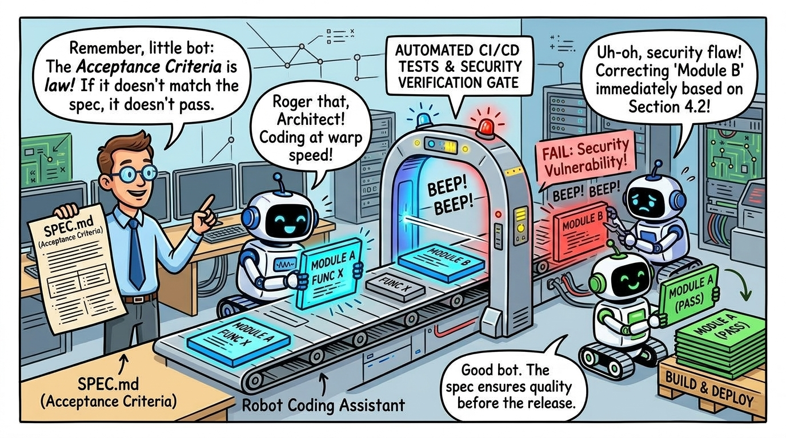

*Figure 2.9.1: Vibe Coding vs. Specification-Driven AI. Blindly accepting unstructured AI code snippets (left) creates brittle toys and skyrocketing code churn. Governing AI agents with formal specifications and automated verification gates (right) builds sustainable, industrial-grade systems.*

### 2.9.1 The Trap of "Vibe Coding" & Code Churn

In popular tech culture, the term **"Vibe Coding"** has emerged to describe interacting with an LLM through informal natural language prompts, accepting code based purely on "vibes" and superficial visual demos without understanding its architecture.

While suitable for weekend hobby projects, Vibe Coding is disastrous for enterprise software:
* **GitClear Empirical Study (Analyzing 153 Million Lines of Code):** AI-assisted development without formal specifications caused **Code Churn (the percentage of code discarded within two weeks of being committed) to double**.
* AI agents excel at generating convincing code that compiles, but frequently introduce subtle security vulnerabilities, hallucinated API arguments, race conditions, and architectural regressions.

### 2.9.2 Vibe Coding vs. Specification-Driven AI

```
+---------------------+-------------------------------+-------------------------------+
| Dimension           | Vibe Coding (Anti-Pattern)    | Spec-Driven AI (Engineering)  |
+---------------------+-------------------------------+-------------------------------+
| Core Philosophy     | Prompt-first; accept outputs  | Specification-first; verify   |
|                     | based on superficial demos.   | outputs against formal gates. |
+---------------------+-------------------------------+-------------------------------+
| Single Source       | Ephemeral chat history and    | Version-controlled Markdown   |
| of Truth (SSOT)     | fuzzy conversational memory.  | files (`SPEC.md`, `API.yaml`).|
+---------------------+-------------------------------+-------------------------------+
| Human Role          | Passive code-accepter and     | System architect, constraint  |
|                     | casual prompter.              | author, and high-level reviewer.|
+---------------------+-------------------------------+-------------------------------+
| Verification Gate   | Manual eyeballing and casual  | Deterministic compilers, SAST,|
|                     | clicking in the browser.      | and automated CI test suites. |
+---------------------+-------------------------------+-------------------------------+
| Project Longevity   | Codebase collapses into chaos | Sustained, maintainable       |
|                     | beyond 1,000 lines.           | long-term evolution.          |
+---------------------+-------------------------------+-------------------------------+
```

### 2.9.3 The 3-Step Agentic Feedback Loop

In modern Specification-Driven development, human engineers and autonomous AI agents collaborate in a rigorous 3-step closed loop:

```
[ Step 1: Formal Specification ] (Human Architect)
  * Defines unambiguous schemas, interfaces, data structures, and acceptance tests in Markdown.
         |
         v
[ Step 2: Autonomous Agent Execution ] (AI Worker)
  * Agent reads codebase, generates code in an isolated sandbox, reads compile errors, self-corrects.
         |
         v
[ Step 3: Deterministic Verification Gates ] (CI/CD Pipeline & Human Review)
  * Compilers, linters, security scanners, and test suites execute objectively.
  * Human performs final architectural review before merging to production.
```

### 2.9.4 The 4 Golden Principles of AI-Driven Engineering

1. **Specifications as Single Source of Truth (SSOT):** LLMs have limited context windows and easily forget chat conversations. Persistent Markdown specification files (`SPEC.md`, `ARCHITECTURE.md`) provide unwavering context.
2. **Deterministic Sandboxes & Automated Verification Gates:** Never trust an AI model's assertion that its code works. Only deterministic tools (compilers, linters, unit tests, mutation tests) provide objective validation.
3. **Human-in-the-Loop Architectural Review:** Humans abdicate code typing, but elevate their responsibility to reviewing high-level architecture, data privacy, threat models, and ethics.
4. **Small Modular Increments:** Do not ask an AI agent to build an entire application in one shot. Decompose work into small, verifiable slices, committing passing code incrementally.

---

<!-- id: ase-ch02-ccq14 -->
#### 🙋 **Concept Check (CCQ 14) — AI Specification-Driven CI/CD Verification Gates**

**Question**

In modern AI Specification-Driven development, what is the primary role of automated CI/CD verification gates?

* A) To prevent human developers from reviewing artificial intelligence output.
* B) To enforce deterministic quality, test compliance, and defect containment before AI-generated code merges into production.
* C) To convert natural language prompts directly into cloud infrastructure invoices.
* D) To replace software specifications with unverified prompt histories.

[Interactive Activity (線上作答)](https://nlhsueh.github.io/nickedupocket/#/student/ase-ch02-ccq14)


<details>
<summary>Click to view Answer & Explanation</summary>

Correct Answer: B
Explanation: AI coding agents can generate code rapidly, but they may introduce subtle hallucinations or security flaws. Automated CI/CD gates provide deterministic verification barriers that prevent unverified code from reaching production.
</details>

---

## 2.10 Concept Summary, Review Quiz & References

### 2.10.1 Chapter Review: Fill-in-the-Blank Mastery Quiz

Test your mastery across the 9 modules of Chapter 2:

1. All software processes, regardless of model, encompass four universal activities: Specification, Design/Implementation, **Software Validation**, and **Software Evolution**.
2. The **V-Model** introduces horizontal symmetry by designing acceptance test criteria concurrently during the early **Requirements Analysis** phase.
3. **Incremental** development focuses on functional vertical slicing, while **Iterative** development focuses on progressive refinement of the whole system.
4. In Henrik Kniberg's MVP analogy, delivering a standalone **wheel** provides zero user mobility, whereas starting with a **skateboard** validates transportation needs from day one.
5. The Agile Manifesto values **Working software** over comprehensive documentation, and **Responding to change** over following a plan.
6. In Kanban, teams enforce **WIP Limits** on columns to eliminate multitasking context-switching and expose workflow bottlenecks.
7. According to Ward Cunningham, the extra friction, slowdown, and defect-fixing time caused by messy code represents the compounding **Interest** on Technical Debt.
8. In Extreme Programming, TDD enforces the **Red-Green-Refactor** cycle, where the refactoring step improves internal structure without altering external behavior.
9. In DevOps, the boundary between Continuous Delivery and Continuous Deployment is that Continuous Delivery requires a **Manual business approval gate** to deploy to live production.
10. In AI-assisted software engineering, teams avoid the pitfalls of "Vibe Coding" by establishing formal **Specifications** as the single source of truth and enforcing automated CI/CD verification gates.

### 2.10.2 Frequently Asked Questions (FAQ)

* **Q1: Does Agile mean we should never write documentation?**
  * *Answer:* **No.** Agile values working software *over* comprehensive documentation, not *instead of* documentation. Documentation should be concise, purposeful, and maintained as living documentation (e.g., Markdown specifications, Swagger API contracts, automated executable test cases).
* **Q2: Can Waterfall ever be the right choice today?**
  * *Answer:* **Yes.** For systems with fixed physical hardware interfaces, zero requirement volatility, and severe regulatory certification requirements (e.g., nuclear power control systems, pacemakers, rocket flight hardware), Waterfall and V-Model provide rigorous, audited traceability.
* **Q3: What is the relationship between Scrum and DevOps?**
  * *Answer:* Scrum organizes team collaboration and backlog prioritization (cadence), while DevOps extends agility through technical automation to production deployment and operational observability. High-performing teams use Scrum to plan work and DevOps CI/CD pipelines to deliver it.

### 2.10.3 Foundational Literature & References

* **Ian Sommerville** (2016). *Software Engineering* (10th Edition). Pearson. *(Chapters on Software Processes and Agile Development).*
* **Kent Beck** (2004). *Extreme Programming Explained: Embrace Change* (2nd Edition). Addison-Wesley. *(Foundational text on XP, TDD, and engineering discipline).*
* **Martin Fowler** (2018). *Refactoring: Improving the Design of Existing Code* (2nd Edition). Addison-Wesley. *(The definitive guide to technical debt and code design).*
* **Henrik Kniberg** (2015). *Scrum and XP from the Trenches* (2nd Edition). Crisp. *(Practical guide to real-world agile project management).*
* **Nicole Forsgren, Jez Humble, Gene Kim** (2018). *Accelerate: The Science of Lean Software and DevOps*. IT Revolution. *(Empirical research behind DORA metrics and engineering performance).*
* **Ward Cunningham** (1992). *"The WyCash Portfolio Management System"*. OOPSLA '92 Experience Report. *(Original introduction of the Technical Debt metaphor).*
* **Winston W. Royce** (1970). *"Managing the Development of Large Software Systems"*. Proceedings of IEEE WESCON. *(Original paper describing the Waterfall lifecycle).*

---

## Appendix: Solutions & Detailed Explanations to All Interactive Concept Checks (CCQ 1–14)

```
+--------+-------------------------------------------------------------+--------+
| CCQ ID | Topic / Question Title                                      | Answer |
+--------+-------------------------------------------------------------+--------+
| CCQ 1  | Operational Drawbacks of the Traditional Waterfall Model    |   B    |
| CCQ 2  | Engineering Advantage of the V-Model (Test Planning)        |   B    |
| CCQ 3  | Fundamental Difference: Incremental vs. Iterative           |   B    |
| CCQ 4  | Henrik Kniberg MVP Skateboard Analogy Anti-Pattern          |   B    |
| CCQ 5  | Agile Value: Working Software over Comprehensive Docs       |   B    |
| CCQ 6  | Agile Principle 8: Promoting a Sustainable Pace             |   A    |
| CCQ 7  | Kanban Framework: Purpose of Work In Progress (WIP) Limits  |   B    |
| CCQ 8  | Scrum Framework: Objective of the Sprint Retrospective      |   B    |
| CCQ 9  | Ward Cunningham's Technical Debt: Compounding Interest      |   B    |
| CCQ 10 | Martin Fowler's "Flaccid Scrum" Warning                     |   A    |
| CCQ 11 | Extreme Programming: Role of the Pair Programming Navigator |   B    |
| CCQ 12 | Test-Driven Development (TDD): Objective of Refactor Step   |   B    |
| CCQ 13 | Operational Difference: Continuous Delivery vs. Deployment  |   B    |
| CCQ 14 | AI Specification-Driven: Role of CI/CD Verification Gates   |   B    |
+--------+-------------------------------------------------------------+--------+
```
