# Software Processes

**Lecture Outline & Key Points**
> * **Software Process Models**: Core concepts, trade-offs, and applicable scenarios of Waterfall, Incremental, Iterative, Combined, and Integration & Configuration (COTS) models.
> * **Core Process Activities**: Requirements engineering (Elicitation, Specification, Validation), Software design and implementation, Verification & Validation (V&V, Testing stages, V-Model), and Evolution.
> * **Coping with Change**: Strategies to minimize rework costs through Change Anticipation, Change Tolerance, System Prototyping, and Incremental Delivery.
> * **Process Improvement Framework (CMMI)**: 5 maturity levels (Initial, Managed, Defined, Quantitatively Managed, Optimizing) and their process areas.
> * **Software Engineering Metrics**: Measuring code quality, developer productivity, defect management, system performance, reliability, process flow, security, and user experience.

[Slide Deck: Ch2 Software Processes](https://docs.google.com/presentation/d/1e6reT4VGHE7UspwQ4amJlr6TDspo2FQm/edit?usp=sharing&ouid=109022309423128079509&rtpof=true&sd=true)

---

## 2.1 Software Process Models

* A **software process** is a structured set of activities required to develop a software system.
* While many different software processes exist, all must include four fundamental activities:
    * **Specification** – Defining what the system should do and its operational constraints;
    * **Design and Implementation** – Defining the architecture of the system and producing the executable code;
    * **Validation** – Checking and testing that the software conforms to specifications and meets customer expectations;
    * **Evolution** – Modifying and enhancing the software in response to changing customer and market needs.
* A **software process model** is an abstract, simplified representation of a process from a specific perspective.

---

> 👍 **Core Insight**: A software development process is essentially a *human-based algorithm*. A good process acts as an efficient algorithm that delivers software projects on time, on budget, and with high quality.

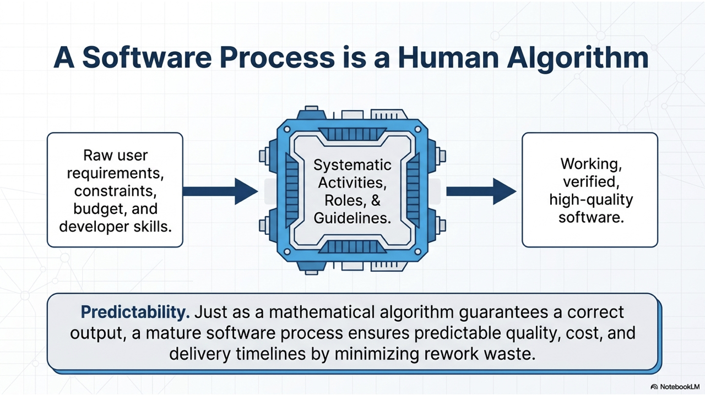

---

### Major Categories of Process Models

1. **The Waterfall Model**: A plan-driven model with separate, distinct sequential phases of specification and development.
2. **Incremental Development**: Specification, development, and validation activities are interleaved and executed in small steps.
3. **Integration and Configuration**: The system is assembled from existing configurable, reusable components (COTS).

In practice, most large commercial systems are developed using hybrid processes that incorporate elements from all of these models.

---

### Waterfall Model

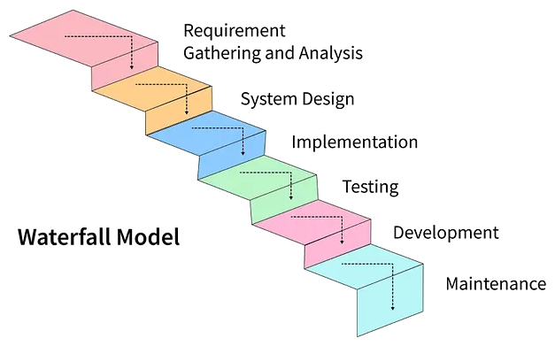

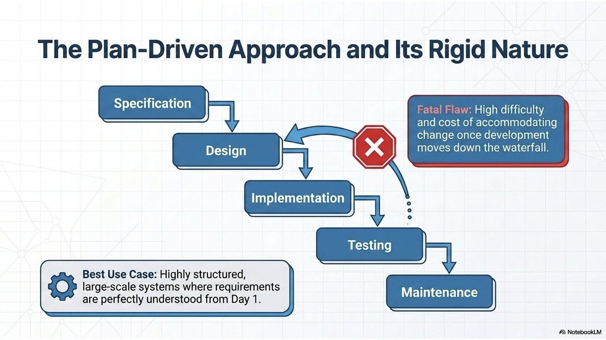

* **Key Characteristics**:
  * Linear-sequential life cycle model where each phase must be signed off before the next phase begins.
  * Plan-driven approach with extensive documentation generated at each milestone.
* **Drawbacks**:
  * **Difficulty accommodating change**: Inflexible partitioning of the project makes it very difficult to respond to evolving customer requirements.
  * **Late risk discovery**: Integration and testing occur near the end, meaning major architectural defects are discovered late when fixing them is most expensive.
  * **Delayed value delivery**: The customer sees a working system only at the final stage of the lifecycle.
* **Applicable Scenarios**:
  * Embedded systems where software must interface tightly with inflexible hardware.
  * Critical safety/defense systems requiring formal verification and extensive upfront certification.
  * Large, multi-site engineering projects where a strict plan is necessary to coordinate distributed contractors.

---

### Incremental Development Model

An **incremental** process focuses on delivering software in functional, self-contained pieces called **increments**. You build and deliver one functional slice of the product, then the next, with each increment adding new capabilities. 

A helpful analogy is building a house: you lay the foundation first, then construct the ground floor (kitchen and living room), followed by the upper floor bedrooms. Each increment adds a complete, functional part to the whole.

* **Focus**: Early delivery of prioritized functionality; incrementally completing the full scope.
* **Outcome**: A working product is delivered after the first increment, with subsequent increments expanding its feature set.
* **Use Case**: Best suited when requirements are well-understood and can be broken down into distinct, prioritized modules.

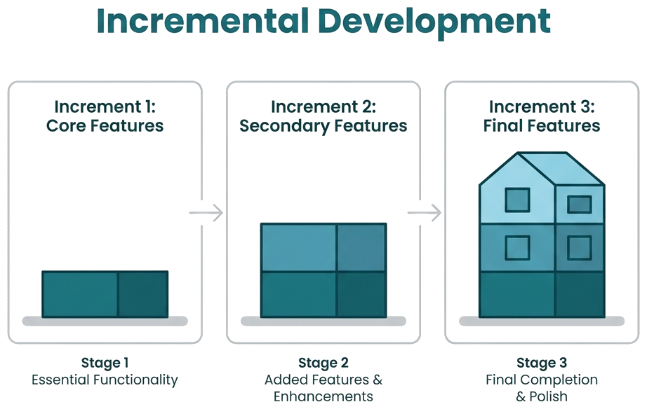

---

#### Benefits of the Incremental Approach

* **Rapid Delivery & Early Value**: Customers can start using and deriving business value from core software features much earlier than with a waterfall process.
* **Early Customer Feedback**: Stakeholders can interact with running demonstrations and provide feedback on implemented functionality to guide subsequent increments.
* **Reduced Cost of Change**: The amount of analysis and documentation that has to be reworked is much smaller than in a plan-driven waterfall model.

---

### Iterative Development Model

An **iterative** process focuses on **continuous refinement**. You construct a rough, working end-to-end version of the product first, and then in repeated cycles ("iterations"), you continuously improve, polish, and optimize the existing system based on feedback.

Think of it like a sculptor starting with a rough block of clay: each pass refines the proportions, contours, and fine details until the final sculpture emerges.

* **Focus**: Refining, evolving, and improving existing capabilities.
* **Outcome**: A progressively more complete, robust, and polished version of the entire product with each cycle.
* **Use Case**: Ideal when initial requirements are vague, uncertain, or highly dynamic, allowing teams to explore design options through continuous feedback.

---

### Incremental vs. Iterative: Key Differences

| Dimension            | Incremental Development                                               | Iterative Development                                                           |
| :---------------------| :----------------------------------------------------------------------| :--------------------------------------------------------------------------------|
| **Primary Goal**     | Adding new functional modules in successive steps.                    | Refining, improving, and polishing existing functionality.                      |
| **Deliverables**     | Each increment delivers an additional working subsystem.              | Each iteration delivers an improved version of the whole system.                |
| **Management Focus** | Progressively expanding feature coverage according to a roadmap.      | Exploring requirements, reducing technical risks, and enhancing quality.        |
| **Best Used When**   | System modules can be cleanly decoupled and prioritized for delivery. | Requirements are ambiguous or market feedback is critical to product direction. |

> 💡 **Key Takeaway**: *Incremental* focuses on delivering functional pieces early according to a planned roadmap; *Iterative* focuses on continuous enhancement and adaptation driven by user feedback.

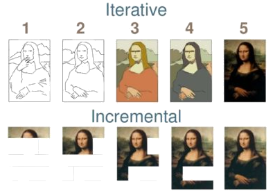

---

### Combined Approach: Iterative & Incremental

In modern software engineering (such as **Scrum** and **Agile methodologies**), both approaches are combined into an **iterative and incremental model**. The team builds the product in small, functional slices (incremental) and repeatedly refines and adapts them based on stakeholder feedback (iterative).

> 💡 **Principle**: Even with a planned functional roadmap, every release must incorporate user feedback to continuously improve both software architecture and user experience.

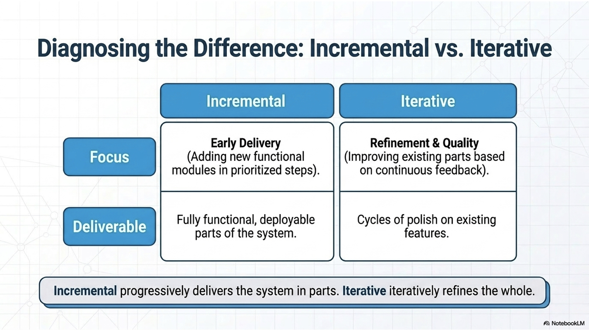

---

#### The MVP Analogy (Mona Lisa & Mobility)

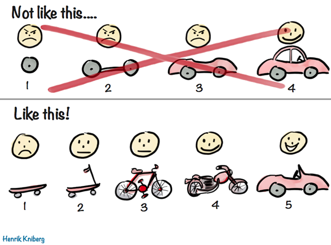

* **Poor Incremental Analogy**: Delivering a single wheel, then an axle, then a chassis gives the customer no usable transportation until the final automobile is finished.
* **True Agile (Iterative & Incremental)**: Deliver a skateboard first, then a scooter, then a bicycle, then a motorcycle, and finally a car. At every stage, the customer possesses a usable transportation solution, and feedback guides the next evolution.

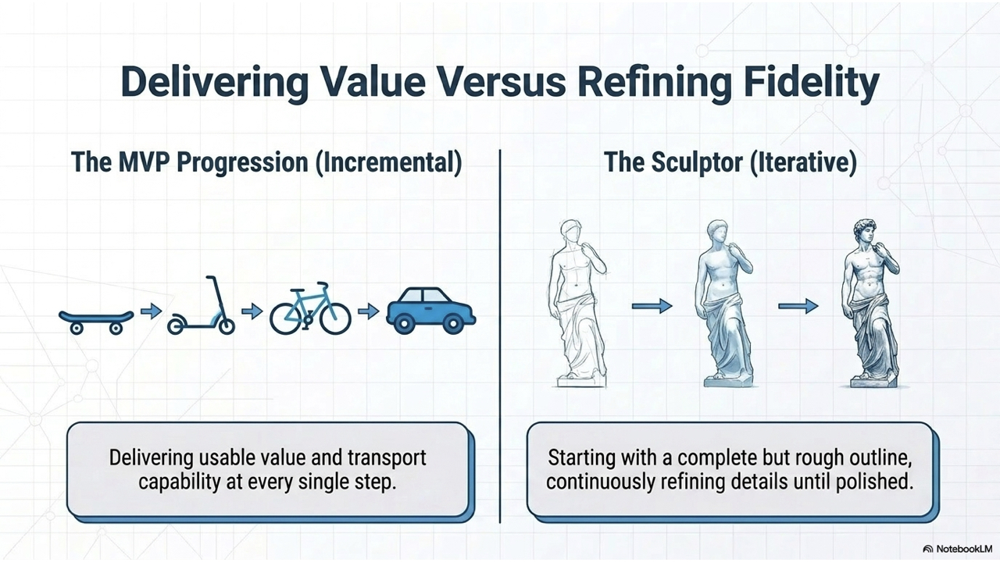

---

> 💡💬 **Discussion Activity**: Choose one of the following systems and propose both an **Incremental plan** and an **Iterative plan** showing how releases would evolve:
> 1. University Department Portal
> 2. E-Commerce Marketplace
> 3. Online Food Delivery Platform
> 4. Travel & Vacation Planning System
> 5. Major League Baseball Analytics Dashboard

#### Case Study: University Department Web Portal
* Introduce department vision and academic programs.
* Synchronize with university faculty databases for live profiles.
* Events Management: Course workshops, academic speeches, spotlight stories.
* Alumni networking and career hub.
* 💡💬 *How would you structure development sprints across Waterfall, Incremental, and Agile processes for this project?*

---

### Integration and Configuration Model (COTS)

* Based on **software reuse**, where systems are assembled and customized from existing pre-built components or commercial-off-the-shelf (COTS) applications.
* Reusable elements are configured to adapt their workflows, schemas, and user interfaces to specific organizational requirements.

#### Categories of Reusable Software:
1. **COTS Application Systems**: Off-the-shelf platforms configured for a specific domain (e.g., SAP ERP, Salesforce CRM, WordPress CMS).
2. **Component Framework Packages**: Collections of reusable libraries integrated into a runtime framework (e.g., Spring Boot, .NET, Node.js packages).
3. **Cloud Web Services & APIs**: Standardized services deployed in the cloud and invoked remotely via REST/GraphQL APIs (e.g., Stripe for payments, Firebase for auth, Twilio for messaging).

> 💡💬 **Discussion**: Which modern software frameworks and cloud services do you rely on to rapidly assemble full-stack web applications?

---

## 2.2 Core Process Activities

### Requirements Engineering Process

> ✅ **Requirements Engineering** is the disciplined process of establishing what services stakeholders expect from a system and the constraints under which it must operate.

The process comprises three main sub-activities:
1. **Requirements Elicitation & Analysis**: Discovering stakeholder needs, business constraints, and system boundaries through interviews, observation, and user stories.
2. **Requirements Specification**: Translating informal customer requirements into a precise, structured specification document.
3. **Requirements Validation**: Checking that the documented specifications are realistic, consistent, complete, and accurately reflect user needs.

> 💡💬 **Discussion**: For a campus food ordering system, identify 2 high-level user requirements and specify their detailed technical system specifications.

---

### Design and Implementation

> ✅ The process of transforming a system specification into an executable, deployable software system.

* **Software Design**: Creating a software architecture, data model, and component interfaces that realize the specification.
* **Implementation**: Translating the design structures into executable source code programs.
* In modern development, design and implementation activities are tightly coupled and iteratively interleaved.

#### Four Key Design Stages:
* **Architectural Design**: Identifying the high-level system structure, major sub-systems, their relationships, and deployment topology.
* **Database Design**: Designing relational schemas, document stores, and data structures.
* **Interface Design**: Defining clear contracts (APIs, method signatures, REST endpoints) between components.
* **Component Selection & Design**: Selecting reusable libraries or designing custom component internals.

---

### Verification and Validation (V&V)

> ✅ **Verification and Validation (V&V)** demonstrates that a system conforms to its specification ("building the product right") and meets the true operational needs of the customer ("building the right product").

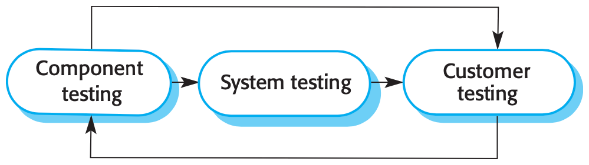

#### Testing Stages in the Software Process:
1. **Component / Unit Testing**: Individual functions, classes, or modules are tested independently by developers to verify internal logic.
2. **System / Integration Testing**: Testing integrated subsystems as a whole to uncover interface mismatches and evaluate emergent properties (performance, reliability, security).
3. **Customer / Acceptance Testing**: Testing the system with real-world customer data and operational scenarios to ensure it satisfies business requirements prior to sign-off.

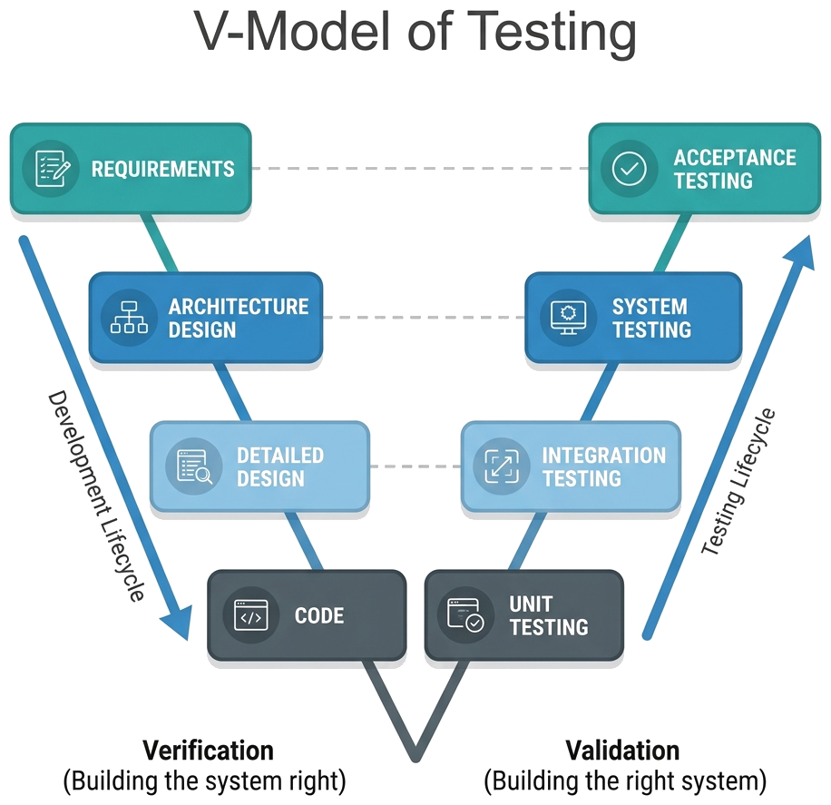

👉 **The V-Model**: Pairs each development phase (Requirements, Architecture, Detailed Design) directly with its corresponding testing phase (Acceptance Testing, System Testing, Unit Testing).

---

### Software Evolution

* Software is inherently malleable and must continuously change throughout its operational lifetime.
* As business needs evolve, regulations change, and new platforms emerge, software must be updated and maintained.
* The traditional boundary between initial development and long-term maintenance is disappearing—modern systems undergo continuous delivery and perpetual evolution.

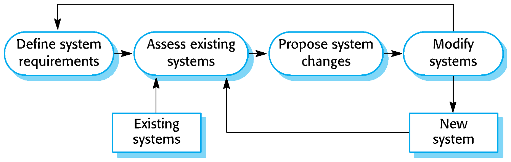

---

## 2.3 Coping with Change

Change is inevitable in all software projects due to business shifts, emerging technologies, changing platforms, and evolving user preferences.

Because changes cause **rework** (e.g., re-analyzing requirements, re-architecting, re-testing), engineering processes must be designed to minimize change costs:

1. **Change Anticipation**: Activities designed to foresee potential changes before extensive rework occurs (e.g., building rapid prototypes to validate risky assumptions early).
2. **Change Tolerance**: Structuring the architecture and development workflow so changes can be accommodated at low cost (e.g., loose coupling, incremental delivery).

---

### System Prototyping

A **prototype** is an initial, executable version of a system used to demonstrate concepts, evaluate UI designs, and explore technical feasibility.

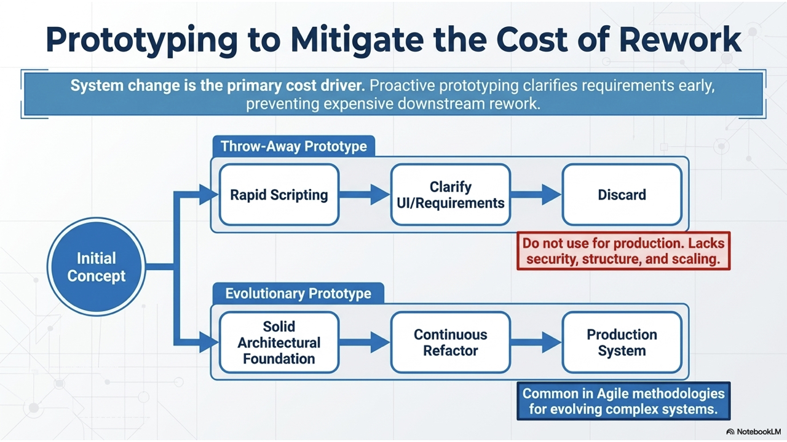

#### Primary Uses of Prototypes:
* **Requirements Engineering**: Helps stakeholders clarify ambiguous needs and validate requirements.
* **Design Exploration**: Allows developers to experiment with architectural patterns, UI layouts, and technology stacks.
* **Feasibility Testing**: Validates performance bottlenecks and third-party API capabilities.

#### Benefits of Prototyping:
* Significantly improved system usability and user satisfaction.
* Closer alignment with true customer workflows.
* Lower risk of major architectural surprises late in development.

> ⚠️ **Throw-away Prototypes**: Prototypes should typically be discarded rather than used as production code because they are often poorly structured, lack error handling, omit non-functional requirements (security, scaling), and lack documentation.

---

### Incremental Delivery

In an **incremental delivery** strategy, finished increments of the software are deployed into the hands of real end-users for production use.

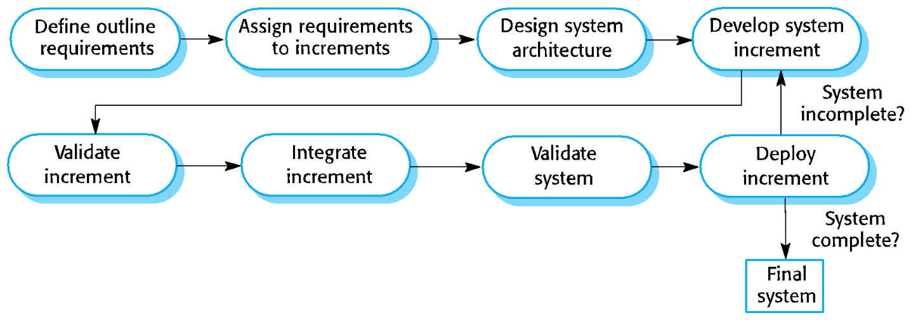

#### Advantages of Incremental Delivery:
* **Immediate Customer Value**: Users gain real utility from early increments while subsequent features are being developed.
* **Realistic Validation**: Real-world usage generates genuine feedback that cannot be replicated in artificial testing labs.
* **Lower Total Project Risk**: If a project must be paused or canceled early, the organization still retains working, valuable software in production.

---

## 2.4 Process Improvement & CMMI

Process improvement helps software organizations elevate their development capability, reduce defects, lower costs, and achieve predictable delivery schedules.

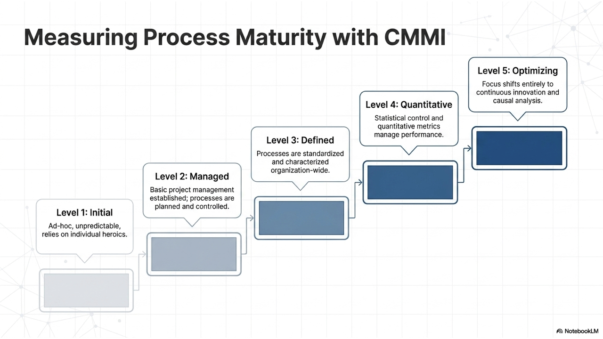

### The CMMI Framework

The **Capability Maturity Model Integration (CMMI)** is a globally recognized process improvement framework that defines **5 Maturity Levels** assessing an organization's process capability:

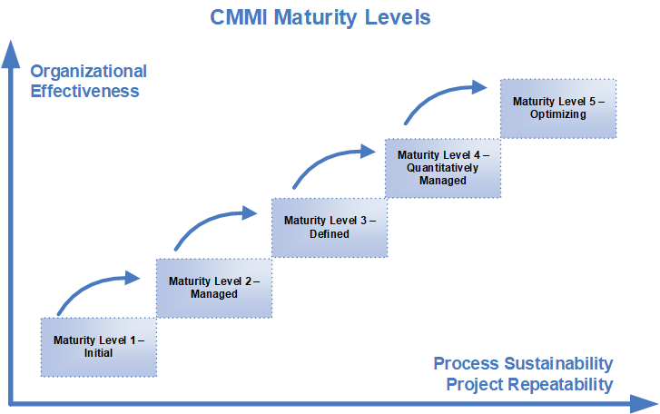

1. **Level 1: Initial (Ad-hoc / Chaotic)**
   * Processes are unpredictable, reactive, and poorly controlled. Success relies on individual heroics rather than institutional practices.
2. **Level 2: Managed**
   * Basic project management processes are established to control cost, schedule, and scope. Processes are planned and tracked at the project level.
3. **Level 3: Defined**
   * Processes are standard across the entire organization. Standard procedures, training, and methodologies are documented and tailored across projects.
4. **Level 4: Quantitatively Managed**
   * The organization uses statistical and quantitative techniques to measure process performance and product quality with high predictability.
5. **Level 5: Optimizing**
   * The organization continuously improves its processes based on quantitative feedback, root-cause defect analysis, and technological innovation.

---

### CMMI Process Areas by Maturity Level

| Maturity Level | Key Process Areas (PAs) |
| :--- | :--- |
| **Level 1 - Initial** | *No formal process areas (Ad-hoc execution).* |
| **Level 2 - Managed** | • Requirements Management (REQM) • Project Planning (PP) • Project Monitoring & Control (PMC) • Supplier Agreement Management (SAM) • Measurement & Analysis (MA) • Process & Product Quality Assurance (PPQA) • Configuration Management (CM) |
| **Level 3 - Defined** | • Requirements Development (RD) • Technical Solution (TS) • Product Integration (PI) • Verification (VER) • Validation (VAL) • Organizational Process Focus (OPF) • Organizational Process Definition (OPD) • Organizational Training (OT) • Integrated Project Management (IPM) • Risk Management (RSKM) • Decision Analysis & Resolution (DAR) |
| **Level 4 - Quantitatively Managed** | • Organizational Process Performance (OPP) • Quantitative Project Management (QPM) |
| **Level 5 - Optimizing** | • Organizational Innovation & Deployment (OID) • Causal Analysis & Resolution (CAR) |

---

## 2.5 Software Engineering Metrics

Metrics provide objective, data-driven indicators to monitor product quality, developer productivity, process health, and user satisfaction.

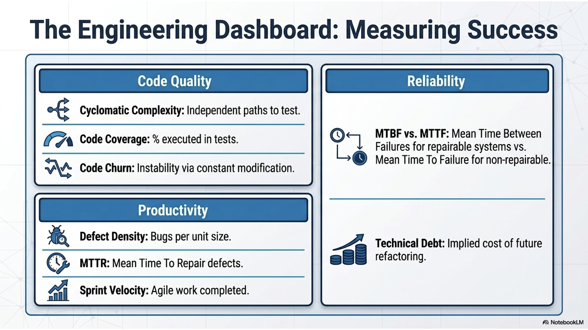

### 1. Code Quality Metrics
* **Cyclomatic Complexity**: Measures the number of linearly independent execution paths through code. Higher complexity correlates with higher defect rates and harder maintenance.
* **Code Coverage**: The percentage of codebase statements or branches executed during automated test runs.
* **Code Churn**: The volume of lines added, modified, or deleted over time; excessive churn indicates architectural instability.

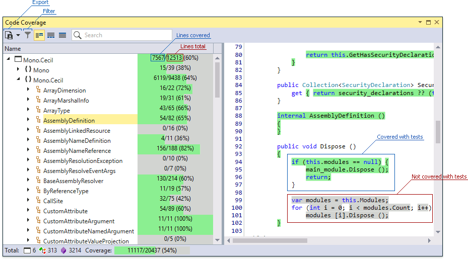

---

### 2. Productivity Metrics
* **Lines of Code (LOC)**: Traditional volume metric; should be evaluated carefully as higher LOC does not necessarily equal higher value.
* **Sprint Velocity**: The number of story points or user stories delivered by an Agile team per sprint iteration.
* **Commit Frequency**: The cadence of source code check-ins, indicating active continuous integration.

---

### 3. Defect Metrics
* **Defect Density**: Number of confirmed defects per thousand lines of code (KLOC) or per function point.
* **Defect Leakage**: Percentage of defects that escape early testing stages into production.
* **Mean Time to Detect (MTTD)**: Average time elapsed between bug introduction and identification.
* **Mean Time to Repair (MTTR)**: Average time required to debug, fix, and verify a reported defect.

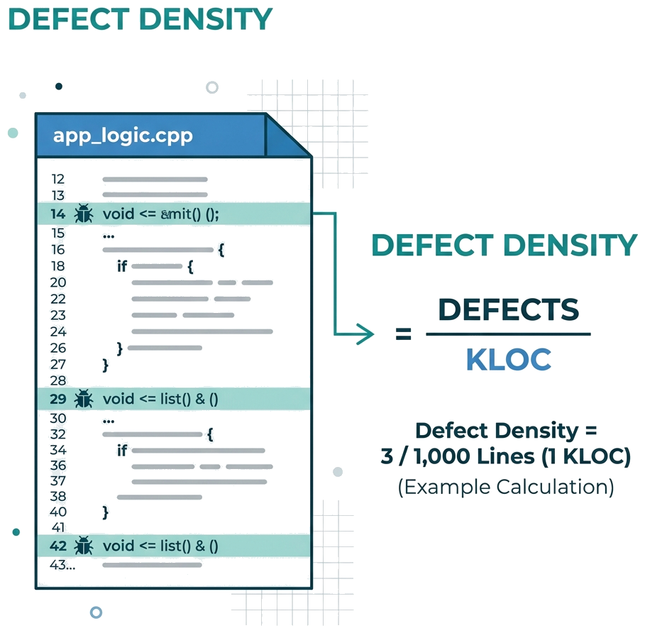

---

### 4. Performance & Reliability Metrics
* **Response Time & Latency**: System round-trip duration when responding to client requests.
* **Throughput**: Transactions or requests handled per unit time.
* **MTBF / MTTF**: Mean Time Between Failures and Mean Time to Failure, measuring system reliability.
* **Technical Debt Ratio**: Estimated remediation cost of code shortcuts relative to total system replacement cost.

---

### 5. Process & Agile Metrics
* **Cycle Time & Lead Time**: Total duration from task inception/commitment to production deployment.
* **Sprint Burndown Chart**: Visual representation of remaining sprint work over time, highlighting team trajectory and blockers.

---

### 6. Security & UX Metrics
* **Vulnerability Count & Time to Patch (TTP)**: Tracking unresolved CVEs and remediation speed.
* **Net Promoter Score (NPS)**: Standard index measuring customer willingness to recommend the software.
* **Task Completion Rate & Error Rate**: UX indicators tracking whether users achieve their goals intuitively without application faults.

---

## Summary & Key Takeaways

1. **Universal Activities**: All software processes require specification, design & implementation, validation, and evolution.
2. **Process Selection**: 
   - Use **Waterfall** when requirements are fixed, stable, and safety/hardware constraints demand strict upfront sign-offs.
   - Use **Iterative & Incremental (Agile)** for dynamic business applications where early value delivery and adaptability are vital.
3. **Coping with Change**: Minimize rework costs through rapid prototyping, change tolerance design, and incremental delivery.
4. **Maturity & Metrics**: Adopt CMMI principles and objective software metrics to foster continuous, data-driven engineering improvement.
