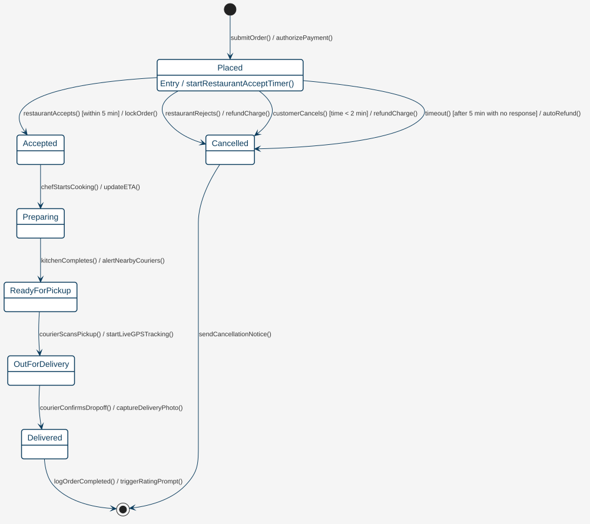

# 軟體架構與系統設計說明書 (Software Design Document, SDD)
## 專案名稱：QuickBite 饗速配 — 分散式雲端美食外送與智慧派單平台

> **課程專案案例 (Course Case Study)**：逢甲大學軟體工程 (Software Engineering) 實務示範教材  
> **版本**：v2.4 (正式發布版)  
> **對應簡報章節**：Ch04 系統塑模 (System Modeling) & Ch05 軟體架構與設計 (Software Architecture & Design)  
> **標準依據**：遵循 IEEE 1016-2009 軟體設計說明書標準與 Kruchten 4+1 架構視圖模型

---

## 1. 架構設計概述與 4+1 視角 (Architectural Overview & 4+1 Views)

### 1.1 系統架構風格 (Architectural Style)
QuickBite 平台採用 **微服務架構 (Microservices Architecture)** 結合 **事件驅動架構 (Event-Driven Architecture, EDA)**。  
整體系統透過現代化雲原生架構運作，兼具高水平擴展性 (Scalability)、容錯彈性 (Resilience) 與職責隔離 (Separation of Concerns)。

```
+---------------------------------------------------------------------------------+
|                       Client Tier (Mobile iOS/Android & Web SPA)                |
+---------------------------------------------------------------------------------+
                                        | (HTTPS / WSS)
                                        v
+---------------------------------------------------------------------------------+
|                  Cloud API Gateway (Kong / Envoy) + OAuth 2.0 Auth              |
|        - SSL Termination  - Rate Limiting  - Route Management  - JWT Validation |
+---------------------------------------------------------------------------------+
          |                     |                      |                   |
          v                     v                      v                   v
+------------------+  +-------------------+  +------------------+  +--------------+
|  Order Service   |  | Restaurant Service|  | Dispatch Service |  |Payment Serv. |
| (Spring Boot/Go) |  |   (Menu & Prep)   |  | (Matching Engine)|  | (Stripe/Bank)|
+------------------+  +-------------------+  +------------------+  +--------------+
          |                     |                      |                   |
          +---------------------+----------------------+-------------------+
                                        |
                                        v
+---------------------------------------------------------------------------------+
|               High-Throughput Event Streaming Bus (Apache Kafka)                |
| Topics: order.created | order.paid | order.prep_ready | courier.matched | ...  |
+---------------------------------------------------------------------------------+
          |                                            |
          v                                            v
+------------------------------------+       +------------------------------------+
|  Polyglot Persistence Layer        |       |  Notification & Real-time Services |
|  - PostgreSQL (ACID Order Records) |       |  - Redis Cluster (GeoJSON & Lock)  |
|  - MongoDB (Unstructured Logs)     |       |  - WebSocket Push Gateway (Tracking)|
+------------------------------------+       +------------------------------------+
```

### 1.2 4+1 架構視圖模型定位 (Kruchten's 4+1 View Model)
依據課程 **Ch05 軟體設計模組** 所講授之 4+1 視角模型：
1. **用例視角 (Use Case View)**：驅動整體架構的商業行為契約（詳見 SRS 需求規格書圖 3.1 與圖 3.2）。
2. **邏輯視角 (Logical View)**：透過領域類別圖 (Class Diagram) 與設計模式，體現抽象封裝、繼承與職責劃分。
3. **流程視角 (Process View)**：透過循序圖 (Sequence Diagram) 與狀態機圖 (State Machine)，展現併發、非同步通訊與狀態轉換。
4. **開發視角 (Development View)**：微服務專案結構、Maven/Gradle 模組相依性與介面合約 (API Contracts)。
5. **實體視角 (Physical View)**：Docker 容器、Kubernetes (EKS/GKE) 叢集部署拓撲與多可用區 (Multi-AZ) 備援。

---

## 2. 靜態結構塑模：領域類別圖與物件模型 (Static Domain Model)

### 2.1 領域類別圖 (Domain Class Diagram)
在物件導向分析與設計 (OOAD) 中，領域類別圖是捕捉真實世界業務概念與系統實體骨架的核心模型。

下圖為 QuickBite 平台之完整 UML 領域類別圖，展現各領域物件之屬性、操作、多重性 (Multiplicity) 以及繼承、組合與聚合關係：

<div align="center">
  
  <p><em>圖 2.1 QuickBite 美食外送平台 UML 領域類別圖 (Class Diagram)</em></p>
</div>

### 2.2 核心類別職責與關聯結構 (Class Anatomy & Relationships)

#### 1. 使用者角色繼承階層 (Generalization / Inheritance)
* `User` 作為抽象基底類別（具有 `userId`, `name`, `phone`, `email` 等共用屬性）。
* `Customer` 與 `Courier` 繼承自 `User`：
  - `Customer` 擴展個人外送地址清單與錢包支付代碼。
  - `Courier` 擴展交通載具類型 (`vehicleType`)、當前即時經緯度 (`currentLocation`)、累計評價星等 (`rating`) 與在線接單狀態 (`status`)。

#### 2. 訂單與品項的「組合」關係 (Composition: `Order` *-- `OrderItem`)
* `Order` 與 `OrderItem` 呈現實心菱形代表的**組合 (Composition)** 強依附關係。
* **生命週期綁定**：訂單明細項無法獨立於訂單而存在。一旦訂單被永久刪除或歸檔，所屬之所有 `OrderItem` 亦隨之消滅。
* `OrderItem` 同時保存下單當下的餐點快照價格 (`unitPrice`)，避免後續餐廳調整菜單定價而破壞歷史訂單財務數據之正確性。

#### 3. 餐廳與菜單品項的「聚合」關係 (Aggregation: `Restaurant` o-- `MenuItem`)
* `Restaurant` 擁有 $0..*$ 個 `MenuItem`，屬於空心菱形代表的**聚合 (Aggregation)** 關係。
* 菜單品項在商業邏輯上具有獨立實體意義，即便餐廳暫停營業或刪除菜單分類，歷史商品資料在庫存管理維度仍可獨立追溯。

---

### 2.3 深入設計模式在領域模型中的實踐 (Design Patterns in Action)

為符合物件導向設計原則（高內聚、低耦合、開放封閉原則），QuickBite 於架構核心具體落實三大經典 GoF 設計模式：

#### 模式一：策略模式 (Strategy Pattern) — 智慧派單調度演算法
派單引擎隨時段、氣候與區域負載動態切換媒合演算法，透過抽取 `DispatchStrategy` 介面達成 OCP（開放封閉原則）：

```
                <<interface>>
              DispatchStrategy
       +-----------------------------+
       |+ matchCourier(Order): Courier|
       +-----------------------------+
                      ^
         +------------+------------+
         |                         |
+---------------------+   +-----------------------+
|NearestCourierStrategy|   |RatingWeightedStrategy |
| (雨天/尖峰優先就近)   |   | (平峰品質優先兼顧星等)  |
+---------------------+   +-----------------------+
```

```java
public interface DispatchStrategy {
    Courier matchCourier(Order order, List<Courier> availableCouriers);
}

// 實踐 1：最短直線距離優先策略（尖峰極限吞吐模式）
public class NearestCourierStrategy implements DispatchStrategy {
    @Override
    public Courier matchCourier(Order order, List<Courier> couriers) {
        return couriers.stream()
            .min(Comparator.comparingDouble(c -> 
                GeoUtils.calculateDistance(order.getRestaurantLocation(), c.getCurrentLocation())))
            .orElseThrow(() -> new NoCourierAvailableException());
    }
}

// 實踐 2：綜合權重評分策略（平峰品質與防作弊模式）
public class RatingWeightedStrategy implements DispatchStrategy {
    @Override
    public Courier matchCourier(Order order, List<Courier> couriers) {
        return couriers.stream()
            .max(Comparator.comparingDouble(c -> 
                (c.getRating() * 0.4) - (GeoUtils.calculateDistance(order.getRestaurantLocation(), c.getCurrentLocation()) * 0.6)))
            .orElseThrow(() -> new NoCourierAvailableException());
    }
}
```

#### 模式二：狀態模式 (State Pattern) — 訂單生命週期狀態機
傳統寫法充斥龐大的 `switch-case` 或多層 `if-else`。狀態模式將訂單在不同生命週期階段之行為封裝於獨立的狀態物件中，杜絕無效狀態跳躍：

```
                <<interface>>
                 OrderState
       +-----------------------------+
       |+ pay(): void                |
       |+ accept(): void             |
       |+ pickup(): void             |
       |+ deliver(): void            |
       |+ cancel(): void             |
       +-----------------------------+
                      ^
     +----------------+----------------+
     |                |                |
+----------+    +------------+   +-------------+
|PlacedState|   |PaidState   |   |Delivering...|
+----------+    +------------+   +-------------+
```

#### 模式三：觀察者模式 (Observer Pattern / Pub-Sub) — 即時狀態異動廣播
當訂單發生關鍵狀態轉換（如 `OrderPaidEvent`, `FoodReadyEvent`），Order Service 不直接與餐廳、外送員及推播伺服器緊密耦合，而是發布事件至 Kafka 事件總線，由下游獨立 Consumer 各自訂閱處理。

---

## 3. 動態行為塑模：循序圖與狀態機圖 (Dynamic Behavioral Modeling)

### 3.1 跨服務端到端循序圖 (Sequence Diagram)
UML 循序圖表達跨微服務實體之間在時間軸上的訊息傳遞（呼叫、非同步回傳、發布訂閱）。

下圖展示自消費者發起結帳、第三方金流扣款、餐廳確認備餐、派單引擎媒合至外送員接單之完整呼叫流程：

<div align="center">
  
  <p><em>圖 3.1 QuickBite 端到端下單、金流與智慧派單循序圖 (Sequence Diagram)</em></p>
</div>

#### 關鍵呼叫步驟剖析：
1. **等冪性結帳 (Checkout with Idempotency)**：
   - 客戶端發出 `POST /orders/checkout` 附帶 `Idempotency-Key`。
   - `Order Service` 取得 Redis 分散式鎖，防止高頻重複扣款。
2. **外部金流授權 (Payment Gateway)**：
   - 同步呼叫第三方銀行 API，取得交易代碼 `charge_id`。
3. **非同步事件廣播 (Async Event Publishing)**：
   - 訂單建立後，`Order Service` 發布 `OrderCreatedEvent` 至 Kafka 主題。
   - `Restaurant Service` 透過 WebSocket 實時喚醒廚房端平板響鈴。
4. **平行調度 (Parallel Dispatch)**：
   - 餐廳點擊接受訂單並輸入備餐時間 T_prep。
   - `Dispatch Service` 於預計出餐前 10 分鐘 發起外送員媒合廣播，將外送員抵店等待時間壓降至最低。

---

### 3.2 訂單完整生命週期狀態機圖 (State Machine Diagram)
訂單生命週期為外送平台之最核心狀態機，涵蓋正常交付流程、異常退款分支與取消保護守衛條件 (Guards)。

<div align="center">
  
  <p><em>圖 3.2 QuickBite 訂單生命週期狀態機圖 (State Machine Diagram)</em></p>
</div>

#### 狀態機轉移動態規格表：
| 現有狀態 (Source) | 觸發事件 (Event) | 守衛條件 (Guard) | 目標狀態 (Target) | 執行動作 (Actions & Side Effects) |
| :--- | :--- | :--- | :--- | :--- |
| **`Placed`** | `PAYMENT_SUCCESS` | 金流授權通過 | **`Paid`** | 記錄交易憑據；發送推播通知餐廳接單 |
| **`Placed`** | `TIMEOUT_OR_FAILED` | 超過 15 分鐘未付款 | **`Cancelled`** | 釋放商品庫存保留；關閉訂單 |
| **`Paid`** | `RESTAURANT_ACCEPT` | 廚房產能充裕 | **`Preparing`** | 設定備餐倒數計時；排程派單任務 |
| **`Paid`** | `USER_ABORT` | 下單 10 秒內或餐廳未接單 | **`Refunded`** | 呼叫金流原路全額刷退；解鎖優惠碼 |
| **`Preparing`** | `KITCHEN_DONE` | 所有品項出餐完畢 | **`ReadyForPickup`** | 通知外送員「餐點已備妥，請前往取餐」 |
| **`ReadyForPickup`** | `COURIER_PICKUP` | 驗證外送員取餐 4 碼 PIN | **`Delivering`** | 開啟顧客對外送員之即時 GPS WebSocket 航跡 |
| **`Delivering`** | `COURIER_DELIVERED` | 抵達送達點且拍照上傳 | **`Delivered`** | 寄送電子發票歸戶；觸發雙向評分通知 |

---

## 4. 介面與資料架構設計 (Interface & Data Storage Architecture)

### 4.1 核心 RESTful API 規範摘要 (OpenAPI 3.0 Specs)

#### 1. 訂單結帳端點
* **`POST /api/v1/orders/checkout`**
* **Headers**: `Authorization: Bearer <JWT>`, `Idempotency-Key: <UUID>`
* **Request Body**:
```json
{
  "restaurantId": "rest-88392",
  "items": [
    { "menuItemId": "item-101", "quantity": 1, "customizations": ["加麵", "半熟蛋"] },
    { "menuItemId": "item-205", "quantity": 2, "customizations": ["微糖微冰"] }
  ],
  "deliveryAddress": {
    "lat": 24.1790,
    "lng": 120.6482,
    "detail": "台中市西屯區文華路100號 資訊電算中心 3F"
  },
  "promoCode": "SE2026",
  "paymentMethod": "CREDIT_CARD",
  "paymentToken": "tok_visa_4242"
}
```
* **Response 201 Created**:
```json
{
  "orderId": "ord-20261003-9981",
  "status": "Placed",
  "totalAmount": 380,
  "discountAmount": 50,
  "finalAmount": 330,
  "estimatedDeliveryTime": "2026-10-03T12:25:00Z"
}
```

#### 2. 外送員實時坐標回傳端點
* **`PUT /api/v1/couriers/me/location`**
* **Headers**: `Authorization: Bearer <Courier-JWT>`
* **Request Body**:
```json
{
  "latitude": 24.17924,
  "longitude": 120.64911,
  "speed": 35.5,
  "heading": 85.0,
  "timestamp": 1791000000
}
```
* **Backend Storage Action**:
  - 執行 Redis 命令：`GEOADD couriers:online:geo 120.64911 24.17924 courier-402`
  - 若該外送員有進行中的配送任務，發布至 Redis Pub/Sub：`PUBLISH order:ord-9981:tracking "{...}"`

---

### 4.2 多模態資料持久化架構 (Polyglot Persistence)

不同的業務場景對一致性與存取延遲之需求迥異，QuickBite 依循「適才適所」原則規劃儲存策略：

| 儲存技術 | 儲存實體與業務資料 | 選型考量與架構理由 |
| :--- | :--- | :--- |
| **PostgreSQL (關聯式 DB)** | 帳號、訂單、訂單明細、財務金流紀錄 | 嚴格支援 ACID 交易特性；外鍵保證資料完整性；提供金流稽核基準。 |
| **Redis Cluster (記憶體快取)** | 使用者工作階段 Session、購物車、外送員地理空間索引 (GeoHash)、API 等冪性分散式鎖 (Redlock) | 極致微秒級 (Microsecond) 讀寫延遲；原生提供空間距離搜尋指令。 |
| **Apache Kafka (串流佇列)** | 全域業務事件流 (`order.*`, `courier.*`, `payment.*`) | 高吞吐排隊緩衝 (Buffer)，平抑尖峰流量 (Traffic Peak Shaving)；支援事件溯源 (Event Sourcing)。 |
| **Amazon S3 / MinIO** | 餐廳菜單餐點照片、外送員交付存證照片 | 高可用性、低成本之物件儲存服務，搭配 CDN 邊緣加速。 |

---

## 5. 設計原則檢驗與架構權衡 (Design Principles & Trade-offs)

### 5.1 SOLID 設計原則落實檢視 (呼應簡報 Ch05)
1. **單一職責原則 (SRP - Single Responsibility Principle)**：
   - `OrderCalculator` 僅負責金額與促銷扣抵運算；`OrderRepository` 僅負責資料持久化；`DispatchEngine` 僅負責派單配對，各類別均只有單一修改理由。
2. **開放封閉原則 (OCP - Open/Closed Principle)**：
   - 新增第三方金流（如引入街口支付）時，只需新增實作 `PaymentGateway` 介面之子類別，無須修改原有的 `CheckoutService` 程式碼。
3. **里氏替換原則 (LSP - Liskov Substitution Principle)**：
   - 任何接受基底類別 `User` 之邏輯，均可由衍生子類別 `Customer` 或 `Courier` 完美替換，且不破壞原有系統不變式。
4. **介面隔離原則 (ISP - Interface Segregation Principle)**：
   - 避免肥大巨型介面。將餐廳端操作拆解為 `MenuManageable` 與 `OrderFulfillable`，外送員端僅能接觸 `DeliveryFulfillable`。
5. **依賴反轉原則 (DIP - Dependency Inversion Principle)**：
   - 商業邏輯核心層依賴抽象介面（如 `NotificationSender`），而非具體依賴特定郵件或簡訊廠商實作（如 `TwilioSender` 或 `SendGridSender`），依賴由 IoC 容器於啟動時注入。

### 5.2 CAP 定理架構權衡決策 (CAP Theorem Trade-off)
根據 CAP 定理，在面臨網路分割 (Network Partition, P) 時，分散式系統必須在一致性 (Consistency, C) 與可用性 (Availability, A) 之間進行權衡取捨：

```
                    +------------------------------------+
                    |        CAP Trade-off Strategy      |
                    +-----------------+------------------+
                                      |
              +-----------------------+-----------------------+
              |                                               |
              v                                               v
    [ CP 子系統: 核心交易與扣款 ]                  [ AP 子系統: 即時軌跡與推薦 ]
    - 追求強一致性 (Strong Consistency)           - 追求高可用性 (High Availability)
    - 資料庫嚴格鎖定 (ACID / Distributed Lock)   - 接受最終一致性 (Eventual Consistency)
    - 寧可拒絕少數下單，絕不超賣或重複扣款        - 網路短暫抖動時，顯示上一次已知 GPS 位置
```

---
*文件編制：逢甲大學軟體工程教學團隊 (Prof. Nien-Lin Hsueh)*  
*相關文件：[QuickBite 軟體需求規格書 (SRS)](doc.html?file=Lecture/food_delivery/srs_food_delivery.md)*
