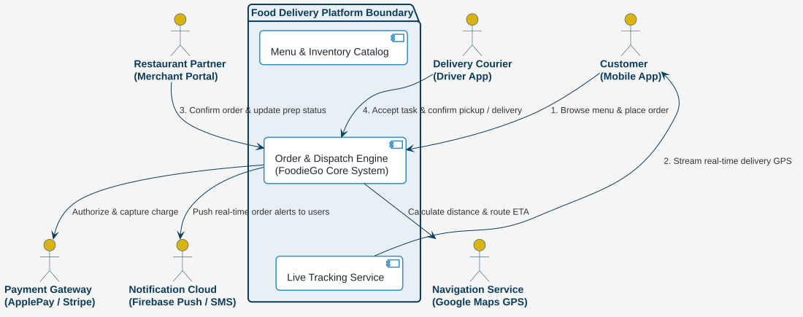
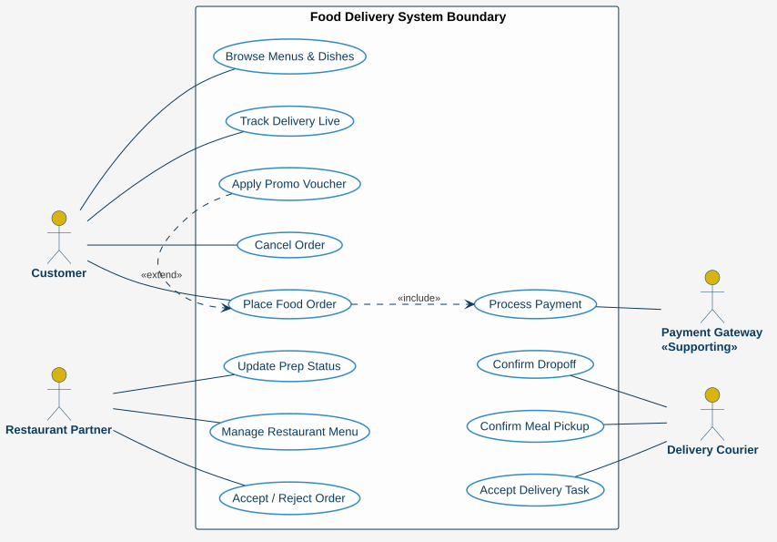
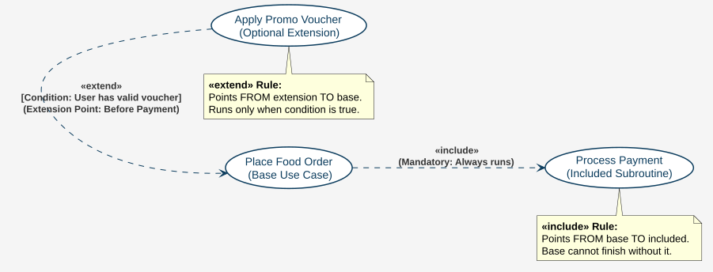
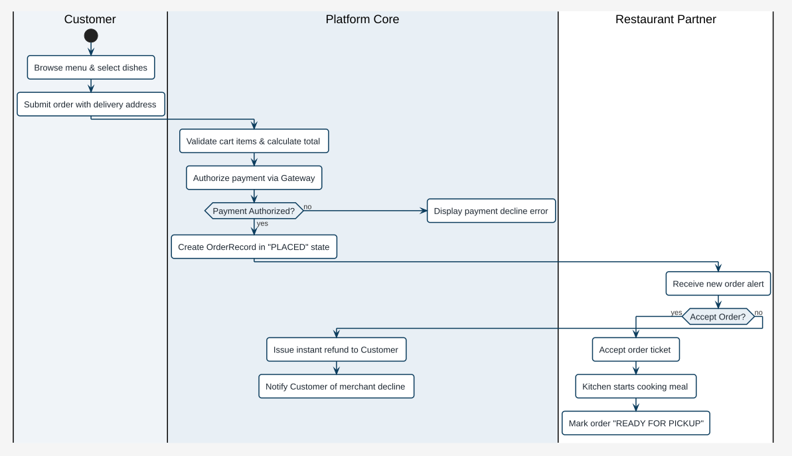

# 軟體需求規格書 (Software Requirements Specification, SRS)
## 專案名稱：QuickBite 饗速配 — 分散式雲端美食外送與智慧派單平台

> **課程專案案例 (Course Case Study)**：逢甲大學軟體工程 (Software Engineering) 實務示範教材  
> **版本**：v2.4 (正式發布版)  
> **對應簡報章節**：Ch03 需求工程 (Requirements Engineering) & Ch04 系統塑模 (System Modeling)  
> **標準依據**：遵循 IEEE 830 / ISO/IEC/IEEE 29148 軟體需求規格標準

---

## 1. 引言與專案背景 (Introduction & Scope)

### 1.1 系統緣起與商業願景 (Vision & Background)
「QuickBite 饗速配」是一座現代化、高併發的分散式即時美食外送電商平台。平台串聯**消費者 (Customer)**、**合作餐廳 (Restaurant/Merchant)** 與**外送合作夥伴 (Courier/Driver)** 三大核心角色，透過即時雙向媒合演算法、地理空間索引 (Geospatial Indexing) 與事件驅動架構，提供流暢的「30 分鐘熱食即送」極致體驗。

本系統作為軟體工程課程的核心範例，完整體現：
1. **需求工程三元論**：涵蓋領域屬性、軟體規格與使用者需求。
2. **UML 多重視角塑模**：從脈絡、用例、活動、循序到類別與狀態的完整對應。
3. **嚴謹的非功能性需求 (NFR) 量化指標**：落實 Sommerville 分類架構與 GQM (Goal-Question-Metric) 指標設計。

### 1.2 利害關係人與使用者角色 (Stakeholders & Actors)
* **消費者 (Customer)**：瀏覽菜單、自訂餐點規格、結帳付款、實時追蹤外送員 GPS 動態及評價訂單。
* **合作餐廳 (Restaurant / Merchant)**：維護數位菜單、營業狀態設定、接收訂單並回報廚房備餐進度。
* **外送合作夥伴 (Courier / Driver)**：透過行動端接單、前往餐廳取餐、導航配送並完成最終交付。
* **平台營運與客服仲裁者 (Platform Admin / Support)**：監控全局派單效率、處理訂單異常、退款審核與客服糾紛。
* **外部整合服務 (External Services)**：
  - **第三方金流閘道 (Payment Gateway)**：提供信用卡、Apple Pay、LINE Pay 授權與清算。
  - **地理空間地圖服務 (Geospatial Map API)**：提供路徑規劃、距離計算與 ETA (預計抵達時間) 預估。
  - **推播通知服務 (Push Notification Service)**：提供 APNs / FCM 實時狀態推播。

### 1.3 核心術語與詞彙定義 (Glossary)
| 術語 | 英文定義 | 系統說明 |
| :--- | :--- | :--- |
| **訂單 (Order)** | Order Entity | 消費者於單一餐廳完成商品選擇並發起之購買契約，具唯一 UUID。 |
| **派單調度 (Dispatch)** | Intelligent Matching | 根據外送員空間距離、評分、負載，經匈牙利演算法計算最佳媒合。 |
| **備餐時間 (Prep Time)** | Kitchen Prep Duration | 餐廳預估出餐所需時間，直接影響外送員抵達取餐的最佳時間窗。 |
| **等冪性 (Idempotency)** | Idempotent Operation | 重複發送相同請求（如重複點擊付款）保證僅執行一次扣款與建單。 |

---

## 2. 系統整體描述與環境架構 (General System Description)

### 2.1 系統邊界與外部脈絡 (System Boundary & Context)
QuickBite 平台居於中樞位置，協調消費者、餐廳、外送員之訊號與金流，並與外部銀行和地圖雲端服務互動。

```
                       +----------------------------+
                       |    Geospatial Map API      |
                       |  (Google Maps / Mapbox)    |
                       +--------------+-------------+
                                      ^
                                      | 距離計算 / 軌跡導航
+-------------------+                 v                 +--------------------+
|     Customer      |<======> [ QuickBite Platform ] <====>|     Restaurant     |
| (Mobile App / Web)|  下單/付款       (Core API)       接單/出餐 | (Merchant Console) |
+-------------------+                 ^                 +--------------------+
                                      | 派單/定位
                                      v
                       +--------------+-------------+
                       |      Courier Partner       |
                       |   (Courier Driver App)     |
                       +----------------------------+
```

下圖為系統標準架構脈絡圖（System Context Diagram），定義了平台與外部實體之邊界介面：

<div align="center">
  
  <p><em>圖 2.1 QuickBite 美食外送平台系統脈絡圖 (System Context Diagram)</em></p>
</div>

### 2.2 系統假設與限制 (Assumptions & Constraints)
1. **連線假設**：外送員與消費者端預設具備行動通訊網路（4G/5G/Wi-Fi）及 GPS 定位硬體。
2. **併發峰值**：每日中午 11:30–13:30 及傍晚 17:30–19:30 為用餐尖峰，訂單請求量達常態 8–10 倍。
3. **法規限制**：嚴格遵循台灣「個人資料保護法」與「勞動基準法外送員專章」規定，外送員單日上線連續工時不得超過法定上限。

---

## 3. 功能性需求規格 (Functional Requirements)

### 3.1 總體用例圖 (Overall Use Case Diagram)
系統功能依使用者角色與核心業務流程劃分，下圖為平台標準 UML 用例圖（Use Case Diagram）：

<div align="center">
  
  <p><em>圖 3.1 QuickBite 平台整體用例圖 (Use Case Diagram)</em></p>
</div>

### 3.2 用例關係延伸剖析 (Include vs. Extend Mechanics)
在需求工程塑模中，用例之間的關係具備明確語義（呼應簡報 Ch04）：
* **包含關係 (`<<include>>`)**：代表基底用例不可或缺的強制組成部分。在「結帳下單 (Checkout)」過程中，必須無條件包含「處理線上支付 (Process Payment)」。
* **擴展關係 (`<<extend>>`)**：代表在滿足特定擴展點 (Extension Point) 與前提條件下才會觸發的選擇性行為。例如當消費者持有優惠代碼時，才在結帳流程中擴展執行「套用折價優惠 (Apply Promo Code)」。

<div align="center">
  
  <p><em>圖 3.2 結帳用例中 <<include>> 與 <<extend>> 機制詳解</em></p>
</div>

### 3.3 核心用例規格表 (Detailed Use Case Specifications)

#### [UC-01] 瀏覽與下單結帳 (Browse & Checkout Order)
* **主參與者**：消費者 (Customer)
* **前置條件**：消費者已成功登入並設定有效外送送達地址。
* **主要成功流程 (Main Success Scenario)**：
  1. 消費者開啟 App，系統依據 GPS 位置呈現服務範圍內之餐廳清單。
  2. 消費者點選「經典義大利麵餐廳」，瀏覽菜單分頁。
  3. 消費者選擇「松露野菇燉飯」，選取加飯與半熟蛋規格後加入購物車。
  4. 消費者進入結帳預覽頁，確認餐點清單、配送費與預估送達時間 (ETA)。
  5. 系統執行 `<<extend>>`：消費者輸入有效促銷代碼 `SE2026`，系統重算折抵金額。
  6. 系統執行 `<<include>>`：呼叫第三方金流進行信用卡扣款授權。
  7. 金流授權成功，系統生成唯一訂單編號，狀態轉換為 `Placed`。
  8. 系統透過 WebSocket 與推播通知餐廳接單。
* **例外流程 (Alternative / Exception Flows)**：
  - *4a. 餐點庫存售罄*：系統跳出警告並自購物車移除該項目，提示重新選擇。
  - *6a. 信用卡授權失敗*：提示「發卡銀行拒絕授權」，保留購物車，讓使用者更換付款方式。
* **後置條件**：建立持久化訂單紀錄，扣除消費者款項，餐廳端收到新單警示音。

#### [UC-04] 餐廳接單與備餐 (Accept Order & Kitchen Prep)
* **主參與者**：合作餐廳 (Restaurant)
* **前置條件**：訂單已成功完成付款驗證，狀態為 `Paid`。
* **主要成功流程**：
  1. 餐廳平板響起警示音並彈出新訂單卡片，標明餐點明細與顧客特殊需求。
  2. 廚房人員確認產能，點擊「確認接單」，並輸入預估備餐時間（如 20 分鐘）。
  3. 系統將訂單狀態更新為 `Accepted` 並轉入 `Preparing`。
  4. 系統觸發派單調度服務，開始搜尋周遭適合的外送員。
  5. 廚房出餐完畢，餐廳人員點擊「備餐完成」，狀態轉換為 `ReadyForPickup`。

#### [UC-05] 智慧派單與外送履約 (Smart Dispatch & Delivery)
* **主參與者**：外送合作夥伴 (Courier)、派單演算法服務 (Dispatch Service)
* **前置條件**：訂單已進入 `Preparing` 或 `ReadyForPickup`，周遭有上線狀態外送員。
* **主要成功流程**：
  1. 派單演算法根據地理距離、交通即時路況與外送員評分，向最適外送員發送派單邀請（倒數 25 秒）。
  2. 外送員點擊「接受派單」，訂單狀態綁定該外送員。
  3. 外送員抵達餐廳，核對取餐編號並收取餐點，點擊「已取餐」。
  4. 訂單狀態轉換為 `Delivering` (外送中)，系統開啟客戶端對外送員之實時 GPS 軌跡推播。
  5. 外送員抵達送達地點，交付餐點並拍照存證，點擊「完成送達」。
  6. 訂單狀態轉換為 `Delivered`，系統發送問卷引導顧客進行雙向評分。

---

### 3.4 業務流程活動圖 (Activity Diagrams & Workflows)

美食外送流程跨越四大領域實體，採用 UML 泳道活動圖（Swimlane Activity Diagram）表達清晰的責任分工與非同步事件協作：

#### 階段一：客戶下單與餐廳備餐活動流程
涵蓋顧客結帳、金流授權檢驗、餐廳接單逾時防護之分支判斷：

<div align="center">
  
  <p><em>圖 3.3 階段一：客戶下單、金流扣款與餐廳備餐泳道活動圖</em></p>
</div>

#### 階段二：外送員智慧派單與配送交接活動流程
展示外送員媒合重試迴圈、平行取餐備餐路徑以及最終交付驗證：

<div align="center">
  
  <p><em>圖 3.4 階段二：外送員智慧媒合、取餐與配送交付泳道活動圖</em></p>
</div>

---

## 4. 非功能性需求規格 (Non-Functional Requirements, NFRs)

本章節嚴格落實課程 **Ch03 需求工程第 3.3 節** 所教導之 Sommerville NFR 分類模型，杜絕「系統要快、要穩」等無法客觀度量的空泛宣稱，每一條 NFR 皆定義可客觀驗證之量化度量指標 (Verifiable Metrics)。

```
                           +--------------------------------------+
                           |   Non-Functional Requirements (NFR)  |
                           +------------------+-------------------+
                                              |
        +-------------------------------------+------------------------------------+
        |                                     |                                    |
        v                                     v                                    v
+------------------+                +-------------------+                +-------------------+
| 1. 產品需求 (Product) |           | 2. 組織需求 (Org) |                | 3. 外部需求 (Ext) |
| - 效能與輸送量    |                | - 開發環境與框架  |                | - 法規工時遵從    |
| - 可用性與可靠度  |                | - 測試與品質門檻  |                | - 電子發票與稅務  |
| - 安全性與隱私遮罩|                | - 部署與維運標準  |                | - 個資安全防護    |
| - 易用性與人機介面|                +-------------------+                +-------------------+
+------------------+
```

### 4.1 產品需求 (Product Requirements)

#### 4.1.1 效能需求 (Performance & Scalability)
* **NFR-P-01 查詢延遲 (Read Latency)**：
  - 在常態負載下（每秒 3,000 次讀取請求），餐廳與菜單查詢 API 之 95th-percentile (P95) 回應時間必須 ≤ 200 ms，99th-percentile (P99) 必須 ≤ 400 ms。
* **NFR-P-02 尖峰交易吞吐量 (Peak Transaction Throughput)**：
  - 核心下單與金流處理子系統必須支援至少每秒 8,000 筆併發交易請求 (8,000 TPS)；在年節促銷等極端尖峰情境下，透過自動水平擴展 (HPA) 彈性承載至 15,000 TPS 且錯誤率不得超過 0.01%。
* **NFR-P-03 即時定位更新頻率 (GPS Update Frequency)**：
  - 外送員 App 每 3 秒 回傳一次經緯度座標；客戶端地圖畫面上外送員圖標之渲染延遲時間不得超過 2.0 秒。

#### 4.1.2 可靠性與可用性 (Reliability & Availability)
* **NFR-A-01 服務等級合約 (SLA & Availability)**：
  - 系統整體服務可用度須達到 **99.95%**（每年非計畫性停機總時間不得超過 4 小時 23 分鐘）。
* **NFR-A-02 平均故障修復時間 (MTTR) 與容錯能力**：
  - 系統任一單一節點或微服務 Pod 當機，Kubernetes 叢集必須在 15 秒 內完成自動健康探針偵測並重啟替代 Pod；平均修復時間 (MTTR) ≤ 5 分鐘。
* **NFR-A-03 訂單交易等冪性 (Idempotency Guarantee)**：
  - 所有結帳扣款與出單請求必須附帶唯一 `Idempotency-Key`。因網路重試造成之重複請求，系統保證 100% 僅執行一次扣款與一次訂單生成，絕不發生重複計費。

#### 4.1.3 安全性與隱私防護 (Security & Privacy)
* **NFR-S-01 傳輸與靜態資料加密 (Encryption Standard)**：
  - 所有外部通訊一律強制採用 TLS 1.3 協定。
  - 資料庫中之使用者密碼必須經由 Argon2id 或 bcrypt 加鹽雜湊保存；信用卡號、交易金鑰等機敏資料必須以 AES-256-GCM 進行資料表層級欄位加密。
* **NFR-S-02 隱私電話轉接與遮罩 (Virtual Number Masking)**：
  - 外送員與消費者之間之語音通話與簡訊，一律透過第三方虛擬總機號碼（Masked Proxy Number）自動轉接；雙方在 App 介面上均無法看見彼此真實行動電話號碼與完整法定姓名。
* **NFR-S-03 金流合規 (PCI-DSS Compliance)**：
  - 系統核心架構不得儲存持卡人之 CVV/CVC 驗證碼及明文卡號，全面落實 PCI-DSS Level 1 規範，採用 Tokenization 代碼化機制。

#### 4.1.4 易用性需求 (Usability - 呼應簡報 Ch06 UX/UI 原則)
* **NFR-U-01 結帳極簡化 (Checkout Efficiency)**：
  - 常客於同家餐廳「再點一次」並完成結帳之操作步驟不得超過 3 個點擊動作，中位數完成時間不得超過 12 秒。
* **NFR-U-02 狀態可見性 (Visibility of System Status - Nielsen #1)**：
  - 訂單建立後，顧客畫面必須常駐顯示 5 階段視覺化進度條（已下單 → 餐廳接單 → 廚房備餐 → 外送員外送中 → 送達），進度異動必須在 1 秒內動態回饋。
* **NFR-U-03 誤觸緊急出口 (User Control & Freedom - Nielsen #3)**：
  - 消費者按下付款後，系統提供 **10 秒內無條件一鍵取消機制**；在餐廳尚未按下「確認接單」前，顧客可隨時無償取消訂單。

---

### 4.2 組織需求 (Organizational Requirements)
* **NFR-O-01 程式碼品質與單元測試門檻 (Test Coverage Baseline)**：
  - 所有微服務的核心商業邏輯（訂單計算、折扣引擎、派單媒合），單元測試（Unit Test）語句涵蓋率 (Statement Coverage) 必須達到 **85% 以上**，分歧涵蓋率 (Branch Coverage) 達到 **75% 以上**。
* **NFR-O-02 持續整合與交付 (CI/CD Pipeline)**：
  - 程式碼推播至 GitHub/GitLab 主幹前，必須通過自動化靜態檢查 (SonarQube/Linter)、容器安全性掃描 (Trivy) 及所有迴歸測試；自代碼提交至可上線容器映像檔產出耗時不得超過 8 分鐘。

---

### 4.3 外部與法規需求 (External Requirements)
* **NFR-E-01 外送員法規工時防護 (Labor Regulation Compliance)**：
  - 系統外送調度服務必須內建疲勞防護機制，單一外送員累計接單工作時間達 8 小時，系統發出警示；達 12 小時則強制中斷派單並下線休息至少 8 小時。
* **NFR-E-02 財政部電子發票載具規範**：
  - 訂單完成送達時，系統必須在 48 小時內呼叫財政部電子發票 API 完成開立，並支援手機條碼載具、自然人憑證與綠界載具自動歸戶。

---

## 5. 驗證與驗收標準 (Verification & Acceptance Criteria)

### 5.1 Gherkin BDD 格式驗收劇本 (Given-When-Then Scenarios)
本平台採用行為驅動開發 (BDD) 格式定義客觀驗收準則：

```gherkin
Feature: 訂單結帳與等冪性扣款驗收

  Scenario: 正常結帳並套用優惠代碼
    Given 消費者 "Alice" 購物車內有 "松露野菇燉飯" 1份，總計金額 250 元
    And 系統內存在有效促銷代碼 "SE2026"，規則為滿 200 現折 50 元
    When Alice 在結帳頁輸入促銷代碼 "SE2026"
    And 點擊 "確認付款" 送出訂單
    Then 最終應付金額應計算為 200 元
    And 系統成功扣款 200 元
    And 訂單狀態應轉為 "Placed"
    And 餐廳端應在 2 秒內收到該筆新訂單警示

  Scenario: 網路不穩引發連續快速點擊付款（等冪性防護）
    Given 消費者 "Bob" 發起一筆金額 400 元之結帳請求，產生 Idempotency-Key "uuid-bob-1234"
    When 由於網路延遲，Bob 在 1 秒內連續點擊 3 次 "確認付款" 按鈕
    Then 金流閘道與訂單系統僅執行 1 次扣款 400 元
    And 資料庫僅新增 1 筆訂單記錄
    And 後續兩次重複請求應回傳相同的訂單確認結果，狀態碼為 200 OK
```

### 5.2 GQM (Goal-Question-Metric) 評估框架 (呼應簡報 Ch03)
為了客觀評估 QuickBite 平台之系統品質，依據 Basili 的 GQM 模型建立品質度量矩陣：

| 目標 (Goal) | 關鍵問題 (Question) | 度量指標 (Metric) | 驗收標準 (Target) |
| :--- | :--- | :--- | :--- |
| **G1: 確保下單尖峰之極致回應體驗** | Q1.1 用餐尖峰時間，核心 API 是否維持低延遲？ | API 端點 P95 / P99 延遲時間 (ms) | P95 ≤ 200 ms，P99 ≤ 400 ms |
| | Q1.2 促銷期間大量併發是否導致訂單遺失或報錯？ | 交易失敗率 (Failure Rate, %) | 交易失敗率 ≤ 0.01% |
| **G2: 強化外送員智慧調度效率** | Q2.1 外送員接單後至抵達餐廳之等待時間是否最小化？ | 外送員抵店後「等待餐點平均分鐘數」 | 平均等待時間 ≤ 3.5 分鐘 |
| | Q2.2 派單媒合演算法之平均運算延遲為何？ | 媒合引擎單次批次運算耗時 | 運算時間 ≤ 1.5 秒 |
| **G3: 保障平台交易之零重複扣款事故** | Q3.1 因網路連線不穩造成之重複扣款申訴案件數？ | 客服「重複計費」工單比率 | 每月 $0$ 起重複扣款事件 |

---
*文件編制：逢甲大學軟體工程教學團隊 (Prof. Nien-Lin Hsueh)*  
*相關文件：[QuickBite 系統設計與架構說明書 (SDD)](doc.html?file=Lecture/food_delivery/sdd_food_delivery.md)*
