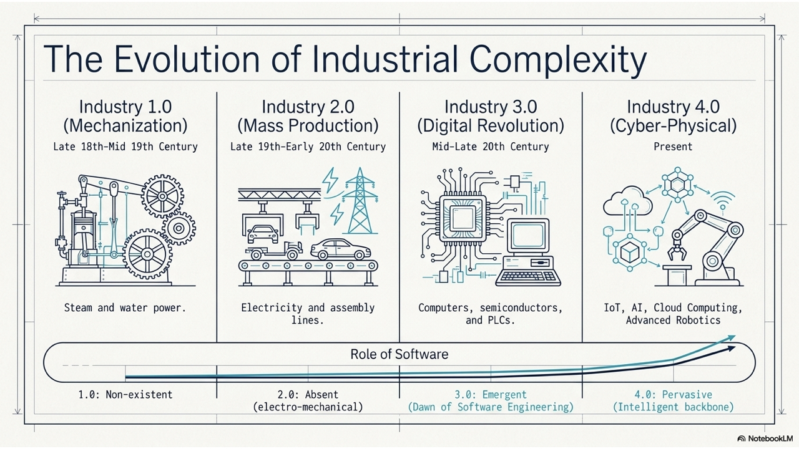
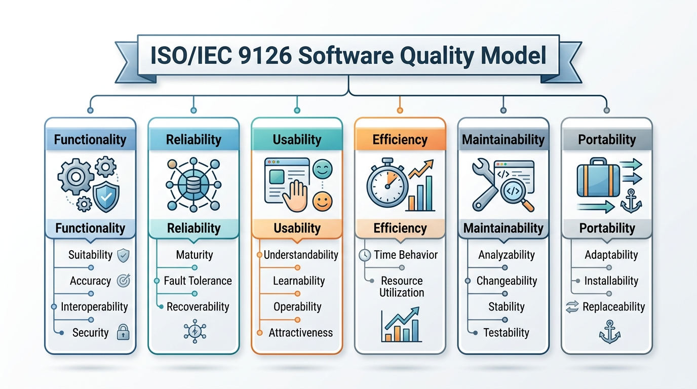
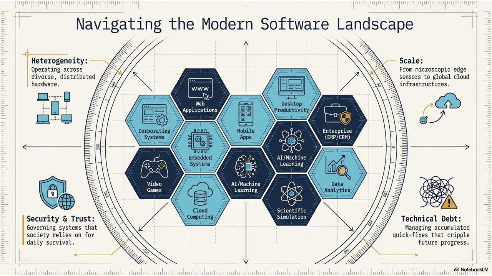
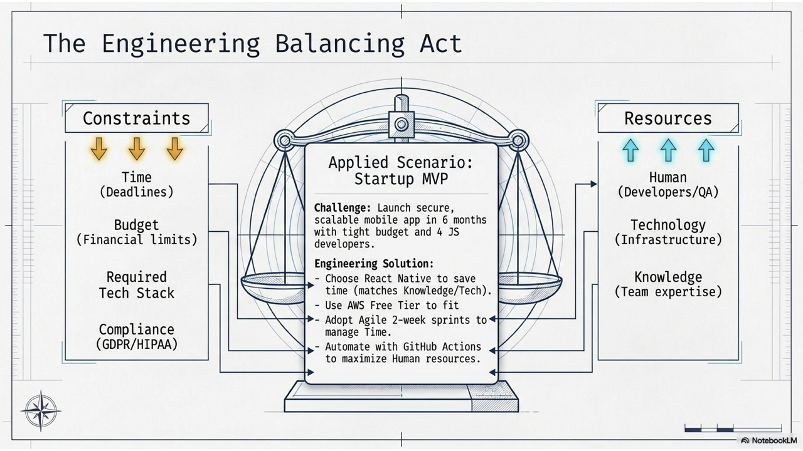
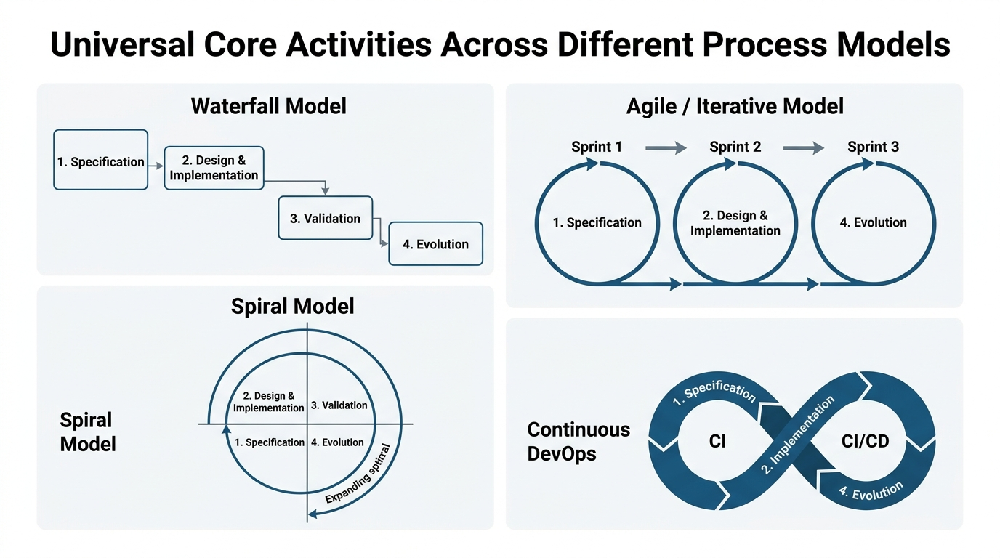
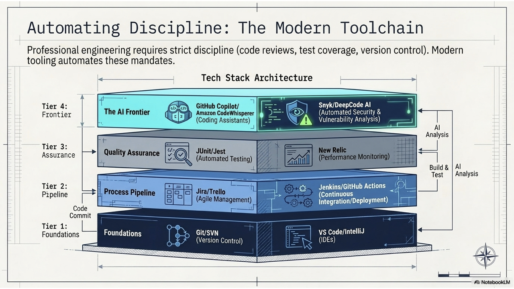
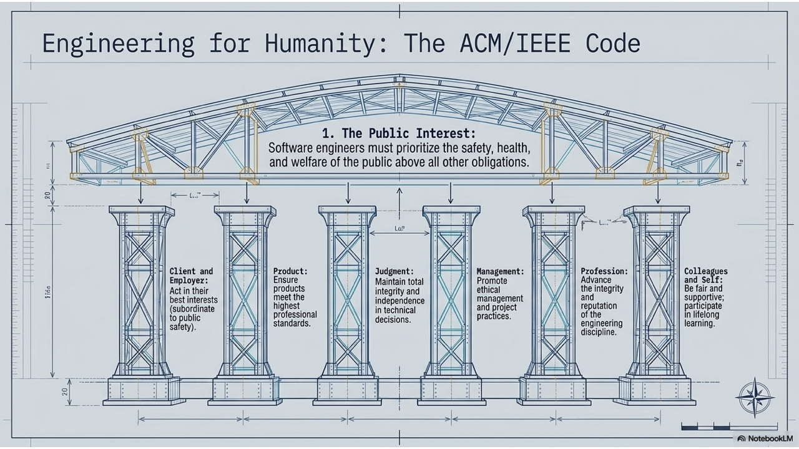
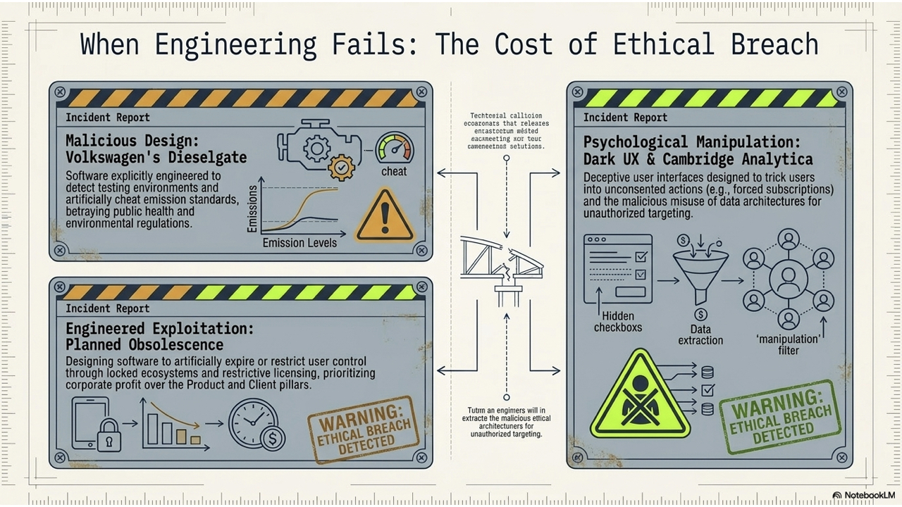
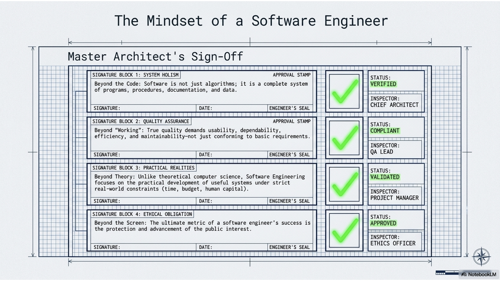

# Introduction to Software Engineering

**Lecture Outline & Key Concepts**
> * **1.1 The Technological Arc**: From mechanization to the digital revolution and ubiquitous AI.
> * **1.2 The Genesis of Software Engineering**: Why the 1968 "Software Crisis" forced software development to evolve from a craft into an engineering discipline.
> * **1.3 Demystifying Software**: Beyond source code (Programs, Data, Procedures, Documentation).
> * **1.4 ISO 9126 Quality Model**: 6 characteristics and operational sub-attributes with practical examples.
> * **1.5 Navigating the Modern Software Landscape**: Diverse application domains from cloud-native SaaS to embedded systems and AI platforms.
> * **1.6 What is Software Engineering?**: Definition, the Software Process, balancing constraints against resources, the 4 universal core activities, practical dimensions, and dispelling software myths.
> * **1.7 Modern Toolchains & AI in Software Engineering**: CI/CD pipelines and the benefits vs. risks of AI across every lifecycle phase.
> * **1.8 Professional Ethics, Social Responsibility & Dark Patterns**: The ACM/IEEE Code of Ethics, ethical failures, and identifying deceptive UI/UX dark patterns (Monochrome Comic).
> * **1.9 Frequently Asked Questions (FAQ) in Software Engineering**.
> * **Appendix: Solutions & Explanations to Interactive Activities**.

[Slide Deck: Ch1 SE Introduction](https://docs.google.com/presentation/d/1CLQaKE9g9EQE0XWGd2yiA9TnyB8-H-qf/edit?usp=sharing&ouid=109022309423128079509&rtpof=true&sd=true)

---

## 1.1 The Technological Arc: From Mechanization to Ubiquitous AI

To understand why software engineering exists as a formal discipline, we must look at how human production has evolved over the past two centuries. Software did not emerge in a vacuum; it became the central nervous system of global civilization through four distinct industrial waves.

*Figure 1.1: The progression across four industrial revolutions—shifting the primary driver of productivity from physical muscle to mechanical energy, digital logic, and finally autonomous intelligence.*

### 1.1.1 The Four Industrial Eras

1. **Industry 1.0 — The Age of Mechanization (Late 18th to Mid-19th Century)**
   The first industrial revolution replaced human and animal muscle with steam and water power. Centralized factories emerged, transforming textiles, coal mining, and transportation through steam locomotives and ships. In this era, technology was purely mechanical and physical; the concept of software was completely non-existent.

2. **Industry 2.0 — The Age of Mass Production (Late 19th to Early 20th Century)**
   Driven by electricity, the internal combustion engine, and Henry Ford’s moving assembly line, Industry 2.0 enabled large-scale manufacturing of standardized consumer goods, automobiles, and electrical appliances. While electro-mechanical relays and telephone networks laid the earliest groundwork for automated communication, control logic was still physically hardwired.

3. **Industry 3.0 — The Digital Revolution and the Dawn of Software (Mid to Late 20th Century)**
   The invention of semiconductors, microprocessors, and mainframe computers ushered in the digital age. Programmable Logic Controllers (PLCs) automated industrial machinery, while personal computers democratized computing for businesses and households. During this era, **software emerged as a distinct, standalone discipline**: programs were written to control physical hardware, process financial records, and route telecommunications.

4. **Industry 4.0 — The Era of Connectivity, Cloud, and AI (Early 21st Century to Present)**
   Today, cyber-physical systems, the Internet of Things (IoT), cloud computing, and Artificial Intelligence converge. Software is no longer just a supporting tool for business; it is the fundamental infrastructure powering healthcare, transportation, finance, and governance. Software today is ubiquitous, self-adapting, and globally interconnected.

---

> 💡💬 **Interactive Activity — Classroom Poll & Discussion**:
> * **Poll**: Think about the devices and services you interact with daily. What percentage of them operate on Industry 3.0 deterministic rules vs. Industry 4.0 connected, AI-driven adaptive software?
> * **Discussion Prompt**: Identify one everyday manual or legacy system (e.g., campus parking, hospital triage, grocery supply chains) that is ripe for an Industry 4.0 software overhaul. What unique engineering challenges would arise during that transition?

---

## 1.2 The Genesis of Software Engineering and the "Software Crisis"

In the early decades of computing (1940s–1950s), computers were scarce and expensive, while software was viewed merely as a secondary set of instructions tailored for specific hardware. Programs were small, written in assembly or early machine languages by individual scientists who treated programming as an artisanal craft.

However, as computer hardware became exponentially faster and cheaper throughout the 1960s, organizations began commissioning massive software systems—such as real-time military radar networks (e.g., SAGE), airline reservation platforms (e.g., SABRE), and spacecraft navigation computers.

*Figure 1.2.1: The Software Crisis of the late 1960s—marked by chronic budget overruns, missed deadlines, fatal bugs, and systems that proved unmaintainable upon delivery.*

### 1.2.1 The Software Crisis of the Late 1960s

By the late 1960s, the software industry hit a wall known as the **Software Crisis**. Projects across corporations and defense agencies were failing at an alarming rate. Software was consistently:
* **Severely over budget**: Final costs frequently exceeded initial estimates by factors of three or four.
* **Critically delayed**: Systems were delivered years late or abandoned entirely before completion.
* **Plagued by defects**: Systems crashed frequently, produced incorrect calculations, or introduced severe safety hazards.
* **Impossible to maintain**: Code written without modular structure or documentation could not be modified without breaking unrelated features.

The root cause was clear: **writing code as a solitary, informal craft does not scale to large, complex systems built by teams of developers over years**.

### 1.2.2 The 1968 NATO Conference: Birth of a Discipline

To address this crisis, the NATO Science Committee convened a landmark conference in **Garmisch, Germany, in October 1968**, bringing together 50 top computer scientists, industry managers, and academics.

*Figure 1.2.2: The historic 1968 NATO Software Engineering Conference in Garmisch, Germany, where the term "Software Engineering" was formally adopted to establish engineering rigor for software.*

The conference formally established the term **Software Engineering** with a deliberate goal: software development needed to transition from an ad-hoc art into a formal engineering discipline—one grounded in structured methodologies, formal specifications, cost estimation, rigorous validation, and project management.

### 1.2.3 Real-World Costs of Software Failure

When engineering discipline is missing, the consequences are not just financial—they can be catastrophic:

* **Nagoya Airbus A300 Crash (1994)**: A subtle Human-Machine Interface (HMI) software conflict occurred when the autopilot fought the pilots' manual control inputs, resulting in the tragic loss of 264 lives.
* **Mars Climate Orbiter (1999)**: A $327 million spacecraft was destroyed in the Martian atmosphere due to an unverified unit mismatch between two software modules (metric Newtons vs. imperial pound-force).
* **Ariane 5 Flight 501 (1996)**: A rocket self-destructed 37 seconds after launch because a 64-bit floating-point value was converted into a 16-bit signed integer without exception handling, costing over $370 million.

---

> 💡🧠 **Concept Check (CCQ 1) — The Nature of the Software Crisis**:
> 
> *Question*: Why couldn't the 1968 Software Crisis be resolved simply by manufacturing faster computer hardware or purchasing more memory?
> * A) Hardware manufacturing stopped advancing in the late 1960s.
> * B) The crisis was fundamentally a cognitive and organizational problem of intellectual complexity, system architecture, and communication overhead, which faster hardware only amplified.
> * C) Early programming languages lacked arithmetic calculation capabilities.
> * D) Hardware was incompatible with cloud infrastructure.
> 
> [👉 View Answer & Detailed Explanation in Appendix](#ccq-1--the-nature-of-the-software-crisis)

---

## 1.3 Demystifying Software: The Anatomy Beyond Source Code

A common misconception among beginner programmers is that software is simply another name for source code. In professional software engineering, source code is only the visible tip of the iceberg.

*Figure 1.3: The anatomy of professional software—composed of source code, data assets, operational procedures, and comprehensive documentation.*

### 1.3.1 The IEEE Definition of Software

The IEEE standard formally defines software as:
> **Software**: Computer programs, procedures, and possibly associated documentation and data pertaining to the operation of a computer system.

### 1.3.2 The Four Pillars: Programs, Data, Procedures, and Documentation

Under this definition, professional software consists of four essential pillars:
1. **Programs (Source Code & Binaries)**: The executable logic written in languages like Python, Java, or C++ that instructs the CPU.
2. **Data & Schemas**: Databases, configuration files, seed datasets, and AI training weights required for the program to function.
3. **Operational Procedures**: Deployment scripts, backup routines, system maintenance manuals, disaster recovery runbooks, and CI/CD automation rules.
4. **Documentation**: Architecture design documents (ADDs), API specifications (OpenAPI/Swagger), user manuals, requirement traceability matrices, and inline code documentation.

As computer scientist Harold Abelson famously noted:
> *"Programs must be written for people to read, and only incidentally for machines to execute."*

---

> 💡👥 **Pair Discussion Activity — The Iceberg in Action**:
> * Pair up with a teammate and choose a service like **Google Maps**, **Spotify**, or **Uber**.
> * Identify at least one specific artifact for each of the 4 software components (Program, Data, Procedure, Documentation) in that system.
> * Discuss: If an engineering team lost all their deployment procedures and database schemas, could they rebuild and operate the business using only the raw application source code? Why not?

---

## 1.4 What Defines a "Good" Software System? The ISO 9126 Quality Model

Quality in software is multifaceted. While beginner developers often judge software solely by whether "it works without crashing," professional software engineering evaluates systems across multiple formal quality dimensions.

The international standard **ISO/IEC 9126** establishes six core characteristics of software quality, each subdivided into specific, testable sub-characteristics.

*Figure 1.4: Comprehensive breakdown of the 6 ISO 9126 software quality characteristics and their operational sub-attributes.*

### 1.4.1 Deep Dive into the 6 ISO 9126 Quality Characteristics & Sub-Attributes

#### 1. Functionality
The degree to which the software satisfies stated and implied business and technical needs.
* **Suitability**: Does the system provide the right set of functions for its intended tasks?
  * *Example*: An e-commerce platform must support shopping carts, discount vouchers, and multi-currency checkouts.
* **Accuracy**: Does the software deliver mathematically correct, precise results?
  * *Example*: A financial accounting engine calculating tax withholdings to exact penny precision without rounding drift.
* **Interoperability**: Can the software seamlessly interact with specified external systems?
  * *Example*: A hospital information system exchanging clinical lab results via standardized HL7 / FHIR APIs.
* **Security**: Does the system prevent unauthorized access, data tampering, and cyberattacks?
  * *Example*: Enforcing Multi-Factor Authentication (MFA), role-based access control (RBAC), and encrypting data at rest via AES-256.
* **Functionality Compliance**: Adhering to application-specific standards or industry regulations.

#### 2. Reliability
The capability of software to maintain its level of performance under stated conditions over time.
* **Maturity**: How rarely does the software fail due to latent bugs during routine operation (measured by high MTBF)?
* **Fault Tolerance**: Can the software handle unexpected runtime faults or third-party service outages without crashing?
  * *Example*: If the primary credit card payment gateway times out, the checkout service catches the exception and immediately retries via a secondary backup gateway.
* **Recoverability**: Can the software re-establish its operating state and recover lost data following a crash?
  * *Example*: A PostgreSQL database crashing abruptly and recovering transactional integrity within 30 seconds using Write-Ahead Logging (WAL).
* **Reliability Compliance**: Adhering to reliability and availability service level agreements (e.g., 99.99% uptime).

#### 3. Usability
The effort required for users to understand, learn, operate, and enjoy the software.
* **Understandability**: How easily can a new user grasp what the software does and how it is organized?
* **Learnability**: How quickly can users master the application to perform their daily work?
  * *Example*: A junior nurse learning how to enter patient vitals into an electronic health record (EHR) app within a 15-minute onboarding tutorial.
* **Operability**: How smoothly can users operate the software in varied environments (including keyboard shortcuts, screen readers, and accessibility standards like WCAG 2.1)?
* **Attractiveness**: Is the interface visually clean, well-spaced, and engaging without visual clutter?

#### 4. Efficiency (Performance)
The relationship between the software's performance level and the amount of computational resources consumed.
* **Time Behavior**: What are the response times, latency distributions, and transaction throughput rates under peak traffic?
  * *Example*: An API service returning 99% of search query responses in under 80 milliseconds (p99 latency < 80ms).
* **Resource Utilization**: How efficiently does the software consume CPU, RAM, disk I/O, and network bandwidth?
  * *Example*: An optimized microservice handling 10,000 concurrent WebSocket connections using less than 250 MB of memory.

#### 5. Maintainability
The effort needed to modify the software—including bug fixes, performance improvements, and feature enhancements.
* **Analyzability**: How easily can developers inspect logs, diagnose defects, and identify root causes?
  * *Example*: Using OpenTelemetry distributed tracing and structured JSON logging to identify the exact failing microservice in seconds.
* **Changeability**: Can developers safely implement modifications without extensive rewriting?
* **Stability**: How resistant is the system to unexpected side effects when changes are introduced?
* **Testability**: How easily can the codebase be tested using automated unit, integration, and regression suites?
  * *Example*: Designing code with Dependency Injection so database connections can be effortlessly mocked in automated unit tests.

#### 6. Portability
The ease with which software can be transferred from one hardware, operating system, or cloud environment to another.
* **Adaptability**: Can the software run on different OS platforms without requiring code alterations?
  * *Example*: A Node.js backend executing identically across Linux x86_64, macOS ARM64, and Windows Server.
* **Installability**: How straightforward is the deployment process?
  * *Example*: Spinning up a complete local development stack in 60 seconds with `docker compose up`.
* **Co-existence**: Can the application run harmoniously alongside other software sharing the same host without dependency conflicts?
* **Replaceability**: How easily can this component replace another similar component (e.g., swapping MySQL for PostgreSQL via an ORM interface)?

---

> 💡📊 **Interactive Activity — Quality Trade-Off Poll**:
> * **Scenario**: In real-world engineering, you cannot maximize all quality attributes simultaneously due to budget and performance trade-offs.
> * **Poll**: Rank the top 2 non-negotiable ISO 9126 quality attributes for each of these two systems:
>   1. *An automated insulin pump controller*.
>   2. *A viral mobile casual game*.
> * **Discussion**: Why is it disastrous to optimize for "Time to Market" over "Fault Tolerance" in an insulin pump, whereas a casual game might deliberately accept occasional non-critical bugs in exchange for rapid feature deployment?

---

## 1.5 Navigating the Modern Software Landscape

Software systems are deployed across vastly diverse environments, each demanding distinct architectural patterns, testing methodologies, and operational constraints.

*Figure 1.5: The modern software landscape—spanning cloud-native web apps, mobile apps, enterprise ERPs, embedded IoT systems, and AI platforms.*

### 1.5.1 Key Application Domains

* **Web & SaaS Applications**: Distributed cloud platforms (e.g., Salesforce, Slack, Netflix) requiring high availability, elastic scaling, microservices, and zero-downtime deployments.
* **Mobile Applications**: Native (iOS/Android) and cross-platform apps (React Native/Flutter) optimized for touch interaction, intermittent network connectivity, and constrained battery life.
* **Enterprise Systems (ERP/CRM)**: Mission-critical corporate backbones (e.g., SAP, Oracle, Workday) focused on complex business workflows, ACID database transactions, and data governance.
* **Embedded Software & IoT**: Real-time firmware operating inside medical equipment, automotive engine controllers, smart thermostats, and avionics where hardware resources are limited and failure is not an option.
* **AI & Machine Learning Applications**: Data-intensive systems leveraging Large Language Models (LLMs), computer vision, and recommendation engines, requiring specialized MLOps pipelines.
* **Scientific & CAD Applications**: High-performance simulation packages (e.g., MATLAB, ANSYS, AutoCAD) requiring floating-point numerical accuracy and hardware acceleration.

---

> 💡💬 **Interactive Activity — System Classification & Discussion**:
> * Consider a **Tesla Connected Electric Vehicle**.
> * Which software categories does it span? (e.g., real-time embedded firmware for braking, local touch UI for navigation, cloud-native backend for telemetry/fleet updates, and edge AI models for Full Self-Driving).
> * Discuss: Why do modern intelligent systems require hybrid engineering approaches, and how do their update cycles differ (e.g., updating cloud microservices daily vs. updating automotive braking firmware)?

---

## 1.6 What is Software Engineering? Definition, Process, Constraints & Core Activities

Why can't we simply write more code faster? Why do we need "Software Engineering"?

*Figure 1.6.1: Small programs can be crafted by individual programmers, but large-scale systems require formal engineering principles to remain manageable, reliable, and sustainable over time.*

### 1.6.1 Defining Software Engineering & The Software Process

> **Software Engineering** is an engineering discipline concerned with all aspects of software production—from the early stages of system specification through to maintaining and evolving the system after it has gone into live use.

Extending from this classic definition, we must unpack two foundational pillars:
1. **Engineering Discipline (Work Under Constraints & Resources)**: Engineering is not theoretical science or unrestricted art; it is the practical application of scientific theories and heuristics to **solve human problems under strict economic, technical, and regulatory constraints using finite resources**.
2. **All Aspects of Software Production (The Software Process)**: Software development is far more than writing code. It is governed by a systematic **Software Engineering Process (SE Process)**—a structured set of activities, methods, roles, and deliverables that guides software reliably from inception through deployment, maintenance, and eventual retirement.

---

### 1.6.2 The Engineering Equation: Balancing Constraints and Resources

All engineering disciplines share a fundamental defining characteristic: **solving practical problems by balancing strict constraints against finite resources**.

*Figure 1.6.2: The software engineering balancing act—managing project scope, time, budget, and quality within available human, technological, and architectural resources.*

#### 1. Constraints (The Limitations)
* **Time Constraints**: Hard project deadlines, market launch windows, or contractual release dates.
* **Budget Constraints**: Financial limitations on developer salaries, cloud hosting, third-party API licenses, and tooling.
* **Technology Constraints**: Mandated legacy database systems, specific mobile operating system versions, or restricted hardware compute capacity.
* **Regulatory & Compliance Constraints**: Legal requirements that must be strictly satisfied (e.g., GDPR data privacy, HIPAA medical compliance, PCI-DSS payment standards).
* **Scalability Constraints**: Expected transaction loads (e.g., handling 50,000 queries per second during peak events).

#### 2. Resources (The Assets)
* **Human Resources**: Software developers, UI/UX designers, QA engineers, product managers, and DevOps specialists.
* **Technological Assets**: Cloud compute infrastructure (AWS/GCP), development frameworks, pre-built open-source libraries, and automated CI/CD pipelines.
* **Knowledge & Domain Expertise**: The team's understanding of the business domain, architecture design patterns, and engineering best practices.

#### Practical Case Study: Launching a Healthcare Startup MVP
* **Challenge**: A digital health startup needs to launch a patient-doctor telemedicine app within 6 months on a tight $80,000 budget.
* **The Engineering Solution**:
  1. **Scope Prioritization (Constraint Management)**: Focus the Minimum Viable Product (MVP) strictly on essential video consultation and prescription booking; postpone complex insurance billing to Phase 2.
  2. **Cross-Platform Tool Selection (Resource Optimization)**: Use **Flutter** or **React Native** to maintain a single codebase for both iOS and Android, reducing frontend development effort by 40%.
  3. **Managed Cloud Backend (Infrastructure Leverage)**: Use managed backend services (e.g., Supabase / Firebase with HIPAA-compliant encryption) rather than provisioning custom bare-metal servers.
  4. **Automated CI/CD (Quality Assurance)**: Set up **GitHub Actions** for automated linting and unit testing on every pull request, allowing a small 3-person team to maintain high code quality without a dedicated QA department.

---

### 1.6.3 The Core Activities of the Software Engineering Process

At the very heart of software engineering, every software process model (whether Waterfall, Spiral, Scrum, or Continuous DevOps) organizes and contains **Four Universal Core Activities**:

*Figure 1.6.3: How the four universal activities (Specification, Design & Implementation, Validation, Evolution) are structured across major software process models—from linear Waterfall cascades and iterative Agile sprint cycles to risk-driven Spiral quadrants and continuous DevOps infinity loops.*

#### Detailed Breakdown of the 4 Core Activities

| Activity | Key Artifacts | Risks If Neglected |
|:---|:---|:---|
| **1. Specification** (Requirements) | User Stories & Epics, SRS Document, Use Case Models | Building the wrong product; 100x rework cost during acceptance testing |
| **2. Design & Implementation** | Architecture Diagrams (ADD), Database ERD, Source Code | Spaghetti codebase; unscalable architecture; massive technical debt |
| **3. Validation** (Testing & V&V) | Automated Test Suites, CI Test Reports, Defect Logs | Production crashes; data corruption; security breaches & user churn |
| **4. Evolution** (Maintenance) | Release Notes, Migration Scripts, Refactored Codebases | Software rot; security vulnerabilities; system obsolescence |

1. **Software Specification (Requirements Engineering)**:
   * Understanding stakeholder needs, business constraints, and operational environments through elicitation, analysis, and formal specification.
   * *Artifacts*: SRS, User Stories with Acceptance Criteria.
   * *Consequences of Neglect*: Building a system that works technically but fails to solve the user's real problem. Discovering requirement defects in production costs up to 100x more to fix.

2. **Software Design and Implementation**:
   * Transforming abstract requirements into a concrete, executable software system.
   * *Design*: Partitioning into architectural layers, designing database schemas, defining REST/gRPC API contracts, and selecting design patterns.
   * *Implementation*: Writing clean, modular source code, conducting peer code reviews, and configuring runtime environments.
   * *Artifacts*: Architecture Design Documents (ADD), UML Diagrams, Database ERDs, Source Code.
   * *Consequences of Neglect*: Tightly coupled "spaghetti code" that collapses under scale.

3. **Software Validation (Verification & Validation / V&V)**:
   * Ensuring the system conforms to technical specifications (**Verification**: *"Are we building the product right?"*) and satisfies customer business needs (**Validation**: *"Are we building the right product?"*).
   * Encompasses unit, integration, system, performance/load, security, and User Acceptance Testing (UAT).
   * *Artifacts*: Automated Test Suites (JUnit, PyTest, Playwright), CI Test Reports.
   * *Consequences of Neglect*: Catastrophic production outages, data loss, security exploits.

4. **Software Evolution (Maintenance & Continuous Improvement)**:
   * Modifying and upgrading the software throughout its operational lifetime:
     * *Corrective*: Fixing production bugs.
     * *Adaptive*: Updating software for new OS versions, browsers, or cloud APIs.
     * *Perfective*: Enhancing performance and adding user-requested features.
     * *Preventive*: Refactoring code and updating libraries to prevent future security vulnerabilities.
   * *Artifacts*: Release Notes, Migration Scripts, Incident Post-Mortems.
   * *Consequences of Neglect*: "Software rot," accumulated technical debt, and system obsolescence.

---

> 💡💬 **Interactive Scenario Analysis — Which Activity Failed?**:
> 
> *Scenario*: A team spent 6 months building an ultra-fast, bug-free in-app crypto payment gateway for a local community grocery delivery app. The software has 100% test coverage and zero crashes. However, post-launch analytics revealed that zero users adopted it because the local community exclusively used cash-on-delivery and standard bank credit cards.
> 
> *Question*: Which of the four fundamental activities failed: Specification, Design, Validation, or Evolution? Explain why having 100% code test coverage cannot compensate for a failure in Specification!
> 
> [👉 View Scenario Analysis Discussion & Answer in Appendix](#scenario-analysis--which-activity-failed)

---

### 1.6.4 Exploring Common Software Engineering Dimensions: Disciplines, Principles, Methods, and Heuristics

To introduce and structure the broad landscape of software engineering practices, we explore four practical dimensions: professional disciplines, foundational principles, process methodologies, and field-tested heuristics.

*Figure 1.6.4: A structured overview of common software engineering dimensions—including professional disciplines, core principles, process methodologies, and heuristics/guidelines (the items below represent illustrative examples rather than an exhaustive list).*

#### 1. Disciplines (Professional Engineering Practices)
Standardized professional workflows that ensure consistent engineering rigor:
* **Specification before Design**: Clarify *what* problem needs to be solved before deciding *how* to construct the solution.
* **Design before Coding**: Establish system boundaries, interface contracts, and database models before writing implementation logic.
* **Interface-Based Programming**: Depend upon abstract contracts rather than concrete implementations to ensure modularity.
* **Formal Change Management**: Systematically evaluate and trace the impact of requirement changes rather than patching production ad-hoc.
* **Architecture Decision Records (ADRs)**: Document the rationale behind critical architectural trade-offs for future maintainers.
* *(and more: Peer Code Reviews, Continuous Static Analysis, Blameless Post-Mortems, ...)*

#### 2. Principles (Core Foundational Rules)
Fundamental conceptual rules that guide system architecture:
* **Abstraction**: Hiding low-level implementation details behind clean, cohesive interfaces.
* **Anticipation of Change**: Designing modules with loose coupling so future requirements evolve gracefully.
* **Open-Closed Principle (OCP)**: Software entities should be open for extension, but closed for modification.
* **KISS (Keep It Simple, Stupid)**: Prioritize clean, understandable designs over clever, overly complex abstractions.
* **Principle of Least Astonishment (POLA)**: APIs and user interfaces should behave in ways that minimize surprise.
* *(and more: Separation of Concerns, High Cohesion, Information Hiding, ...)*

#### 3. Methods & Methodologies (Process Frameworks)
Structured lifecycle frameworks for organizing team collaboration:
* **Plan-Driven (Waterfall, V-Model)**: Formal, document-driven processes suited for safety-critical and hardware-constrained systems.
* **Agile & Scrum**: Iterative, incremental cycles emphasizing rapid feedback loops and working software.
* **Spiral Model**: Risk-driven lifecycle navigation combining prototyping with iterative evaluation.
* **Test-Driven Development (TDD)**: Writing automated unit tests before functional code to drive modular architecture.
* **CI/CD & DevOps**: Continuous automation connecting development, testing, and production deployment.
* *(and more: Kanban, Extreme Programming (XP), Cleanroom Software Engineering, ...)*

#### 4. Heuristics & Guidelines (Practical Rules of Thumb)
Field-tested guidelines derived from decades of practical software experience:
* **Nielsen’s 10 Usability Heuristics**: Established UX guidelines (e.g., visibility of system status, error prevention, recognition over recall).
* **SOLID Design Principles**: Five object-oriented design principles preventing software rot.
* **Clean Code Guidelines**: Meaningful variable names, small single-purpose functions, and self-documenting code.
* **DRY (Don't Repeat Yourself)**: Eliminate duplicate logic to prevent inconsistent bug fixes.
* **YAGNI (You Aren't Gonna Need It)**: Avoid implementing speculative features until they are actually needed.
* *(and more: Law of Demeter, Boy Scout Rule, 12-Factor App methodology, ...)*

---

### 1.6.5 Dispelling Common Software Myths

Professional software engineering relies on empirical reality rather than wishful thinking.

* **Myth 1: "If we fall behind schedule, we can simply add more developers to catch up."**
  * **Reality (Brooks's Law)**: Adding manpower to a late software project makes it later. New developers require onboarding and mentoring from existing senior developers, and the communication overhead increases quadratically ($O(n^2)$).

* **Myth 2: "Software is purely digital and flexible, so changing requirements late in development is cheap."**
  * **Reality**: Changing a foundational requirement late in development cascades through database schemas, API contracts, and test suites, making late changes up to 100 times more costly than early ones.

*Figure 1.6.5: Educational comic illustrating the cost of late changes—erasing a pencil line during blueprint design takes 5 seconds (Cost: 1x), but moving the foundation after a 50-story skyscraper is built causes catastrophic structural collapse (Cost: 100x).*

* **Myth 3: "If we outsource the project to an external vendor, we can relax and let them build it."**
  * **Reality**: Outsourcing requires rigorous technical oversight, continuous integration, well-defined acceptance criteria, and clear architectural governance; otherwise, the delivered system is often unmaintainable.

---

> 💡🧠 **Concept Check (CCQ 2) & Pair Discussion**:
> 
> *Question*: A project is 3 weeks behind schedule with 2 weeks left before product launch. The project manager wants to add 4 junior developers to finish coding faster. What is the most likely outcome according to Brooks's Law?
> * A) The project will finish 1 week early.
> * B) The project will be delayed even further because senior developers must stop coding to train and coordinate the new hires.
> * C) Adding developers has no measurable effect on software delivery time.
> 
> [👉 View Answer & Detailed Explanation in Appendix](#ccq-2--brookss-law-and-project-dynamics)
> 
> *Pair Discussion*: Share an example of a software shortcut ("technical debt") you took in a past project to meet a tight deadline. How did that shortcut affect you when you tried to add new features later?

---

## 1.7 Modern Toolchains and AI in Software Engineering

Modern software engineering teams leverage sophisticated automation toolchains and Artificial Intelligence across every stage of the lifecycle.

*Figure 1.7: Structural design patterns (such as the Decorator pattern shown here) combined with automated CI/CD pipelines provide architectural modularity and eliminate error-prone manual deployments.*

### 1.7.1 The Modern Engineering Toolchain
* **Version Control (Git)**: Tracks revisions, supports branch-based feature development, and facilitates collaborative code reviews.
* **Integrated Development Environments (IDEs)**: Environments like VS Code and IntelliJ IDEA providing automated refactoring, syntax analysis, and integrated debugging.
* **Continuous Integration & Continuous Deployment (CI/CD)**: Automated pipelines (e.g., GitHub Actions, GitLab CI) that test, lint, build, and deploy software upon every commit.
* **Automated Testing Suites**: Unit testing frameworks (JUnit, PyTest, Jest), integration test harnesses, and end-to-end testing tools (Playwright, Cypress).
* **Observability & APM**: Monitoring platforms (Datadog, Prometheus, Sentry) capturing real-time telemetry, error stack traces, and performance bottlenecks.

---

### 1.7.2 AI in Software Engineering: Benefits and Risks Across Lifecycle Phases

The integration of Large Language Models (LLMs) and AI agents is transforming software engineering. However, responsible engineering requires understanding both the **transformative benefits** and the **critical risks/drawbacks** of AI across all development phases:

| Lifecycle Phase | Benefits of AI | Risks & Drawbacks |
|:---|:---|:---|
| **1. Requirements & Analysis** | Rapidly drafts user stories, extracts acceptance criteria, finds ambiguity | Hallucinates constraints, misses tacit organizational knowledge |
| **2. Architecture & Design** | Recommends patterns, drafts UML & database ERDs | Over-engineering, ignores latency SLAs and security isolation |
| **3. Implementation & Coding** | Auto-completes code, speeds up boilerplate generation | **"Vibe coding"** trap, subtle security flaws, license contamination |
| **4. Testing & QA** | Auto-generates unit tests and synthetic edge-case data | **Echo-chamber tests** (validating buggy AI code rather than specs) |
| **5. Maintenance & Evolution** | Explains legacy code, auto-generates API docs | Silent regression bugs during automated refactoring |

---

> 💡📊 **Classroom Poll & Pair Discussion — The "Vibe Coding" Challenge**:
> * **Poll**: When you use an AI coding assistant (like GitHub Copilot or ChatGPT), how often do you read and understand every line of code it outputs before hitting commit? (1: Always | 2: Most of the time | 3: Rarely | 4: Never)
> * **Pair Discussion**: Suppose an AI assistant generates a complex SQL query that passes your 2 basic unit tests, but you don't fully understand its nested subquery structure. What engineering disciplines should you apply before merging this code into a production branch?

---

## 1.8 Professional Ethics, Social Responsibility and Dark Patterns

Because software controls critical aspects of human life—from medical ventilators and aircraft flight controllers to banking networks and voting systems—software engineers carry profound ethical responsibilities to society.

*Figure 1.8.1: The ACM/IEEE Software Engineering Code of Ethics—establishing eight fundamental ethical pillars for practicing professionals.*

### 1.8.1 The ACM/IEEE Code of Ethics: 8 Core Principles

1. **Public**: Software engineers shall act consistently with the public interest, prioritizing human health, safety, and welfare above all else.
2. **Client and Employer**: Act in the best interests of clients and employers, consistent with the public interest.
3. **Product**: Ensure that software products meet the highest professional standards of reliability, security, and maintainability.
4. **Judgment**: Maintain integrity and independence in professional technical evaluations; refuse to endorse misleading or unsafe claims.
5. **Management**: Promote ethical management practices, realistic project estimations, transparent communication, and supportive engineering environments.
6. **Profession**: Advance the integrity and reputation of software engineering through knowledge sharing, peer review, and lifelong learning.
7. **Colleagues**: Be fair to and supportive of colleagues, fostering a culture of mentorship and constructive feedback.
8. **Self**: Continuously upgrade professional knowledge and promote an ethical approach to the practice of the profession.

---

### 1.8.2 When Engineering Ethics Fail: Real-World Lessons

*Figure 1.8.2: Real-world ethical breaches—highlighting the devastating societal, legal, and financial costs when engineering integrity is compromised.*

* **Volkswagen "Dieselgate" (2015)**: Software engineers intentionally programmed engine management software to detect when the car was undergoing laboratory emissions testing and artificially reduce toxic nitrogen oxide ($NO_x$) output. In real driving conditions, the cars emitted up to 40 times the legal limit. This deliberate ethical breach resulted in tens of billions of dollars in fines, criminal convictions, and severe environmental damage.
* **Cambridge Analytica Scandal (2018)**: Improper harvesting and misuse of private personal data from millions of social media users for targeted political manipulation, demonstrating the vital importance of data privacy by design.
* **Planned Obsolescence**: Writing software updates that artificially slow down older hardware or arbitrarily disable interoperability to force consumers into purchasing new devices.

---

### 1.8.3 Deceptive "Dark Patterns" in UI/UX Design

A **Dark Pattern** is a user interface carefully crafted to trick users into doing things they might not otherwise do—such as buying unwanted insurance, signing up for recurring monthly subscriptions, or surrendering personal private data.

*Figure 1.8.3: Monochrome comic strip illustrating common deceptive Dark Patterns in UI/UX—1. Roach Motel, 2. Confirmshaming, 3. Fake Urgency, and 4. Sneak into Basket.*

#### Major Types of Deceptive Dark Patterns:
1. **Roach Motel (Subscription Labyrinth)**: Making it effortless to sign up with a single click, but making cancellation an infuriating maze of hidden settings, mandatory phone calls, or artificial delays.
2. **Confirmshaming**: Emotionally manipulating the user by wording the opt-out button to induce guilt (e.g., a giant button saying *"Yes, Start Free Trial!"* paired with a tiny grey link saying *"No thanks, I hate saving money"*).
3. **Hidden Costs & Sneak into Basket**: Adding unexpected fees or pre-ticking optional add-on products at the final checkout step.
4. **False Urgency & Fabricated Scarcity**: Artificial countdown timers (*"Only 2 minutes left to claim this deal!"*) or misleading alerts (*"34 other people are looking at this room right now!"*) designed to pressure users into impulsive purchases.

> **The Ethical Engineer's Duty**: Professional software engineers must refuse to implement deceptive dark patterns, advocating instead for transparent, honest, and user-respecting user experiences.

*Figure 1.8.4: The professional mindset of a software engineer—recognizing our profound responsibility toward data integrity, operational reliability, and end-user trust.*

---

> 💡🕵️ **Interactive Activity — Dark Pattern Detective**:
> * **Challenge**: Recall an app, website, or subscription service you recently encountered that used a deceptive dark pattern (e.g., hidden recurring charges, confusing opt-out buttons, or a cancellation labyrinth).
> * **Analysis**: Which principle of the ACM/IEEE Code of Ethics (e.g., Public Interest, Product Quality, or Professional Judgment) does that design violate?
> * **Redesign**: How would you redesign that interaction so that it respects the user while still achieving legitimate business conversion?

---

## 1.9 Frequently Asked Questions (FAQ) in Software Engineering

### 1.9.1 Core Distinctions and Lifecycle Realities

**Q1: What is the fundamental difference between Computer Science and Software Engineering?**
* **Computer Science** focuses on the mathematical and theoretical foundations of computation—such as algorithm complexity, data structures, compiler design, and automata theory.
* **Software Engineering** is an applied engineering discipline focused on the practical, economic, and organizational realities of designing, constructing, testing, and maintaining reliable software systems on time and within budget.

**Q2: What are the cost breakdowns across the software lifecycle?**
* During initial construction, roughly **60% of costs go toward development (specification, architecture, coding)** and **40% toward verification and testing**.
* For long-lived enterprise software, **post-release maintenance and evolution costs often account for 70% to 80% of total lifecycle expenditures**.

**Q3: Is there a single "best" methodology or programming language for all software?**
* No. Different applications operate under entirely different constraints. A AAA video game requires rapid prototyping and graphics performance (C++/Unreal Engine); an aircraft flight controller demands rigorous formal verification and deterministic execution (Ada/Rust); a web startup prioritizes rapid developer iteration and fast feedback loops (TypeScript/Python). Professional software engineering is about selecting the right tool and process for the specific problem at hand.

---

## Appendix: Solutions & Explanations to Interactive Activities

### CCQ 1 — The Nature of the Software Crisis
* **Correct Answer**: **B** (The crisis was fundamentally a cognitive and organizational problem of intellectual complexity, system architecture, and communication overhead, which faster hardware only amplified).
* **Explanation**: Increasing hardware capacity allowed organizations to dream up systems of unprecedented scale. However, because human programmers were still using ad-hoc, informal techniques, larger codebases rapidly exceeded human intellectual limits. Faster CPU chips do not fix missing requirements, tangled spaghetti dependencies, or miscommunicated interface contracts.
* [⬆ Return to Section 1.2](#12-the-genesis-of-software-engineering-and-the-software-crisis)

---

### Scenario Analysis — Which Activity Failed?
* **Correct Answer**: **Specification (Requirements Engineering)** failed fundamentally.
* **Explanation**: The team achieved 100% test coverage and flawless uptime (**Verification**: *"Did we build the product right?"* $\rightarrow$ Yes). However, they built a feature that solved zero real-world user needs (**Validation**: *"Did we build the right product?"* $\rightarrow$ No). Because they skipped rigorous stakeholder elicitation and market validation, they invested 6 months of expensive engineering resources into building the wrong system. Testing cannot fix flawed requirements.
* [⬆ Return to Section 1.6.3](#163-the-core-activities-of-the-software-engineering-process)

---

### CCQ 2 — Brooks's Law and Project Dynamics
* **Correct Answer**: **B** (The project will be delayed even further because senior developers must stop coding to train and coordinate the new hires).
* **Explanation**: Frederick Brooks demonstrated in *The Mythical Man-Month* that complex software tasks are not cleanly partitionable like manual labor (e.g., digging a ditch). When new engineers join a project in its final critical phase:
  1. Senior developers must context-switch away from coding to onboard and mentor the newcomers.
  2. The number of inter-personal communication channels increases quadratically according to $\frac{n(n-1)}{2}$.
* [⬆ Return to Section 1.6.5](#165-dispelling-common-software-myths)

---

## References & Further Reading

* Sommerville, Ian. *Software Engineering* (10th Edition). Pearson. [Official Website](https://software-engineering-book.com/)
* Brooks, Frederick P. *The Mythical Man-Month: Essays on Software Engineering*. Addison-Wesley.
* ISO/IEC 9126-1:2001. *Software engineering — Product quality — Part 1: Quality model*.
* ACM/IEEE Joint Task Force on Software Engineering Ethics and Professional Practices. *Software Engineering Code of Ethics*. [IEEE CS](https://www.computer.org/education/code-of-ethics)
* Brignull, Harry. *Deceptive Patterns: Exposing the Tricks Tech Companies Use to Control You*.
