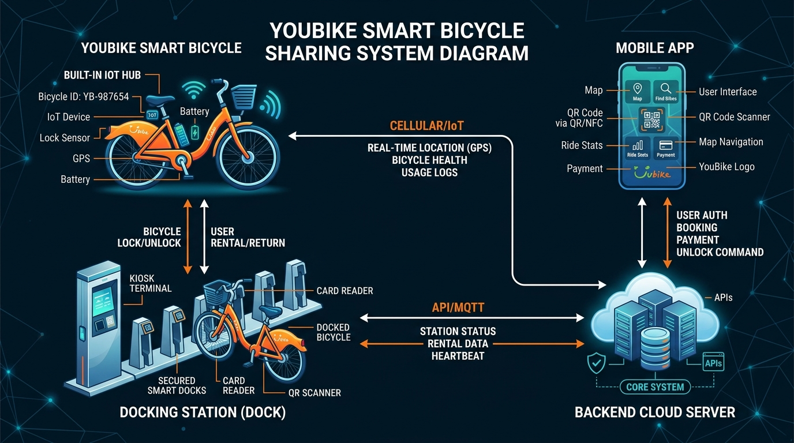

# 軟體工程導論 (Introduction to Software Engineering)

**講義大綱與核心概念**
> * **1.1 技術演進脈絡**：從機械化、數位革命到普及化人工智慧（Industry 1.0～4.0）。
> * **1.2 軟體工程起源與「軟體危機」**：1968 年 NATO Garmisch 會議為何宣告軟體開發必須從個人工藝走向工程紀律，以及三大歷史災難細節。
> * **1.3 軟體本質剖析**：軟體為何遠超過程式碼（程式、數據、SOP、文檔）以及軟體冰山陷阱。
> * **1.4 ISO 9126 品質模型**：6 大特徵與關鍵子屬性實務案例圖解。
> * **1.5 現代軟體多元樣貌**：從雲端 SaaS、行動應用、企業 ERP 到嵌入式物聯網與 AI 平台，以及 YouBike 等現代異質系統。
> * **1.6 何謂軟體工程？**：正式定義、約束與資源權衡天平、滿足約束的折衷決策、四大通用核心活動（Specification, Design, Validation, Evolution）。
> * **1.7 現代工具鏈與 AI 雙面刃**：新增 5 種現代工具、CI/CD 自動化流程與 AI 在生命週期各階段的效益與風險矩陣，以及 Vibe Coding 漫畫圖解。
> * **1.8 專業倫理、社會責任與欺騙性黑暗模式**：ACM/IEEE 倫理守則（8 大原則圖解）、重大歷史災難與 UI/UX 黑暗模式圖解。
> * **1.9 軟體工程常見問答 (FAQ)**：重新設計的 4 大核心問答。
> * **附錄：互動活動解答與詳細解析**：包含 7 個 CCQ 與情境分析解答。

[投影片連結：Ch1 軟體工程導論](https://docs.google.com/presentation/d/1CLQaKE9g9EQE0XWGd2yiA9TnyB8-H-qf/edit?usp=sharing&ouid=109022309423128079509&rtpof=true&sd=true)

---

## 1.1 技術演進脈絡：從機械化到普及化 AI

要理解軟體工程為何成為一門正式學科，必須先回顧過去兩個世紀人類生產力的演進歷程。軟體並非憑空誕生，而是歷經四次工業革命浪潮，逐步成為現代人類社會運轉的中樞神經。

*圖 1.1：四次工業革命歷程——生產力驅動力從人體肌肉、機械能量、數位邏輯逐步轉移至自主認知智慧。*

### 1.1.1 四大工業革命時代

1. **工業 1.0 —— 機械化時代（18 世紀末至 19 世紀中葉）**
   以蒸汽機與水力動力取代人體與勢力肌肉，工廠制度應運而生，深刻改變了紡織業、煤礦開採與交通運輸（蒸汽火車與輪船）。此時代科技純屬機械與物理範疇，完全沒有「軟體」的概念。

2. **工業 2.0 —— 大規模量產時代（19 世紀末至 20 世紀初）**
   電力、內燃機與亨利·福特的流水線裝配作業，推動了消費品、汽車與電器的標準化大規模生產。雖然電磁繼電器與電話網路奠定了自動通訊的早期基礎，但控制邏輯仍純粹由物理硬體電路硬焊決定。

3. **工業 3.0 —— 數位革命與軟體毀林（20 世紀中葉至末期）**
   半導體、微處理器與大型主機的發明引領人類進入數位時代。可程式化邏輯控制器 (PLC) 自動化了工業機台，個人電腦 (PC) 走入企業與家庭。在這一時期，**軟體正式獨立成為一門專業領域**：人們開始撰寫程式來控制硬體、處理金融數據與路由通訊封包。

4. **工業 4.0 —— 互聯、雲端與 AI 時代（21 世紀初至今）**
   虛實整合系統 (CPS)、物聯網 (IoT)、雲端運算與人工智慧深度融合。軟體不再只是輔助業務的工具，而是支撐醫療、交通、金融與國家治理的基礎骨幹。現代軟體具備高度互聯、自我調適與無所不在的特質。

---

> 💡💬 **課堂互動活動 —— 隨堂投票與討論**：
> * **投票**：檢視你每天使用的各項數位服務與裝置，你認為其中有多少比例屬於工業 3.0 確定性邏輯，又有多少比例屬於工業 4.0 的自適應 AI 聯網軟體？
> * **討論**：請列舉一個你認為急需進行「工業 4.0 軟體轉型」的傳統流程（例如：校園停車管理、急診檢傷分類、大眾運輸排班）。在轉型過程中會面臨哪些獨特的軟體工程挑戰？

---

## 1.2 軟體工程的起源與「軟體危機」

在計算機發展初期（1940～1950 年代），硬體極為昂貴且稀少，軟體僅被視為附屬於特定硬體的指令集。程式規模很小，通常由少數科學家以組合語言或機器碼編寫，開發過程猶如個人工藝手作。

然而，隨著 1960 年代硬體運算能力呈指數級提升、成本大幅下降，企業與國防機構開始委託開發超大型複雜系統——如軍事防空雷達 (SAGE)、民航訂位系統 (SABRE) 與太空船導航計算機。

*圖 1.2.1：1960 年代後期的軟體危機——專案嚴重超支、交付延宕、缺陷頻傳，且上線後難以維護。*

### 1.2.1 1960 年代後期的軟體危機

到了 1960 年代後期，軟體產業撞上了嚴重的技術高牆，史稱**軟體危機 (Software Crisis)**：
* **成本嚴重超支**：最終花費經常達到最初預算的 3 到 4 倍。
* **交付嚴重延宕**：專案比預期晚數年交付，甚至在完成前即遭腰斬廢棄。
* **品質缺陷頻傳**：系統頻繁當機、運算結果錯誤，甚至引發嚴重的公共安全隱患。
* **系統無法維護**：缺乏模組化架構與文件說明的程式碼，一旦修改便引發連鎖崩潰。

危機的核心根源在於：**將編寫程式碼視為孤立的手工藝做法，完全無法應對跨團隊、長週期、高複雜度的現代大型軟體系統**。

### 1.2.2 1968 年 NATO Garmisch 會議：學科的誕生

為了徹底解決此一危機，北約科學委員會於 **1968 年 10 月在德國加米施 (Garmisch)** 召開歷史性會議，匯聚了 50 位頂尖電腦科學家、業界主管與學者。

*圖 1.2.2：1968 年歷史性的 NATO 軟體工程會議，正式確立了「軟體工程」一詞，宣告將工程嚴謹度引入軟體開發。*

會議正式確立了 **軟體工程 (Software Engineering)** 這一術語，其核心目標是：推動軟體開發從隨意無序的手工編程，轉型為具備結構化方法論、形式化規格、成本估算、嚴格驗證與專案管理的正式工程學科。

### 1.2.3 軟體工程失敗的真實代價

缺乏工程紀律的後果絕不僅僅是金錢損失，更可能造成災難性的生命危害：

* **名古屋空難 (1994)**：在中華航空 140 號航班降落過程中，副駕駛不小心誤觸了重飛 (TO/GA) 模式。駕駛員試圖藉由將控制桿向前推以使飛機下降來手動蓋過 (override) 該模式。然而，自動駕駛系統仍然保持在重飛模式，並與駕駛員的手動輸入相抗衡，將水平安定面調整到最大的抬頭限制。由於軟體架構在這種特定模式下未將駕駛員的手動蓋過設為最優先，導致飛機失速墜毀，造成 264 人死亡。
* **火星氣候探測器 (1999)**：這艘價值 3.27 億美元的探測器在進入火星大氣層時墜毀。原因在於地面控制站軟體所產生的推進器效能數據使用的是英制單位磅力秒 ($lbf \cdot s$)，而太空船上的導航電腦預期的卻是公制單位牛頓秒 ($N \cdot s$)。由於軟體介面缺乏單位驗證，導致探測器軌道過低，在火星大氣層中因摩擦燃燒而毀滅。
* **阿利安 5 號火箭 501 航班 (1996)**：發射 37 秒後火箭自行引爆。失敗原因為慣性基準系統中的一個未處理軟體例外。一個表示水平速度的 64 位元浮點數被轉換成 16 位元有號整數。由於數值超過 32,767，導致了整數溢位。因為缺乏例外處理程序，主電腦與備份電腦均相繼當機，而匯流排上的診斷數據被誤判為飛行控制指令，最終觸發了自我毀滅程序。

---

> 💡🧠 **觀念檢驗題 (CCQ 1) —— 軟體工程會議的召開**：
> 
> *問題*：第一次軟體工程會議在何時召開？
> * A) 1928
> * B) 1968
> * C) 1948
> * D) 1988
> 
> [👉 前往附錄查看解答與詳細解析](#ccq-1--軟體工程會議的召開)

---

> 💡🧠 **觀念檢驗題 (CCQ 2) —— 軟體危機的本質**：
> 
> *問題*：為何 1968 年的軟體危機無法僅透過採購運算速度更快的超級電腦或擴充硬體記憶體來解決？
> * A) 危機是由 1960 年代後期的硬體製造延遲與矽晶片短缺所導致的。
> * B) 危機是管理系統複雜度的認知與組織失敗，更快的硬體只會放大這個問題。
> * C) 危機源於早期的程式語言缺乏基本的數學與計算功能。
> * D) 危機之所以發生是因為早期大型主機與現代的分散式雲端架構不相容。
> 
> [👉 前往附錄查看解答與詳細解析](#ccq-2--軟體危機的本質)

---

> 💡👥 **雙人分組活動 —— 真實世界中的軟體失效**：
> * 與同學兩兩一組，思考或在網路上搜尋一個本節未提到的真實軟體失效案例（例如：Knight Capital 交易軟體錯誤、Therac-25 醫療儀器漏洞，或 2024 年 CrowdStrike 系統當機事件）。
> * 討論：該失效背後的技術或流程根本原因是什麼？
> * 現代軟體工程實踐、測試方法論或設計規範，可以如何預防該失效的發生？

---

## 1.3 軟體本質剖析：超越原始碼的四大支柱

初學者常誤以為軟體就是原始程式碼 (Source Code) 的代名詞。然而在專業軟體工程中，原始碼僅僅是冰山浮出水面的一角。

*圖 1.3：專業軟體的解剖結構——由執行程式、資料資產、維運程序與架構文檔共同構成。*

### 1.3.1 IEEE 的軟體標準定義

IEEE 標準對軟體的正式定義為：
> **軟體 (Software)**：與計算機系統運作相關的電腦程式、程序、以及可能伴隨的相關文件與資料。

### 1.3.2 四大核心支柱：程式、資料、程序與文檔

根據此定義，專業軟體系統包含四大核心支柱：
1. **Programs（程式碼與二進制執行檔）**：以 Python、Java、C++ 或 TypeScript 撰寫、指示 CPU 執行的邏輯。
2. **Data & Schemas（資料與綱要）**：資料庫表格、配置檔案、初始化種子資料集與 AI 模型權重檔。
   * *真實世界案例*：在 2012 年，**Knight Capital Group** 因設定資料出錯而在 45 分鐘內損失了 4.4 億美元。根本原因在於其部署的設定檔中，一個不活躍的設定旗標被錯誤設為 "true"，啟動了新伺服器中殘存的過時廢棄程式碼，從而觸發了無限的重複交易迴圈。
3. **Operational Procedures（維運程序與 SOP）**：部署腳本、備份例程、災難復原演練守則與 CI/CD 自動化腳本。
   * *真實世界案例*：在 2017 年，**GitLab** 遭遇嚴重斷線，原因在於一名資料庫工程師因操作環境命名標示不清，意外刪除了 300GB 的生產資料庫而非測試資料庫。由於他們的備份程序未自動化且未定期驗證，導致五種備份機制全部失效，最終造成 18 小時服務中斷且永久遺失部分資料。
4. **Documentation（架構與規格文檔）**：架構決策記錄 (ADR)、OpenAPI/Swagger 介面規格書、需求規格書 (SRS) 與使用者手冊。
   * *真實世界案例*：惡名昭彰的 **Therac-25 癌症放射治療儀器（1985~1987 年）** 因軟體競態條件導致六名患者接受了過量輻射。製造商直接沿用了舊機型的程式碼，卻未留下內部安全假設的文件。此外，由於操作手冊缺乏對晦澀錯誤代碼（如 "Malfunction 54"）的說明，操作人員忽視了警訊並重複治療，最終造成患者重傷與死亡。

### 1.3.3 軟體冰山陷阱
許多軟體專案之所以失敗，是因為開發人員與專案經理掉入了只關注軟體冰山頂端——**程式原始碼**的陷阱中。他們僅以寫了多少行程式碼或交付了多少功能來衡量進度，卻忽略了資料庫遷移（資料）、CI/CD 部署管線與復原守則（程序）、以及系統設計與 API 規格（文檔）。缺乏這四大支柱中的任何一項，系統就稱不上是「專業軟體」，而只是一個無法順暢部署、難以維護且運作危險的脆弱程式。

誠如電腦科學家 Harold Abelson 名言：
> *「程式寫出來主要是給人閱讀的，順便給機器執行而已。」*

---

> 💡🧠 **觀念檢驗題 (CCQ 3) —— IEEE 軟體標準定義**：
> 
> *問題*：根據 IEEE 標準對軟體的正式定義，以下哪一項**不被視為**軟體的組成部分？
> * A) 可執行的電腦程式與原始程式碼檔案。
> * B) 系統資料庫綱要與組態設定檔案。
> * C) CPU 處理器硬體與物理記憶體單元。
> * D) 軟體的安裝說明與系統部署程序。
> 
> [👉 前往附錄查看解答與詳細解析](#ccq-3--ieee-軟體標準定義)

---

> 💡👥 **雙人分組活動 —— 實務中的軟體冰山**：
> * 與隔壁同學分組，挑選一項日常熱門服務：**Google Maps**、**Uber** 或 **Spotify**。
> * 兩人合作針對四大支柱（程式、資料、程序、文檔）各列出一項具體產出物。
> * **深入探討**：如果一個工程團隊遺失了所有部署腳本與資料庫綱要，他們能否單憑原始程式碼在產線上順利重建並維運業務？為什麼？

---

## 1.4 何謂「好」軟體？ISO 9126 品質模型

軟體品質具有多維度特性。國際標準組織制定了 **ISO/IEC 9126** 品質模型，將軟體品質劃分為 6 大特徵與多個可測試的子屬性。

*圖 1.4：ISO 9126 軟體品質 6 大特徵與關鍵子屬性完整架構圖解。*

### 1.4.1 ISO 9126 六大特徵與子屬性深度解析

#### 1. Functionality（功能性）
軟體滿足明確指定與隱含業務及技術需求的能力。
* **Suitability（適用性）**：系統是否提供符合預期任務的完整功能？（如電商支援購物車、折扣券與多幣別結帳）。
* **Accuracy（準確性）**：運算結果是否精確無誤？（如財務會計引擎計算扣稅額達零分位漂移）。
* **Interoperability（互操作性）**：能否與外部系統順暢交換數據？（如醫療系統透過標準 HL7/FHIR API 傳輸病歷）。
* **Security（資安性）**：能否防範未授權存取與攻擊？（如強制 MFA、RBAC 權限控管與 AES-256 資料庫加密）。

#### 2. Reliability（可靠性）
軟體在規定條件下與時間內維持規定效能水準的能力。
* **Maturity（成熟性）**：軟體因設計缺陷而引發失效的頻率有多低？
* **Fault Tolerance（容錯性）**：軟體能否在面臨執行期錯誤或第三方服務中斷時，不發生系統崩潰？
  * *實務案例*：若主要刷卡交易閘道逾時，結帳服務能捕捉例外，並立即改走備用信用卡交易閘道重試。
* **Recoverability（易回復性）**：當系統當機後，能否重新建立其運作狀態並復原遺失的資料？
  * *實務案例*：PostgreSQL 資料庫在無預警斷電重啟後，能在 30 秒內透過預寫式日誌 (WAL) 自動復原並確保交易一致性。
* **Reliability Compliance（可靠性遵循）**：是否符合規定的可靠性與可用性服務等級協議（例如：99.99% 的系統可用時間）。

#### 3. Usability（易用性）
使用者理解、學習、操作以及喜愛軟體所需耗費的精力。
* **Understandability（易理解性）**：新使用者能否輕易理解軟體如何運作、其功能如何組織？
* **Learnability（易學習性）**：使用者能否在短時間內學會操作此系統以執行其日常工作？
  * *實務案例*：新進護理人員只需觀看 15 分鐘的教學影片，即可學會如何在電子病歷 (EHR) App 中登錄患者生命徵象。
* **Operability（易操作性）**：使用者在不同維度下是否能順暢控制軟體（包括快捷鍵、螢幕閱讀器與符合 WCAG 2.1 網頁無障礙標準）？
* **Attractiveness（介面美觀性）**：介面是否視覺整潔、排列井然有序、符合美學且沒有雜亂的視覺資訊？

#### 4. Efficiency（效率性／效能）
軟體效能水準與所耗用之計算資源之間的關係。
* **Time Behavior（時間特性）**：系統在尖峰流量下的回應時間、延遲分佈與交易吞吐量表現為何？
  * *實務案例*：API 搜尋服務的回應時間，在 99% 的情況下皆小於 80 毫秒（p99 延遲 < 80ms）。
* **Resource Utilization（資源利用性）**：軟體在執行時對 CPU、記憶體、硬碟 I/O 以及網路頻寬的消耗效率為何？
  * *實務案例*：一項經高度優化的微服務在處理 10,000 個併發 WebSocket 連線時，所佔用的記憶體小於 250 MB。

#### 5. Maintainability（可維護性）
修改軟體所需的精力（包括臭蟲修正、效能調整與新功能擴充）。
* **Analyzability（可分析性）**：開發人員能否輕易檢查日誌、診斷軟體缺陷並找出根本原因？
  * *實務案例*：使用 OpenTelemetry 分散式追蹤與結構化 JSON 日誌，在數秒內精確找出跨服務呼叫中出錯的微服務節點。
* **Changeability（可修改性）**：開發人員是否能安全地實現程式碼修改，而不需要進行大規模重寫？
* **Stability（穩定性）**：在引入修改後，系統是否能抵抗意外的副作用或迴歸錯誤？
* **Testability（可測試性）**：程式碼庫是否能輕鬆地透過自動化單元測試、整合測試與迴歸測試套件進行檢驗？
  * *實務案例*：在設計程式時使用相依性注入 (Dependency Injection)，以便在自動化單元測試中輕鬆 Mock 資料庫連線。

#### 6. Portability（可攜性）
軟體從一個硬體、作業系統或雲端環境轉移到另一個環境的難易程度。
* **Adaptability（可適應性）**：軟體能否在不同的 OS 平台運行，而不需要修改程式碼？
  * *實務案例*：同一個 Node.js 後端程式在 Linux x86_64、macOS ARM64 與 Windows Server 上執行結果完全一致。
* **Installability（易安裝性）**：部署軟體到目標環境的簡易程度為何？
  * *實務案例*：藉由在終端機輸入 `docker compose up`，能在 60 秒內於本地端架構出完整的開發微服務環境。
* **Co-existence（共存性）**：該軟體能否與同主機上的其他獨立軟體和諧共存，且不發生相依性套件衝突？
* **Replaceability（易替換性）**：該元件能否輕易替換掉其他類似的元件（例如：藉由 ORM 介面，將資料庫從 MySQL 無痛切換成 PostgreSQL）？

---

> 💡🧠 **觀念檢驗題 (CCQ 4) —— ISO 9126 品質特徵**：
> 
> *問題*：以下哪一組屬性代表了 ISO 9126 模型所定義的六大主要品質特徵？
> * A) Functionality, Reliability, Usability, Efficiency, Maintainability, Portability.
> * B) Performance, Security, Scalability, Availability, Testability, Readability.
> * C) Accuracy, Correctness, Modularity, Reusability, Interoperability, Safety.
> * D) Simplicity, Flexibility, Robustness, Extensibility, Compatibility, Deployability.
> 
> [👉 前往附錄查看解答與詳細解析](#ccq-4--iso-9126-品質特徵)

---

> 💡🧠 **觀念檢驗題 (CCQ 5) —— 實務問題與品質因素對應**：
> 
> *問題*：以下哪一個選項正確將真實世界的軟體問題與其對應的 ISO 9126 品質特徵進行了配對？
> * A) 資料庫查詢需要 15 秒才能回傳結果 $\rightarrow$ Maintainability (Testability)
> * B) 當第三方 API 斷線時，系統發生崩潰 $\rightarrow$ Reliability (Fault Tolerance)
> * C) 由於程式碼緊密耦合，開發人員難以撰寫單元測試 $\rightarrow$ Portability (Adaptability)
> * D) 應用程式無法在新版本的 macOS 上運行 $\rightarrow$ Usability (Operability)
> 
> [👉 前往附錄查看解答與詳細解析](#ccq-5--實務問題與品質因素對應)

---

> 💡📊 **課堂互動活動 —— 品質權衡隨堂投票與討論**：
> * **情境**：在真實的工程世界中，受限於專案時程與資源，你無法在同一個軟體中將所有品質特徵最大化。
> * **投票**：請針對以下兩種類型的系統，挑選出最關鍵、不容妥協的 2 項 ISO 9126 品質特徵：
>   1. *醫療型自動胰島素注射控制器*
>   2. *爆紅的手機休閒小遊戲*
> * **討論**：為什麼在胰島素注射控制器中，為了搶快上線（Time to Market）而犧牲容錯性（Fault Tolerance）是極為災難性的決定；而在休閒小遊戲中，卻能為了快速推出新功能而容忍一些不影響核心遊玩的非關鍵臭蟲？在你的觀點中，有哪些主要因素或約束（例如：預算、開發者技能、時程壓力、頻繁變更的需求）會損害軟體品質，或使高品質難以達成？

---

## 1.5 現代軟體多元樣貌

軟體系統部署在極度多元的環境中，每一種環境都對系統架構、測試方法與維運條件提出了完全不同的要求。現代軟體系統已很少是單一形態的程式，相反地，它通常是由多種軟體形態混合而成的異質生態系統。

*圖 1.5：YouBike 智慧單車共享系統的異質架構示意圖。單一項真實服務融合了嵌入式軟體（車上 IoT 車機與智慧車柱）、行動應用程式（使用者 App）、網頁應用程式（官方網站）與企業後端系統（雲端伺服器與扣款後端）。*

### 1.5.1 關鍵應用領域

* **Web & SaaS 應用程式**：部置於雲端的分散式平台（如 Slack、Netflix），強調高可用性、彈性伸縮、微服務架構與無痛不停機部署。
* **行動應用程式 (Mobile Apps)**：專為觸控操作優化的 Native (iOS/Android) 或跨平台 (Flutter) App，需考量電力消耗與不穩定行動網路。
* **企業系統 (ERP/CRM)**：企業運作的命脈系統（如 SAP、Salesforce），高度重視複雜商務邏輯、資料一致性 (ACID 交易) 與嚴格資料治理。
* **嵌入式軟體與物聯網 (IoT)**：運行於醫療設備、汽車引擎控制器、智慧車柱上的即時韌體，運算資源極其受限，且通常不容許任何系統當機。
* **AI 與機器學習應用**：以資料為中心的系統，利用大型語言模型 (LLMs)、電腦視覺與推薦引擎，需要專門的 MLOps 自動化管線。
* **科學與 CAD 應用**：高運算效能的模擬套件（如 MATLAB、AutoCAD），極度要求浮點數運算的精確度與硬體顯示加速。

### 1.5.2 現代的異質系統
在當今時代，大規模的系統已很少能單靠一種軟體類別來涵蓋。它們通常是複雜的異質系統，將多個領域無縫縫合。例如，一台現代的**特斯拉智慧電動車**不只是嵌入式韌體——它融合了即時嵌入式軟體（煞車與動力控制）、邊緣 AI 系統（自動輔助駕駛視覺模型）、行動 App（車主遠端遙控手機 App）、雲端 SaaS（車輛遙測與 OTA 更新系統）以及企業 CRM（售後與維修服務平台）。成功的軟體工程必須協調這類跨領域系統的開發，平衡彼此衝突的限制與發布週期。

---

> 💡💬 **課堂互動活動 —— 系統分類與討論**：
> * 思考一台現代的 **智慧聯網電動車**。
> * 它涵蓋了本節所提到的哪些應用領域？
> * **討論**：為什麼這些不同的子系統，其軟體更新與部署週期會有巨大差異（例如：雲端娛樂系統可每天更新，但自動煞車控制韌體需要長達數月的測試才能更新）？

---

## 1.6 何謂軟體工程？定義、流程、約束與核心活動

我們不能只是加快打字速度或招募更多程式設計師嗎？為什麼我們需要「軟體工程」？

*圖 1.6.1：寫程式 (Coding) 與軟體工程 (Software Engineering) 的核心差異——寫程式著重於個人在單點時間內產出原始碼；軟體工程則是涵蓋多人協作、多個生命週期、受限於資源约束，並在漫長時間軸上持續維護系統演進的科學學科。*

### 軟體工程的正式定義

> **軟體工程 (Software Engineering)**：一門關於軟體生產所有階段的工程學科——從初始的需求規格書制定，直到系統上線後的維護與演進。

此定義包含兩個核心特徵：
1. **工程學科 (Engineering Discipline)**：工程師並不追求不計代價的完美技術，而是要在**有限資源與嚴格約束條件下，找出最合適的解決方案**。
2. **軟體流程所有階段 (All Aspects of Production)**：軟體開發並非僅限於寫程式。它是由一整套系統化的**軟體工程流程 (SE Process)** 所引導，該流程明確規範了專案的各項活動、角色分工、產出物件與品質檢查點。

---

### 1.6.1 約束管理與資源優化

工程的本質就是一場在約束條件下尋求資源最優解的平衡遊戲：

*圖 1.6.2：軟體工程的權衡天平——在有限的人力、技術與架構資源下，平衡專案範疇、時間、預算與品質。*

#### 1. 約束條件 (Constraints - 限制)
* **時間約束**：專案上線死線、市場搶灘窗口或合約規定的交付時程。
* **預算約束**：團隊開發薪資、雲端基礎設施開銷、第三方套件授權費。
* **技術約束**：必須相容的舊型資料庫、限定的手機 OS 版本、終端硬體的 CPU 限制。
* **法規約束**：法律強制的法規標準（如 GDPR 隱私法、HIPAA 醫療法規、PCI-DSS 金融支付安全）。

#### 2. 資源 (Resources - 資產)
* **人力資源**：開發人員、UI/UX 設計師、測試工程師、SRE 維運人員。
* **技術資產**：成熟的雲端基礎設施 (AWS/GCP)、現成的開源套件與自動化 CI/CD Pipeline。
* **領域知識**：團隊對於業務流程與架構模式的理解與開發經驗。

#### 案例研究：醫療新創公司 MVP 的上線挑戰
* **情境**：一家醫療科技新創公司需要在 6 個月內推出一款病患與醫生線上面診的視訊 App，且預算極其吃緊，僅有 8 萬美元。
* **工程權衡方案**：
  1. **範疇優先級控管**：將 Minimum Viable Product (MVP) 範圍限制在核心視訊與掛號功能；把複雜的保險給付系統挪到 Phase 2。
  2. **跨平台開發**：選用 **React Native** 或 **Flutter**，以單一程式碼庫同時產生 iOS 與 Android 版本，節省 40% 的前端人力。
  3. **託管式雲端後端**：採用現成符合 HIPAA 醫療級加密的安全託管服務 (如 Supabase/Firebase)，避免自行搭建與維護實體伺服器。
  4. **自動化 CI/CD**：設定 GitHub Actions，在每次程式碼提交時進行自動檢驗與單元測試，使小團隊在沒有專門 QA 部門的情況下仍能維持品質。

#### 為什麼不選擇技術上「完美」的方案？
在工程實務中，從純技術的角度來看「最完美」的架構，往往不是最終被採用的方案。從頭開始以原生 Swift 與 Kotlin 撰寫、搭配自建多區域備援微服務架構，在技術上可能最具擴充性與效能。然而，這套完美架構會因為嚴重超出 8 萬美元的預算與 6 個月的死線而被工程團隊否決。
工程的真諦在於尋找**滿意解 (Satisficing Solution)**——這是一個能透過權衡，在滿足所有限制的前提下「足夠好」的解決方案。選定的 MVP 架構或許存在效能折衷，但它卻是唯一能讓專案在時限與預算內存活並成功上線的正確工程解。

---

### 1.6.3 軟體工程流程的核心活動

不論開發團隊採用何種軟體流程模型（從早期的瀑布模型、疊代式的敏捷開發、到現代持續交付的 DevOps），其背後皆由**四大通用核心活動**所驅動：

*圖 1.6.3：軟體工程通用核心活動概念圖。Specification（需求規格）、Design & Implementation（設計與實現）、Validation（驗證與確認）、Evolution（演進與維護）是軟體生命週期中環環相扣的四大基礎核心活動。*

#### 1. Software Specification (軟體需求規格制定)
* 釐清利益關係人需求、商業約束與系統邊界，並形成正式的需求規格說明。
* *產出物*：需求規格說明書 (SRS)、附帶驗收條件的 User Stories。
* *忽視後果*：工程師開發出技術完美、但完全不符合使用者需求的系統。在產線修復需求錯誤的代價是前期的 100 倍。

#### 2. Software Design and Implementation (軟體設計與實現)
* 將抽象的需求規格轉換為可執行的具體軟體系統。
* *設計*：劃分系統架構層級、設計資料庫綱要、定義 API 合約、套用軟體設計模式。
* *實現*：撰寫高品質、模組化的程式原始碼，進行同儕代碼審查 (Code Review) 並配置執行環境。
* *產出物*：架構設計文件 (ADD)、UML 圖、資料庫 ERD、原始程式碼。
* *忽視後果*：產出難以維護、架構僵化、在尖峰流量下迅速崩潰的「義大利麵條程式」。

#### 3. Software Validation (軟體驗證與確認)
* 驗證系統是否符合技術規格（**Verification 驗證**：*「我們是否以正確的方法建構產品？」*）以及確認系統是否確實滿足客戶的業務需求（**Validation 確認**：*「我們是否建構了正確的產品？」*）。
* 包含單元測試、整合測試、系統負載測試、資安弱點掃描與使用者驗收測試 (UAT)。
* *產出物*：自動化測試套件 (JUnit, PyTest, Playwright)、CI 測試結果報告。
* *忽視後果*：系統上線後頻繁崩潰、資料遺失、或遭遇嚴重的資安威脅。

#### 4. Software Evolution (軟體演進與維護)
* 在軟體的整個營運生命週期中，因應新需求與環境變化進行持續修改與升級。
  * *糾正性*：修復產線錯誤。
  * *適應性*：升級以支援新作業系統、瀏覽器或雲端 API。
  * *完善性*：改善系統效能或新增使用者要求的功能。
  * *預防性*：重構過時程式碼，修補潛在安全漏洞。
* *產出物*：版本發布日誌 (Release Notes)、資料庫遷移腳本 (Migration Scripts)。
* *忽視後果*：軟體面臨「軟體老化 (Software Rot)」，技術債越積越高，最終系統徹底過時報廢。

---

> 💡🧠 **觀念檢驗題 (CCQ 6) —— 工程動作與核心活動配對**：
> 
> *問題*：以下哪一個配對正確將特定的軟體工程動作與其對應的通用核心活動進行了對應？
> * A) 進行利害關係人訪談以撰寫使用者故事 $\rightarrow$ Software Specification
> * B) 撰寫自動化單元測試以模擬資料庫回應 $\rightarrow$ Software Design & Implementation
> * C) 重構資料庫綱要以改善查詢速度 $\rightarrow$ Software Validation
> * D) 將第三方的付款 API 替換為新的金流閘道 $\rightarrow$ Software Specification
> 
> [👉 前往附錄查看解答與詳細解析](#ccq-6--工程動作與核心活動配對)

---

> 💡💬 **課堂互動活動 —— 互動式案例情境分析**：
> * **情境**：某新創團隊花了 6 個月，為一款社區生鮮送貨 App 開發了速度極快、安全無虞且功能強大的加密貨幣付款閘道。該軟體擁有 100% 的測試覆蓋率且在測試中從未當機。然而，上線後的數據分析顯示，有 0% 的社區長輩使用此功能，因為該地區的使用者習慣只使用現金支付與一般信用卡。
> * **問題**：這四大通用活動（Specification, Design, Validation, Evolution）中，哪一個活動失敗了？為什麼 100% 的測試覆蓋率無法挽救本案例的失敗？

---

### 1.6.4 軟體工程的多元維度：紀律、原則、方法與啟發式法則

軟體工程實踐是一個多層次的立體結構，我們可以將其拆解為四個重要維度：

*圖 1.6.4：軟體工程維度圖解——包含專業紀律、核心原則、流程方法論與啟發式準則（此處僅列出具代表性的範例）。*

* **專業紀律 (Disciplines)**：要求開發前的規格制定與系統設計、採用 API 介面優先設計、落實程式碼審查 (Code Review)、撰寫架構決策記錄 (ADR) 等。
* **Foundational Principles (基礎原則)**：軟體設計的理論根基，如 **Abstraction（抽象化）**、**Modularity（模組化）**、**Anticipation of Change（預測變更）**、**Open-Closed Principle（開閉原則）**等。
* **Process Methodologies (流程方法論)**：引導團隊開發運作的框架，如 Waterfall（瀑布模型）、Agile/Scrum（敏捷疊代）、Spiral（螺旋風險模型）、DevOps 自動化交付等。
* **Heuristics & Guidelines (啟發式法則與實務準則)**：前人總結出的實務設計準則，如 SOLID 物件導向設計原則、Clean Code 乾淨程式碼、DRY（Don't Repeat Yourself）、YAGNI（You Aren't Gonna Need It）等。

### 1.6.5 破解常見的軟體迷思

* **迷思 1：「我們的專案進度落後了，再招募 5 位工程師進來就能趕上時程。」**
  * **現實（布魯克斯法則 - Brooks's Law）**：在已經落後的軟體專案中加入人手，只會讓專案更落後。因為新人的加入會使團隊溝通管道呈現 $O(n^2)$ 指數級增長，且資深人員必須停下手邊工作去指導新人。
* **迷思 2：「軟體是虛擬且充滿彈性的，因此在開發後期修改需求非常便宜。」**
  * **現實**：後期修改需求會像骨牌般引發連鎖反應，迫使已完成的資料庫綱要、API 合約與測試程式全面重寫，其修改成本通常是前期的 100 倍。
* **迷思 3：「只要把程式外包給外部廠商，我們就可以高枕無憂等著收網。」**
  * **現實**：外包專案如果缺乏嚴格的技術管理、持續整合、明確的驗收準則與架構監督，最終交付的系統往往是一團無法運作、無法維護的災難。

---

> 💡🧠 **觀念檢驗題 (CCQ 7) —— 布魯克斯法則**：
> 
> *問題*：專案目前落後進度 3 週，距離預定上線日僅剩 2 週。專案經理決定緊急招募 4 名新工程師來加速開發。根據布魯克斯法則（Brooks's Law），最可能發生的結果為何？
> * A) 專案將會提早 1 週順利上線。
> * B) 專案將會面臨更嚴重的延遲，因為資深開發人員必須停下工作來培訓與協調新進人員。
> * C) 新進人員的加入對專案時程完全沒有任何影響。
> 
> [👉 前往附錄查看解答與詳細解析](#ccq-7--布魯克斯法則)

---

## 1.7 現代工具鏈與 AI 雙面刃

現代軟體工程高度依賴自動化工具鏈與人工智慧。

### 1.7.1 現代工程工具鏈
* **Version Control (Git)**：管理程式碼版本分支，支援 Pull Request 協作與程式碼審查。
* **現代 IDE（如 VS Code, IntelliJ）**：提供即時語法分析、重構輔助與整合除錯環境。
* **CI/CD 自動化管線 (GitHub Actions, GitLab CI)**：在每次提交程式時，自動執行編譯、單元測試、安全弱點掃描並進行容器化部署。
* **自動化測試套件**：單元測試（JUnit、PyTest）、整合測試以及端到端測試（Playwright、Cypress）。
* **可觀測性與 APM (OpenTelemetry, Sentry)**：收集系統維運指標、錯誤日誌與追蹤鏈路，即時捕捉產線異常。
* **容器化與編排 (Docker, Kubernetes)**：將應用程式及其依賴項封裝到隔離的容器中，在伺服器叢集上實現自動部署與彈性伸縮。
* **專案追蹤與敏捷管理 (Jira, Linear, GitHub Issues)**：管理團隊待辦事項，規劃衝刺看板，追蹤缺陷與功能開發進度。
* **靜態程式碼分析 (SonarQube, ESLint, Pylint)**：在不執行程式的情況下掃描原始碼，以偵測潛在臭蟲、程式碼異味與安全弱點。
* **API 開發與協作 (Postman, Insomnia)**：提供設計、Mock、測試、記錄並共享 RESTful、GraphQL 與 gRPC API 的整合環境。
* **基礎設施即程式碼 (IaC) (Terraform, Ansible, Pulumi)**：透過版本控制的設定檔來宣告與管理雲端資源，確保部署環境的完全可重複性。

---

### 1.7.2 AI 在軟體工程中的雙面刃效益與風險

Large Language Models (LLMs) 與 AI 代理程式正在徹底改變軟體開發，然而工程師必須清醒認識其在各階段的風險：

| 生命週期階段 | AI 帶來的效益 | AI 伴隨的風險與隱憂 |
|:---|:---|:---|
| **1. 需求與分析** | 快速產出 User Stories 初稿、提煉驗收條件 | 虛構（幻覺）不實約束、遺漏隱性的組織業務知識 |
| **2. 架構與設計** | 建議架構模式、自動草擬資料庫 ERD 綱要 | 過度設計、忽略系統延遲與安全隔離等 SLA 限制 |
| **3. 實現與編碼** | 自動補齊程式碼、加速樣板程式代碼產生 | **「Vibe Coding」** 陷阱、引入安全性漏洞、授權爭議 |
| **4. 測試與 QA** | 自動生成單元測試案例、提供邊界測試數據 | **「迴音室測試」**（測試程式只在驗證 AI 出錯的程式碼） |
| **5. 演進與維護** | 自動解讀遺留代碼、撰寫 API 規格文檔 | 自動重構時引入隱性迴歸臭蟲 (Regression Bugs) |

---

*圖 1.7：幽默漫畫圖解 "Vibe Coding" 陷阱——完全依賴 AI 產生程式碼，只看表面測試通過就按下部署，忽略了程式碼背後的架構完整性與安全性，最終導致生產環境系統崩潰。*

---

> 💡📊 **隨堂投票與討論 —— 「Vibe Coding」的工程挑戰**：
> * **投票**：當你使用 AI 程式助理（如 Copilot 或 ChatGPT）時，你在按下 Commit 提交前，有多少比例會逐行閱讀並完全理解它所產生的每一行程式碼？（1: 每次都逐行看懂 | 2: 大部分時候會看 | 3: 很少看 | 4: 從來不看，能動就好）
> * **討論**：假設 AI 幫你寫了一段高複雜度的非同步資料庫處理邏輯，且順利通過了本地端 2 項單元測試，但你其實看不懂其內部原理。在軟體工程紀律下，你是否應該直接將其 Merge 到正式分支？你該採取哪些步驟來驗證其安全？

---

## 1.8 專業倫理、社會責任與欺騙性黑暗模式

由於軟體深深控制著現代人類的生活（從醫療儀器、飛機飛控系統到銀行金融與投票系統），軟體工程師對社會背負著重大的倫理責任。

*圖 1.8.1：ACM/IEEE 軟體工程倫理守則的 8 大基礎支柱，規範了專業工程人員應盡的社會責任。*

### 1.8.1 ACM/IEEE 倫理守則：8 大核心原則

1. **Public（公眾）**：軟體工程師應以公眾利益為最高指導原則，優先保障公眾安全、健康與福祉。
2. **Client and Employer（客戶與雇主）**：在符合公眾利益的前提下，維護客戶與雇主的最佳權益與隱私。
3. **Product（產品）**：確保交付的軟體產品達到專業的最高安全、可靠與維護標準。
4. **Judgment（判斷）**：保持專業評估的獨立與完整性，拒絕簽署或背書不實的技術宣稱。
5. **Management（管理）**：推動符合倫理的開發管理，提供真實時程估算，拒絕不合理壓榨。
6. **Profession（專業）**：藉由分享知識、參與同儕審查與持續學習，維護軟體工程的聲譽與誠信。
7. **Colleagues（同事）**：對同事公平客氣，營造互助與正面建設性回饋的團隊文化。
8. **Self（自身）**：終身學習，提升專業技術能力，並落實道德的開發實踐。

---

### 1.8.2 當工程倫理失效時：真實世界的教訓

* **福斯汽車「柴油門」事件 (2015)**：軟體工程師受命編寫了一段特殊的引擎管理軟體，專門用來偵測車輛是否正在實驗室中接受排氣檢測，並在檢測時暫時降低有毒的氮氧化物 ($NO_x$) 排放量。然而在實際道路行駛時，車輛的排放量卻高達法定上限的 40 倍。這項蓄意的倫理違規最終導致數百億美元罰款、主管入獄以及嚴重的環境污染。
* **劍橋分析數據醜聞 (2018)**：工程人員協助不正當地收集並濫用數千萬社交媒體使用者的隱私數據，以進行精準政治宣傳操弄，此案例揭示了「預防性隱私設計 (Privacy by Design)」的重要性。
* **計劃性報廢 (Planned Obsolescence)**：刻意在作業系統更新中加入限速程式，使舊型硬體執行效能大幅降低，以逼迫消費者購買新型號的硬體。

---

### 1.8.3 UI/UX 設計中的欺騙性「黑暗模式 (Dark Patterns)」

**黑暗模式 (Dark Pattern)** 是指介面設計師蓄意設計的惡意使用者介面，用來誘導、欺騙使用者進行其本意並不想做的行為——例如訂購不需要的保險、訂閱每月扣款服務、或交出個人隱私數據。

*圖 1.8.2：黑白四格漫畫圖解 UI/UX 常見欺騙性黑暗模式——1. 蟑螂屋 (Roach Motel)、2. 誘導式確認 (Confirmshaming)、3. 虛假緊急 (Fake Urgency)、以及 4. 悄悄加入購物車 (Sneak into Basket)。*

#### 常見黑暗模式類型：
1. **蟑螂屋 (Roach Motel)**：註冊訂閱只需按一個鍵；但取消訂閱卻需要打電話給客服、填寫繁雜問卷、或在迷宮般的設定選單中尋找隱藏的連結。
2. **誘導式確認 (Confirmshaming)**：將拒絕按鈕的文字設計得具有羞辱性或愧疚感（如拒絕訂閱的按鈕寫著：*「不，謝謝，我討厭省錢」*或*「我不關心受虐動物的死活」*）。
3. **悄悄塞入購物車 (Sneak into Basket)**：在結帳流程中，自動預先勾選加購商品（如旅遊平安險、快速通關卡），若使用者不仔細取消勾選就會一起被刷卡結帳。
4. **虛假緊急與製造稀缺 (Fake Urgency)**：畫面上出現虛假的倒數計時器（*「此特價剩餘 2 分鐘！」*）或不實的搶購資訊（*「有 34 人正在瀏覽此房間！」*）以製造焦慮迫使下單。

> **倫理工程師的職責**：專業軟體工程師應拒絕實作任何欺騙性黑暗模式，並在團隊中積極倡導誠實、透明、尊重使用者的設計實踐。

---

> 💡🕵️ **課堂互動活動 —— 黑暗模式偵探**：
> * **挑戰**：回想你最近在使用哪些 App 或網站時，曾遇過哪種類型的黑暗模式（如蟑螂屋、誘導式確認或悄悄塞入商品）？
> * **分析**：這項惡意設計違反了 ACM/IEEE 倫理守則中的哪一條原則？
> * **重新設計**：如果由你主導，你會如何重新設計該操作流程，使其既符合商業轉換率，又尊重使用者的自主權？

---

## 1.9 軟體工程常見問答 (FAQ)

**Q1：寫程式與軟體工程到底有何不同？**
* **回答**：寫程式（Programming）主要是個別開發人員撰寫程式碼來解決特定的特定問題。而軟體工程（Software Engineering）是一門系統性的工程學門，涵蓋了軟體生命週期的所有階段。它著重於多人協作、在有限的資源與預算（時程、金錢、技術法規）約束下妥協出合適的解決方案，保障軟體的品質指標（如可靠性、可維護性、易用性），並為系統長期的演進進行規劃。如同電腦科學家 Titus Winters 所言：「軟體工程是融入了時間軸的寫程式實踐。」

**Q2：為什麼軟體專案即便程式碼完全正確且測試覆蓋率 100% 仍會面臨失敗？**
* **回答**：因為專業的軟體包含四大核心支柱：程式、資料、程序、與文檔。一個專案很容易因為程式以外的其他三項非程式支柱出錯而宣告失敗——例如設定資料出錯（如 Knight Capital Group 的 4.4 億美元交易迴圈）、未自動化或未測試復原程序（如 GitLab 資料庫誤刪事件），或是缺乏安全操作文件的再利用程式碼（如 Therac-25 輻射超標事件）。此外，若**需求規格制定（Specification）**階段失敗，團隊會開發出完全不符合利害關係人實際需求的系統：這屬於「驗證了正確程式碼，卻確認錯了產品需求」。

**Q3：軟體工程中的「滿意解（Satisficing Solution）」與「最優解（Optimized Solution）」有何區別？**
* **回答**：在真實的軟體工程中，專案必須受到時間、預算與技術的硬約束。技術上的「最優解」（例如為小專案自建高度分散式備援微服務，並用 Swift/Kotlin 原生雙版本開發）往往因開發時間太長、費用太昂貴而被否決。工程的真諦在於尋找**滿意解**——這是一個經過妥協後，在所有約束邊界內「足夠好」的方案。正確的工程決策並非盲目追求程式技術上的完美，而是要交付最符合專案資源與限制約束的系統。

**Q4：AI 程式助理帶來的「Vibe Coding」風險是什麼？開發團隊該如何防範？**
* **回答**：「Vibe Coding（憑感覺寫程式）」是指開發人員未深入理解程式架構、邊界條件與安全隱患，便盲目採用 AI 產生的程式碼。這會帶來邏輯漏洞、隱性安全缺陷、授權合規風險，並容易產生「迴音室測試」——即測試案例只是用來自我驗證 AI 寫出的錯誤邏輯，而非依據需求規格進行驗證。防範之道在於：落實嚴格的程式碼審查 (Code Review)、在請 AI 寫程式前依據獨立規格先撰寫測試套件、並堅持將 AI 產生的程式碼視為未經驗證的初稿，必須經過專業工程師的審查與測試驗證後才能上線。

---

## 附錄：互動活動解答與詳細解析

<!-- id: ase-ch01-ccq1 -->
### CCQ 1 —— 軟體工程會議的召開

* **正確答案**：**B** (1968)
* **詳細解析**：北約科學委員會於 1968 年 10 月在德國加米施召開了歷史性會議，正式確立了「軟體工程」一詞，這被公認為軟體工程作為一門正式學科的起點。
* [⬆ 返回 Section 1.2](#12-軟體工程的起源與軟體危機)

[課堂互動](https://nlhsueh.github.io/nickedupocket/#/student/ase-ch01-ccq1)

---

<!-- id: ase-ch01-ccq2 -->
### CCQ 2 —— 軟體危機的本質

* **正確答案**：**B** (危機本質上是人類心智面對架構複雜度、跨人溝通成本與缺乏規範的認知危機，更快的硬體只會放大問題規模)
* **詳細解析**：增加硬體效能只會讓組織有信心去構想出更大規模、更複雜的系統。然而，由於開發人員當時仍在使用隨意、無序的手工編程做法，龐大的程式庫迅速超出了人類的心智控制極限。運算速度再快的 CPU，也無法解決模糊的需求規格、錯綜複雜的麵條程式依賴、或是團隊內部溝通失效等根本問題。
* [⬆ 返回 Section 1.2](#12-軟體工程的起源與軟體危機)

[課堂互動](https://nlhsueh.github.io/nickedupocket/#/student/ase-ch01-ccq2)

---

<!-- id: ase-ch01-ccq3 -->
### CCQ 3 —— IEEE 軟體標準定義

* **正確答案**：**C** (CPU 處理器硬體與物理記憶體單元)
* **詳細解析**：IEEE 標準明確將軟體定義為電腦程式、程序、以及可能伴隨的文件與資料。CPU 硬體與記憶體單元屬於硬體（Hardware）範疇，是用來執行軟體的物理媒介，不屬於軟體本身的組成元件。
* [⬆ 返回 Section 1.3.1](#131-ieee-的軟體標準定義)

[課堂互動](https://nlhsueh.github.io/nickedupocket/#/student/ase-ch01-ccq3)

---

<!-- id: ase-ch01-ccq4 -->
### CCQ 4 —— ISO 9126 品質特徵

* **正確答案**：**A** (Functionality, Reliability, Usability, Efficiency, Maintainability, Portability.)
* **詳細解析**：ISO 9126 標準明確規範了軟體品質的這六大主要特徵。其他如效能 (Performance)、資安 (Security) 與可用性 (Availability) 則是這些主要特徵底下的子屬性特徵（如資安屬於功能性，可用性屬於可靠性）。
* [⬆ 返回 Section 1.4](#14-何謂好軟體iso-9126-品質模型)

[課堂互動](https://nlhsueh.github.io/nickedupocket/#/student/ase-ch01-ccq4)

---

<!-- id: ase-ch01-ccq5 -->
### CCQ 5 —— 實務問題與品質因素對應

* **正確答案**：**B** (當第三方 API 斷線時，系統發生崩潰 $\rightarrow$ Reliability (Fault Tolerance))
* **詳細解析**：
  * **B** 正確：系統在面臨外部第三方 API 故障時不崩潰、能妥善處理例外並維持基本運作，這正是**可靠性**中的**容錯性 (Fault Tolerance)** 子特徵的定義。
  * **A** 錯誤：資料庫查詢耗時 10 餘秒屬於效能（效率性 - Time Behavior）問題。
  * **C** 錯誤：難以撰寫單元測試屬於可維護性 (Testability) 範疇。
  * **D** 錯誤：無法在特定 OS 上執行屬於可攜性 (Adaptability) 問題。
* [⬆ 返回 Section 1.4](#14-何謂好軟體iso-9126-品質模型)

[課堂互動](https://nlhsueh.github.io/nickedupocket/#/student/ase-ch01-ccq5)

---

<!-- id: ase-ch01-ccq6 -->
### CCQ 6 —— 工程動作與核心活動配對

* **正確答案**：**A** (進行利害關係人訪談以撰寫使用者故事 $\rightarrow$ Software Specification)
* **詳細解析**：
  * **A** 正確：透過與利害關係人進行訪談來釐清需求並撰寫成使用者故事，是「需求規格制定 (Specification)」活動的核心工作。
  * **B** 錯誤：撰寫測試程式屬於「驗證與確認 (Validation)」活動，而非設計與實現。
  * **C** 錯誤：重構資料庫綱要以改善查詢速度屬於軟體在生命週期中的「維護與演進 (Evolution)」活動。
  * **D** 錯誤：實作並替換 API 閘道屬於「設計與實現 (Design & Implementation)」活動。
* [⬆ 返回 Section 1.6.3](#163-軟體工程流程的核心活動)

[課堂互動](https://nlhsueh.github.io/nickedupocket/#/student/ase-ch01-ccq6)

---

### 課堂活動情境分析 —— 哪一項活動失敗了？
* **正確答案**：**Software Specification (需求規格制定)** 失敗了。
* **詳細解析**：該團隊達成了 100% 的測試覆蓋率與完美的運作時間，這代表他們做好了「驗證 (Verification)」——確保「產品被正確地建造出來了」。然而，他們卻做錯了「確認 (Validation)」——沒有「建構出正確的產品」，因為他們完全建構出一個社區長輩根本不需要、也無法使用（沒有使用場景）的支付閘道。這證明了：如果不進行前期的需求探索與利益關係人溝通，即便後面實現與測試做得再完美，也是在用高昂的開發成本建造一個無用的廢物。測試是無法彌補需求規格制定的失效。
* [⬆ 返回 Section 1.6.3](#163-軟體工程流程的核心活動)

---

<!-- id: ase-ch01-ccq7 -->
### CCQ 7 —— 布魯克斯法則

* **正確答案**：**B** (專案將會面臨更嚴重的延遲，因為資深開發人員必須停下工作來培訓與協調新進人員)
* **詳細解析**：布魯克斯（Frederick Brooks）在其名著《人月神話》中指出，軟體開發是高度複雜的腦力工作，並不能像挖土溝那樣簡單地透過增加人手來等比例縮短時間。當新進人員加入時，資深工程師必須暫停開發工作以協助其 onboard，且團隊中人與人之間的溝通管道數量會呈現 $\frac{n(n-1)}{2}$ 的二次方攀升。這使得落後的專案引入新人只會導致專案更為延遲。
* [⬆ 返回 Section 1.6.5](#165-破解常見的軟體迷思)

[課堂互動](https://nlhsueh.github.io/nickedupocket/#/student/ase-ch01-ccq7)

---

## 參考文獻與延伸閱讀

* Sommerville, Ian. *Software Engineering* (10th Edition). Pearson. [Official Website](https://software-engineering-book.com/)
* Brooks, Frederick P. *The Mythical Man-Month: Essays on Software Engineering*. Addison-Wesley.
* ISO/IEC 9126-1:2001. *Software engineering — Product quality — Part 1: Quality model*.
* ACM/IEEE Joint Task Force on Software Engineering Ethics and Professional Practices. *Software Engineering Code of Ethics*. [IEEE CS](https://www.computer.org/education/code-of-ethics)
* Brignull, Harry. *Deceptive Patterns: Exposing the Tricks Tech Companies Use to Control You*.
