# Software Engineering

### Lecture 5d: Generative AI Adoption in Software Engineering

**Prof. Nien-Lin Hsueh**
Department of Information Engineering and Computer Science
Feng Chia University

---

## Focus Questions

* What factors influence software developers in deciding to adopt Generative AI (GenAI) and Large Language Models (LLMs)?
* How does the **Human-AI Collaboration and Adaptation Framework (HACAF)** explain GenAI adoption dynamics?
* Why is **workflow compatibility** more critical to adoption than perceived utility or individual innovativeness?
* How can organizations strategically implement and govern GenAI tools in their engineering teams?
* How should GenAI tool providers design their systems to better fit the needs of developers?

---

## Navigating GenAI Adoption: Core Context

> "The integration of AI not only reduces the time commitment for coding tasks but also enhances the overall efficiency and effectiveness of the software development process. Nonetheless, despite the prospective advantages, the incorporation of language models appears to be intricate and fraught with challenges."
> — *Daniel Russo (TOSEM, 2024)*

* **Disruptive Innovation:**
  * LLM-powered tools (e.g., GitHub Copilot, ChatGPT) represent a major disruption.
  * Promise productivity gains of **20% to 45%** across refactoring, debugging, and drafting code.
  * However, some evidence suggests a decline in usage after initial experimentation due to a lack of alignment with developer tasks.

---

## Research Methodology

The paper applies a **convergent mixed-methods approach** combining qualitative and quantitative phases:

1. **Qualitative Phase ($N=100$):**
   * Conducted a questionnaire survey with 100 professional software engineers.
   * Coded responses using the **Gioia Methodology** to discover 1st-order concepts, 2nd-order themes, and aggregate dimensions.
   * Result: Formulated the preliminary **HACAF** theoretical model.
2. **Quantitative Phase ($N=184$):**
   * Collected survey data from 184 validated professional software engineers.
   * Employed **PLS-SEM (Partial Least Squares-Structural Equation Modeling)** and **IPMA (Importance-Performance Map Analysis)** to validate model relationships.

---

## Underpinning Theoretical Frameworks

To capture the complex levels of technology adaptation, HACAF adapts constructs from three established frameworks:

* **Technology Acceptance Model (TAM):**
  * Evaluates individual-level attitudes: *Perceived Usefulness (PU)* and *Perceived Ease of Use (PEOU)*.
* **Diffusion of Innovation Theory (DOI):**
  * Evaluates technology-level traits: *Compatibility Factors* and *Complexity/Relative Advantage*.
* **Social Cognitive Theory (SCT) & UTAUT:**
  * Evaluates social-level dynamics: *Social Influence*, *Computer Self-Efficacy*, and facilitating *Environmental Factors* (organizational support).

---

## Qualitative Findings: Dimensions and Themes

The Gioia analysis of the $N=100$ qualitative survey revealed key dimensions:

* **Perceived Usefulness (TAM):** Efficiency improvement (boilerplate code generation, faster code drafting), task-specific help (regex, script writing), and as a complementary tool.
* **Perceived Ease of Use (TAM):** Driven by prior experience, UI design, intuitiveness, and task complexity.
* **Compatibility (DOI):** Ease of integration into existing development workflows and similarity to current practices.
* **Complexity / Barriers (DOI):** Data security/privacy, reliance/complacency, code quality concerns, and fear of skill degradation.
* **Relative Advantage (DOI):** Time efficiency, code quality, user experience, learning and skill development, customization.
* **Environmental Factors (SCT):** Organizational stances ranging from highly supportive (proactive training) to completely discouraging (outright bans).

---

## Human-AI Collaboration and Adaptation Framework (HACAF)

HACAF models the relationships between perceptions, compatibility, social influence, personal/environmental traits, and intention to adopt GenAI:

* **Perceptions about the Technology (PT):** Usefulness, ease of use, and relative advantage.
* **Compatibility Factors (CF):** Work practice alignment, system integration, and workflow fit.
* **Social Factors (SF):** Peer influence, professional image, and developer self-efficacy.
* **Personal and Environmental Factors (PEF):** Developer innovativeness and organizational facilitating conditions.
* **Intention to Use (IU):** Intention and likelihood of adopting GenAI.

---

## HACAF Hypotheses Map

The structural relationships hypothesized within HACAF:

* **H1:** Positive Perceptions (PT) $\rightarrow$ Intention to Use (IU).
* **H2:** Positive Perceptions (PT) $\rightarrow$ Compatibility Factors (CF).
* **H3:** Enhanced Compatibility (CF) $\rightarrow$ Intention to Use (IU).
* **H4:** Positive Perceptions (PT) $\rightarrow$ Social Factors (SF).
* **H5:** Social Factors (SF) $\rightarrow$ Intention to Use (IU).
* **H6:** Personal & Environmental Factors (PEF) $\rightarrow$ Intention to Use (IU) (Direct effect).
* **H7:** Personal & Environmental Factors (PEF) $\rightarrow$ Perceptions about the Technology (PT).

---

## The HACAF Validation Model

  

---

## Demographics of Validated Sample ($N=184$)

The quantitative survey targeted validated professionals across 27 countries:

* **Geography:** UK (24%), South Africa (13%), Poland (11%), Germany (11%), USA (7%).
* **Gender:** 80% Male, 18% Female, 1% Non-binary, 1% undisclosed.
* **Work Tenure:** Median experience of **3 years** (1–5 years: 68%, 6–15 years: 22%, 16–30 years: 8%, >30 years: 3%).
* **Professional Roles:**
  * Software Developers / Engineers: **66%**
  * Data Analysts / Scientists: **12%**
  * Leadership (Team Leads, CIOs): **8%**
  * QA / Testers: **6%**
  * DevOps / Infrastructure: **3%**
  * Architects & UI/UX: **4%**

---

## Quantitative Validation Results (PLS-SEM)

The path coefficient analysis yielded surprising results, upending classical TAM assumptions:

| Hypothesis | Path Relation        | Coefficient ($\beta$) | T-Statistic | p-Value   | Result              |
| :-----------| :---------------------| :----------------------| :------------| :----------| :--------------------|
| **H1**     | PT $\rightarrow$ IU  | 0.155                 | 1.271       | 0.204     | **Not Supported**   |
| **H2**     | PT $\rightarrow$ CF  | **0.766**             | **16.405**  | **0.000** | **Supported** (***) |
| **H3**     | CF $\rightarrow$ IU  | **0.536**             | **5.936**   | **0.000** | **Supported** (***) |
| **H4**     | PT $\rightarrow$ SF  | **0.405**             | **5.346**   | **0.000** | **Supported** (***) |
| **H5**     | SF $\rightarrow$ IU  | 0.087                 | 1.373       | 0.170     | **Not Supported**   |
| **H6**     | PEF $\rightarrow$ IU | -0.004                | 0.064       | 0.949     | **Not Supported**   |
| **H7**     | PEF $\rightarrow$ PT | **0.313**             | **4.313**   | **0.000** | **Supported** (***) |

*(***) denotes $p < 0.001$.

---

## Key Insight: The Primacy of Compatibility

The quantitative results highlight a critical shift in how developers adopt AI tools:

* **Utility Alone is Insufficient (H1 Rejected):**
  * Positive perceptions of ease of use and usefulness do **not** directly drive adoption.
  * Instead, perceptions work exclusively *through* workflow compatibility (H2 & H3).
* **Workflow Compatibility is the Ultimate Driver:**
  * Compatibility Factors (CF) explain almost single-handedly the intention to adopt AI, showing a very high **$R^2$ of 58.7%**.
  * Total variance explained in Intention to Use (IU) is **48.9%**.
* **Social and Individual Traits Play a Supporting Role Only:**
  * Social factors (SF) and Personal innovativeness (PEF) do **not** directly drive adoption (H5 and H6 Rejected).
  * Personal innovativeness and organizational support (PEF) only act as facilitators to improve general perceptions (H7).

---

## Practical Implications: Tool Design Guidelines

To promote successful adoption, AI tool developers should shift from pure "feature building" to "contextual workflow integration":

* **User-Centric Workflow Integration:**
  * AI must fit seamlessly inside the developer's IDE and existing deployment chains. Avoid tools that require changing context or switching platforms.
* **Explainability & Transparency:**
  * Provide mechanisms that explain *how* the AI generated a specific code snippet or architectural design. This builds developer trust and facilitates code verification.
* **Calibration & Customization:**
  * Allow developers to fine-tune AI suggestions based on project-specific rules, internal APIs, and code styling patterns.
* **Symbiotic Feedback Loops:**
  * Establish real-time workspaces where developer adjustments iteratively retrain and guide the local AI model.

---

## Practical Implications: Organizational Strategies

For engineering managers, GenAI rollout requires structuring the operational environment:

* **Workflow-Fit Evaluations & Pilot Tests:**
  * Evaluate AI tools based on workflow compatibility rather than theoretical feature lists. Run pilot tests with 1-5 projects to measure actual developer integration.
* **Tailored Training Programs:**
  * Establish training modules focusing on *collaborative prompt engineering* and *workflows integration*, rather than just demonstrating tool capabilities.
* **Risk & Vulnerability Management:**
  * Explicitly address data privacy (avoiding code leakage into public models) and security vulnerabilities in generated code through periodic code audits.
* **Iterative Feedback Loops:**
  * Gather continuous feedback from developers to refine organizational usage guidelines, licensing, and access permissions.

---

## Concept Check Question 1

  

According to the PLS-SEM validation of the HACAF model, which factor is the **primary direct driver** of a developer's Intention to Use (IU) Generative AI tools?

* **A.** Perceptions about the Technology (PT)
* **B.** Social Factors (SF)
* **C.** Compatibility Factors (CF)
* **D.** Personal and Environmental Factors (PEF)

  

  

    
  

---

## Concept Check Question 1: Answer

  

**Correct Answer: C**

* **Explanation:**
  * **Compatibility Factors (CF)** is the primary direct driver of Intention to Use, with a path coefficient of 0.536 and explaining the adoption with an $R^2$ of 58.7%.
  * Perceptions about the Technology (PT) does **not** directly drive IU (H1 was rejected); it only influences IU indirectly *through* Compatibility Factors.
  * Social Factors (SF) and Personal/Environmental Factors (PEF) also had non-significant direct relationships with Intention to Use.

  

  

    
  

---

## Concept Check Question 2

  

What research methodology did Daniel Russo use in the qualitative phase of the study to analyze questionnaire data from 100 software engineers?

* **A.** Quantitative Structural Equation Modeling
* **B.** Grounded Theory using the Gioia Methodology
* **C.** Importance-Performance Map Analysis
* **D.** Literature Review Meta-Analysis

  

  

    
  

---

## Concept Check Question 2: Answer

  

**Correct Answer: B**

* **Explanation:**
  * The qualitative questionnaire survey with 100 software engineers was analyzed using the **Gioia Methodology**.
  * The Gioia methodology is a systematic approach to qualitative analysis that groups raw data (in vivo codes) into 1st-order concepts, 2nd-order themes, and aggregate dimensions to generate theoretical models.
  * Structural Equation Modeling and Importance-Performance Map Analysis were used in the *quantitative validation* phase ($N=184$).

  

  

    
  

---

## Concept Check Question 3

  

What does the rejection of Hypothesis H1 (PT $\rightarrow$ IU) imply for organizations introducing GenAI tools to developers?

* **A.** Developers will never adopt GenAI tools under any circumstances.
* **B.** Introducing high-utility tools is sufficient to guarantee immediate adoption.
* **C.** Social pressure from managers is the only way to enforce tool adoption.
* **D.** Simply promoting a tool's usefulness is insufficient; it must be demonstrably compatible with existing workflows.

  

  

    
  

---

## Concept Check Question 3: Answer

  

**Correct Answer: D**

* **Explanation:**
  * Since H1 (PT $\rightarrow$ IU) was rejected, positive perceptions of utility and ease of use alone **do not** catalyze adoption.
  * The tool must align with the developer's actual workflow (CF) to be adopted.
  * Therefore, organizations should focus on how well the tool integrates into current development, testing, and deployment workflows, rather than merely marketing the tool's capabilities.

  

  

    
  

---

## References & Resources

* **Daniel Russo (2024)**
  * *Navigating the Complexity of Generative AI Adoption in Software Engineering.*
  * Published in: **ACM Transactions on Software Engineering and Methodology (TOSEM)**, Vol. 33, No. 5.
  * DOI: [https://doi.org/10.1145/3652154](https://doi.org/10.1145/3652154)
* **Replication Package:**
  * Full dataset, measurement model setups, and PLS-SEM configurations:
  * Zenodo: [https://doi.org/10.5281/zenodo.8124332](https://doi.org/10.5281/zenodo.8124332)
