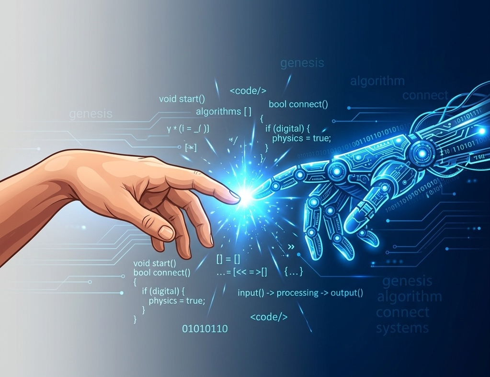
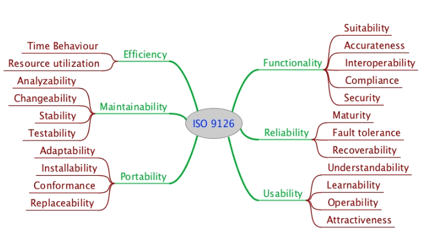
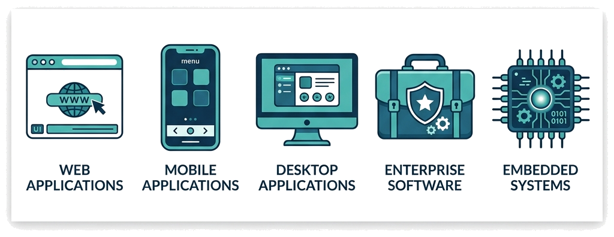
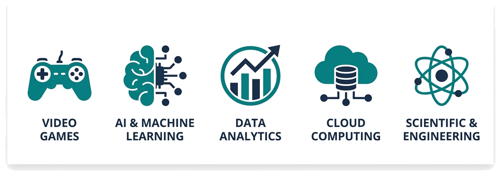
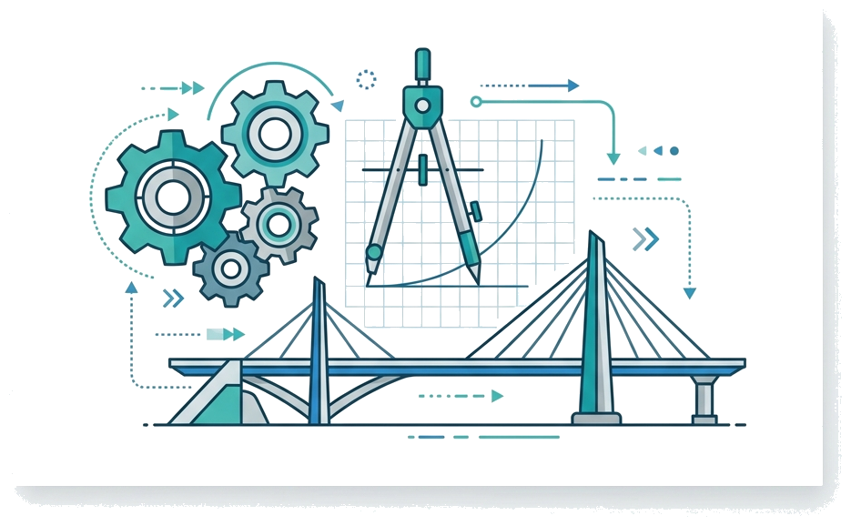
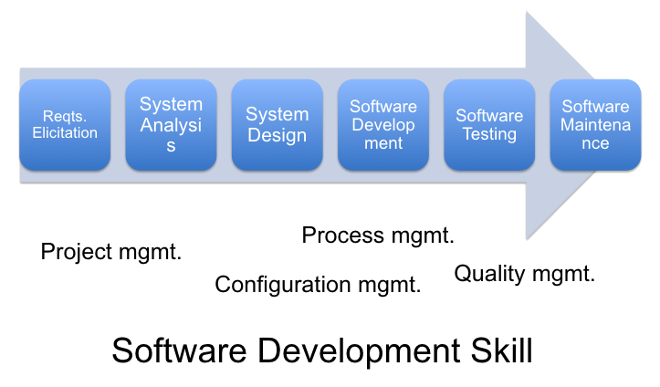
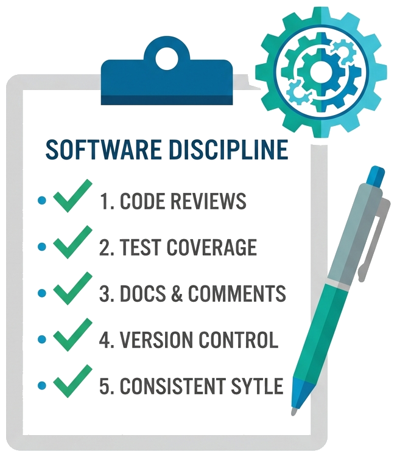
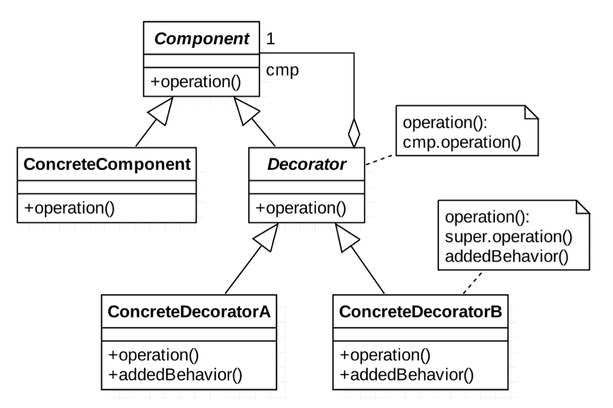

# Software Engineering

### Lecture 1: Introduction To Software Engineering
**Prof. Nien-Lin Hsueh**
Department of Information Engineering and Computer Science
Feng Chia University

---

## Key Topics in This Chapter

* **Evolution of Industry**
* **The Importance of Software**
* **Why We Need Software Engineering**
  * Historical failure cases
  * Issues SE aims to solve
* **What is Software?** Systems and types
* **Coding vs. Software Engineering**
  * Activities and components of SE
* **Code of Ethics for Software Engineers**
* **Software Engineering FAQ**

---
<!-- _class: full-image-slide -->

  

---

## Industrial Revolutions Overview

* **Industry 1.0:** The Age of Mechanization (Late 18th - Mid 19th Century)
* **Industry 2.0:** The Age of Mass Production (Late 19th - Early 20th Century)
* **Industry 3.0:** The Digital Revolution & Dawn of Software (Mid - Late 20th Century)
* **Industry 4.0:** The Era of Connectivity, AI, and Robotics (Early 21st Century - Present)

---

## Industry 1.0 & Industry 2.0

### **Industry 1.0: Mechanization**
* **Key Innovation:** Steam engine, water power.
* **Focus:** Transition from manual labor to machine-based manufacturing.
* **Impact:** Factories emerged, shifting production to centralized locations.
* **Software's Role:** Non-existent. Purely physical and mechanical.

### **Industry 2.0: Mass Production**
* **Key Innovations:** Electricity, assembly lines, internal combustion engines.
* **Focus:** Mass production, standardization of goods, new energy sources.
* **Impact:** Large-scale production (automobiles, appliances), telegraph/telephone.
* **Software's Role:** Absent. Automation was electro-mechanical.

---

## Industry 3.0: The Digital & Software Revolution

* **Key Innovations:** Computers, semiconductors, internet, PLCs (Programmable Logic Controllers).
* **Focus:** Automation of production through electronics and IT.
* **Impact:**
  * **Birth of Software:** Complex programming required, laying foundations for software engineering.
  * **PC Democratization:** Spread of office applications (word processors, spreadsheets).
  * **Automation in Manufacturing:** PLCs enabled precise machinery control.
* **Software's Role:** Emerged as a distinct discipline. Software started controlling machines and managing data.

---

## Industry 4.0: Connectivity, AI, and Robotics

* **Key Innovations:** IoT, Cloud Computing, AI, Machine Learning, Big Data, Advanced Robotics.
* **Focus:** Smart factories, interconnected systems, data-driven decisions, intelligent automation.
* **Impact:**
  * **Ubiquitous Software:** Backbone of almost every aspect of life and industry.
  * **AI & Machine Learning:** Systems learn from data and adapt autonomously.
  * **Advanced Robotics:** Collaborative robots (cobots) performing complex tasks.
  * **IoT & Cloud:** Massive data generation, real-time control, and scalable deployment.
* **Software's Role:** Central and pervasive. Making systems intelligent, adaptive, and interconnected.

---

## Concept Check Question (CCQ 1)

  

**During which industrial revolution did software first emerge as a distinct discipline to control machines and manage data?**

* **A.** Industry 1.0 (Mechanization)
* **B.** Industry 2.0 (Mass Production)
* **C.** Industry 3.0 (Digital & Software Automation)
* **D.** Industry 4.0 (Connectivity, AI, & Robotics)

  

  

    
  

---

## CCQ 1 - Answer & Explanation

  

### **Correct Answer: C. Industry 3.0**

* **Explanation:** 
  * **Industry 3.0** introduced computers, semiconductors, and PLCs in the mid-to-late 20th century, which established software as a distinct engineering discipline.
  * Industry 1.0 and 2.0 were purely mechanical and electro-mechanical. Industry 4.0 is built on top of Industry 3.0's foundations, introducing smart connectivity and AI.

  

  

    
  

---

## The Genesis of Software Engineering (1/2)

  

  * **Early Computing (1940s-1950s):**
    * Hardware-focused; software was rudimentary and custom-built.
    * Development processes were informal.

  * **The Software Crisis (1960s-1970s):**
    * Software projects grew rapidly in scale and complexity.
    * Inherent difficulties led to project failures, budget overruns, and late deliveries.

  

  

    
  

---

<!-- _class: full-image-slide -->

  

---

## The Genesis of Software Engineering (2/2)

  

  * **Formalization and Conferences (Late 1960s - 1970s):**
    * The term **"Software Engineering"** gained formal traction at the **NATO Software Engineering Conferences (1968 & 1969)**.
    * Experts gathered to address the challenges of the software crisis.

  * **Establishment as a Discipline (1980s onwards):**
    * Solidified alongside computer science.
    * Emergence of Waterfall model, structured programming, and Object-Oriented programming (OOP) to bring predictability.

  

  

    
  

---

## Why Early SE Struggled & The Need for Agile

* **Difficulties of Early Plan-Driven SE:**
  * **Manufacturing Analogy Mismatch:** Software was treated like civil engineering (e.g. building bridges). It assumed requirements are fixed and predictable.
  * **Rigid Sequential Phases:** Testing and integration happened at the very end. Design flaws or bugs were discovered too late, leading to high cost of change.
  * **Low Visibility:** Customers only saw working software at the end of the project lifecycle.

* **The Agile Solution:**
  * **Embracing Change:** Welcomes evolving requirements throughout development.
  * **Iterative & Incremental:** Delivers value in short, active sprint cycles for early feedback.
  * **Frequent Integration:** Continually tests and integrates to minimize risk.

---

## Software Engineering in the 2000s

* **The Agile Revolution:**
  * Emphasizes flexibility, active team collaboration, and customer involvement.
  * Promotes iterative development and responding to change over following rigid plans.
* **Open Source Software (OSS) & Git:**
  * The maturity of open-source frameworks (e.g. Spring, Rails) dramatically accelerated development.
  * Git (2005) and platform ecosystems (GitHub, 2008) democratized global code collaboration and sharing.
* **Web 2.0 & SaaS Era:**
  * Transitioned software delivery from physical media (CDs) to cloud-based Web Applications.
  * Laid the groundwork for Continuous Integration (CI) and modern DevOps practices.

---

## Industry 4.0: AI & Cyber-Physical Systems

* **AI-Powered Software Engineering:**
  * **LLMs (2022) Emerged:** The launch of ChatGPT catalyzed LLM integration, driving the shift to prompt-based coding.
  * Automates boilerplate generation, reviews code quality, and provides intelligent debugging insights.
  * Shifts developer focus from writing low-level syntax to system design, prompt engineering, and architectural orchestration.
* **Cyber-Physical Systems (Robotics & IoT):**
  * Software acts as the nervous system connecting advanced sensors, hardware robots, and smart factories.
  * Requires real-time computing, edge deployments, and high safety-critical engineering standards.

---

## Why We Can't Avoid Software Failure?

### Root Causes
* **Complexity of Software:** Software systems are highly complex, invisible, and non-linear.
* **Inadequate Methods:** The development methodologies applied fail to scale with complexity.

### Key Goals of Software Engineering
* **Improve Quality** of the software.
* **Increase Productivity** of developers.
* **Reduce Development Effort** (lower costs).
* **Reduce Cycle Time** (faster time to market).

---

## What is Software?

  

  > **IEEE Definition:**
  > Computer **programs**, **procedures**, and possibly associated **documentation** and **data** pertaining to the operation of a computer system.

  * **Beyond Code:** Includes procedures, data, and documentation. Many system failures (e.g., flight incidents) stem from operational/procedural issues.
  
  > Programs must be written for people to read, and only incidentally for machines to execute. — Abelson & Sussman

  

  

    
  

---

## Concept Check Question (CCQ 2)

  

**True or False?**

> According to the IEEE definition, "software" refers solely to the executable computer programs (source code) and does not include operational procedures or documentation.

* **A.** True
* **B.** False

  

  

    
  

---

## CCQ 2 - Answer & Explanation

  

### **Correct Answer: B. False**

* **Explanation:**
  * Software is **more than just executable code**.
  * The IEEE definition explicitly includes four parts: **programs**, **procedures**, **documentation**, and **data**.
  * Operational procedures and documentation are vital parts of a complete software system.

  

  

    
  

---

## Concept Check Question (CCQ 3)

  

**According to the IEEE definition, which of the following is NOT considered an essential component of "software"?**

* **A.** Computer programs (source code)
* **B.** Computer hardware and physical memory circuits
* **C.** Operating and execution procedures
* **D.** Associated documentation and system data

  

  

    
  

---

## CCQ 3 - Answer & Explanation

  

### **Correct Answer: B. Computer hardware & physical memory circuits**

* **Explanation:**
  * Software consists of **programs (code), procedures, documentation, and data** necessary for operating a system.
  * Physical hardware and circuits are the domain of hardware/system engineering, not software itself.

  

  

    
  

---

## Software Quality (1/2)

What makes a software system "good"? Consider these definitions:

1. **Conformance to Requirements (Crosby, 1979):**
   > The degree to which a system, component, or process meets specified requirements.
   * _Critique:_ Requirements are often incomplete. A system meeting the spec might still fail to satisfy the user.

2. **Fit for Purpose (Juran, 1998):**
   > The degree to which a system, component, or process meets customer or user needs or expectations.
   * _Critique:_ Is user expectation alone enough? What about non-functional qualities like maintainability?

---

## Software Quality (2/2)

3. **Professional Standards (Pressman):**
   > Conformance to explicitly stated functional and performance requirements, explicitly documented development standards, and implicit characteristics expected of all professionally developed software.

* **Insight:** Testing skills can be acquired quickly, but building a **quality culture** takes time.
* Quality Model: **ISO 9126** (Functionality, Reliability, Usability, Efficiency, Maintainability, Portability).

---
<!-- _class: full-image-slide -->

  

---

## Types of Software Applications (1/2)

1. **Web Applications:** E-commerce (Amazon), CMS (WordPress), Social Media, SaaS (Salesforce).
2. **Mobile Applications:** Utility apps, networking, games, health trackers, e-learning.
3. **Desktop Applications:** Productivity (Office), IDEs (VS Code), design (Figma).
4. **Enterprise Applications:** ERP (SAP), CRM (Salesforce), HRMS (Workday).
5. **Embedded Software:** Firmware in smart TVs, cars, medical devices, IoT.

  

---

## Types of Software Applications (2/2)

6. **Game Development:** Console, PC, and mobile games.
7. **AI & Machine Learning:** Virtual assistants (Siri, Alexa), recommendation engines (Netflix), chatbots.
8. **Data Analytics & BI:** Power BI, Tableau, Hadoop, Spark, R.
9. **Cloud-based Applications:** Cloud storage (Google Drive), VM infra (AWS, Azure), databases (Firebase).
10. **Scientific & Engineering:** CAD (AutoCAD), simulation tools (MATLAB).

  

---

## General Issues Affecting Software

* **Heterogeneity:** Operating across diverse, distributed networks, hardware, and mobile systems.
* **Business & Social Change:** Rapid economic and technology shifts demand fast updates and rapid deployments.
* **Security & Trust:** The absolute necessity of trusting software that governs our daily life.
* **Scale:** Spanning from tiny embedded sensors to massive internet-scale cloud infrastructures.
* **Technical Debt:** Accumulated quick-fixes that slow down future progress.
* **Project & Team Management:** Ineffective communication, poor QA, or bad planning.

---
<!-- _class: title-image-slide -->

## Why Software Engineering?

  

---

## What is Engineering?

  

  > **Engineering** is the application of scientific, economic, and practical knowledge to design and build structures, machines, devices, and systems.

  * **What is Engineering:**
    * Applying rigorous science & math to solve practical problems.
    * Designing under constraints (budget, safety, materials).
  * **What is NOT Engineering:**
    * **Pure Science:** Discovery of knowledge without building systems.
    * **Ad-hoc Crafting / Art:** Building by intuition without systematic methods, planning, or safety margins.

  

  

    
  

---

## What is Software Engineering?

* **SE is a branch of Engineering:**
  * Just as civil engineering applies physics to build bridges, software engineering applies computer science and mathematical logic to build software systems.
  * It shares the same engineering core: systematic planning, quantitative measurement, risk management, and rigorous quality assurance.
* **An Engineering Discipline:**
  * Concerned with all aspects of software production from early specification to post-deployment maintenance.
* **Systematic and Organized:**
  * Follows a structured, methodical process to minimize errors, optimize collaboration, and deliver on time/budget.
* **Pragmatic Choices:**
  * Uses appropriate tools and techniques depending on the problem, constraints, and resources available.

---

## SE Approaches and Activities

  ### Core Development Models
  * **Waterfall model:** Sequential and plan-driven.
  * **Spiral model:** Risk-driven iterative model.
  * **Agile methods:** Incremental and collaborative.

  ### Fundamental Activities
  * **Specification:** Defining functions and constraints.
  * **Development:** Designing and programming.
  * **Validation:** Checking against customer needs.
  * **Evolution:** Modifying for changing markets.

---
<!-- _class: full-image-slide -->

  

---

## The Discipline of Software Engineering

  

  Professional engineering requires **discipline**:
  * Write comments and document code.
  * Specify requirements before design; design before implementation.
  * Manage requirement changes systematically.
  * Design with interfaces, not concrete implementations.
  * Estimate efforts before developing.
  * Manage risks and record design rationales.

  

  

    
  

---

## SE Myths and Principles

### Common Myths
* *Myth 1:* If we fall behind schedule, we can just add more programmers to catch up.
* *Myth 2:* Software is easy to change.
* *Myth 3:* If we outsource the project, we can just sit back and relax.

### Core Principles
* **Open-Closed Principle (OCP):** Open for extension, closed for modification.
* **Anticipation of Change:** Design for future flexibility.
* **KISS Principle:** Keep It Simple, Stupid.
* **Continuous Validation:** Perform early and frequent testing.

---

## Concept Check Question (CCQ 4)

  

**True or False?**

> If a software project falls behind schedule, adding more programmers to the team will help us catch up and meet the deadline.

* **A.** True
* **B.** False

  

  

    
  

---

## CCQ 4 - Answer & Explanation

  

### **Correct Answer: B. False**

* **Explanation:**
  * This is a famous software engineering myth known as **Brooks' Law**: *"Adding human power to a late software project makes it later."*
  * New programmers require training, ramp-up time, and introduce communication overhead, which slows down the existing team.

  

  

    
  

---

## Discussion Topic 1

  

Based on your own experience, develop a software development principle or myth, or share one you strongly agree with and explain why.

  

  

    
  

---

## Nielsen's 10 Usability Heuristics

1. **Visibility of system status**
2. **Match between system and the real world**
3. **User control and freedom**
4. **Consistency and standards**
5. **Error prevention**
6. **Recognition rather than recall**
7. **Flexibility and efficiency of use**
8. **Aesthetic and minimalist design**
9. **Help users recognize, diagnose, and recover from errors**
10. **Help and documentation**

---

## Software Engineering Tools (1/2)

* **Version Control:** Git, SVN (tracks history, enables collaboration).
* **IDEs:** IntelliJ, VS Code (rich environments for writing/debugging).
* **Agile Management:** Scrum, Kanban (Jira, Trello for tasks & sprint cycles).
* **Automated Testing:** JUnit, Jest, Selenium (ensures correctness early).
* **CI/CD:** Jenkins, GitHub Actions (automates build, test, and release).
* **Architecture & Design:** Lucidchart, UML tools (models architectures & design patterns).

---

## Software Engineering Tools (2/2)

  

  * **AI-Powered Coding Assistants:** GitHub Copilot, Amazon CodeWhisperer.
  * **AI Documentation Generators:** Automatically keeps API specs, READMEs, and user stories aligned with code.
  * **AI Security & Code Analyzers:** Snyk, DeepCode AI (detects vulnerabilities, suggests refactoring).
  * **Performance Monitoring:** New Relic, JProfiler (profiling and optimization).
  * **Database Management:** MySQL Workbench, Postman (API and query tools).

  

  

    
  

---

## Discussion Topic 2

  

  Write down the software development tool that you find most useful, particularly one that others might commonly overlook.

  

  

    
  

---

## Constraints and Resources in SE

To deliver a successful project, engineers must balance constraints with available resources.

| **Constraints (Limitations)** | **Resources (Assets)** |
|---|---|
| **Time:** Deadlines & schedule | **Human Resources:** Developers, testers, managers |
| **Budget:** Financial limits | **Technology:** Hardware, software, infrastructure |
| **Technology Stack:** Required stack | **Knowledge:** Team's expertise & experience |
| **Compliance/Regulations:** GDPR, HIPAA | **Time & Budget:** Allocation limits |

---

## Balancing Constraints & Resources (Example)

### **Scenario:** A startup must launch a secure, scalable mobile app in 6 months with a tight budget and a team of 4 JS developers.

* **Approach:**
  * **Technology Choice:** React Native (cross-platform, saves time).
  * **Security:** Use SSL and OAuth 2.0.
  * **Hosting:** Leverage AWS Free Tier (scale up later).
  * **Process:** Adopt Agile/Scrum with 2-week sprints to build an MVP first.
  * **Automation:** Setup GitHub Actions for CI/CD.

---

## ACM/IEEE Code of Ethics

  

  ACM/IEEE outline 6 primary ethical pillars for software engineers:
  1. **Public:** Act consistently with the public interest (safety, health, welfare).
  2. **Client and Employer:** Act in the best interests of clients and employers.
  3. **Product:** Ensure products meet high professional standards.
  4. **Judgment:** Maintain integrity and independence in judgment.
  5. **Management:** Promote ethical management practices.
  6. **Profession:** Advance the integrity and reputation of the profession.

  

  

    
  

---

## Concept Check Question (CCQ 5)

  

**According to the ACM/IEEE Software Engineering Code of Ethics, what is the highest priority that software engineers must always uphold?**

* **A.** The financial interests of the Client and Employer
* **B.** The technical complexity of the Product
* **C.** The Public Interest (safety, health, and welfare)
* **D.** The professional development of their team

  

  

    
  

---

## CCQ 5 - Answer & Explanation

  

### **Correct Answer: C. The Public Interest**

* **Explanation:**
  * The first and most critical ethical pillar is **Public Interest**. 
  * Software engineers must always place the health, safety, and welfare of the public above the interests of their clients, employers, or personal advancement.

  

  

    
  

---

## Ethical Failures in the Industry

* **Planned Obsolescence (Phoebus Cartel):** Designing hardware/software to artificially expire.
* **Forced Subscriptions & Locked Ecosystems:** Disrupting user control through restrictive licensing.
* **Volkswagen's "Dieselgate":** Software designed specifically to cheat emission tests.
* **Dark UX Patterns:** Deceptive UI designed to trick users (e.g., hard-to-cancel subscriptions).
* **Cambridge Analytica:** Misusing user data for political targeting.

---

## Ethical Case Studies 1

  

  * [Read the story](https://g.co/gemini/share/022dd19085b9) of Mizuho Securities and the Tokyo Stock Exchange
  * Who do you think should bear the responsibility for this enormous loss? Should it be Tanaka from Mizuho Securities? The Tokyo Stock Exchange? Or the system developer, Fujitsu?

  

  

    
  

---

## Ethical Case Studies 2

  

  * Read the story [Data is Gold](https://g.co/gemini/share/2da5d25a4cca)
  
  The digital town became more real and full of wisdom, because everyone understood that true power lay in their own judgment, not in being quietly guided by others.

  

  

    
  

---

## Discussion Topic 3

  

  Provide examples of Dark UX Patterns, preferably ones you have personally encountered.

  

  

    
  

---

## Recap: Fill-in-the-blank Quiz

  

Test your understanding of the core concepts in this chapter:

1. According to the IEEE definition, **software** consists of computer programs, procedures, associated **___**, and data.
2. The four essential attributes of **good** software are: usability, dependability, efficiency (performance), and **___**.
3. **Software Engineering** is an **___** discipline that is concerned with all aspects of software production.
4. Computer Science focuses on theory and fundamentals, while **Software Engineering** focuses on the **___** development of useful software.

  

  

    
  

---

## Recap: Answers & Summary

  

Here are the completed concepts:

1. According to the IEEE definition, software consists of computer programs, procedures, associated **documentation**, and data.
2. The four essential attributes of good software are: usability, dependability, efficiency (performance), and **maintainability**.
3. Software Engineering is an **engineering** discipline that is concerned with all aspects of software production.
4. Computer Science focuses on theory and fundamentals, while Software Engineering focuses on the **practical** development of useful software.

  

  

    
  

---

## References

* **Sommerville Software Engineering Book**
  * [Official Website](https://software-engineering-book.com/)
  * [All Slides Folder](https://drive.google.com/drive/u/0/folders/1aU-KsrwQsNMk3Gzlj15wihctOioIMBjN)
  * [Chapter Slides Link](https://docs.google.com/presentation/d/1CLQaKE9g9EQE0XWGd2yiA9TnyB8-H-qf/edit?usp=sharing&ouid=109022309423128079509&rtpof=true&sd=true)
