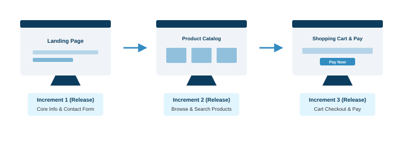
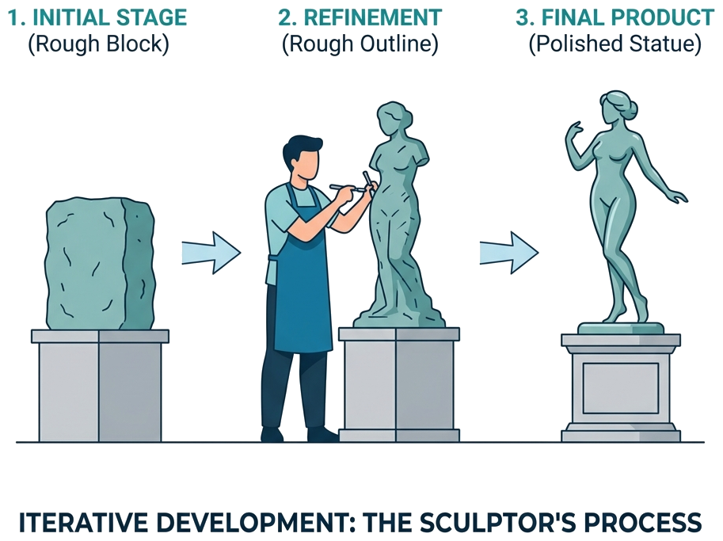
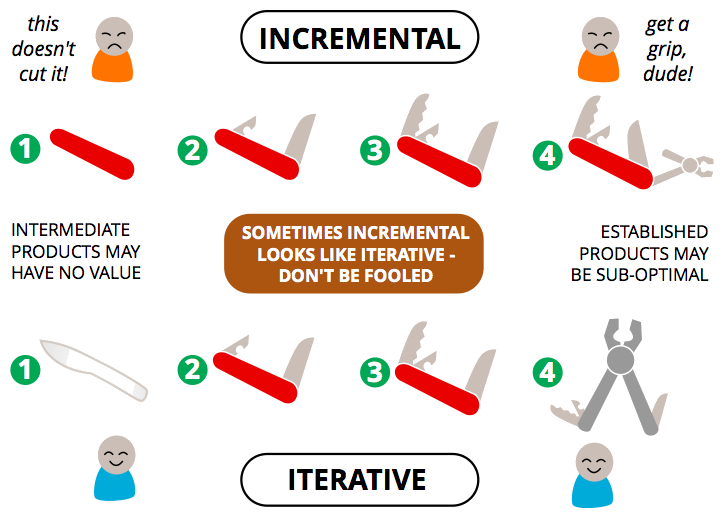
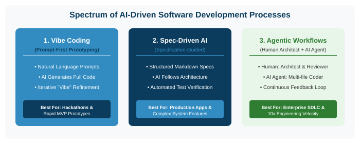
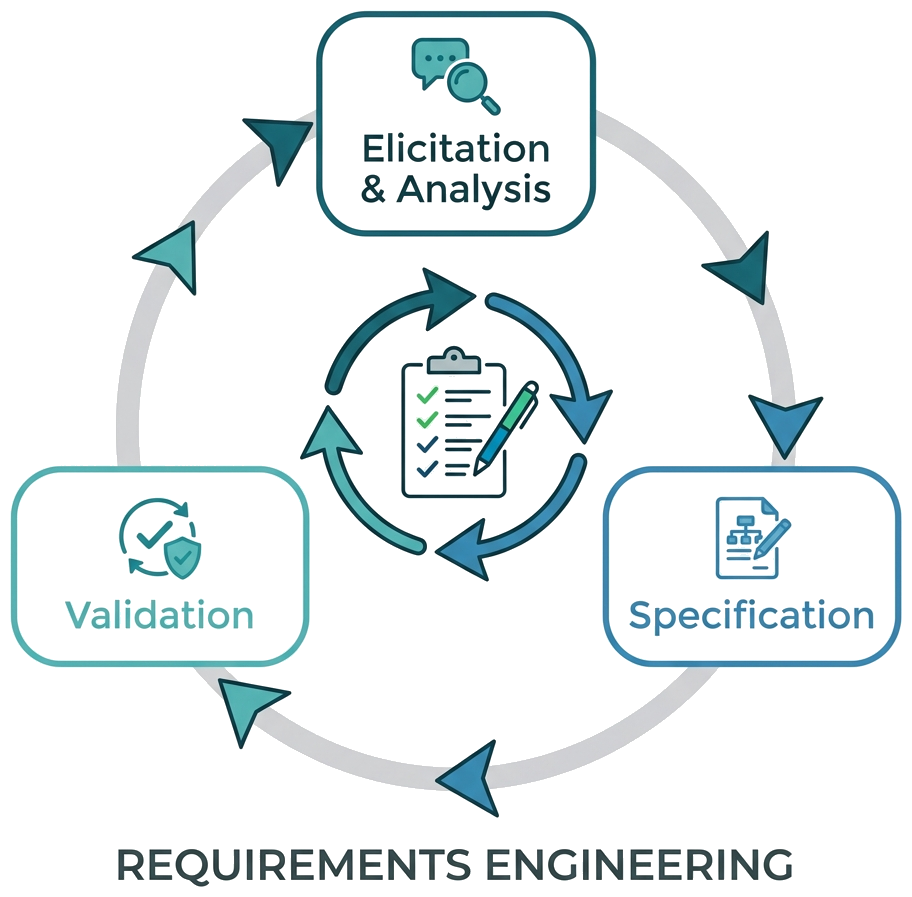
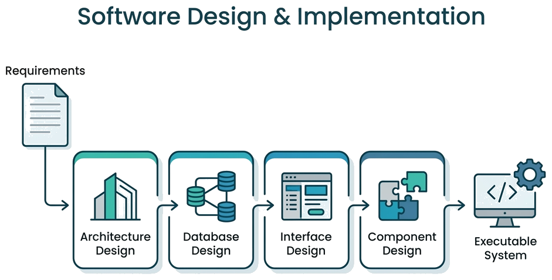
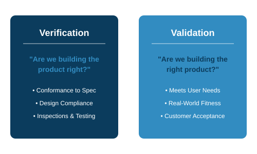
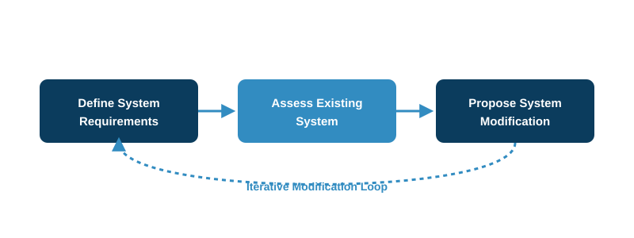
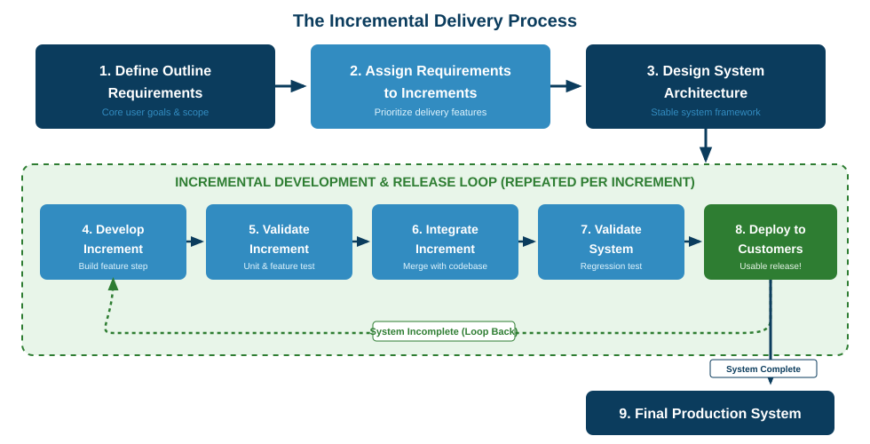
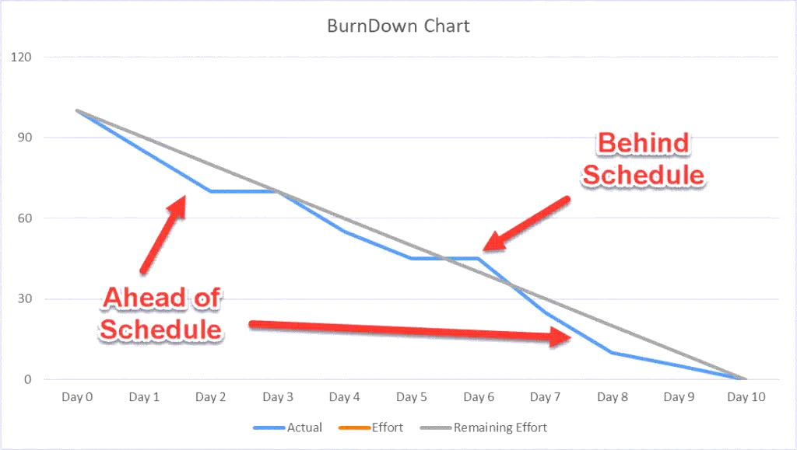

# Software Engineering

### Lecture 2: Software Processes

**Prof. Nien-Lin Hsueh**
Department of Information Engineering and Computer Science
Feng Chia University

---

## Focus Questions

* What are the primary **software process models**, and what are their pros, cons, and applicability?
* What are the fundamental **process activities** in software development?
* How do we cope with **change** and reduce expensive **rework**?
* What is the purpose of **prototyping** and **incremental delivery**?
* What are modern **AI-Driven Software Development Processes** (Vibe Coding, Spec-Driven AI, Agentic Workflows)?
* How can organizations improve their processes using **CMMI**?
* What are key **software engineering metrics**?

---

## Software Processes: Definition

  

  * **Academic Definition (Ian Sommerville):**
    > "A structured set of activities required to develop a software system."
  * **ISO/IEC 12207 Standard Definition:**
    > "A set of interrelated or interacting activities which transforms inputs into outputs."
  * **All processes must involve:**
    * **Specification** (defining what to do)
    * **Design & Implementation** (building the system)
    * **Validation** (testing and checking)
    * **Evolution** (modifying and maintaining)

  

  

    
  

---

## Process as an Algorithm

> **"A software process is essentially a human-based algorithm."**

* **Inputs & Outputs:**
  * **Input:** Raw user requirements, constraints, budget, and developer skills.
  * **Process:** Systematic activities, roles, and guidelines.
  * **Output:** A working, verified, and high-quality software product.
* **Predictability:** Just as a mathematical algorithm guarantees a correct output, a mature software process ensures predictable quality, cost, and delivery timeline.
* **Efficiency:** A well-designed process optimizes resource usage and minimizes waste (rework).

---

## Software Process Models

* **Plan-Driven Model (e.g., Waterfall):** Distinct, separate phases of specification and development.
* **Incremental Development:** Specification, development, and validation are interleaved.
* **Integration and Configuration:** System is assembled from existing reusable, configurable components.

* *In practice:* Most large systems are hybrid processes incorporating elements from all these models.

---

## The Waterfall Model

  

  * **Plan-Driven Process:** Separate and distinct phases of specification and development.
  * **Drawbacks:**
    * High difficulty accommodating **change** once underway.
    * A phase must be complete before moving to the next.
  * **Applicability:**
    * Only when requirements are **well-understood**.
    * Highly structured **large systems** engineered across multiple sites.

  

  

    
  

---

## Incremental Development

  

  * **Functional Partitioning:**
    * System functionality is broken down into prioritized, self-contained **increments**.
  * **Prioritized Delivery:**
    * High-priority features are developed and delivered in early increments.
  * **Deliverable Increments:**
    * **Crucial Note:** Each increment is a fully functional, deliverable system (Release) that can be deployed to production.

  

  

    
  

---

## Benefits of Incremental Approach

  

  * **Rapid Delivery & Value:** Customers receive and gain value from key software functions early.
  * **Agile Risk Reduction:**
    * Validating early increments reduces the risk of major requirements failure.
  * **Easy Backlog Adjustment:**
    * If market needs shift, future increments can be adjusted before code is written.
  * **Continuous Feedback:** Customers comment on actual working software.

  

  

    
  

---

## Iterative Development

  

  * **Continuous Refinement:**
    * Focuses on polishing, refactoring, and adding detail to existing features based on cycles of feedback.
  * **Sculptor Analogy:**
    * Starts with a rough block of clay, then chisels a rough outline, and finally refines details until a polished statue is complete.
  * **Flexibility:** Great when the initial architecture or requirements are highly unstable.

  

  

    
  

---

## Incremental vs. Iterative

* **Goal:**
  * **Incremental:** Add new features/components in small steps (Focus: *Early Delivery*).
  * **Iterative:** Refine or improve existing parts in cycles (Focus: *Refinement & Quality*).
* **Deliverables:**
  * **Incremental:** Each increment is a fully functional part of the system.
  * **Iterative:** Each cycle refines what already exists.

> 💡 **Key Difference:** Incremental focuses on delivering parts of the system progressively. Iterative focuses on refining and improving the product quality iteratively.

---

## Analogy: Incremental vs. Iterative

  

  * **Incremental (Left):**
    * Each step adds a completed, colored piece.
    * The first release only shows a head (no body).
  * **Iterative (Right):**
    * Start with a full rough sketch.
    * Cycle 2 adds color wash.
    * Cycle 3 details the final masterpiece.

  

  

    
  

---

## Combined Approach

* **Iterative and Incremental Model:**
  * The foundation of many Agile methodologies (e.g., **Scrum**).
  * Build the system in small, functional increments (incremental) and then refine and improve them over time based on feedback (iterative).
* **Benefits:**
  * Early delivery of working software.
  * Flexibility to adapt to changing needs.

---

## MVP Analogy (Scooter to Car)

  

  * **Not like this (Top):**
    * Delivering a wheel, then axle, then frame. First usable version is only at the end.
  * **Like this (Bottom):**
    * Delivering a skateboard (usable), then scooter, bicycle, motorcycle, and finally car.
    * Every version is a functional transport tool.

  

  

    
  

---

## AI-Driven Software Development Processes

* **The Evolution of Software Processes:**
  * Software processes have evolved from **Waterfall** (document-heavy) to **Agile** (human sprints) and now to **AI-Driven Development** (prompt-to-software & agentic loops).
* **4 Golden Principles for AI-Based Processes:**
  1. **Spec-First, Code-Second:** Define clear acceptance criteria and system constraints before prompting AI for code.
  2. **Verification is Non-Negotiable:** AI code must be validated by automated tests and human review—never trust unverified LLM output.
  3. **Modular Context Management:** Break complex tasks into small, isolated sub-tasks to prevent context window degradation.
  4. **Maintain Architectural Ownership:** Human developers remain 100% accountable for system security, data integrity, and design.

---
<!-- _class: full-image-slide -->

  

---

## Empirical Evidence: Benefits of AI-Driven Development

* **1. GitHub / MIT Controlled Experiment (Peng et al., 2023):**
  * Paper: [*The Impact of AI on Developer Productivity: Evidence from GitHub Copilot*](https://arxiv.org/abs/2302.06590)
  * **Finding:** Developers using AI completed tasks **55.8% faster** (71 min vs 161 min, <i>p</i> &lt; 0.001).
* **2. McKinsey Software Engineering Study (2023):**
  * Paper: [*Unlocking the Value of Generative AI in Software Engineering*](https://www.mckinsey.com/capabilities/mckinsey-digital/our-insights/unleashing-developer-productivity-with-generative-ai)
  * **Finding:** Reduces task completion time by **20% to 50%** for complex coding and up to **50%** for documentation.
* **3. ACM / IEEE Developer Experience Research (Ziegler et al., 2022):**
  * Paper: [*Productivity Assessment of Neural Code Completion*](https://arxiv.org/abs/2205.06538)
  * **Finding:** **74% of developers** reported higher job fulfillment, spending less time on boilerplate and remaining in "flow state" longer.

---

## Process 1: Vibe Coding (Prompt-First Prototyping)

* **Definition (Coined by Andrej Karpathy):**
  > You just speak to the AI in natural language, describe what you want, hit run, and vibe with the code. Programming is shifting from writing code syntax to guiding AI intent.
* **Process Workflow:**
  1. **Conversational Prompting:** Developer inputs informal user intent into AI (Cursor, v0, Bolt.new, Lovable).
  2. **Zero-Shot Code Generation:** AI generates full HTML/CSS/JS or backend code.
  3. **Visual Feedback Loop:** Developer observes execution, adjusts prompts, and iterates.
* **Best Applicability:** Hackathons, rapid UI prototyping, greenfield MVPs, and exploratory ideas.

---

## Process 2 & 3: Spec-Driven & Agentic AI Workflows

* **Spec-Driven AI Process (Specification-Guided):**
  * Developer writes structured markdown specs (`plan.md`, `task.md`, `PRD.md`) defining architecture & acceptance criteria.
  * AI Agent reads specs, plans multi-file edits, and executes autonomous code changes.
  * **Best For:** Enterprise features, production refactoring, and maintaining architectural coherence.
* **The 3-Step Agentic Feedback Loop:**
  * **Intent / Spec Definition** &rarr; **Autonomous AI Agent Execution** &rarr; **Automated Test & Human Approval**.

---

## Discussion: Process Planning

  

How would you plan the incremental and iterative releases for one of these systems?
* IECS Department Website
* Online Shopping Mall
* Food Delivery App
* Travel Planning System

  

  

    
  

---

## Integration and Configuration

* **Reuse-Oriented Model:**
  * Systems are integrated from existing reusable components or Commercial-off-the-shelf (**COTS**) systems.
* **Types of Reusable Software:**
  * **Stand-alone applications:** Configured for a particular environment.
  * **Component collections:** Integrated within frameworks (e.g., .NET, J2EE).
  * **Web Services:** Standards-based services available for remote invocation.

---

## Concept Check Question 1

  

What is the primary drawback of the Waterfall model?

* **A.** It is too fast and lacks documentation.
* **B.** It is hard to accommodate change once development is underway.
* **C.** It does not require validation or testing.
* **D.** It cannot be used for large engineering projects.

  

  

    
  

---

## Concept Check Question 1: Answer

  

What is the primary drawback of the Waterfall model?

* **Correct Answer: B**
* **Explanation:** Because phases are sequential and distinct, it is extremely difficult and costly to change requirements once the process is underway.

  

  

    
  

---

## Concept Check Question 2

  

What is the main difference in focus between Incremental and Iterative development?

* **A.** Incremental focuses on quality; Iterative focuses on speed.
* **B.** Incremental focuses on planning; Iterative focuses on coding.
* **C.** Incremental focuses on early delivery of parts; Iterative focuses on cyclic refinement of features.
* **D.** There is no difference; they are identical terms.

  

  

    
  

---

## Concept Check Question 2: Answer

  

What is the main difference in focus between Incremental and Iterative development?

* **Correct Answer: C**
* **Explanation:** Incremental development adds new functional modules in steps; Iterative development refines and polishes existing modules based on continuous feedback.

  

  

    
  

---

## Process Activities

* Software processes consist of four fundamental activities:
  1. **Requirements Specification**
  2. **Software Design & Implementation**
  3. **Software Validation (Testing)**
  4. **Software Evolution (Maintenance)**

---

## Requirements Engineering

  

  > **Requirements Engineering** is the systematic process of discovering, analyzing, documenting, and validating the services required from the system and the operational/developmental constraints.

  * **Three Core Phases:**
    1. **Elicitation & Analysis:** Discovering what stakeholders require.
    2. **Specification:** Defining the requirements in detail.
    3. **Validation:** Verifying that requirements are complete and correct.

  

  

    
  

---

## Design & Implementation

  

  * **Software Design:** Designing a software structure that realizes the specification.
  * **Implementation:** Translating this structure into an executable program.
  * **Interleaved:** For most software systems, design and implementation are closely related and occur together.

  

  

    
  

---

## Key Design Activities

1. **Architectural Design:**
   * Defining the overall system structure, principal components (subsystems/modules), their relationships, and distributed architecture.
2. **Database Design:**
   * Designing data schemas, entity-relationship models, and storage representations (SQL vs. NoSQL).
3. **Interface Design:**
   * Specifying component interfaces, APIs, and user interfaces (UI/UX).
4. **Component Selection & Detail Design:**
   * Deciding on reusable components or detailing specific algorithms, logic, and class structures.

---

## Software Validation (V & V)

  

  * **Verification & Validation (V&V):**
    * **Verification:** Conformance to spec ("Are we building the product right?").
    * **Validation:** Meets user needs ("Are we building the right product?").
  * **Three Stages of Testing:**
    1. **Component Testing:** Testing individual components.
    2. **System Testing:** Testing the system as a whole.
    3. **Customer Testing:** Testing with customer data.

  

  

    
  

---
<!-- _class: full-image-slide -->

  

---

## Software Evolution

  

  * **Inherently Flexible:** Software can adapt and change as business circumstances evolve.
  * **Brownfield vs. Greenfield:**
    * Most modern software engineering is "brownfield" (evolution/maintenance of legacy code) rather than building from scratch ("greenfield").
  * **Architectural Erosion:**
    * Continuous evolution requires systematic refactoring, or the system structure will degrade over time.

  

  

    
  

---

## Concept Check Question 3

  

Which stage of software testing focuses on verifying individual functions, classes, or coherent groupings of objects independently?

* **A.** System Testing
* **B.** Component Testing
* **C.** Customer Testing
* **D.** Evolution Testing

  

  

    
  

---

## Concept Check Question 3: Answer

  

Which stage of software testing focuses on verifying individual functions, classes, or coherent groupings of objects independently?

* **Correct Answer: B**
* **Explanation:** Component testing focuses on testing individual parts of the system in isolation, such as individual functions, classes, or modules.

  

  

    
  

---

## Coping with Change

* **System Change is the Primary Cost Driver:**
  * Requirements shift due to business needs, new platforms, and technology advancements.
* **Rework Cost:**
  * The cost of changing software includes both re-analysis (rework) and re-implementation.
* **Mitigation Strategies:**
  * **Change Anticipation:** Anticipating changes before major rework (e.g., prototyping).
  * **Change Tolerance:** Designing processes so changes are easy to absorb (e.g., modular design, increments).

---

## Reducing Rework Costs

  

  * **Proactive Prototyping:**
    * Building early mockups to clarify requirements and test design feasibility, preventing expensive downstream rework.
  * **Incremental Isolation:**
    * Restricting modifications to a single increment (isolated subsystem) rather than altering the entire codebase.
  * **Change Buffer:**
    * Allocating uncommitted increments to absorb future customer requirements.

  

  

    
  

---

## System Prototyping

* **Prototyping Lifecycle:**
  * **Establish objectives:** Decide if the goal is requirements validation or design exploration.
  * **Define function:** Focus on high-visibility features (UI, main flows) while omitting error handling or security.
  * **Develop prototype:** Build rapidly using scripting languages or mockups.
  * **Evaluate:** Gather feedback from stakeholders.
* **Benefits:** Improved usability, closer match to user needs, and reduced development risk.

---

## Throw-Away vs. Evolutionary

* **Throw-Away Prototypes:**
  * Built quickly to clarify requirements/UI, then **completely discarded**.
  * *Drawbacks:* Undocumented, degraded structure, and lacks performance/security.
* **Evolutionary Prototypes:**
  * Built as a solid first version that is continuously modified and refactored to become the final production system.
  * Common in Agile methodologies.

---
<!-- _class: full-image-slide -->

  

---

## Concept Check Question 4

  

Why should a "throw-away" prototype NOT be used as the base for a production system?

* **A.** It is too expensive to maintain.
* **B.** It is typically undocumented, has degraded structure, and lacks non-functional requirements (e.g., security, scaling).
* **C.** Customers cannot understand it.
* **D.** It cannot be integrated with databases.

  

  

    
  

---

## Concept Check Question 4: Answer

  

Why should a "throw-away" prototype NOT be used as the base for a production system?

* **Correct Answer: B**
* **Explanation:** Throw-away prototypes are developed rapidly without documentation, proper architecture, or optimizations for non-functional requirements like scaling, reliability, or security. Using them as production bases leads to unstable systems.

  

  

    
  

---

## Process Improvement & CMMI

* **Process Improvement Cycle:**
  * **Process Measurement:** Quantifying the current process metrics (defects, cost, schedule).
  * **Process Analysis:** Finding bottlenecks, failures, and opportunities.
  * **Process Change:** Adapting the process to resolve identified problems.
* **CMMI Framework:**
  * Assists organizations in measuring their process maturity and optimizing operations.

---
<!-- _class: full-image-slide -->

  

---

## CMMI Maturity Levels (1-3)

* **Level 1: Initial (Ad-hoc/Chaotic)**
  * Unpredictable, poorly controlled, reactive. Relies on individual heroics rather than processes.
* **Level 2: Managed**
  * Basic project management established (cost, schedule). Processes are planned, performed, and controlled.
* **Level 3: Defined**
  * Processes are characterized, understood, and standardized organization-wide. Proactive tailoring.

---

## CMMI Maturity Levels (4-5)

* **Level 4: Quantitatively Managed**
  * Uses quantitative metrics and statistical control to manage process performance.
* **Level 5: Optimizing**
  * Focuses on continuous process improvement, innovation, and causal analysis to proactively enhance quality.

---

## CMMI Process Areas

| Level | Key Focus & Process Areas (PAs) |
| --- | --- |
| **L2 - Managed** | Requirements Management (REQM), Project Planning (PP), Project Monitoring & Control (PMC), Configuration Management (CM). |
| **L3 - Defined** | Requirements Development (RD), Technical Solution (TS), Verification (VER), Validation (VAL), Risk Management (RSKM). |
| **L4 - Quantitative** | Organizational Process Performance (OPP), Quantitative Project Management (QPM). |
| **L5 - Optimizing** | Organizational Innovation (OID), Causal Analysis & Resolution (CAR). |

---

## Code Quality Metrics

  

  * **Cyclomatic Complexity:** Measures complexity by counting independent paths. Higher complexity means harder to test/maintain.
  * **Code Coverage:** Percentage of code executed during testing. Higher coverage reduces hidden bugs.
  * **Code Churn:** Amount of code added/modified/deleted over time. High churn indicates instability.

  

  

    
  

---

## Productivity & Defect Metrics

  

  * **Defect Density:** Number of defects found per unit of code size (e.g., defects/KLOC).
  * **Defect Leakage:** Number of defects escaping to later phases or production.
  * **Mean Time to Repair (MTTR):** Average time it takes to fix a defect.
  * **Velocity (Agile):** Work completed by the team per sprint.

  

  

    
  

---

## Reliability & Agile Metrics

  

  * **MTBF vs. MTTF:**
    * **MTTF:** Mean Time to Failure (for non-repairable systems; average lifetime).
    * **MTBF:** Mean Time Between Failures (for repairable systems; MTBF = MTTF + MTTR).
  * **Technical Debt:**
    * The implied cost of future refactoring caused by choosing a quick/dirty fix now instead of a proper design. Compounds over time!
  * **Sprint Burndown (Agile):**
    * Visual chart displaying remaining work hours or story points vs. sprint timeline, showing if commitments will be met.

  

  

    
  

---

## Recap: Fill-in-the-blank Quiz

  

Test your understanding of the core concepts in this chapter:

1. The **___** model is only appropriate when requirements are well-understood.
2. In CMMI, Maturity Level **___** represents a proactively defined, tailored, and standardized process across projects.
3. Code **___** measures the percentage of code lines executed during testing.
4. **___** prototypes are built to explore requirements/UI options, then discarded.

  

  

    
  

---

## Recap: Answers & Summary

  

Here are the completed concepts:

1. The **Waterfall** model is only appropriate when requirements are well-understood.
2. In CMMI, Maturity Level **3 (Defined)** represents a proactively defined, tailored, and standardized process across projects.
3. Code **coverage** measures the percentage of code lines executed during testing.
4. **Throw-away** prototypes are built to explore requirements/UI options, then discarded.

  

  

    
  

---

## References

* **Sommerville Software Engineering Book**
  * [Official Website](https://software-engineering-book.com/)
  * [All Slides Folder](https://drive.google.com/drive/u/0/folders/1aU-KsrwQsNMk3Gzlj15wihctOioIMBjN)
  * [Chapter Slides Link](https://docs.google.com/presentation/d/1CLQaKE9g9EQE0XWGd2yiA9TnyB8-H-qf/edit?usp=sharing&ouid=109022309423128079509&rtpof=true&sd=true)
