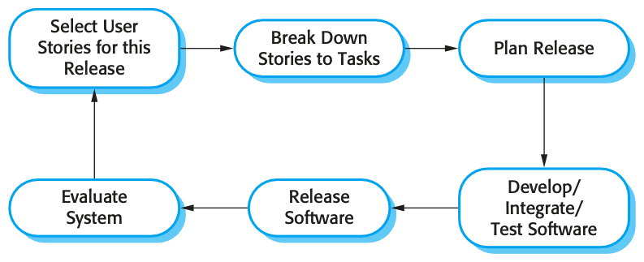
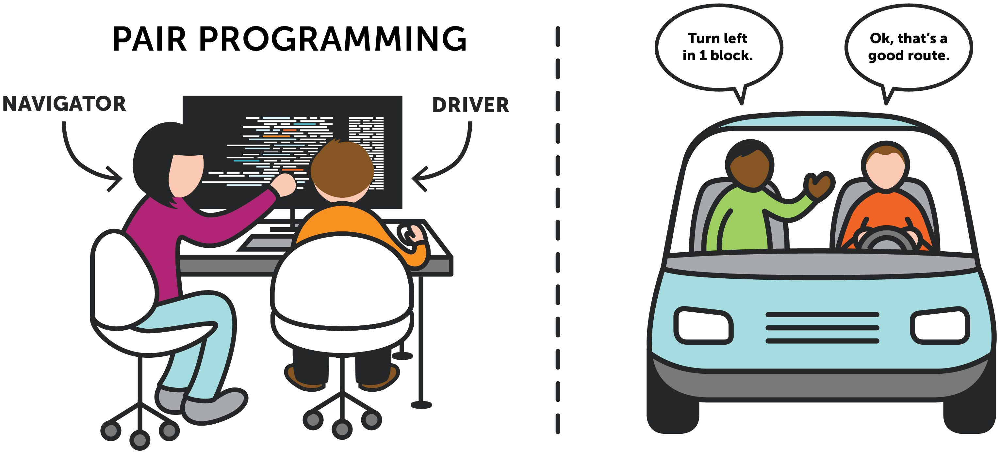
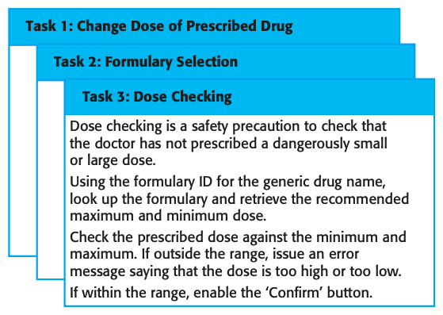
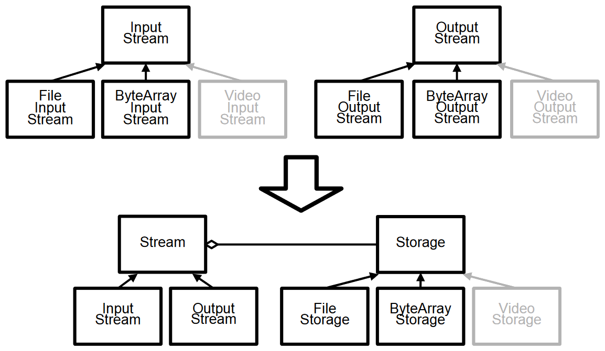
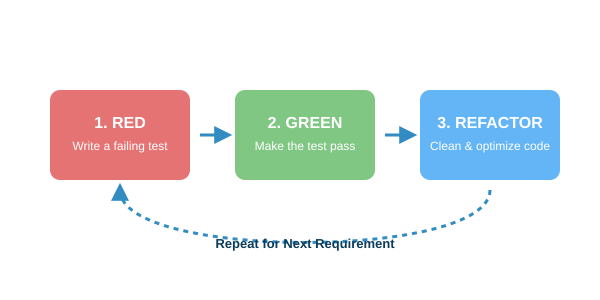
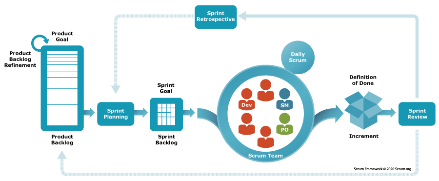

# Software Engineering

### Lecture 3: Agile Software Development

**Prof. Nien-Lin Hsueh**
Department of Information Engineering and Computer Science
Feng Chia University

---

## Focus Questions

* Why did **Agile development methods** emerge to replace traditional plan-driven approaches?
* What are the four core values of the **Agile Manifesto**?
* What are the key practices of **Extreme Programming (XP)**?
* How are requirements captured using **User Stories** and **Task Cards**?
* What is **Test-Driven Development (TDD)** and why is **Refactoring** critical?
* How does **Scrum** manage iterative development through roles, artifacts, and sprints?

---

## Rapid Software Development

* **Fast-Changing Business Environment:**
  * Businesses operate in volatile markets where producing stable, long-term requirements is practically impossible.
* **Evolution Speed:**
  * Software must evolve rapidly to reflect changing customer needs.
* **Plan-Driven Limitations:**
  * Heavy plan-driven models create bureaucracy and fail to deliver rapid business value.
* **Rise of Agile:**
  * Emerged in the late 1990s to radically reduce delivery time for working software systems.

---

## Agile Development Characteristics

* **Interleaved Activities:**
  * Specification, design, and implementation occur concurrently rather than in separate sequential phases.
* **Incremental Versions:**
  * Systems are developed as a series of increments with customer involvement in specification and evaluation.
* **Tool & Automation Driven:**
  * Heavy reliance on automated testing frameworks and continuous integration tools.
* **Minimal Documentation:**
  * Focuses on delivering working code rather than exhaustive design documents.

---

## The Agile Manifesto

In 2001, 17 software developers created the **Agile Manifesto**, valuing:

* **Individuals and interactions** over processes and tools
* **Working software** over comprehensive documentation
* **Customer collaboration** over contract negotiation
* **Responding to change** over following a plan

> 💡 *While there is value in the items on the right, we value the items on the left more.*

---

## 5 Core Principles of Agile Methods

1. **Customer Involvement:** Customers are actively engaged throughout to provide/prioritize requirements and evaluate releases.
2. **Incremental Delivery:** Software is delivered in small, functional increments.
3. **People, Not Process:** Team skills are exploited; developers organize their own work without rigid constraints.
4. **Embrace Change:** Requirements change is expected and built into the design process.
5. **Maintain Simplicity:** Actively eliminate unnecessary complexity in both code and process.

---

## Extreme Programming (XP)

  

  * **Extreme Approach:** Pushes iterative development practices to extreme levels.
  * **Frequent Builds:** New versions built multiple times per day.
  * **2-Week Deliveries:** Functional increments delivered to customers every 2 weeks.
  * **Automated Safety:** All unit tests must pass before any build is accepted.

  

  

    
  

---

## XP 10 Core Practices

| Practice | Key Objective |
| --- | --- |
| **Incremental planning** | Requirements recorded on story cards, prioritized for release. |
| **Small releases** | Minimal useful functionality delivered first and frequently updated. |
| **Simple design** | Carry out enough design to meet current requirements—no more. |
| **Test-first development** | Automated unit tests written *before* feature code is implemented. |
| **Refactoring** | Continuously clean up and improve code structure without changing behavior. |
| **Pair programming** | Two developers work at one computer, checking work continuously. |
| **Collective ownership** | Developers work across all code; anyone can refactor any module. |
| **Continuous integration** | Integrate completed tasks into main build immediately; all tests must pass. |
| **Sustainable pace** | No large overtime; maintains code quality and developer health. |
| **On-site customer** | Full-time customer representative available to answer requirements queries. |

---

## Pair Programming

  

  * **Collaborative Coding:** Two programmers work together at one workstation.
  * **Informal Code Review:** Continuous inspection as code is written.
  * **Knowledge Sharing:** Spreads domain and system knowledge across the entire team, reducing project risk.
  * **Collective Ownership:** Encourages refactoring and shared responsibility.

  

  

    
  

---

## User Stories & Task Cards

* **Expressing Requirements:**
  * Written from the user's perspective on physical or digital story cards.
* **Task Breakdown:**
  * Developers break each user story down into concrete implementation **tasks**.
* **Estimation & Scheduling:**
  * Tasks are estimated by effort/time, forming the schedule for the next release.
* **Customer Selection:**
  * Customers prioritize user stories to include in the upcoming sprint.

  

---

## Refactoring

  

  * **Constant Code Improvement:**
    * Restructuring code to make it simpler and more maintainable without altering external functionality.
  * **Why Refactor?**
    * Prevents code degradation during rapid change.
    * Eliminates duplicate code and improves readability.
  * **Common Refactoring Techniques:**
    * *Extract Method:* Splitting complex functions.
    * *Rename Variables/Methods:* Improving clarity.

  

  

    
  

---

## Test-Driven Development (TDD)

  

  * **Test First:** Tests are written as executable programs *before* feature code.
  * **The TDD Cycle:**
    1. **RED:** Write a failing automated unit test.
    2. **GREEN:** Write minimal code to pass the test.
    3. **REFACTOR:** Clean up code structure.
  * **Regression Testing:** Automated test suites ensure new code doesn't break existing features.

  

  

    
  

---

## Concept Check Question 1

  

Which of the following is ONE of the 4 core values stated in the Agile Manifesto?

* **A.** Comprehensive documentation over working software.
* **B.** Following a plan over responding to change.
* **C.** Customer collaboration over contract negotiation.
* **D.** Processes and tools over individuals and interactions.

  

  

    
  

---

## Concept Check Question 1: Answer

  

Which of the following is ONE of the 4 core values stated in the Agile Manifesto?

* **Correct Answer: C**
* **Explanation:** The Agile Manifesto values *Customer collaboration over contract negotiation*. The other options invert the manifesto's core values.

  

  

    
  

---

## Agile Project Management: Scrum

* **Scrum Focus:** An agile framework that focuses on managing iterative development through regular sprints and self-organizing teams.
* **Three Phases of Scrum:**
  1. **Outline Planning:** Setting general objectives and designing overall software architecture.
  2. **Sprint Cycles:** Iterative 2-4 week cycles delivering working software increments.
  3. **Project Closure:** Completing documentation, user manuals, and post-project assessment.

---
<!-- _class: full-image-slide -->

  

---

## Key Scrum Roles & Artifacts

* **Scrum Roles:**
  * **Product Owner:** Defines product features, prioritizes the Product Backlog, represents business needs.
  * **ScrumMaster:** Facilitator who protects the team from external distractions and ensures Scrum process compliance.
  * **Development Team:** Self-organizing group (5-9 members) responsible for building increments.
* **Scrum Artifacts:**
  * **Product Backlog:** Prioritized list of all features, user stories, and technical requirements.
  * **Sprint Backlog:** Sub-set of backlog items selected for the current sprint.
  * **Potentially Shippable Increment:** Fully tested, working code delivered at sprint end.

---

## Scrum Sprint Ceremonies

* **Sprint Planning:** Team selects high-priority backlog items and commits to sprint goals.
* **Daily Scrum (Standup):** 15-minute daily meeting where team members review:
  * *What did I do yesterday? What will I do today? What blockers do I have?*
* **Sprint Review (Demo):** Presenting working increment to stakeholders for feedback.
* **Sprint Retrospective:** Recurring meeting to discuss what went well and what can be improved.

---

## Concept Check Question 2

  

In Scrum, who is responsible for protecting the development team from external distractions and facilitating daily meetings?

* **A.** Product Owner
* **B.** ScrumMaster
* **C.** Project Sponsor
* **D.** Lead Architect

  

  

    
  

---

## Concept Check Question 2: Answer

  

In Scrum, who is responsible for protecting the development team from external distractions and facilitating daily meetings?

* **Correct Answer: B**
* **Explanation:** The ScrumMaster acts as a facilitator and buffer between external management/distractions and the development team.

  

  

    
  

---

## Recap: Fill-in-the-blank Quiz

  

Test your understanding of the core concepts in this chapter:

1. The Agile Manifesto values **working software** over comprehensive **`___`**.
2. In XP, writing automated unit tests *before* writing code is called **`___`** development.
3. Code **`___`** involves continuously restructuring existing code without altering its external behavior.
4. In Scrum, the **`___`** Backlog contains the prioritized list of all features and requirements for the project.

  

  

    
  

---

## Recap: Answers & Summary

  

Here are the completed concepts:

1. The Agile Manifesto values **working software** over comprehensive **documentation**.
2. In XP, writing automated unit tests *before* writing code is called **test-first (or TDD)** development.
3. Code **refactoring** involves continuously restructuring existing code without altering its external behavior.
4. In Scrum, the **Product** Backlog contains the prioritized list of all features and requirements for the project.

  

  

    
  

---

## References

* **Sommerville Software Engineering Book**
  * [Official Website](https://software-engineering-book.com/)
  * [Agile Alliance Manifesto](https://agilemanifesto.org/)
  * [Scrum Guide Official](https://scrumguides.org/)
