# Software Engineering

### Lecture 4: Requirements Engineering

**Prof. Nien-Lin Hsueh**
Department of Information Engineering and Computer Science
Feng Chia University

---

## Focus Questions

* What is **Requirements Engineering (RE)** and why is fixing requirements errors early so critical?
* What is the fundamental difference between **User Requirements** and **System Requirements**?
* How do **Functional**, **Non-Functional**, and **Domain Requirements** differ?
* What are the 4 main stages of the **Requirements Elicitation & Analysis** process?
* How can non-functional goals be transformed into **testable, verifiable metrics**?
* How are requirements **validated** and **managed** when changes occur?
* How can **Artificial Intelligence (LLMs & Generative AI)** assist in Requirements Engineering?

---
<!-- _class: full-image-slide -->

  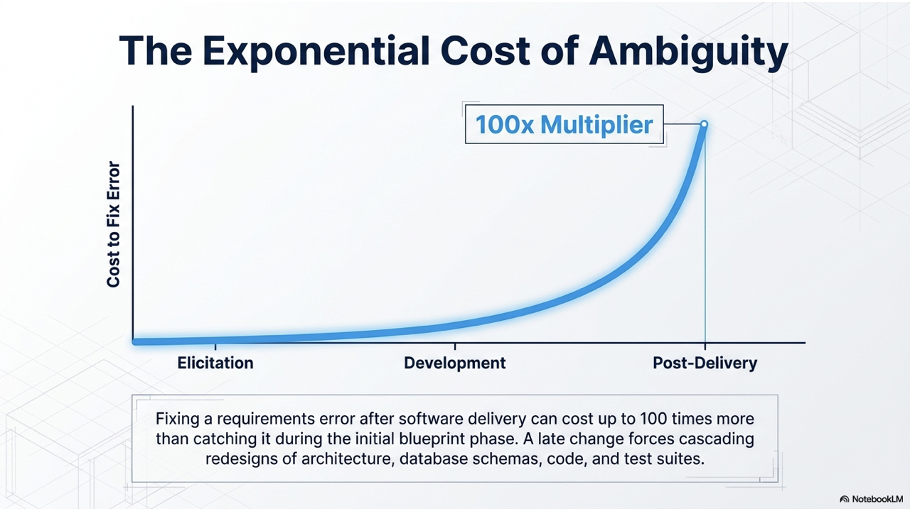

---

## What is Requirements Engineering?

* **Definition:**
  > The systematic process of establishing the services that a customer requires from a system and the operational/developmental constraints under which it operates.
* **Dual Function of Requirements:**
  1. **Contract Bidding:** High-level abstract statements open to contractor interpretation.
  2. **Contract Basis:** Detailed functional specification defining exact system implementation.

---
<!-- _class: full-image-slide -->

  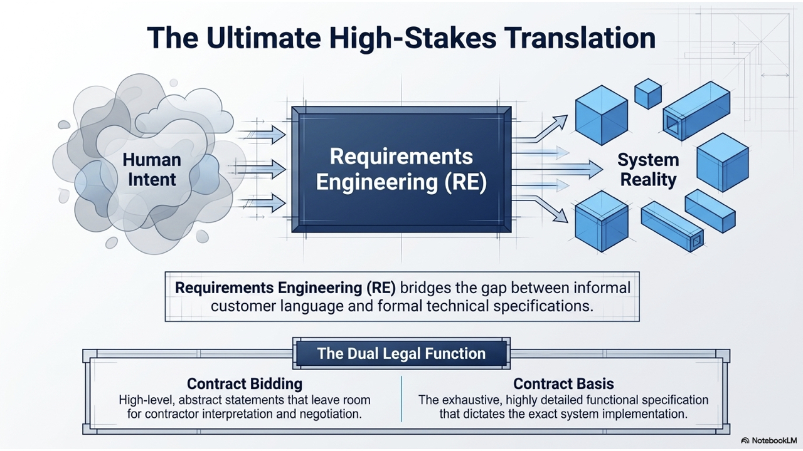

---

## User vs. System Requirements

* **User Requirements:**
  * High-level statements in natural language and intuitive diagrams outlining system services and operational constraints. Written primarily for **customers and end-users**.
* **System Requirements:**
  * Structured document setting out detailed descriptions of system functions, services, and operational constraints. Forms the basis of the **contract between client and contractor**.

---

## User vs. System Requirements Example

> **User Requirement Definition:**
> The Mentcare system shall generate monthly management reports showing the cost of drugs prescribed by each clinic during that month.

> **System Requirements Specification (Detailed):**
> 1. On the last working day of each month, a summary of drugs prescribed, cost, and clinics shall be generated.
> 2. The report shall be automatically generated after 17:30 on the last working day.
> 3. Access to all cost reports shall be restricted to authorized users on an access control list.

---
<!-- _class: full-image-slide -->

  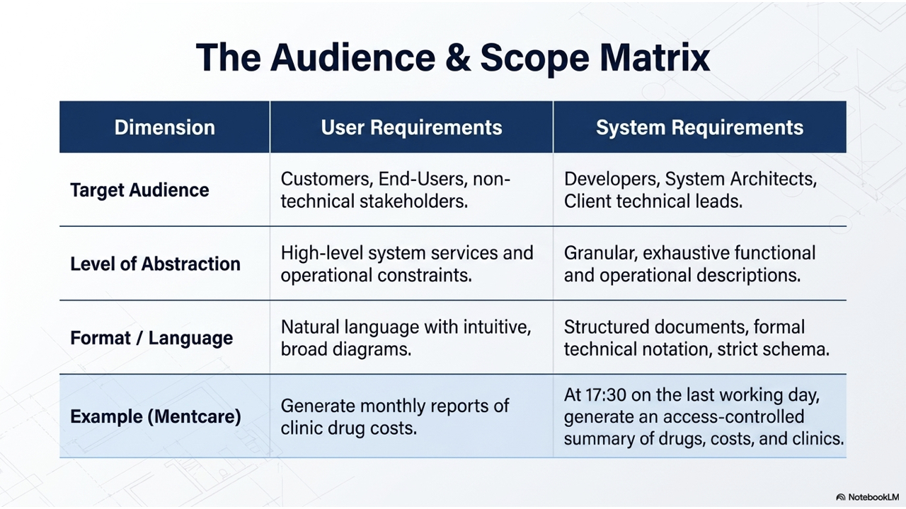

---

## System Stakeholders

* **Definition:** Any person or organization affected by the system who has a legitimate interest.
* **Types of Stakeholders:**
  * **End Users:** Patients, Doctors, Nurses, Receptionists.
  * **System Managers:** Clinic Managers, IT Staff.
  * **System Owners:** Hospital Board, Health Authority.
  * **External Stakeholders:** Medical Ethics Board, Government Regulators.

---

## Types of Requirements

1. **Functional Requirements:**
   * Statements of specific services the system should provide, how it reacts to particular inputs, or what it must *not* do.
2. **Non-Functional Requirements:**
   * Constraints on system services or functions (e.g., performance, response time, security, reliability).
3. **Domain Requirements:**
   * Constraints derived directly from the operational domain (e.g., medical safety regulations, banking standards).

---
<!-- _class: full-image-slide -->

  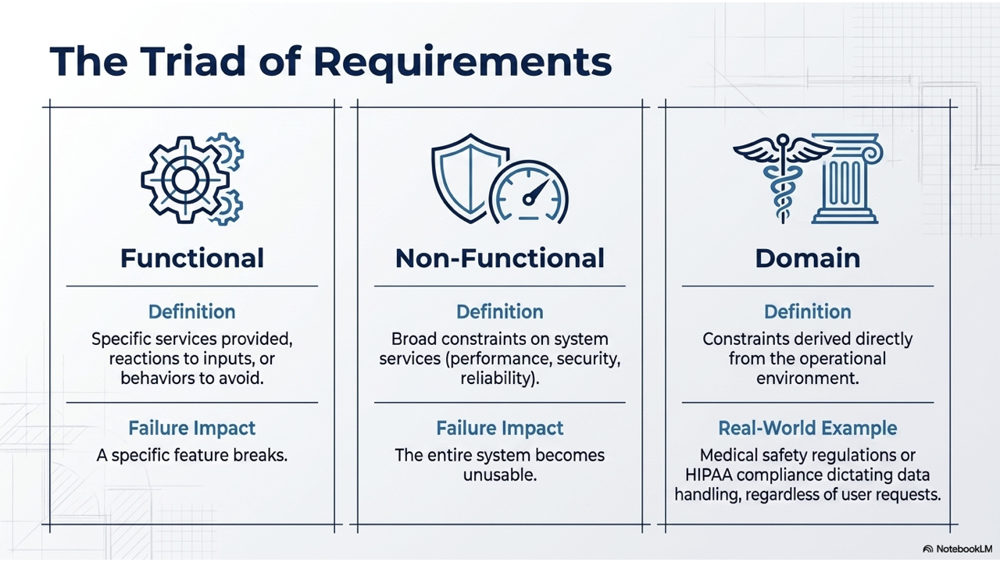

---

## Functional Requirements: Challenges

* **Requirements Imprecision:**
  * Ambiguous natural language requirements cause misunderstandings.
  * *Example:* "Search appointment list" — does it mean across *all* clinics (user intent) or within an *individual* clinic (developer assumption)?
* **Completeness vs. Consistency:**
  * **Complete:** Includes descriptions of all required facilities.
  * **Consistent:** Contains no conflicting or contradictory specifications.
  * *In practice, complete and consistent requirements are extremely difficult to achieve for complex systems.*

---
<!-- _class: full-image-slide -->

  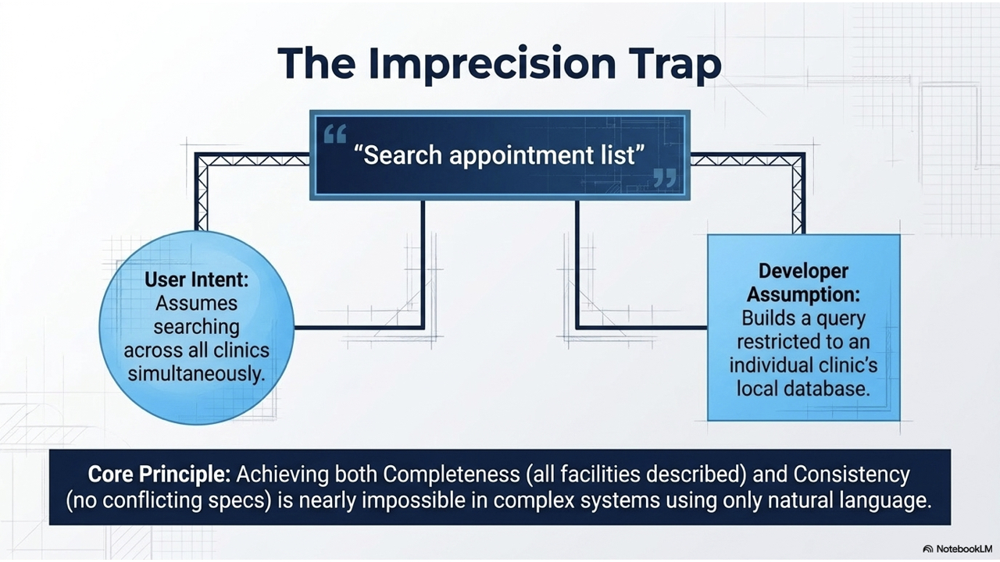

---

## Non-Functional Requirements (NFR)

* **System-Wide Impact:**
  * NFRs often apply to the system as a **whole** rather than individual features.
  * Failing to meet an NFR can render the entire system useless (e.g., a slow or insecure medical database).
* **Architectural Influence:**
  * Performance NFRs dictate module communication patterns; security NFRs introduce authentication infrastructure.

---
<!-- _class: full-image-slide -->

  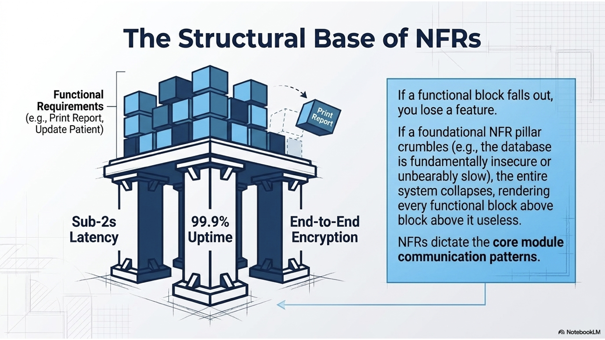

---

## Classification of Non-Functional Requirements

  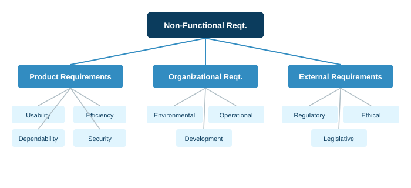

---

## Goals vs. Verifiable NFRs

* **Goal (Imprecise Intention):**
  > *"The system should be easy to use by medical staff and minimize user errors."*
* **Verifiable NFR (Testable Metric):**
  > *"Medical staff shall be able to use all core functions after 4 hours of training. After training, the average user error rate shall not exceed 2 errors per hour of use."*
* **Goal-Question-Metric (GQM) Approach:**
  * Define **Goals** $\rightarrow$ Ask key **Questions** $\rightarrow$ Specify measurable **Metrics**.

---
<!-- _class: full-image-slide -->

  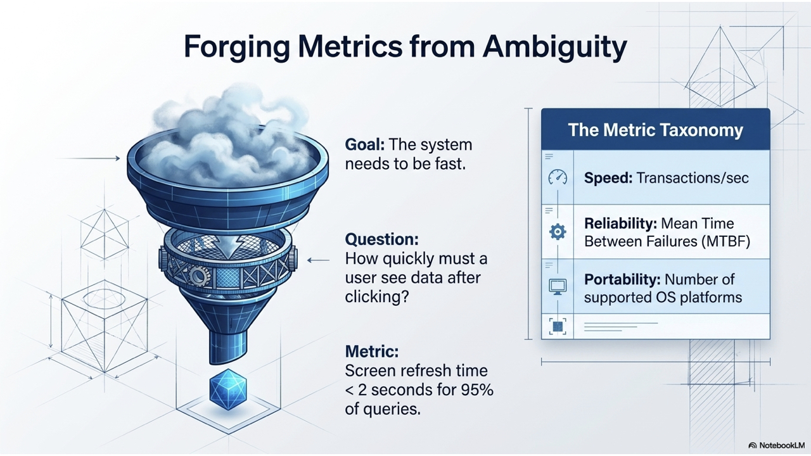

---

## Metrics for Specifying NFRs

| Property        | Measurable Metric Examples                                                   |
| -----------------| ------------------------------------------------------------------------------|
| **Speed**       | Transactions/second, User response time (<2s), Screen refresh time.          |
| **Size**        | Mbytes storage, Memory footprint.                                            |
| **Ease of Use** | Training time (hours), Number of help screens required.                      |
| **Reliability** | Mean Time Between Failures (MTBF), Availability percentage (99.9%).          |
| **Robustness**  | Time to restart after failure, Probability of data corruption.               |
| **Portability** | Percentage of target-dependent statements, Number of supported OS platforms. |

---

## Concept Check Question 1

  

Which category of requirements specifies constraints on system performance, reliability, and security across the system as a whole?

* **A.** Functional Requirements
* **B.** User Requirements
* **C.** Non-Functional Requirements
* **D.** Domain Requirements

  

  

    
  

---

## Concept Check Question 1: Answer

  

Which category of requirements specifies constraints on system performance, reliability, and security across the system as a whole?

* **Correct Answer: C**
* **Explanation:** Non-functional requirements specify constraints (timing, reliability, security, compliance) that apply to the system overall.

  

  

    
  

---

## The Requirements Engineering Process

* **Four Interleaved Activities:**
  1. **Elicitation & Analysis:** Discovering requirements from stakeholders.
  2. **Specification:** Documenting requirements formally.
  3. **Validation:** Checking that requirements meet customer needs.
  4. **Management:** Managing requirements change over time.

---
<!-- _class: full-image-slide -->

  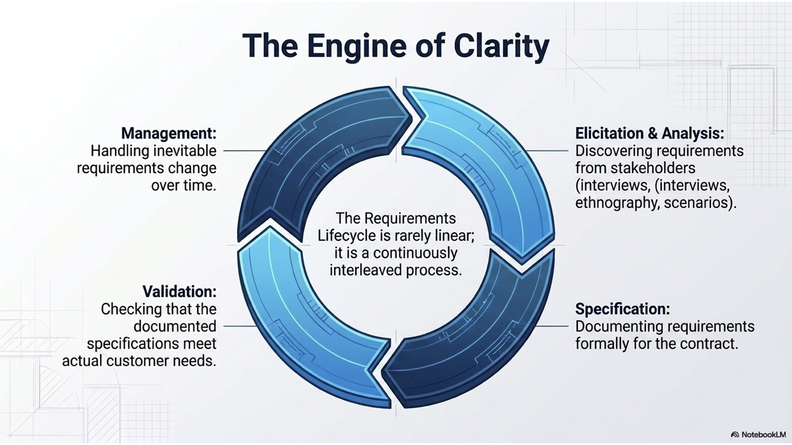

---

## Requirements Elicitation Loop

  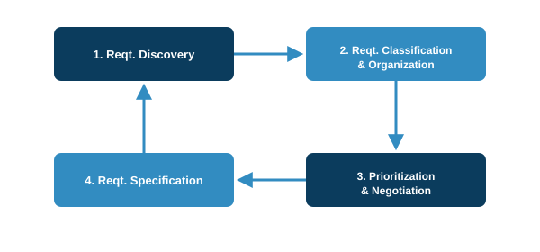

---

## Elicitation Techniques

* **Interviews:**
  * **Closed Interviews:** Fixed set of pre-determined questions.
  * **Open Interviews:** Exploratory discussions around user goals and workflows.
* **Ethnography (User Observation):**
  * Observing users in their actual working environment to discover implicit/unspoken requirements and operational nuances.
* **Stories & Scenarios:**
  * Real-life narrative examples detailing initial state, normal flow, exception handling, and concurrent tasks.

---

## Use Case Diagram Notation (UML)

* **Actors:** External entities (users or systems) interacting with the application.
* **Use Cases:** Ellipses representing high-level functional interactions.
* **System Boundary:** Box defining scope of the system.

---
<!-- _class: full-image-slide -->

  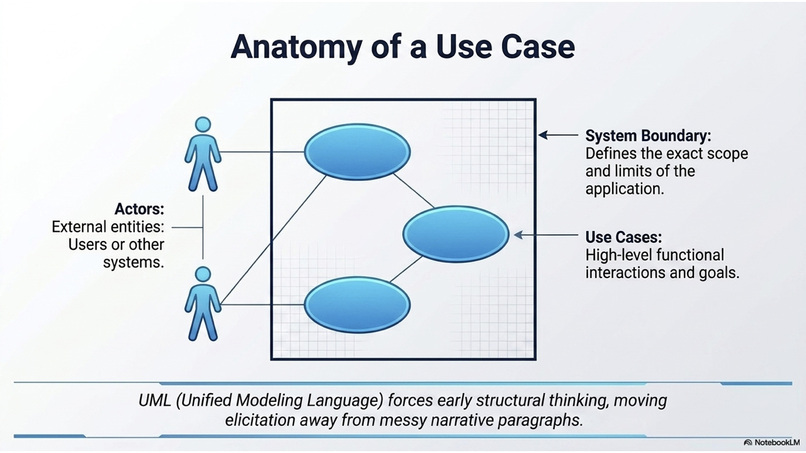

---

## Requirements Validation

* **High Cost of Requirements Errors:**
  * Fixing a requirements error after system delivery can cost **up to 100 times** more than fixing a coding bug!
* **5 Requirements Checks:**
  1. **Validity:** Does it reflect the true needs of stakeholders?
  2. **Consistency:** Are there any conflicting requirements?
  3. **Completeness:** Are all mandatory features specified?
  4. **Realism:** Can it be built within budget and technical constraints?
  5. **Verifiability:** Can it be objectively tested?

---
<!-- _class: full-image-slide -->

  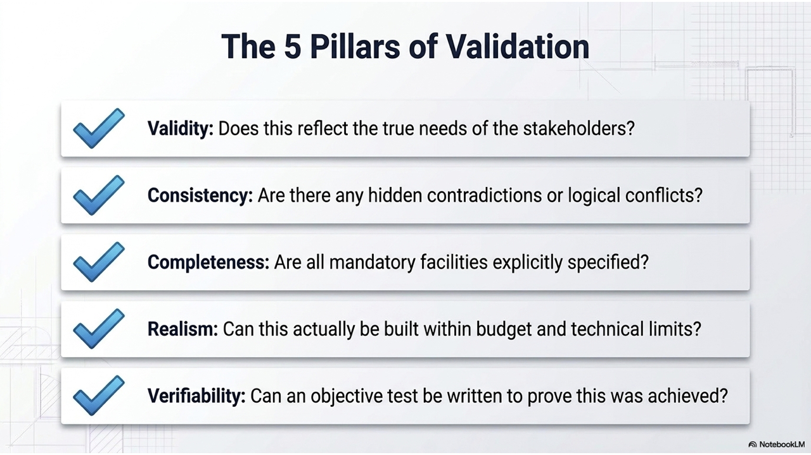

---

## Requirements Change & Management

* **Why Requirements Change:**
  * Business goals shift, new regulations emerge, payors and actual system users have conflicting demands.
* **Requirements Management Planning:**
  * **Unique Identification:** Tagging every requirement (e.g., `SRS-3.3.2`).
  * **Traceability Matrix:** Tracking dependencies between requirements and architecture modules.
  * **Change Control Board (CCB):** Formal process to evaluate cost, impact, and priority of proposed changes.

---
<!-- _class: full-image-slide -->

  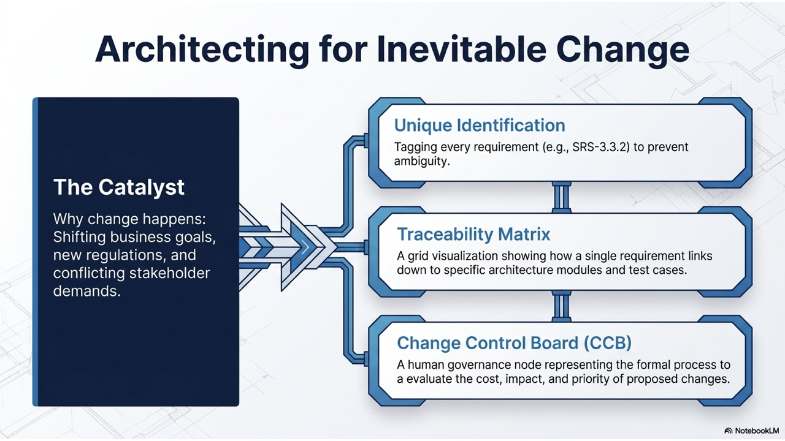

---

## AI in Requirements Engineering: Overview

* **The Generative AI Paradigm Shift:**
  * LLMs and Generative AI tools serve as an **intelligent RE Copilot** across the software engineering lifecycle.
  * Bridges the gap between informal customer language and formal technical specifications.
* **Key Benefit:** Accelerates elicitation, eliminates ambiguities early, and reduces requirements debt.

---
<!-- _class: full-image-slide -->

  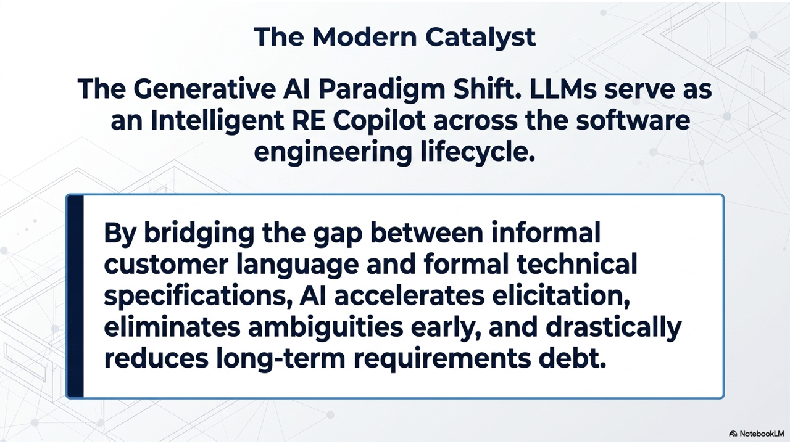

---

## 4 Core AI Applications in RE

1. **Automated User Story & Specification Generation:**
   * Converts raw client interview transcripts into structured `Given-When-Then` Gherkin acceptance criteria.
2. **Ambiguity & Inconsistency Detection:**
   * Scans SRS documents to flag non-verifiable adjectives (*"user-friendly"*, *"fast"*) and logical contradictions.
3. **NFR Metric Derivation & GQM Assistance:**
   * Translates abstract goals into quantitative metrics (e.g. *"System must be responsive"* &rarr; `p95 latency < 200ms`).
4. **Automated Requirements Traceability Matrix (RTM):**
   * Dynamically links user stories to code components and test cases to predict change impact.

---
<!-- _class: full-image-slide -->

  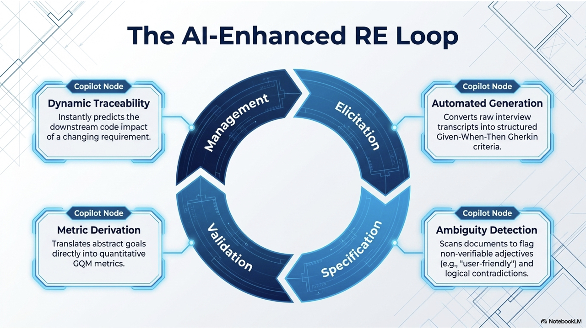

---

## Human-in-the-Loop: Risks & Best Practices

* **Risks of Unchecked AI in RE:**
  * **Hallucinations:** Inventing non-existent business rules or domain constraints.
  * **Privacy & IP Leaks:** Accidentally leaking proprietary business logic to public LLMs.
  * **Superficial Specs:** AI lacks deep organizational domain intuition and stakeholder empathy.
* **The Golden Rule:**
  > **AI is an Assistant, Not an Approver!**
  > Human Domain Experts and Product Managers MUST review, validate, and sign off on all AI-generated requirements.

---
<!-- _class: full-image-slide -->

  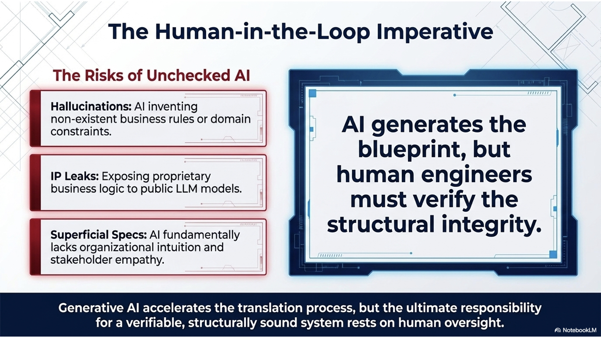

---

## Concept Check Question 2

  

Why is fixing a requirements error after software delivery significantly more expensive than fixing an error during development?

* **A.** Requirements documents cannot be edited after signing.
* **B.** Post-delivery fixes require re-designing, re-coding, and re-testing dependent modules across the entire system.
* **C.** Stakeholders refuse to approve requirements changes.
* **D.** Non-functional requirements do not apply after deployment.

  

  

    
  

---

## Concept Check Question 2: Answer

  

Why is fixing a requirements error after software delivery significantly more expensive than fixing an error during development?

* **Correct Answer: B**
* **Explanation:** A late requirements change impacts architecture, component design, database schemas, code, and test suites, cascading costs up to 100x.

  

  

    
  

---

## Recap: Fill-in-the-blank Quiz

  

Test your understanding of the core concepts in this chapter:

1. **`___`** requirements describe what the system should do, while **`___`** requirements specify system constraints.
2. High-level requirements written for customers are called **`___`** requirements.
3. The Goal-Question-Metric (GQM) approach turns general goals into verifiable **`___`**.
4. The **`___`** Control Board evaluates the impact and cost of proposed requirements changes.

  

  

    
  

---

## Recap: Answers & Summary

  

Here are the completed concepts:

1. **Functional** requirements describe what the system should do, while **non-functional** requirements specify system constraints.
2. High-level requirements written for customers are called **user** requirements.
3. The Goal-Question-Metric (GQM) approach turns general goals into verifiable **metrics**.
4. The **Change** Control Board evaluates the impact and cost of proposed requirements changes.

  

  

    
  

---

## References

* **Sommerville Software Engineering Book (Chapter 4)**
  * [IEEE 830 Recommended Practice for Software Requirements Specifications](https://standards.ieee.org/)
  * [UML Use Case Specification Standard](https://www.omg.org/spec/UML/)
