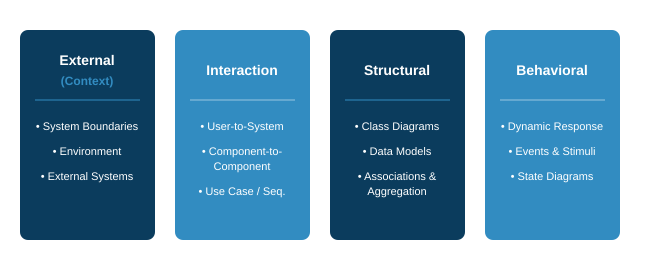
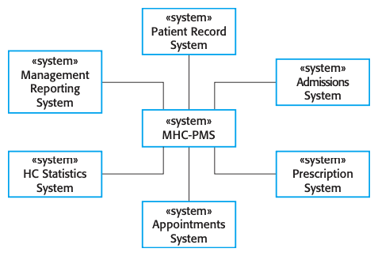
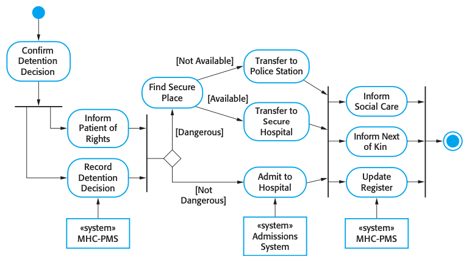
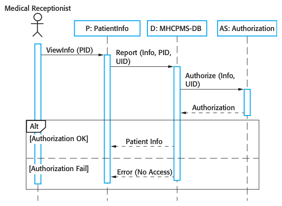
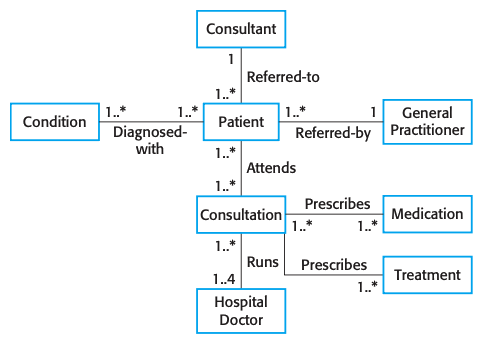
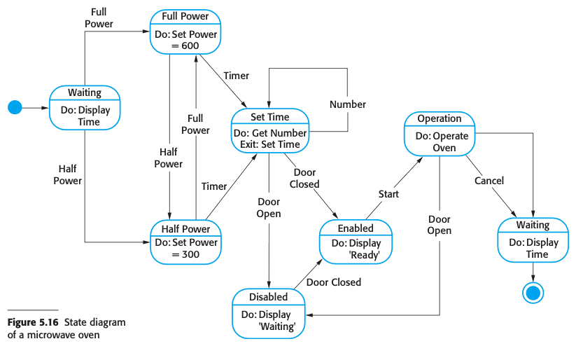
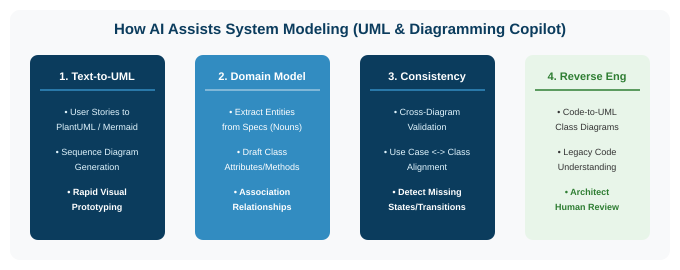

# Software Engineering

### Lecture 5: System Modeling

**Prof. Nien-Lin Hsueh**
Department of Information Engineering and Computer Science
Feng Chia University

---

## Focus Questions

* What is **System Modeling** and why do software engineers build abstract models?
* What are the **4 complementary perspectives** used to model software systems?
* How do **Context Models** define what is inside vs. outside system boundaries?
* How do **Interaction Models** (Use Cases & Sequence Diagrams) capture dynamic behavior?
* How do **Structural Models** (Class Diagrams, Generalization, Aggregation) represent system organization?
* How do **Behavioral Models** (State Diagrams & Activity Diagrams) handle data and events?
* How can **AI & LLMs** assist in automated System Modeling (UML, Sequence, Class Diagrams)?

---

## What is System Modeling?

* **Abstract Representation:**
  * System modeling is the process of developing abstract models of a system, with each model presenting a different view or perspective.
* **Graphical Standard (UML):**
  * Almost universally represented using graphical notations based on the **Unified Modeling Language (UML)**.
* **Purposes of System Modeling:**
  1. **Discussion:** Facilitating communication between engineers, analysts, and customers.
  2. **Documentation:** Documenting existing or proposed system architecture.
  3. **Implementation:** Generating executable code (Model-Driven Engineering).

---

## 4 System Modeling Perspectives

  

---

## 5 Essential UML Diagram Types

1. **Activity Diagram:** Shows the flow of activities involved in a process or data transformation.
2. **Use Case Diagram:** Shows interactions between a system and its external actors.
3. **Sequence Diagram:** Shows chronological interactions between actors and system objects over time.
4. **Class Diagram:** Shows object classes in the system and associations between them.
5. **State Diagram:** Shows how the system reacts to internal and external events.

---

## Context Models & System Boundaries

  

  * **Operational Context:**
    * Illustrates what lies *outside* system boundaries (other systems, databases, external services).
  * **System Boundaries:**
    * Defines what is inside vs. outside system scope.
    * Dictates system requirements and operational dependencies.

  

  

    
  

---

## Process Models & Activity Diagrams

  

  * **Business Process Workflow:**
    * While context models show system environment, process models show how the system is used in broader business workflows.
  * **UML Activity Diagrams:**
    * Model sequential, parallel, and conditional activities using swimlanes and decision nodes.

  

  

    
  

---

## Interaction Models

* **Purpose:**
  * Models interactions between **users and system**, **system to external systems**, or **internal components**.
* **Key UML Diagrams:**
  * **Use Case Diagrams:** High-level summary of system functions and external actors.
  * **Sequence Diagrams:** Detailed chronological message exchange between objects.

---

## Use Case Relationships: Include vs. Extend

* **`<<include>>` (Mandatory Relationship):**
  * The base use case *always* incorporates the behavior of the included use case.
  * Used to factor out common shared functionality (e.g., *Withdraw Cash* `<<include>>` *Authenticate User*).
* **`<<extend>>` (Optional / Conditional Relationship):**
  * The base use case is extended by another use case *only under specific conditions*.
  * Adds optional behavior without modifying the base use case (e.g., *Place Order* `<<extend>>` *Apply Coupon*).

---

## Sequence Diagrams

  

  * **Chronological Message Flow:**
    * Objects and actors are listed along the top; vertical lifelines represent time progression.
  * **Annotated Arrows:**
    * Synchronous calls, asynchronous messages, and return values detail object interactions during a use case instance.

  

  

    
  

---

## Concept Check Question 1

  

Which UML diagram is specifically designed to show chronological message exchanges between actors and system objects over time during a use case execution?

* **A.** Activity Diagram
* **B.** Class Diagram
* **C.** Sequence Diagram
* **D.** State Diagram

  

  

    
  

---

## Concept Check Question 1: Answer

  

Which UML diagram is specifically designed to show chronological message exchanges between actors and system objects over time during a use case execution?

* **Correct Answer: C**
* **Explanation:** Sequence diagrams list objects along the top and show chronological message calls down vertical lifelines.

  

  

    
  

---

## Structural Models & Class Diagrams

  

  * **Static Architecture:**
    * Displays the organization of a system in terms of object classes and associations.
  * **Class Components:**
    * Attributes (data) and Operations (methods).
  * **Associations:**
    * Define links and multiplicity (1:1, 1:N, N:M) between classes.

  

  

    
  

---

## Generalization (Inheritance)

* **Managing Complexity Through Abstraction:**
  * Higher-level superclasses define common attributes and operations; lower-level subclasses **inherit** these properties and add specific details.
* **Example Hierarchy:**
  * `Doctor` (Superclass) $\rightarrow$ `HospitalDoctor` and `GeneralPractitioner` (Subclasses) $\rightarrow$ `Consultant` and `TraineeDoctor`.
* **Object-Oriented Implementation:**
  * Implemented using class inheritance mechanisms (e.g., `extends` in Java/TypeScript).

---

## Aggregation (Whole-Part Relationships)

* **Aggregation Association:**
  * Indicates that an object is composed of or contains other object classes.
  * Represents a **"part-of"** relationship in semantic data models.
* **Encapsulation & Composition:**
  * Helps reduce complexity by grouping related components into higher-level composite structures.

---

## Behavioral Models

* **Dynamic Execution Modeling:**
  * Models system behavior when responding to environmental stimuli during execution.
* **Two Types of Stimuli:**
  1. **Data-Driven Processing:** System controlled by incoming data streams (e.g., business transaction processing).
  2. **Event-Driven Processing:** System driven by external/internal events causing state transitions (e.g., real-time control systems).

---

## State Machine Models

  

  * **Statechart Diagrams:**
    * Model system states as nodes and events/stimuli as transition arcs.
  * **Finite State Machine:**
    * System exists in a finite set of discrete states (e.g., *Waiting*, *Enabled*, *Cooking*, *Disabled*).
  * **Real-Time Systems:**
    * Ideal for modeling reactive hardware/software systems like microwave ovens, mobile devices, and automotive ACC.

  

  

    
  

---

## AI in System Modeling: Overview

* **The Graphical Modeling Revolution:**
  * LLMs convert natural language software specifications into **text-based UML diagrams** (PlantUML, Mermaid.js).
  * Serves as an **AI Diagramming Copilot** to rapidly visualize system interactions.

  

* **Key Benefit:** Accelerates model drafting and eliminates manual diagram formatting friction.

---

## 4 Core AI Applications in System Modeling

1. **Text-to-UML Generation:**
   * Generates Sequence, Class, and Activity diagrams directly from user story text.
2. **Domain Model Entity Extraction:**
   * Analyzes SRS documents to extract domain nouns (classes, attributes) and verbs (methods, associations).
3. **Cross-Diagram Consistency Validation:**
   * Scans Use Case actors, Class diagrams, and Sequence lifelines to detect mismatched component names.
4. **Code-to-Model Reverse Engineering:**
   * Analyzes complex legacy codebases to auto-generate UML class structures for developer onboarding.

---

## Human-in-the-Loop: Modeling Risks & Best Practices

* **Risks of Unchecked AI in System Modeling:**
  * **Hallucinated Associations:** Inventing non-existent inheritance or aggregation relationships.
  * **Model Bloat:** Creating over-engineered class hierarchies instead of clean object abstractions.
* **The Golden Rule:**
  > **AI Drafts the Diagram; Engineers Validate the Semantics!**
  > Software Architects must verify that generated UML models accurately represent system domain reality.

---

## Concept Check Question 2

  

In UML Use Case modeling, what is the main difference between an `<<include>>` and an `<<extend>>` relationship?

* **A.** `<<include>>` is optional; `<<extend>>` is mandatory.
* **B.** `<<include>>` is mandatory shared behavior; `<<extend>>` is conditional behavior added under specific rules.
* **C.** `<<include>>` applies only to actors; `<<extend>>` applies only to classes.
* **D.** There is no difference in UML.

  

  

    
  

---

## Concept Check Question 2: Answer

  

In UML Use Case modeling, what is the main difference between an `<<include>>` and an `<<extend>>` relationship?

* **Correct Answer: B**
* **Explanation:** `<<include>>` represents mandatory shared functionality; `<<extend>>` represents optional/conditional functionality added to a base use case.

  

  

    
  

---

## Recap: Fill-in-the-blank Quiz

  

Test your understanding of the core concepts in this chapter:

1. **`___`** diagrams show the operational boundary between a system and external systems.
2. In UML, a **`___`** diagram models chronological message passing between objects over time.
3. Class **`___`** (inheritance) allows subclasses to inherit attributes and operations from a superclass.
4. **`___`** machine models describe system responses to discrete events by transitioning between states.

  

  

    
  

---

## Recap: Answers & Summary

  

Here are the completed concepts:

1. **Context** diagrams show the operational boundary between a system and external systems.
2. In UML, a **sequence** diagram models chronological message passing between objects over time.
3. Class **generalization** (inheritance) allows subclasses to inherit attributes and operations from a superclass.
4. **State** machine models describe system responses to discrete events by transitioning between states.

  

  

    
  

---

## References

* **Sommerville Software Engineering Book (Chapter 5)**
  * [OMG Unified Modeling Language (UML) Specification](https://www.omg.org/spec/UML/)
  * [Lucidchart UML Modeling Guide](https://www.lucidchart.com/pages/uml-user-guide)
