# Software Engineering

### Lecture 5a: Use Case Diagrams

**Prof. Nien-Lin Hsueh**
Department of Information Engineering and Computer Science
Feng Chia University

---

## Use Case Diagrams

> "Use case diagrams represent the functional requirements of a system in terms of actors and use cases. They specify the interactions between external entities (actors) and the system, defining system boundaries and the services provided."
> — *UML Specification Standard*

* **Core Components:**
  * **Actors (👤):** Roles played by human users, external systems, or devices.
  * **Use Cases (🟢):** Discrete tasks or business goals accomplished through the system.
  * **System Boundary:** Defines the scope of what is inside the system vs. outside.
* **Tabular Descriptions:**
  * Diagrams only show high-level relationships; they must be paired with structured **Use Case Descriptions** to detail the sequential flows of events.

---

## Key Notices when Designing Use Cases

* **Use Cases are NOT Functions:**
  * A use case represents a complete, end-to-end user goal (e.g., *Register Patient*), not a single software function or button click (e.g., *Click Save*, *Validate Input*).
* **Focus on Customer/Actor Value:**
  * Every use case should deliver observable value to an actor. If it doesn't help the actor achieve a goal, it shouldn't be a use case.
* **Describe "What", Not "How":**
  * Focus on the system's external behavior and interactions, rather than internal implementation details (e.g., database queries, UI layouts).
* **Avoid Decomposition Abuse:**
  * Do not decompose a system into hundreds of tiny use cases. A system typically has between 10 to 30 core use cases.

---

## Example 1: Medical System Use Case Diagram

  

---

## Explaining the Medical System Diagram

* **Widescreen Logical Partitioning:**
  * The system is divided into three key sub-domains to organize use cases:
    * **Patient Admission:** Entry point activities handled by the receptionist.
    * **Clinical Management:** Treatment activities shared by nurses and doctors.
    * **Administration:** Reporting tasks restricted to managers.
* **Actors Represent Roles, Not People:**
  * An actor is a *role* played by a user. For example, a single person can act as a `Nurse` and later as a `Manager`, interacting with different use cases.
* **Association vs. Authorization:**
  * The solid association line indicates that the actor *initiates* or *participates* in the use case. It is not a security authorization matrix.

---

## Example 2: Online Shopping Use Case Diagram

  

---

## Explaining the Online Shopping Diagram

* **Primary vs. Supporting Actors:**
  * **Customer (Primary):** Initiates interactions to achieve business goals (`Browse Items`, `Checkout`).
  * **Payment Gateway (Supporting/System):** An external service provider required to complete the checkout flow.
  * **Administrator (Supporting/Staff):** Responsible for backend operational use cases (`Manage Inventory`).
* **Essential Inclusion (`<<include>>`):**
  * The checkout process *always* triggers the payment authorization. The `Checkout` use case cannot complete without invoking `Authorize Payment`.

---

## Use Case Description

* **Tabular Template Structure:**
  * While diagrams capture actor-system relationships at a glance, a **Use Case Description** specifies the exact behavioral details of a single use case using a structured template.
* **Essential Elements:**
  * **Name / Actor:** Identifies the use case and the primary actor initiating it.
  * **Pre-conditions:** System state required before the use case can start.
  * **Post-conditions:** System state guaranteed upon successful completion.
  * **Flow of Events:** Sequential steps of interaction (Main Success Scenario).
  * **Alternative / Exception Flows:** Handling of errors or choices (e.g., duplicate records, invalid data).

---

## Use Case Description Example: Register Patient

| Field | Description |
| :--- | :--- |
| **Use Case Name** | Register Patient |
| **Actors** | Medical Receptionist (Primary) |
| **Pre-conditions** | Receptionist is logged in; patient is not yet registered. |
| **Post-conditions** | Patient record is created; unique patient ID is assigned. |
| **Main Success Flow** | 1. Receptionist inputs patient's personal and contact details. 2. System validates details and checks for duplicate records. 3. System creates a new patient record and generates a unique ID. 4. System displays confirmation message to receptionist. |
| **Alternative Flows** | **2a. Duplicate Record Found:** System alerts receptionist, displays existing record, and aborts creation. **2b. Invalid Data:** System highlights errors and prompts for corrections. |

---

## Use Case Relationships: Include vs. Extend

* **`<<include>>` (Mandatory Relationship):**
  * The base use case *always* incorporates the behavior of the included use case.
  * Used to factor out common shared functionality (e.g., *Withdraw Cash* `<<include>>` *Authenticate User*).
* **`<<extend>>` (Optional / Conditional Relationship):**
  * The base use case is extended by another use case *only under specific conditions*.
  * Adds optional behavior without modifying the base use case (e.g., *Place Order* `<<extend>>` *Apply Coupon*).

---

## Include & Extend in the Medical System

* **`<<include>>` (Mandatory/Shared Example):**
  * Both **`Edit record`** and **`Setup consultation`** must locate and open the correct patient profile.
  * *Relationship:* `Edit record` and `Setup consultation` `<<include>>` **`Search patient database`**.
* **`<<extend>>` (Optional/Conditional Example):**
  * Creating a patient record is standard, but registering special allergy alerts is conditional on whether the patient has high-risk allergies.
  * *Relationship:* **`Register allergy alert`** `<<extend>>` `Register patient` (Condition: *If patient has known drug allergies*).

---

## Example: Include & Extend Relationships Diagram

  

---

## Concept Check Question 1

  

What is the primary difference between `<<include>>` and `<<extend>>` in use case modeling?

* **A.** `<<include>>` is optional behavior, while `<<extend>>` is mandatory behavior.
* **B.** `<<include>>` is mandatory shared behavior, while `<<extend>>` is optional/conditional behavior.
* **C.** `<<include>>` shows inheritance, while `<<extend>>` shows whole-part relationships.
* **D.** `<<include>>` links actors together, while `<<extend>>` links use cases together.

  

  

    
  

---

## Concept Check Question 1: Answer

  

**Correct Answer: B**

* **Explanation:**
  * **`<<include>>`** represents mandatory behavior that is factored out and shared by multiple use cases (e.g., *Authenticate User* is included in *Withdraw Cash*).
  * **`<<extend>>`** represents optional or conditional behavior that extends a base use case under specific conditions.

  

  

    
  

---

## Concept Check Question 2

  

Which of the following is a common pitfall (mistake) when designing use case diagrams?

* **A.** Modeling actors as roles rather than individual people.
* **B.** Restricting the system to 10–30 core use cases.
* **C.** Decomposing use cases into single software functions (e.g., "Click Save", "Validate Password").
* **D.** Including external systems or hardware devices as actors.

  

  

    
  

---

## Concept Check Question 2: Answer

  

**Correct Answer: C**

* **Explanation:**
  * A use case must represent a complete, end-to-end user goal that delivers value, not a single software function or click (e.g., *Register Patient* vs. *Click Save*).
  * Decomposing use cases into individual UI actions or code functions is a common functional decomposition mistake.

  

  

    
  

