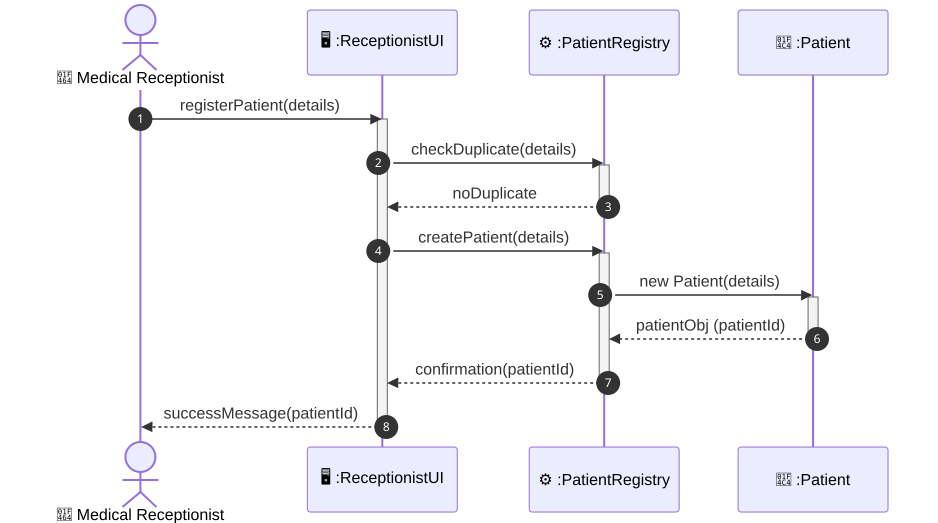
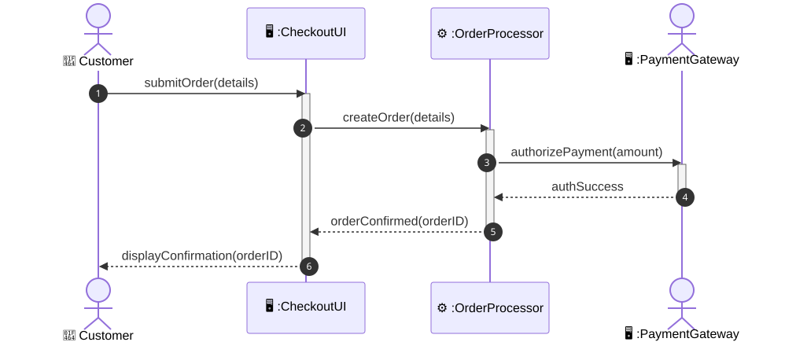
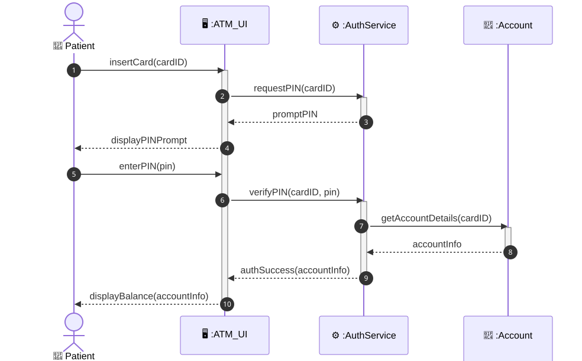

# Software Engineering

### Lecture 5b: Sequence Diagrams in Detail

**Prof. Nien-Lin Hsueh**
Department of Information Engineering and Computer Science
Feng Chia University

---

## What is a Sequence Diagram?

> "A sequence diagram is an interaction diagram that models a single scenario executing in the system. It shows the sequence of events that occur when an actor uses a system to carry out a process."
> — *Ian Sommerville, Software Engineering (10th Ed.)*

* **Interaction Model:**
  * Captures how actors and objects **collaborate over time** by exchanging messages.
  * Represents a **single execution path** (one scenario) of a use case.
* **Core Purpose:**
  * Bridge the gap between high-level use case requirements and low-level code design.
  * Clarify the **order of operations** and **responsibilities** of each participating object.

---

## Key Components of a Sequence Diagram

| Symbol | Name | Description |
| :--- | :--- | :--- |
| **Vertical Dashed Line** | Lifeline | Represents the existence of an object/actor over time |
| **Thin Vertical Box** | Activation | Period when an object is actively processing a message |
| **Solid Arrow (filled head)** | Synchronous Message | Blocking call; sender waits for a response |
| **Solid Arrow (open head)** | Asynchronous Message | Non-blocking; sender continues without waiting |
| **Dashed Arrow** | Return Message | Returns data/control back to the caller |
| **Self-loop Arrow** | Self-Call | An object invoking its own internal operation |

---

## Key Notices when Designing Sequence Diagrams

* **Model One Scenario at a Time:**
  * A sequence diagram covers **one specific execution path** of a use case. Use separate diagrams for alternate flows (error handling, edge cases).
* **Align with Use Case Descriptions:**
  * Actor names, boundary objects, and message names must **map 1-to-1** with the corresponding Use Case Description table.
* **Time Always Flows Downward:**
  * The vertical axis represents time. Earlier messages appear **higher**; later messages appear **lower**. Never draw return arrows going above the originating call.
* **Avoid Over-Detailing:**
  * Do not model trivial setter/getter calls or database connection setups. Focus on **meaningful, high-level message exchanges** relevant to the use case.
* **Objects, Not Classes:**
  * Lifeline headers are **object instances** (e.g., `:PatientRegistry`, `:Order`). The colon (`:`) prefix indicates an *instance*, not a class name.

---

## Example 1: Register Patient (Medical System)

  

---

## Explaining the Register Patient Diagram

* **Objects Represented (Lifelines):**
  * `👤 Medical Receptionist` — Actor initiating the registration.
  * `🖥️ :ReceptionistUI` — Boundary object (the user interface screen).
  * `⚙️ :PatientRegistry` — Control object coordinating registration logic.
  * `📄 :Patient` — Entity object storing the patient record.
* **Step-by-Step Flow:**
  * **①–③:** Receptionist inputs patient details; UI calls Registry to check for duplicate records.
  * **④–⑥:** UI commands Registry to create the patient; Registry instantiates a new `:Patient` object, which returns a unique patient ID.
  * **⑦–⑧:** Confirmation is returned through the UI back to the receptionist.
* **Key Design Decision:**
  * The *duplicate check* occurs **before** patient creation — preventing data integrity issues via the *fail-fast* principle.

---

## Example 2: Online Shopping Checkout

  

---

## Explaining the Online Shopping Checkout Diagram

* **Objects Represented (Lifelines):**
  * `👤 Customer` — Actor initiating the checkout process.
  * `🖥️ :CheckoutUI` — Boundary object (the shopping cart/checkout page).
  * `⚙️ :OrderProcessor` — Control object coordinating order creation and payment.
  * `🖥️ :PaymentGateway` — External system actor (outside the system boundary).
* **Step-by-Step Flow:**
  * **①:** Customer submits the order via the checkout UI.
  * **②:** UI delegates order creation to the `OrderProcessor`.
  * **③:** `OrderProcessor` calls the external `PaymentGateway` to authorize payment.
  * **④:** Gateway returns a success response (dashed return arrow).
  * **⑤–⑥:** Order confirmation propagates back through `OrderProcessor` and UI to the customer.
* **Key Design Insight:**
  * Dashed return arrows (④, ⑤, ⑥) clearly distinguish **responses** from **requests** (solid arrows ①–③).

---

## Example 3: ATM Card Authentication

  

---

## Explaining the ATM Authentication Diagram

* **Objects Represented (Lifelines):**
  * `👤 Patient` — Bank customer interacting with the ATM machine.
  * `🖥️ :ATM_UI` — Boundary object (ATM screen and keypad interface).
  * `⚙️ :AuthService` — Control object performing card and PIN verification.
  * `📄 :Account` — Entity object storing account information.
* **Step-by-Step Flow:**
  * **①–③:** Customer inserts card; `AuthService` is asked to request a PIN, which the UI then prompts.
  * **④–⑤:** Customer enters PIN; UI forwards it to `AuthService` for verification.
  * **⑥–⑦:** `AuthService` queries the `:Account` entity to retrieve account info.
  * **⑧–⑨:** Authentication success is confirmed and the UI displays the account balance.
* **Boundary–Control–Entity Pattern:**
  * The actor **never** interacts directly with Entity objects. All access flows: **UI → Controller → Entity**.

---

## Sequence Diagram vs. Use Case: How They Relate

  

  **Use Case Diagram**
  * Shows *what* users can do with the system.
  * High-level — no timing or ordering.
  * Each oval = one user goal.
  * Actors shown as associations to use cases.

  

  

  **Sequence Diagram**
  * Shows *how* the system fulfills one use case.
  * Detailed — time-ordered, step-by-step.
  * Each diagram = one scenario of one use case.
  * Objects exchange numbered messages over time.

  

> 📌 **Rule:** For every important use case, draw at least one sequence diagram — one for the main success scenario, and separate ones for significant alternate flows.

---

## Concept Check Question 1

  

In a UML sequence diagram, what does the **vertical dashed line** extending downward from an object or actor represent?

* **A.** Activation box
* **B.** Lifeline
* **C.** Return message
* **D.** System boundary

  

  

    
  

---

## Concept Check Question 1: Answer

  

**Correct Answer: B**

* **Explanation:**
  * The **Lifeline** (vertical dashed line) represents the **existence** of an object or actor throughout the scenario timeline.
  * The **Activation box** (thin solid rectangle drawn *on* the lifeline) represents the period during which that object is **actively processing** a message.
  * Both are essential — the lifeline shows presence, the activation shows activity.

  

  

    
  

---

## Concept Check Question 2

  

Which of the following best describes the **purpose** of a sequence diagram?

* **A.** Show the static class hierarchy and inheritance of the system.
* **B.** Model a single execution scenario of a use case, showing message exchanges over time.
* **C.** Define the system boundary and list all external actors.
* **D.** Describe the pre-conditions and post-conditions of a use case.

  

  

    
  

---

## Concept Check Question 2: Answer

  

**Correct Answer: B**

* **Explanation:**
  * A sequence diagram models **one specific scenario** of a use case — showing how actors and objects interact in chronological order via messages.
  * **A** describes a *Class Diagram*; **C** describes a *Use Case Diagram*; **D** describes a *Use Case Description table*.
  * Sequence diagrams bridge the gap between requirements (use cases) and implementation (code design).

  

  

    
  

---

## Concept Check Question 3

  

In the **Boundary–Control–Entity** (BCE) pattern, which layer is responsible for coordinating business logic?

* **A.** Boundary
* **B.** Actor
* **C.** Control
* **D.** Entity

  

  

    
  

---

## Concept Check Question 3: Answer

  

**Correct Answer: C**

* **Explanation:**
  * The **Control** object (e.g., `:PatientRegistry`, `:AuthService`, `:OrderProcessor`) coordinates the business logic for a use case.
  * The **Boundary** object handles interaction with the actor (the UI layer).
  * The **Entity** object holds persistent data (e.g., `:Patient`, `:Account`).
  * **Rule:** Actors never interact directly with Entity objects — all access flows: **Boundary → Control → Entity**.

  

  

    
  

