# Software Engineering

### Lecture 5c: Class Diagrams in Detail

**Prof. Nien-Lin Hsueh**
Department of Information Engineering and Computer Science
Feng Chia University

---

## What is a Class Diagram?

> "A class diagram describes the types of objects in the system and the various kinds of static relationships that exist among them. Class diagrams also show the properties and operations of a class and the constraints that apply to the way objects are connected."
> — *UML Reference Manual, Rumbaugh et al.*

* **Structural Model:**
  * Depicts the **static architecture** of a system — what objects exist and how they relate, independent of time.
* **Core Purpose:**
  * Define the data structure and object relationships used throughout the system.
  * Serve as the blueprint for code implementation (classes, attributes, methods).

---

## Key Components of a Class Diagram

| Element | Notation | Description |
| :--- | :--- | :--- |
| **Class** | Rectangle with 3 sections | Name, attributes, and operations |
| **Attribute** | `+ name: Type` | Data stored in each object instance |
| **Operation** | `+ method(): ReturnType` | Behavior that the class can perform |
| **Association** | Solid line | General relationship between two classes |
| **Multiplicity** | `1`, `0..*`, `1..*` | Number of instances in a relationship |
| **Aggregation** | Diamond (open) | "Has-a" whole-part relationship |
| **Composition** | Diamond (filled) | "Owns-a" strong ownership relationship |
| **Generalization** | Arrow (hollow head) | Inheritance: subclass extends superclass |

---

## Class Notation: Anatomy

<div class="split55">
  <div class="left">

  **Visibility Modifiers:**
  * `+` Public — accessible by all
  * `-` Private — accessible only within the class
  * `#` Protected — accessible by subclasses
  * `~` Package — accessible within the package

  **Naming Conventions:**
  * Class names: `PascalCase` (e.g., `PatientRecord`)
  * Attributes: `camelCase` (e.g., `patientID`)
  * Operations: `camelCase` with `()` suffix (e.g., `register()`)

  </div>
  <div class="right text-left">

  **Example Class:**

  ```
  ┌─────────────────┐
  │    Patient      │  ← Class name
  ├─────────────────┤
  │ + patientID     │  ← Attributes
  │ + name: String  │
  │ + dob: Date     │
  ├─────────────────┤
  │ + register()    │  ← Operations
  │ + getDetails()  │
  └─────────────────┘
  ```

  </div>
</div>

---

## Key Notices when Designing Class Diagrams

* **Classes Represent Concepts, Not UI or Functions:**
  * A class should model a **domain concept** (e.g., `Patient`, `Order`) — not a screen, button, or database table.
* **Keep Associations Meaningful:**
  * Only draw associations that have semantic significance in the domain. Avoid cluttering diagrams with trivial links.
* **Use Multiplicity Carefully:**
  * Always specify multiplicity (`1`, `0..*`, `1..*`) on both ends of an association. It clarifies critical business rules.
* **Generalization ≠ Everything:**
  * Use inheritance (`extends`) only when a true "is-a" relationship exists. Prefer composition ("has-a") for flexibility.
* **Avoid Over-Engineering:**
  * Start with 5–15 core domain classes. Add detail incrementally. An overloaded diagram is harder to understand than code.

---

## Relationships: Association, Aggregation & Composition

<div class="split55">
  <div class="left">

  **Association** (general link)
  * Two classes are related but independent.
  * Example: `Customer` places `Order`

  **Aggregation** (weak whole-part)
  * The "part" can exist independently.
  * Example: `Department` has `Employee` (employee can exist without department)

  </div>
  <div class="right text-left">

  **Composition** (strong whole-part)
  * The "part" cannot exist without the "whole".
  * Example: `Order` contains `OrderItem` (item deleted if order is deleted)

  **Generalization** (inheritance)
  * Subclass *is-a* superclass with added specifics.
  * Example: `HospitalDoctor` *extends* `Doctor`

  </div>
</div>

---

## Example 1: Medical System Class Diagram

<div style="text-align: center; margin-top: 10px;">
  
</div>

---

## Explaining the Medical System Class Diagram

* **Core Classes:**
  * `Patient` — central entity; links to doctors, conditions, and consultations.
  * `Consultation` — records each medical encounter; prescribes medications and treatments.
  * `HospitalDoctor`, `Consultant`, `GeneralPractitioner` — three doctor roles with distinct responsibilities.
* **Key Associations & Multiplicity:**
  * A `Patient` can be diagnosed with **many** `Condition` objects (`1..*`).
  * A `Patient` attends **many** `Consultation` sessions; each session is run by **1 to 4** `HospitalDoctor` instances.
  * Each `Consultation` can prescribe **many** `Medication` and `Treatment` objects.
* **Design Decision:**
  * `Consultant` and `GeneralPractitioner` are separated because they have **distinct referral roles** — a Consultant accepts referrals; a GP initiates them.

---

## Example 2: Online Shopping Class Diagram

<div style="text-align: center; margin-top: 10px;">
  
</div>

---

## Explaining the Online Shopping Class Diagram

* **Core Classes:**
  * `Customer` — the primary actor; maintains a `ShoppingCart` and places `Order` objects.
  * `Order` — composed of one or more `OrderItem` objects (composition: items cannot exist without an order).
  * `Product` — the item being sold; referenced by `OrderItem` but exists independently.
  * `Payment` — records the financial transaction tied 1-to-1 to each `Order`.
* **Key Relationships:**
  * `Customer → ShoppingCart`: Each customer has exactly **one** cart at any time.
  * `Order ◆── OrderItem`: **Composition** — `OrderItem` is destroyed when the `Order` is cancelled.
  * `OrderItem → Product`: **Association** — products exist independently of orders.
* **Design Insight:**
  * Separating `OrderItem` from `Product` allows products to be **updated independently** without affecting existing order records (historical data integrity).

---

## Generalization (Inheritance) in Class Diagrams

<div style="text-align: center; margin-top: 10px;">
  
</div>

---

## Explaining the Doctor Generalization Hierarchy

* **Superclass `Doctor`:**
  * Defines the common attributes (`staffID`, `name`, `licenseNo`) and operations (`diagnose()`, `prescribe()`) shared by **all** types of doctors.
* **First-Level Subclasses:**
  * `HospitalDoctor` — specializes for ward-based hospital practice; adds `department` and `ward`.
  * `GeneralPractitioner` — specializes for clinic-based practice; adds `clinicAddress` and referral behavior.
* **Second-Level Subclasses (from HospitalDoctor):**
  * `Consultant` — senior specialist who `acceptReferral()`; adds `specialty` attribute.
  * `TraineeDoctor` — junior doctor under supervision; adds `trainingYear` and `logActivity()`.
* **Why Generalization?**
  * Avoids duplicating common attributes/operations across all doctor types.
  * Allows **polymorphism** — a `Consultation` can reference any `Doctor` subtype uniformly.

---

## Aggregation Example: Hospital Structure

<div class="split55">
  <div class="left">

  **Aggregation (Weak Whole-Part):**
  * `Hospital` **aggregates** `Department` objects.
  * A `Department` can exist independently (transferred or restructured).

  **Composition (Strong Whole-Part):**
  * `Hospital` **composes** `Ward` objects.
  * A `Ward` cannot meaningfully exist outside a `Hospital`.

  **Key Rule:**
  * Use *Aggregation* when parts have independent lifecycles.
  * Use *Composition* when parts are destroyed with the whole.

  </div>
  <div class="right text-left">

  ```
  Hospital ◇──── Department
  (aggregation: open diamond)
  Department may exist if
  Hospital is restructured.

  Hospital ◆──── Ward
  (composition: filled diamond)
  Ward is deleted if
  Hospital is closed.

  Department ◇──── Employee
  (aggregation)
  Employee may transfer to
  another Department.
  ```

  </div>
</div>

---

## Class Diagram vs. Other UML Diagrams

| Diagram | Perspective | Time-based? | Shows |
| :--- | :--- | :--- | :--- |
| **Class Diagram** | Structural | No (static) | Classes, attributes, relationships |
| **Sequence Diagram** | Interaction | Yes (dynamic) | Objects + message exchanges over time |
| **Use Case Diagram** | Functional | No (static) | Actors + goals (use cases) |
| **State Diagram** | Behavioral | Yes (dynamic) | States + transitions on events |

> 📌 **Rule:** Class diagrams show *what exists*; sequence diagrams show *what happens* at runtime using those same classes.

---

## Concept Check Question 1

<div class="ccq-columns">
  <div class="ccq-text">

Which UML class diagram relationship should you use when the "part" **cannot exist** without the "whole" (e.g., an `OrderItem` cannot exist without its `Order`)?

* **A.** Association
* **B.** Aggregation
* **C.** Composition
* **D.** Generalization

  </div>
  <div class="ccq-logo">
    
  </div>
</div>

---

## Concept Check Question 1: Answer

<div class="ccq-columns">
  <div class="ccq-text">

**Correct Answer: C**

* **Explanation:**
  * **Composition** (filled diamond ◆) represents a strong whole-part relationship where the part's **lifecycle is controlled by the whole**. If the `Order` is deleted, all its `OrderItem` objects are also deleted.
  * **Aggregation** (open diamond ◇) is weaker — the part can exist independently (e.g., `Department` and `Employee`).
  * **Association** is a general link with no ownership semantics.

  </div>
  <div class="ccq-logo">
    
  </div>
</div>

---

## Concept Check Question 2

<div class="ccq-columns">
  <div class="ccq-text">

In a UML class diagram, what does the multiplicity `1..*` on an association end mean?

* **A.** Exactly one instance
* **B.** Zero or more instances
* **C.** One or more instances (at least one required)
* **D.** Zero or one instance (optional)

  </div>
  <div class="ccq-logo">
    
  </div>
</div>

---

## Concept Check Question 2: Answer

<div class="ccq-columns">
  <div class="ccq-text">

**Correct Answer: C**

* **Explanation:**
  * `1..*` means **one or more** — at least one instance must exist, but there is no upper limit.
  * `1` = exactly one; `0..*` (or `*`) = zero or more; `0..1` = optional (zero or one).
  * Example: A `Consultation` must have `1..*` prescriptions — there must be at least one prescription, otherwise the consultation has no clinical outcome.

  </div>
  <div class="ccq-logo">
    
  </div>
</div>

---

## Concept Check Question 3

<div class="ccq-columns">
  <div class="ccq-text">

Which of the following is the correct principle for using **Generalization** (inheritance) in a class diagram?

* **A.** Use it whenever two classes share any attribute.
* **B.** Use it only when a true "is-a" relationship exists between the subclass and superclass.
* **C.** Use it to model part-of relationships between objects.
* **D.** Use it to show chronological message exchanges between classes.

  </div>
  <div class="ccq-logo">
    
  </div>
</div>

---

## Concept Check Question 3: Answer

<div class="ccq-columns">
  <div class="ccq-text">

**Correct Answer: B**

* **Explanation:**
  * **Generalization** should only be used when a genuine **"is-a"** relationship holds. For example: `HospitalDoctor` *is-a* `Doctor` ✅.
  * Using inheritance just to share attributes (without a true "is-a" relationship) leads to fragile, over-coupled designs.
  * **A** is incorrect — shared attributes alone do not justify inheritance; use composition instead.
  * **C** describes aggregation/composition; **D** describes sequence diagrams.

  </div>
  <div class="ccq-logo">
    
  </div>
</div>
