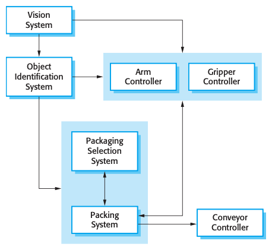
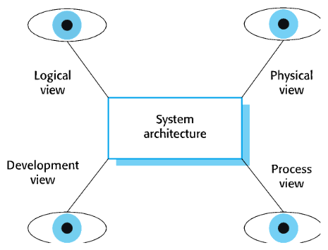
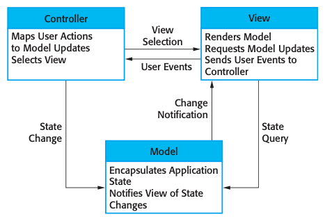
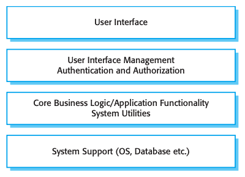
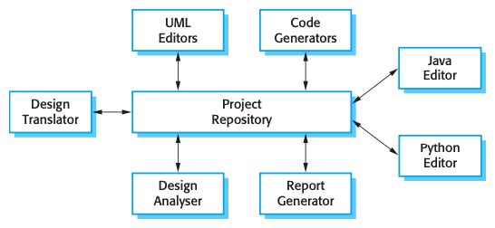
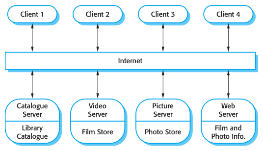
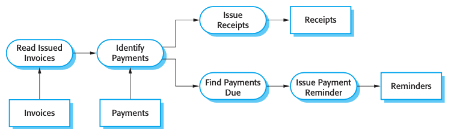
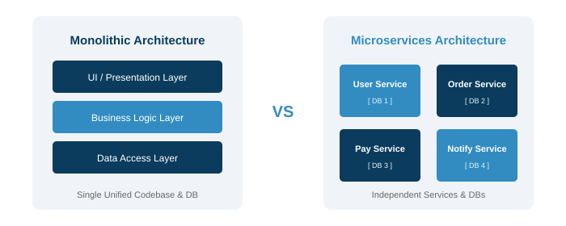
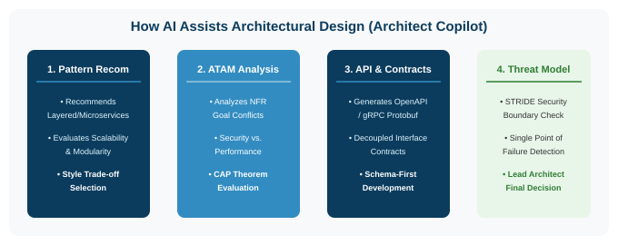

# Software Engineering

### Lecture 6: Architectural Design

**Prof. Nien-Lin Hsueh**
Department of Information Engineering and Computer Science
Feng Chia University

---

## Focus Questions

* What is **Architectural Design** and why is software architecture the critical link between requirements and design?
* How does **Architecture in the Small** differ from **Architecture in the Large**?
* What are Kruchten's **4+1 Architectural Views**?
* How do classic **Architectural Patterns** (MVC, Layered, Repository, Client-Server, Pipe & Filter, Microservices) structure software systems?
* How does architectural design impact system non-functional characteristics (Performance, Security, Safety, Availability, Maintainability)?
* How can **AI** assist software architects in Architectural Design, Pattern Selection, and Trade-off Analysis?

---

## What is Architectural Design?

  

  * **System Structure:**
    * Architectural design is concerned with understanding how a software system should be organized and designing its overall structure.
  * **Critical Link:**
    * Connects **requirements engineering** to **detailed software design** by identifying principal structural components and their relationships.
  * **Architectural Model:**
    * Outlines communicating components and system boundary interfaces.

  

  

    
  

---

## Architectural Abstraction Levels

* **Architecture in the Small:**
  * Concerned with individual programs or applications.
  * Focuses on how a single program is decomposed into sub-components, classes, and packages.
* **Architecture in the Large:**
  * Concerned with complex enterprise systems composed of interacting multi-system networks.
  * Systems are distributed across multiple servers, hardware cores, and cloud infrastructure managed by different teams.

---

## Advantages of Explicit Architecture

1. **Stakeholder Communication:**
   * High-level architectural diagrams act as a common focus of discussion between technical teams, business managers, and clients.
2. **System Analysis:**
   * Enables early verification of whether the system can satisfy key **non-functional requirements** (e.g., performance, security).
3. **Large-Scale Reuse:**
   * Core architectural styles can be reused across product lines in the same domain.

---

## Architecture & System Characteristics

* **Performance:** Localize critical operations in large-grain components; minimize inter-component communication.
* **Security:** Use a **layered architecture** with critical data assets enclosed in inner layers.
* **Safety:** Isolate safety-critical features into dedicated, isolated sub-systems.
* **Availability:** Include redundant components and automated failover mechanisms.
* **Maintainability:** Use fine-grained, loosely coupled, replaceable components.

---

## Architectural Views (Kruchten's 4+1 Model)

  

  * **Logical View:** Shows key domain abstractions as object classes.
  * **Process View:** Shows runtime interacting processes and threads.
  * **Development View:** Shows code structure, packages, and sub-systems.
  * **Physical View:** Shows hardware deployment and network distribution.
  * **+1 Use Cases / Scenarios:** Connects all 4 views together.

  

  

    
  

---

## Concept Check Question 1

  

Which architectural view in Kruchten's 4+1 View Model illustrates how software components are deployed across physical hardware and network servers at runtime?

* **A.** Logical View
* **B.** Process View
* **C.** Development View
* **D.** Physical View

  

  

    
  

---

## Concept Check Question 1: Answer

  

Which architectural view in Kruchten's 4+1 View Model illustrates how software components are deployed across physical hardware and network servers at runtime?

* **Correct Answer: D**
* **Explanation:** The Physical View (Deployment View) maps software components to physical hardware processors and network topology.

  

  

    
  

---

## What is an Architectural Pattern?

* **Reusable Architectural Knowledge:**
  * A stylized, tested description of good design practice applicable to common architectural scenarios.
* **Pattern Structure:**
  * Defines the pattern name, description, example usage, when to use, advantages, and disadvantages.
* **Common Patterns:**
  * **MVC**, **Layered Architecture**, **Repository Architecture**, **Client-Server**, **Pipe & Filter**, **Microservices**.

---

## Model-View-Controller (MVC) Pattern

  

  * **Model:** Manages system data and business logic.
  * **View:** Manages presentation and UI layout to the user.
  * **Controller:** Handles user input events and updates View/Model accordingly.
  * **Advantage:** Separates data management from presentation, enabling multiple views of the same data.

  

  

    
  

---

## Layered Architecture Pattern

  

  * **Layered Abstraction:**
    * Organizes system into stacked layers. Each layer provides services to the layer directly above it.
  * **Core Layers:**
    * User Interface $\rightarrow$ User Interaction Management $\rightarrow$ Core Business Logic $\rightarrow$ System Database / OS.
  * **Advantage:** Allows complete layer replacement if interfaces remain stable.

  

  

    
  

---

## Repository Architecture Pattern

  

  * **Centralized Data Sharing:**
    * Sub-systems exchange large volumes of data through a shared central database or repository.
  * **Loose Component Coupling:**
    * Sub-systems operate independently; interactions occur via repository state changes.
  * **Examples:** IDEs (Eclipse, VS Code), CAD systems, Medical Record databases.

  

  

    
  

---

## Client-Server Architecture Pattern

  

  * **Distributed Services:**
    * Functionality is split into servers offering specialized services (database, printing, web) and clients making requests over a network.
  * **Advantages:**
    * Servers can be distributed across different machines; scalable network infrastructure.
  * **Disadvantages:**
    * Single point of failure per server; network latency dependencies.

  

  

    
  

---

## Pipe and Filter Architecture Pattern

  

  * **Sequential Data Transformation:**
    * Processing is structured as a series of discrete transformation steps (**filters**) connected by data streams (**pipes**).
  * **Unix Shell Model:**
    * Output of one filter becomes the input stream of the next filter (e.g., `cat | grep | sort`).
  * **Best Used For:** Batch data processing, invoice processing, compilers.

  

  

    
  

---

## Microservices Architecture (MSA) vs. Monolith

  

---

## Microservices Architecture Characteristics

* **Decoupled Business Services:**
  * Application built as a suite of small, independent services (e.g., *User Service*, *Order Service*, *Payment Service*).
* **Independent Deployment & Databases:**
  * Each service manages its own database and can be updated, deployed, and scaled independently.
* **Lightweight Communication:**
  * Services communicate asynchronously or via lightweight REST APIs (HTTP / Kafka).
* **Resilience:**
  * Failure of one service does not crash the entire application.

---

## AI in Architectural Design: Overview

* **The Architect Copilot Paradigm:**
  * LLMs assist software architects in structuring complex systems, selecting architectural patterns, and evaluating trade-offs.
  * Translates high-level non-functional requirements into structural blueprints.

  

* **Key Benefit:** Accelerates architecture trade-off evaluation and interface contract drafting.

---

## 4 Core AI Applications in Architectural Design

1. **Architectural Pattern Recommendation:**
   * Analyzes non-functional requirements to recommend suitable architectural styles (Microservices, Event-Driven, Layered).
2. **ATAM & Trade-off Analysis Assistance:**
   * Evaluates conflicting quality attributes (e.g., Security vs. Latency, CAP Theorem Consistency vs. Availability).
3. **API & Interface Contract Generation:**
   * Generates OpenAPI (Swagger) specs, gRPC `.proto` schemas, and event payloads to decouple sub-systems.
4. **Threat Modeling & Security Boundary Analysis:**
   * Scans system architecture diagrams for single points of failure (SPOF) and STRIDE security threats.

---

## Human-in-the-Loop: Architectural Risks & Best Practices

* **Risks of Unchecked AI in Architecture:**
  * **Architectural Blind Spots:** AI lacks context regarding team tech stack familiarity, cloud vendor costs, and organizational culture.
  * **Premature Microservices:** AI recommending complex distributed architectures for simple CRUD applications.
* **The Golden Rule:**
  > **AI Proposes Trade-offs; Lead Architects Make Decisions!**
  > Human Architects must own final architectural decisions and long-term system maintainability.

---

## Concept Check Question 2

  

Which architectural pattern separates user presentation/UI from core data management and user input event handling?

* **A.** Pipe and Filter Pattern
* **B.** Model-View-Controller (MVC) Pattern
* **C.** Repository Pattern
* **D.** Client-Server Pattern

  

  

    
  

---

## Concept Check Question 2: Answer

  

Which architectural pattern separates user presentation/UI from core data management and user input event handling?

* **Correct Answer: B**
* **Explanation:** The MVC pattern decouples system data (Model), user UI (View), and input handling (Controller).

  

  

    
  

---

## Recap: Fill-in-the-blank Quiz

  

Test your understanding of the core concepts in this chapter:

1. **`___`** architecture structures a system into stacked abstract machines where each layer provides services to the layer above.
2. In the **`___`** pattern, all sub-systems share and exchange data through a central database.
3. Kruchten's **`___`** View Model presents Logical, Process, Development, and Physical perspectives joined by Scenarios.
4. **`___`** architecture decomposes a monolithic application into small, independently deployable services with decentralized data.

  

  

    
  

---

## Recap: Answers & Summary

  

Here are the completed concepts:

1. **Layered** architecture structures a system into stacked abstract machines where each layer provides services to the layer above.
2. In the **Repository** pattern, all sub-systems share and exchange data through a central database.
3. Kruchten's **4+1** View Model presents Logical, Process, Development, and Physical perspectives joined by Scenarios.
4. **Microservices** architecture decomposes a monolithic application into small, independently deployable services with decentralized data.

  

  

    
  

---

## References

* **Sommerville Software Engineering Book (Chapter 6)**
  * [Kruchten 4+1 View Model Paper](https://www.cs.ubc.ca/~greg/508/readings/kruchten.pdf)
  * [Martin Fowler Microservices Architecture Guide](https://martinfowler.com/articles/microservices.html)
