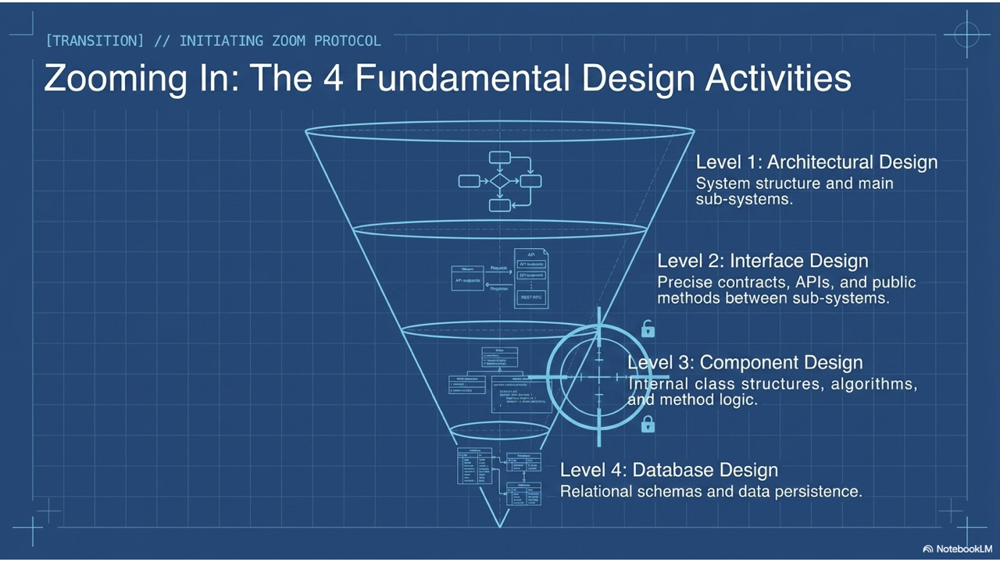
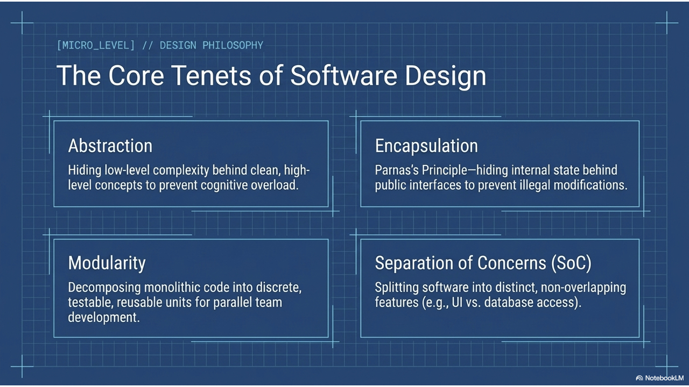
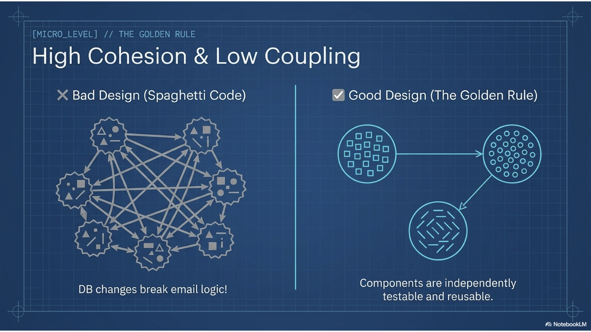
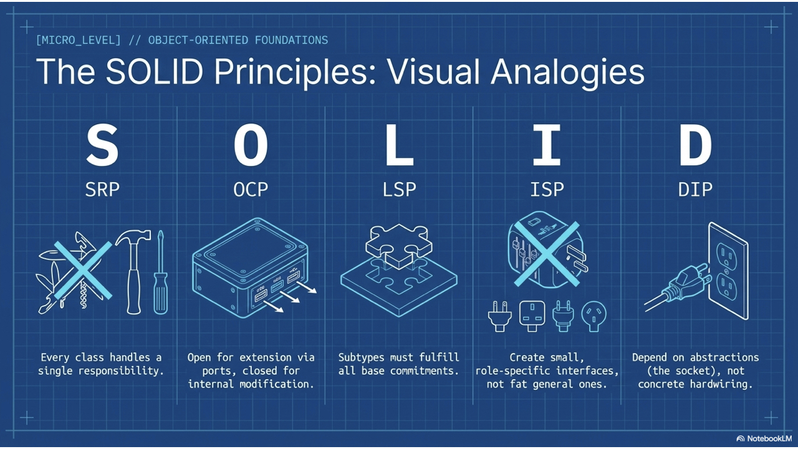
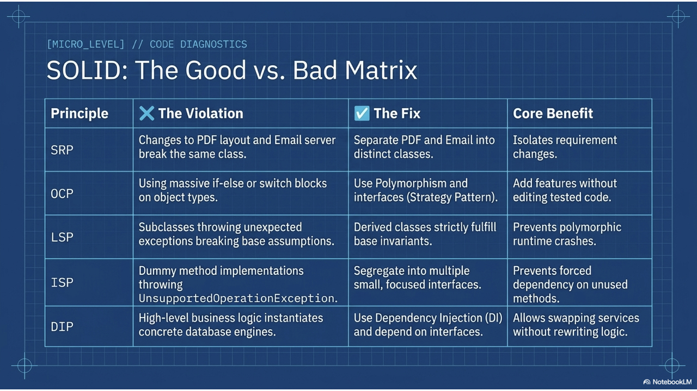
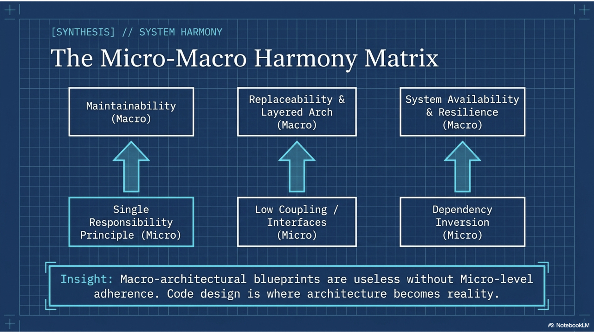
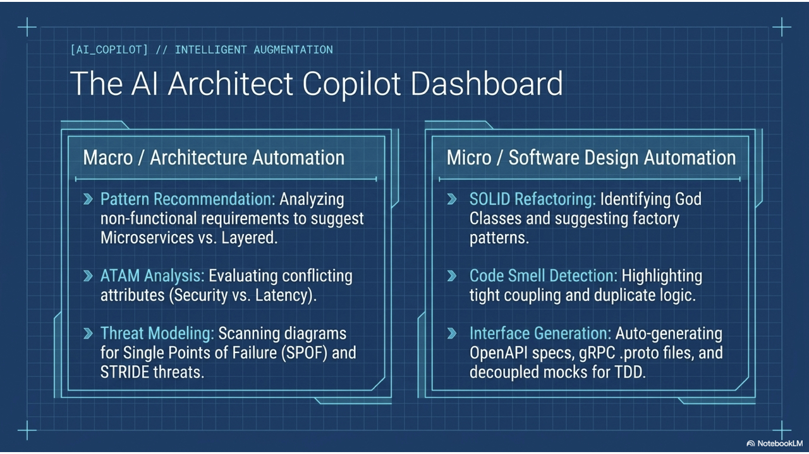
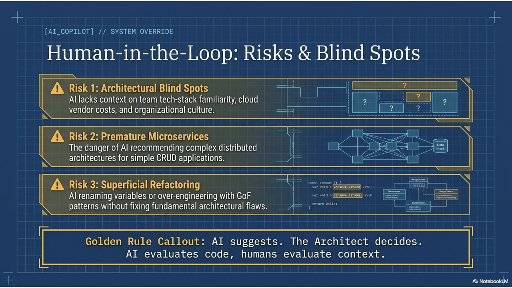

# Software Engineering

### Lecture 6b: Software Design & Object-Oriented Principles

**Prof. Nien-Lin Hsueh**
Department of Information Engineering and Computer Science
Feng Chia University

---

## Focus Questions

* What is **Software Design** and how does it connect requirements to implementation?
* What are the **4 fundamental design activities** in software engineering?
* What are general design principles (**Abstraction, Encapsulation, Modularity**)?
* Why is **High Cohesion & Low Coupling** the golden rule of software architecture?
* What are the **SOLID Object-Oriented Design Principles** (SRP, OCP, LSP, ISP, DIP)?
* How can **AI & LLMs** assist developers in software design and code refactoring?

---

## What is Software Design?

* **Definition:**
  > Software Design is the creative process of transforming customer requirements into a blueprint for building software components, modules, interfaces, and data structures.
* **The Bridge Role:**
  * **Requirements Engineering** &rarr; *What the customer needs (System Specification)*.
  * **Software Design** &rarr; *How the software system is structured (Architectural Blueprint)*.
  * **Implementation & Coding** &rarr; *Constructing executable code*.

---

## 4 Fundamental Software Design Activities

1. **Architectural Design:**
   * Identifying overall system structure, principal sub-systems, and communication pipelines.
2. **Interface Design:**
   * Specifying precise contracts between sub-systems, REST APIs, and public class methods.
3. **Component (Detailed) Design:**
   * Designing internal class structures, algorithms, data types, and method logic.
4. **Database / Data Structure Design:**
   * Designing relational schemas, object graphs, or data persistence models.

---
<!-- _class: full-image-slide -->

<div class="centered-image">
  
</div>

---

## General Design Principles (Part 1)

* **1. Abstraction (抽象化):**
  * Hiding low-level implementation complexity behind clean high-level concepts.
  * Allows engineers to reason about complex systems without getting overwhelmed by detail.
* **2. Encapsulation & Information Hiding (封裝與資訊隱藏):**
  * Parnas's Principle: Bundling state and behavior inside a module, hiding internal variables behind public interfaces.
  * Prevents external code from introducing illegal state modifications.

---

## General Design Principles (Part 2)

* **3. Modularity (模組化):**
  * Decomposing a large, monolithic software system into discrete, self-contained modules.
  * Enables parallel team development, independent testing, and partial reuse.
* **4. Separation of Concerns (SoC / 關注點分離):**
  * Splitting software into distinct features that overlap as little as possible (e.g. decoupling UI rendering from database access).

---
<!-- _class: full-image-slide -->

<div class="centered-image">
  
</div>

---

## High Cohesion vs. Low Coupling

<!-- _class: full-image-slide -->

<div class="centered-image">
  
</div>

---

## Cohesion & Coupling Rules

* **Cohesion (凝聚度):**
  * Measures how strongly related the internal responsibilities inside a single module are.
  * **Goal:** **High Cohesion** (A class should focus on a single well-defined purpose).
* **Coupling (耦合度):**
  * Measures the degree of direct interdependence between separate modules.
  * **Goal:** **Low Coupling** (Modules communicate via abstract interfaces with minimal dependencies).
* **Golden Rule of Software Design:**
  > Maximize Cohesion, Minimize Coupling!

---

## Cohesion & Coupling: Bad vs. Good Design

<div class="split55">
<div class="left" style="background: #ffebee; padding: 15px; border-radius: 8px;">

### ❌ Bad Design (Low Cohesion, High Coupling)

```java
// Monolithic class doing EVERYTHING
class OrderManager {
    public void processOrder() {
        // 1. Direct MySQL DB logic
        // 2. Calculate discounts
        // 3. Render HTML invoice
        // 4. Send SMTP email directly
    }
}
```
* **Problem:** Hard to maintain; DB change breaks email logic!

</div>
<div class="right" style="background: #e8f5e9; padding: 15px; border-radius: 8px;">

### ✅ Good Design (High Cohesion, Low Coupling)

```java
// Decoupled single-purpose classes
class OrderProcessor {
    private DiscountCalculator discount;
    private OrderRepository repo;
    private NotificationService notifier;
    // Communicates via interfaces
}
```
* **Benefit:** Each component is independently testable and reusable.

</div>
</div>

---

## Concept Check Question 1

<div class="ccq-columns">
  <div class="ccq-text">

In software design, what does "Low Coupling" combined with "High Cohesion" achieve?

* **A.** It increases program execution speed by eliminating class methods.
* **B.** It creates highly modular code where changes to one module have minimal ripple effects on others.
* **C.** It forces all data fields to be global variables across sub-systems.
* **D.** It replaces the need for unit testing during development.

  </div>
  <div class="ccq-logo">
    
  </div>
</div>

---

## Concept Check Question 1: Answer

<div class="ccq-columns">
  <div class="ccq-text">

In software design, what does "Low Coupling" combined with "High Cohesion" achieve?

* **Correct Answer: B**
* **Explanation:** High Cohesion ensures a module has a single focused purpose, while Low Coupling minimizes inter-module dependencies, preventing cascading code changes.

  </div>
  <div class="ccq-logo">
    
  </div>
</div>

---

## Object-Oriented Design: The SOLID Principles

<!-- _class: full-image-slide -->

<div class="centered-image">
  
</div>

---

## S &ndash; Single Responsibility Principle (SRP)

* **Definition:**
  > A class should have one, and only one, reason to change.
* **Core Idea:**
  * Every class should be responsible for a single part of the system's functionality.
* **Why SRP Matters:**
  * When requirements change (e.g. database schema change or email format change), only the specific responsible class needs to be modified.

---

## SRP: Bad Design vs. Good Design

<div class="split55">
<div class="left" style="background: #ffebee; padding: 15px; border-radius: 8px;">

### ❌ Bad Design (Violates SRP)

```java
// "God Class" handling 3 distinct roles
class UserReportManager {
    public void fetchUserData() { /* DB */ }
    public void generatePdfReport() { /* PDF */ }
    public void sendEmailReport() { /* Email */ }
}
```
* Changes to PDF layout or Email server break the same class!

</div>
<div class="right" style="background: #e8f5e9; padding: 15px; border-radius: 8px;">

### ✅ Good Design (Follows SRP)

```java
// 3 Single-responsibility classes
class UserRepository {
    public User fetchUserData() { ... }
}
class PdfReportFormatter {
    public byte[] generatePdf(User u) { ... }
}
class EmailService {
    public void sendEmail(String to, byte[] pdf) { ... }
}
```

</div>
</div>

---

## O &ndash; Open / Closed Principle (OCP)

* **Definition:**
  > Software entities should be open for extension, but closed for modification.
* **Core Idea:**
  * You should be able to add new functionality without editing existing, tested source code.
* **How to Achieve:**
  * Use **Polymorphism** and interfaces (e.g. Strategy Pattern) instead of `if-else` or `switch` blocks on types.

---

## OCP: Bad Design vs. Good Design

<div class="split55">
<div class="left" style="background: #ffebee; padding: 15px; border-radius: 8px;">

### ❌ Bad Design (Violates OCP)

```java
class DiscountCalculator {
    public double calculate(String type, double price) {
        if (type.equals("VIP")) return price * 0.8;
        else if (type.equals("STUDENT")) return price * 0.9;
        // Adding new tier REQUIRES editing this class!
        return price;
    }
}
```

</div>
<div class="right" style="background: #e8f5e9; padding: 15px; border-radius: 8px;">

### ✅ Good Design (Follows OCP)

```java
interface DiscountStrategy {
    double apply(double price);
}
class VipDiscount implements DiscountStrategy {
    public double apply(double p) { return p * 0.8; }
}
class StudentDiscount implements DiscountStrategy {
    public double apply(double p) { return p * 0.9; }
}
// Add new tier by adding NEW class!
```

</div>
</div>

---

## L &ndash; Liskov Substitution Principle (LSP)

* **Definition:**
  > Subtypes must be substitutable for their base types without altering the correctness of the program.
* **Core Idea:**
  * Derived classes must fulfill all commitments and invariants of the base class.
* **Why LSP Matters:**
  * If a subclass throws unexpected exceptions or breaks base assumptions, polymorphic code fails at runtime.

---

## LSP: Bad Design vs. Good Design

<div class="split55">
<div class="left" style="background: #ffebee; padding: 15px; border-radius: 8px;">

### ❌ Bad Design (Violates LSP)

```java
class Rectangle {
    protected int w, h;
    public void setWidth(int w) { this.w = w; }
    public void setHeight(int h) { this.h = h; }
}
class Square extends Rectangle {
    // Overrides setWidth to change height too!
    public void setWidth(int w) { this.w = w; this.h = w; }
}
// Client code expecting Rectangle behavior FAILS!
```

</div>
<div class="right" style="background: #e8f5e9; padding: 15px; border-radius: 8px;">

### ✅ Good Design (Follows LSP)

```java
interface Shape {
    int getArea();
}
class Rectangle implements Shape {
    private int w, h;
    public int getArea() { return w * h; }
}
class Square implements Shape {
    private int side;
    public int getArea() { return side * side; }
}
```

</div>
</div>

---

## I &ndash; Interface Segregation Principle (ISP)

* **Definition:**
  > Clients should not be forced to depend on methods they do not use.
* **Core Idea:**
  * Avoid creating "fat" general-purpose interfaces. Instead, create many small, specific role interfaces.
* **Why ISP Matters:**
  * Prevents dummy/unsupported method implementations throwing `UnsupportedOperationException`.

---

## ISP: Bad Design vs. Good Design

<div class="split55">
<div class="left" style="background: #ffebee; padding: 15px; border-radius: 8px;">

### ❌ Bad Design (Violates ISP)

```java
interface MultiFunctionDevice {
    void print();
    void scan();
    void fax();
}
// BasicPrinter forced to implement scan & fax!
class SimplePrinter implements MultiFunctionDevice {
    public void print() { /* OK */ }
    public void scan() { throw new Error(); }
    public void fax() { throw new Error(); }
}
```

</div>
<div class="right" style="background: #e8f5e9; padding: 15px; border-radius: 8px;">

### ✅ Good Design (Follows ISP)

```java
interface Printer { void print(); }
interface Scanner { void scan(); }
interface Fax { void fax(); }

class SimplePrinter implements Printer {
    public void print() { /* Clean */ }
}
class AllInOnePrinter implements 
    Printer, Scanner, Fax { ... }
```

</div>
</div>

---

## D &ndash; Dependency Inversion Principle (DIP)

* **Definition:**
  > High-level modules should not depend on low-level modules. Both should depend on abstractions.
* **Core Idea:**
  * Depend on **Interfaces**, not concrete classes. Use **Dependency Injection (DI)**.
* **Why DIP Matters:**
  * Allows swapping database engines, HTTP clients, or 3rd-party services without rewriting business logic.

---

## DIP: Bad Design vs. Good Design

<div class="split55">
<div class="left" style="background: #ffebee; padding: 15px; border-radius: 8px;">

### ❌ Bad Design (Violates DIP)

```java
class OrderService {
    // Tightly coupled to concrete MySQL class
    private MySQLDatabase db = new MySQLDatabase();

    public void saveOrder(Order o) {
        db.insert(o); // Cannot mock for testing!
    }
}
```

</div>
<div class="right" style="background: #e8f5e9; padding: 15px; border-radius: 8px;">

### ✅ Good Design (Follows DIP)

```java
interface Database { void insert(Order o); }

class OrderService {
    private Database db; // Depends on abstraction
    // Injected via Constructor (DI)
    public OrderService(Database db) {
        this.db = db;
    }
}
```

</div>
</div>

---
<!-- _class: full-image-slide -->

<div class="centered-image">
  
</div>

---
<!-- _class: full-image-slide -->

<div class="centered-image">
  
</div>

---

## AI in Software Design & Refactoring

<!-- _class: full-image-slide -->

<div class="centered-image">
  
</div>

---

## 4 Core AI Applications in Software Design

1. **Automated SOLID Refactoring:**
   * Identifies God Classes (SRP violations) and suggests Strategy or Factory patterns to achieve OCP.
2. **Code Smell Detection:**
   * Scans legacy code for tight coupling, duplicate logic, shotgun surgery, and feature envy.
3. **Design Pattern Recommendation:**
   * Recommends GoF design patterns (Observer, Decorator, Adapter, Builder) for recurring design challenges.
4. **Interface Contract & Mock Generation:**
   * Auto-generates decoupled interfaces and mock objects for Test-Driven Development (TDD).

---

## Human-in-the-Loop: Design Risks & Best Practices

* **Risks of Unchecked AI in Software Design:**
  * **Over-Engineering:** AI suggesting complex Gang of Four patterns for simple functions.
  * **Superficial Refactoring:** Renaming variables without resolving fundamental architectural flaws.
* **The Golden Rule:**
  > AI Proposes Refactoring; Developers Validate Software Quality!
  > Engineers must ensure that refactored designs actually simplify code readability and long-term maintainability.

---
<!-- _class: full-image-slide -->

<div class="centered-image">
  
</div>

---

## Concept Check Question 2

<div class="ccq-columns">
  <div class="ccq-text">

Which SOLID principle states that you should be able to add new system features by adding new classes without modifying existing tested code?

* **A.** Single Responsibility Principle (SRP)
* **B.** Open/Closed Principle (OCP)
* **C.** Interface Segregation Principle (ISP)
* **D.** Liskov Substitution Principle (LSP)

  </div>
  <div class="ccq-logo">
    
  </div>
</div>

---

## Concept Check Question 2: Answer

<div class="ccq-columns">
  <div class="ccq-text">

Which SOLID principle states that you should be able to add new system features by adding new classes without modifying existing tested code?

* **Correct Answer: B**
* **Explanation:** The Open/Closed Principle (OCP) requires systems to be open for extension (via polymorphism/interfaces) but closed for modification.

  </div>
  <div class="ccq-logo">
    
  </div>
</div>

---

## Recap: Fill-in-the-blank Quiz

<div class="fill-blank-columns">
  <div class="fill-blank-text">

Test your understanding of the core concepts in this chapter:

1. **`___`** measures how focused internal module responsibilities are, while **`___`** measures inter-module dependencies.
2. The **`___`** Responsibility Principle states a class should have only one reason to change.
3. The **`___`** Substitution Principle requires subtypes to be substitutable for base types without errors.
4. Dependency **`___`** means high-level business logic should depend on abstract interfaces, not concrete classes.

  </div>
  <div class="fill-blank-logo">
    
  </div>
</div>

---

## Recap: Answers & Summary

<div class="fill-blank-columns">
  <div class="fill-blank-text">

Here are the completed concepts:

1. **Cohesion** measures how focused internal module responsibilities are, while **coupling** measures inter-module dependencies.
2. The **Single** Responsibility Principle states a class should have only one reason to change.
3. The **Liskov** Substitution Principle requires subtypes to be substitutable for base types without errors.
4. Dependency **Inversion** means high-level business logic should depend on abstract interfaces, not concrete classes.

  </div>
  <div class="fill-blank-logo">
    
  </div>
</div>

---

## References

* **Sommerville Software Engineering Book (Chapter 7 - Design and Implementation)**
  * [Martin Fowler Refactoring & Clean Code Guide](https://martinfowler.com/refactoring/)
  * [Robert C. Martin (Uncle Bob) SOLID Principles](https://blog.cleancoder.com/)
