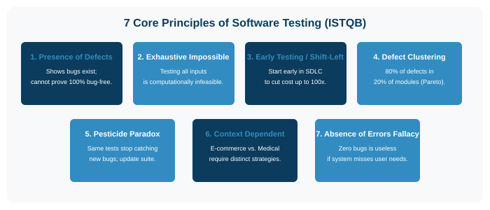
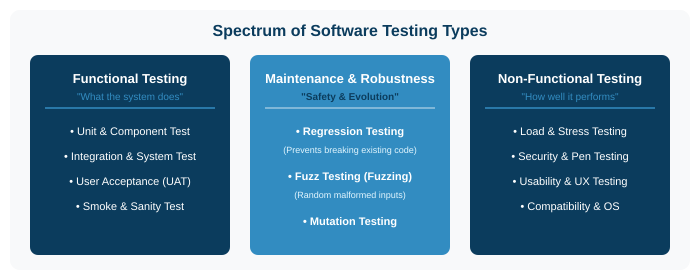
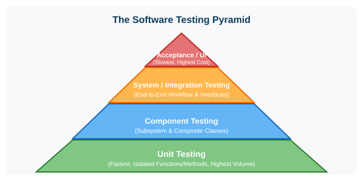

# Software Engineering

### Lecture 7a: Fundamental Testing Concepts & Methods

**Prof. Nien-Lin Hsueh**
Department of Information Engineering and Computer Science
Feng Chia University

---

## Focus Questions

* What is the primary goal of **software testing** and verification?
* What is **Dijkstra's Axiom** regarding program testing?
* What are the **7 Core Software Testing Principles**?
* How do **Functional** vs. **Non-Functional** testing types compare?
* What are **Regression Testing, Fuzz Testing, Smoke, Sanity, and Mutation Testing**?
* How do **Development Testing**, **Release Testing**, and **User Testing** differ?

---

## Testing Objectives & Fundamental Principles

* **Verification & Validation (V&V):**
  * Demonstrating that software conforms to its specification and meets customer requirements.
* **Dijkstra's Testing Principle:**
  > Program testing can be used to show the presence of bugs, but never to show their absence!
* **Two Complementary Testing Goals:**
  1. **Validation Testing:** Demonstrating to developers and clients that the system meets requirements.
  2. **Defect Testing:** Deliberately executing unhandled inputs and edge cases to reveal system bugs.

---

## 7 Core Software Testing Principles (Part 1)

1. **Testing Shows Presence of Defects (Dijkstra's Axiom):**
   * Testing can demonstrate that defects exist, but cannot prove a software system is 100% bug-free.
2. **Exhaustive Testing is Impossible:**
   * Testing all combinations of inputs and preconditions is computationally infeasible; risk-based sampling is required.
3. **Early Testing / Shift-Left:**
   * Testing activities should start as early as possible in the SDLC to catch requirements/design errors when they are cheapest to fix.
4. **Defect Clustering (Pareto Principle):**
   * 80% of system defects are typically concentrated in 20% of complex or frequently changed modules.

---

## 7 Core Software Testing Principles (Part 2)

5. **Beware of the Pesticide Paradox:**
   * Running the same automated tests repeatedly will stop finding new defects. Test suites must regularly evolve and expand.
6. **Testing is Context Dependent:**
   * Testing is performed differently in different contexts (e.g., an e-commerce mobile app vs. a safety-critical pacemaker).
7. **Absence-of-Errors is a Fallacy:**
   * Fixing 100% of bugs is useless if the system is unusable or does not satisfy actual user needs.

---
<!-- _class: full-image-slide -->

  

---
<!-- _class: full-image-slide -->

  

---

## Specialized Testing 1: Regression Testing

* **Definition:**
  * Re-running existing automated test suites after code modifications, refactoring, or bug fixes.
* **Core Objective:**
  * Ensures that new code additions do not introduce collateral damage or break previously working functionality.
* **Integration in CI/CD:**
  * Automated regression suites are executed continuously on every Git commit / Pull Request pipeline.

---

## Specialized Testing 2: Fuzz Testing (Fuzzing)

* **Definition:**
  * An automated testing technique that injects massive streams of **invalid, unexpected, or random malformed inputs** into a target application.
* **Core Objective:**
  * Detects memory leaks, unhandled exceptions, buffer overflows, and zero-day security vulnerabilities.
* **Modern Fuzzing Tools:**
  * AFL (American Fuzzy Lop), libFuzzer, Google OSS-Fuzz.

---

## Specialized Testing 3: Smoke, Sanity & Mutation

* **Smoke Testing (Build Verification):**
  * High-level quick check to verify basic critical paths before accepting a new software build ("Does it catch fire?").
* **Sanity Testing (Post-Fix Verification):**
  * Targeted check following a minor bug fix to verify specific functionality before running full regression.
* **Mutation Testing (Test Suite Evaluation):**
  * Injects artificial defects ("mutants") into source code to check if your test suite catches them ("kills the mutant").

---

## Non-Functional Testing: Load, Stress & Security

* **Load Testing:**
  * Measures system response time, throughput, and resource utilization under expected peak user traffic.
* **Stress Testing:**
  * Pushes the system **beyond maximum operational limits** until it breaks to evaluate error recovery and graceful degradation.
* **Security & Penetration Testing:**
  * Evaluates system resilience against unauthorized access, SQL injection, XSS, and data breaches.

---

## The Software Testing Pyramid

  

---

## Stages of Testing: Development Testing

* **Unit Testing:**
  * Testing individual functions, methods, or object classes in isolation.
  * Uses test mocks, stubs, and automated frameworks (JUnit, PyTest).
* **Component Testing:**
  * Testing integrated clusters of interacting classes or composite components to verify interface integrity.
* **System Testing:**
  * Testing the complete integrated system to verify overall workflows, security, and emergent behavior.

---

## Release Testing vs. User Testing

* **Release Testing (Pre-Deployment):**
  * Testing a complete system build intended for customer release.
  * **Requirements-based testing:** Verifying every functional requirement.
  * **Scenario testing:** Simulating real-world multi-step user workflows.
  * **Performance & Stress testing:** Testing system behavior under extreme traffic loads.
* **User & Acceptance Testing:**
  * **Alpha Testing:** Internal team users test the system at developer's site.
  * **Beta Testing:** Early external release to real users to get field feedback.
  * **Acceptance Testing:** Customer tests against contract agreement before payment.

---

## Concept Check Question 1

  

According to Dijkstra's famous testing principle, what can software testing demonstrate?

* **A.** It can prove that a program is completely free of all defects.
* **B.** It can show the presence of defects, but never their absence.
* **C.** It guarantees 100% statement coverage across all modules.
* **D.** It replaces the need for user acceptance testing.

  

  

    
  

---

## Concept Check Question 1: Answer

  

According to Dijkstra's famous testing principle, what can software testing demonstrate?

* **Correct Answer: B**
* **Explanation:** Dijkstra stated: *"Program testing can be used to show the presence of bugs, but never to show their absence!"*

  

  

    
  

---

## Recap: Fill-in-the-blank Quiz

  

Test your understanding of the core concepts in this chapter:

1. **`___`** testing demonstrates that a system meets requirements, while **`___`** testing seeks to reveal bugs.
2. The Pareto principle in testing suggests that 80% of defects cluster in **`___`**% of modules.
3. Re-running automated tests after code changes to ensure existing functionality is intact is called **`___`** testing.
4. Feeding random, malformed inputs into an app to uncover crashes and buffer overflows is called **`___`** testing.

  

  

    
  

---

## Recap: Answers & Summary

  

Here are the completed concepts:

1. **Validation** testing demonstrates that a system meets requirements, while **defect** testing seeks to reveal bugs.
2. The Pareto principle in testing suggests that 80% of defects cluster in **20**% of modules.
3. Re-running automated tests after code changes to ensure existing functionality is intact is called **regression** testing.
4. Feeding random, malformed inputs into an app to uncover crashes and buffer overflows is called **fuzz** testing.

  

  

    
  

---

## References

* **Sommerville Software Engineering Book (Chapter 8 - Software Testing)**
  * [ISTQB Certified Tester Foundation Level Syllabus](https://www.istqb.org/)
  * [Google OSS-Fuzz Project](https://github.com/google/oss-fuzz)
