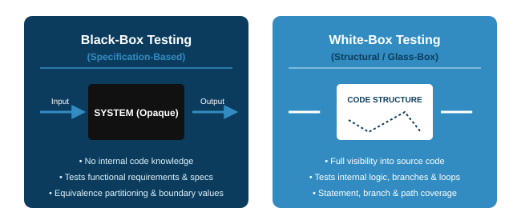
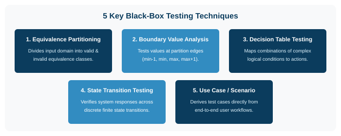
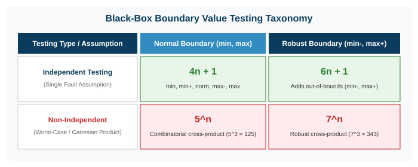
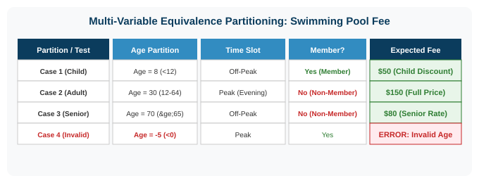
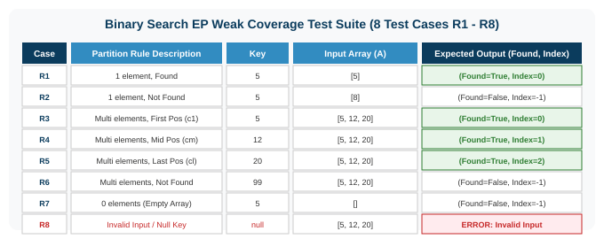
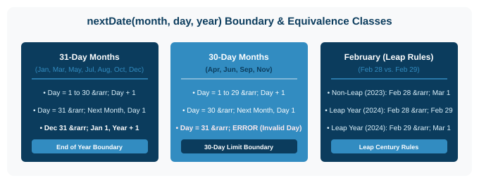
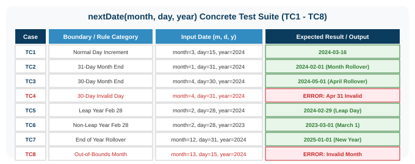
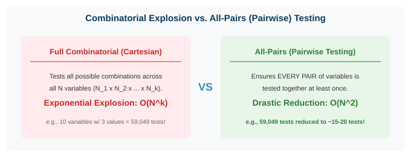
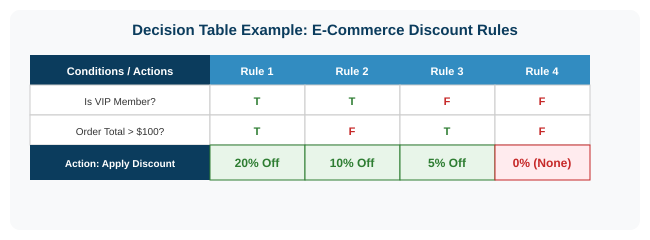

# Software Engineering

### Lecture 7b: Black-Box Testing Techniques

**Prof. Nien-Lin Hsueh**
Department of Information Engineering and Computer Science
Feng Chia University

---

## Focus Questions

* What is **Black-Box (Specification-Based) Testing**?
* What are the 4 **Boundary Value Testing Formulas** (4n+1, 6n+1, 5n, 7n) and Single Fault Assumption?
* How do **Weak Coverage (Weak EP)** and **Strong Coverage (Strong EP)** differ?
* How do we design test suites for **Triangle Classification, Exam Scores, FCU Swimming Pool Fee, Binary Search, and nextDate()**?
* How does **All-Pairs (Pairwise) Testing** solve combinatorial explosion?
* How do **Decision Table Testing** and **State Transition Testing** model system logic?

---

## Black-Box vs. White-Box Testing

* **Black-Box Testing (Functional / Specification-Based):**
  * **Definition:** A testing method where the internal code structure, implementation details, and source code are **completely hidden** from the tester.
  * **Focus:** Tests system behavior against functional specifications by sending inputs and validating expected outputs.
* **White-Box Testing (Structural / Glass-Box Testing):**
  * **Definition:** A testing technique where internal code structure and control flow are **fully visible**.

---
<!-- _class: full-image-slide -->

  

---

## 5 Major Black-Box Testing Methods

  

---

## Boundary Value Testing Taxonomy

* **Single Fault Assumption (單一錯誤假設):**
  * Assumes a system failure is caused by a defect in a *single variable* rather than simultaneous defects across multiple variables.
* **Independent vs. Non-Independent (Worst-Case):**
  * **Independent:** Variables do not interact; test boundary of 1 variable holding others at `norm`.
  * **Non-Independent (Worst-Case):** Variables interact in logic statements (e.g. `if (exam <= 60 && hw <= 60)`). Requires Cartesian cross-product of boundary values.

---

## The 4 Boundary Testing Formulas

  

---

## Boundary Case Study: Triangle Classification

> **Requirement:** Inputs <code>a, b, c &isin; [1, 200]</code>. Output: *Equilateral*, *Isosceles*, *Scalene*, *Non-Triangle*.

* **Independent Normal Boundary (4n+1 = 13 cases):**
  * Hold b, c at <code>norm=100</code>, test a &isin; {1, 2, 199, 200}. Repeat for b and c, plus 1 `norm` case.
* **The Diversity Deficit & Solution:**
  * Independent testing (13 cases) only produces *Isosceles* and *Equilateral* triangles, missing *Scalene* triangles!
  * **Solutions:** Use dynamic random `norm` values or apply **Output-Guided Partitioning**.
* **Non-Independent Worst-Case:** 53 = 125 test cases (5 &times; 5 &times; 5).

---

## Equivalence Partitioning: Weak vs. Strong Coverage

* **Equivalence Partitioning Concept:**
  * Divides input/output space into classes where all values are processed identically.
* **Weak Coverage (Weak EP):**
  * Based on Single Fault Assumption. Every partition of every variable is tested **at least once**.
  * Total test cases = max(Partitions of v1, ..., vn).
* **Strong Coverage (Strong EP):**
  * For non-independent interacting variables. Tests the **Cartesian product** of all partitions across all variables (P1 &times; P2 &times; ... &times; Pn).

---

## EP Case Study 1: Single-Variable Domain (Exam Scores)

> **Requirement:** An online grading system accepts exam scores between **0** and **100** inclusive.

* **Partition 1: Invalid Low (Score &lt; 0)**
  * *Representative Test Value:* **-15** &rarr; *Expected Output:* Error ("Score cannot be negative").
* **Partition 2: Valid Range (0 &le; Score &le; 100)**
  * *Representative Test Value:* **75** &rarr; *Expected Output:* Valid grade recorded.
* **Partition 3: Invalid High (Score &gt; 100)**
  * *Representative Test Value:* **135** &rarr; *Expected Output:* Error ("Score exceeds maximum 100").

---

## EP Case Study 2: Multi-Variable FCU Swimming Pool Fee

> **Requirement:** Public pool ticket price depends on **Age**, **Time Slot**, and **Membership**.

* **Input Partitions:**
  * **Age:** Child (&lt; 12), Adult (12&ndash;64), Senior (&ge; 65), Invalid (&lt; 0).
  * **Time Slot:** Off-Peak (Morning) vs. Peak (Evening).
  * **Membership:** Member (Discount) vs. Non-Member (Full Price).

  

---

## EP Case Study 3: Binary Search Partition Plan

> **Spec:** `Search(Key: int, A: Array) -> (Found: bool, Index: int)`

* **Input Array Partitions:**
  * Empty array (a0: empty), Single element (a1: 1 element), Multiple elements (a*: multiple elements).
* **Output & Position Partitions:**
  * **Found (ft):** Key at first position (c1), middle position (cm), or last position (cl).
  * **Not Found (ff):** Key not present in array.
  * **Invalid Type (k!):** Error handling for corrupted input.
* **Weak Coverage Goal:** Derive 8 structured test cases (R1 &ndash; R8) covering all input and output partitions.

---

## EP Case Study 3: Binary Search Test Suite

> **Concrete Test Suite (R1 &ndash; R8) covering all Equivalence Partitions:**

  

---

## Boundary & EP Case Study: nextDate Plan

> **Spec:** `nextDate(month: int, day: int, year: int) -> String` (Date in 1800&ndash;2048)

  

* **Key Boundary Test Points:**
  * **Month End:** `2024-01-31` &rarr; `2024-02-01` | **Year End:** `2024-12-31` &rarr; `2025-01-01`
  * **30-Day Boundary:** `2024-04-30` &rarr; `2024-05-01` (Day `31` in April is Invalid).
  * **Leap Year Boundary:** `2024-02-28` &rarr; `2024-02-29` vs. `2023-02-28` &rarr; `2023-03-01`.

---

## Boundary & EP Case Study: nextDate Test Suite

> **Concrete Test Suite (TC1 &ndash; TC8) covering all Boundary & Equivalence Classes:**

  

---

## All-Pairs (Pairwise) Testing

* **The Combinatorial Explosion Problem:**
  * Testing all combinations (Strong EP / Cartesian Product) across <i>k</i> variables requires <b>O(Nk)</b> test cases (e.g. 310 = 59,049 tests).
* **Core Empirical Principle:**
  * *Most software bugs are triggered by interactions between at most 2 parameters (pairs)* rather than complex 5-way interactions.

  

* **Benefit:** Ensures **every pair of input parameters is tested together at least once**, reducing 59,049 test cases down to &approx; 15&ndash;20 test cases!

---

## Black-Box Method 3: Decision Table Testing

* **Concept:**
  * A structured tabular approach to model complex business logic containing multiple conditional rules.
  * **Structure:** Combines input conditions (True/False) with resulting system actions.

  

---

## Black-Box Method 4 & 5: State & Use Case Testing

* **Method 4: State Transition Testing:**
  * Tests how the system transitions between discrete finite states in response to user events.
  * Verifies both **valid transitions** (e.g. *Unauthenticated* &rarr; Login &rarr; *Authenticated*) and **invalid transitions** (e.g. attempting checkout while unauthenticated).
* **Method 5: Use Case / Scenario Testing:**
  * Test cases are derived directly from high-level **Use Cases** or user stories.
  * Verifies end-to-end user goals, basic normal flows, alternate paths, and exception flows.

---

## Concept Check Question 1

  

In Black-Box Test Case Design, why is Boundary Value Analysis (BVA) used alongside Equivalence Partitioning?

* **A.** Because white-box code source files are required for boundary testing.
* **B.** Because software defects occur most frequently at the edges/boundaries of input partitions.
* **C.** Because boundary values eliminate the need for unit testing.
* **D.** Because BVA only tests valid partitions and ignores invalid inputs.

  

  

    
  

---

## Concept Check Question 1: Answer

  

In Black-Box Test Case Design, why is Boundary Value Analysis (BVA) used alongside Equivalence Partitioning?

* **Correct Answer: B**
* **Explanation:** Off-by-one errors (&lt; vs &le;) mean defects concentrate heavily at boundaries.

  

  

    
  

---

## Recap: Fill-in-the-blank Quiz

  

Test your understanding of the core concepts in this chapter:

1. **`___`** testing divides input domains into classes processed identically by the system.
2. Under Single Fault Assumption, Independent Normal Boundary testing requires **`___`** test cases for n variables.
3. For interacting non-independent variables, worst-case boundary testing requires **`___`** test cases.
4. **`___`** testing ensures every pair of input parameters is tested together at least once, avoiding combinatorial explosion.

  

  

    
  

---

## Recap: Answers & Summary

  

Here are the completed concepts:

1. **Equivalence partitioning** testing divides input domains into classes processed identically by the system.
2. Under Single Fault Assumption, Independent Normal Boundary testing requires **4n + 1** test cases for n variables.
3. For interacting non-independent variables, worst-case boundary testing requires **5n** test cases.
4. **All-pairs (pairwise)** testing ensures every pair of input parameters is tested together at least once.

  

  

    
  

---

## References

* **Prof. Nien-Lin Hsueh Software Testing Course (Ch05 Black-Box Testing)**
  * [IEEE 829 Standard for Software Test Documentation](https://standards.ieee.org/)
  * [Pairwise / All-Pairs Testing Tool PICT](https://github.com/microsoft/pict)
