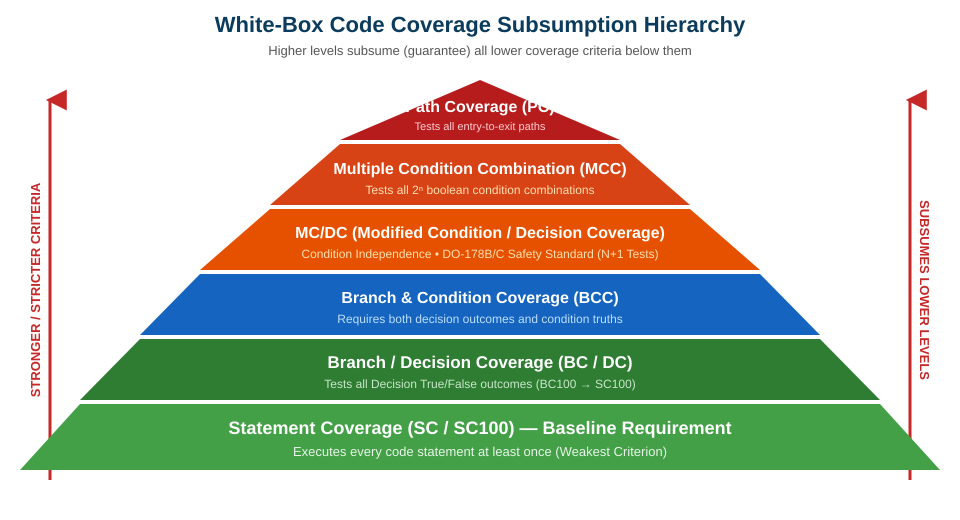

# Software Engineering

### Lecture 7c: White-Box Structural Testing

**Prof. Nien-Lin Hsueh**
Department of Information Engineering and Computer Science
Feng Chia University

---

## Focus Questions

* What is **White-Box (Structural / Glass-Box) Testing**?
* How are all 6 coverage criteria evaluated using the **SAME benchmark program**?
* Why is Statement Coverage (SC100) considered the **weakest** structural criterion?
* Why does 100% Condition Coverage (CC100) **NOT** guarantee Branch Coverage (BC100)?
* How does **MC/DC Coverage** achieve safety compliance (DO-178B/C) with $N+1$ test cases?
* What is the **Loop Path Explosion Problem** and how does Basis Path Testing solve it?

---

## White-Box Structural Testing: Fundamentals

* **White-Box Testing (Structural / Glass-Box Testing):**
  > Testing software with full knowledge of the internal source code, control flow graph (CFG), and logic branches.
* **Core Objective:**
  * Measures how thoroughly test cases exercise the code base.
  * Identifies unexecuted logic, dead code, and untested boundary branches.
* **Subsumption Hierarchy:**
  * Statement Coverage (SC) &le; Branch Coverage (BC) &le; Condition/Branch (BCC) &le; MC/DC &le; Multiple Condition (MCC) &le; Path Coverage (PC).

---
<!-- _class: full-image-slide -->

<div class="centered-image">
  
</div>

---

## Benchmark Code Example (Standard Reference)

To compare all white-box coverage criteria rigorously, we use the **SAME benchmark function** throughout this lecture:

```java
// Standard Benchmark Program for Structural Coverage Analysis
void process(int A, int B, int X) {
    if (A > 1 && B == 0) {  // Decision 1 (b1): Condition c1 && Condition c2
        Y = A;
    }
    if (A == 2 || X > 1) {  // Decision 2 (b2): Condition c3 || Condition c4
        Y = X;
    }
    print(Y);
}
```
* **Decision 1 ($b_1$):** `(A > 1) && (B == 0)` &rarr; Atomic conditions $c_1: A>1$, $c_2: B==0$.
* **Decision 2 ($b_2$):** `(A == 2) || (X > 1)` &rarr; Atomic conditions $c_3: A==2$, $c_4: X>1$.

---

## 1. Statement Coverage (SC / SC100)

* **Definition:**
  * Every executable code statement must be executed **at least once**.
* **Test Suite for 100% SC on Benchmark Code:**
  * Test Case $T_1 = (A=2, B=0, X=3) \Rightarrow Y=3$.
  * *Execution Path:* Hits Decision 1 (True), $Y=2$, Decision 2 (True), $Y=3$, `print(3)`.
  * **Result:** Achieves **100% Statement Coverage with only ONE test case!**
* **The Weakness of Statement Coverage:**
  * SC100 is the **weakest** structural criterion!
  * If Line 2 contained a bug (`&&` miswritten as `||`) or Line 3 was miswritten as `Y=B`, test $T_1=(2,0,3)$ would STILL pass with 100% coverage, missing the defect completely.

---

## 2. Branch / Decision Coverage (BC / BC100)

* **Definition:**
  * Every decision point ($b_1, b_2$) must evaluate to **True** at least once and **False** at least once.
* **Test Suite for 100% BC on Benchmark Code:**
  * $T_1 = (3, 0, 3) \Rightarrow b_1 = \text{True}, b_2 = \text{True}$
  * $T_2 = (3, 1, 1) \Rightarrow b_1 = \text{False}, b_2 = \text{False}$
  * **Result:** 2 test cases achieve 100% Branch Coverage ($b_1: \{T, F\}, b_2: \{T, F\}$).
* **Subsumption Rule:**
  * Achieving 100% Branch Coverage **guarantees 100% Statement Coverage** ($BC100 \implies SC100$).

---

## 3. Condition Coverage (CC / CC100)

* **Definition:**
  * Every individual atomic condition ($c_1, c_2, c_3, c_4$) inside decisions must evaluate to **True** and **False** at least once.
* **Test Suite for 100% CC on Benchmark Code:**
  * $T_1 = (2, 0, 3) \Rightarrow c_1: T, c_2: T, c_3: T, c_4: T$
  * $T_2 = (1, 1, 1) \Rightarrow c_1: F, c_2: F, c_3: F, c_4: F$
  * **Result:** 2 test cases achieve 100% Condition Coverage.
* **The CC vs. BC Paradox:**
  * **Does CC100 imply BC100? NO!**
  * Consider $T_a=(3, 1, 1)$ ($c_1:T, c_2:F \to b_1:F$) and $T_b=(1, 0, 2)$ ($c_1:F, c_2:T \to b_1:F$).
  * Both $c_1, c_2$ take True/False (100% CC), but $b_1$ is ALWAYS False (0% Branch True Coverage!).

---

## Short-Circuit Evaluation Paradox

* **Short-Circuit Evaluation (`&&`, `||`):**
  * Modern compilers skip evaluating right-hand conditions if left-hand conditions determine the outcome (`false && expr` or `true || expr`).
* **Impact on Testing:**
  | Test Case | $p$ | $q$ | Short-Circuit Result ($p \text{ \&\& } q$) |
  | :--- | :---: | :---: | :---: |
  | $T_1$ | **True** | **False** | False |
  | $T_2$ | **False** | *Not Evaluated (x)* | False |
  | $T_3$ | **True** | **True** | **True** |
* **Takeaway:** Under short-circuiting, achieving 100% Condition Coverage requires $T_3$ to force evaluating $q=\text{True}$, which simultaneously guarantees Branch Coverage!

---

## 4. Multiple Condition Combination (MCC)

* **Definition:**
  * All $2^n$ combinations of atomic conditions within each decision must be tested.
* **Combinations for Benchmark Code:**
  * **Decision 1 ($c_1, c_2$):** (1) TT, (2) TF, (3) FT, (4) FF.
  * **Decision 2 ($c_3, c_4$):** (5) TT, (6) TF, (7) FT, (8) FF.
* **Test Suite for 100% MCC (4 Test Cases):**
  * $T_1 = (2, 0, 4) \Rightarrow$ Decision 1: TT, Decision 2: TT
  * $T_2 = (2, 1, 1) \Rightarrow$ Decision 1: TF, Decision 2: TF
  * $T_3 = (1, 0, 2) \Rightarrow$ Decision 1: FT, Decision 2: FT
  * $T_4 = (1, 1, 1) \Rightarrow$ Decision 1: FF, Decision 2: FF
* **Limitation:** For $N$ conditions, requires $2^N$ test cases (exponential explosion).

---

## 5. Modified Condition / Decision Coverage (MC/DC)

* **Definition & Safety Standard:**
  * Mandatory criterion for **safety-critical software (DO-178B/C avionics, medical devices)**.
* **MC/DC Core Requirements:**
  1. Every decision evaluates to True and False at least once (BC100).
  2. Every condition evaluates to True and False at least once (CC100).
  3. **Condition Independence:** Toggling a single condition $c_i$ from $T \to F$ (holding all other conditions constant) **must independently toggle the final decision outcome**.
* **Linear Efficiency:**
  * Requires only **$N + 1$ test cases** for $N$ conditions (instead of $2^N$ for MCC).

---

## 6. Path Coverage & The Loop Explosion Problem

* **Definition:**
  * Tests **every independent execution path** from program entry to exit.
* **Paths for Benchmark Code (4 Independent Paths):**
  * $P_1 (a-c-e): (2,0,4)$ &rarr; Decision 1 True, Decision 2 True.
  * $P_2 (a-c-d): (2,0,1)$ &rarr; Decision 1 True, Decision 2 False.
  * $P_3 (a-b-e): (1,0,2)$ &rarr; Decision 1 False, Decision 2 True.
  * $P_4 (a-b-d): (1,1,1)$ &rarr; Decision 1 False, Decision 2 False.
* **The Loop Path Explosion Problem:**
  * A single loop executing 20 times with 4 internal paths yields:
    $$\text{Total Paths} = 4^{20} = 2^{40} \approx 1.1 \times 10^{12} \text{ paths!}$$
  * Full path coverage is computationally impossible for non-trivial software.

---

## Basis Path Testing (McCabe's Cyclomatic Complexity)

* **McCabe's Cyclomatic Complexity $V(G)$:**
  * Defines the maximum number of **linearly independent basis paths** in a Control Flow Graph.
  * Formula: $V(G) = E - N + 2P = \text{Decision Points} + 1$.
* **Core Benefit:**
  * Guarantees 100% Statement Coverage and 100% Branch Coverage using exactly **$V(G)$ test cases** without undergoing full path explosion.

---

## Concept Check Question

<div class="ccq-columns">
  <div class="ccq-text">

Given the decision `if (X > 10 && Y == 1)`:
Which test suite achieves **100% Condition Coverage (CC100)** but fails to achieve **Branch Coverage (BC100)**?

* A. $(X=12, Y=1)$ and $(X=5, Y=2)$
* B. $(X=12, Y=2)$ and $(X=5, Y=1)$
* C. $(X=12, Y=1)$ and $(X=12, Y=2)$
* D. $(X=5, Y=1)$ and $(X=5, Y=2)$

  </div>
  <div class="ccq-logo">
    
  </div>
</div>

---

## Concept Check Answer

<div class="ccq-columns">
  <div class="ccq-text">

**Correct Answer: B. $(X=12, Y=2)$ and $(X=5, Y=1)$**

* **Condition Analysis:**
  * $c_1 (X>10)$: $T_1(12,2) \to T$, $T_2(5,1) \to F$ (CC satisfied for $c_1$).
  * $c_2 (Y==1)$: $T_1(12,2) \to F$, $T_2(5,1) \to T$ (CC satisfied for $c_2$).
  * Both conditions evaluated to True & False (100% CC achieved!).
* **Branch Analysis:**
  * $T_1: T \text{ \&\& } F = \text{False}$.
  * $T_2: F \text{ \&\& } T = \text{False}$.
  * Decision is ALWAYS False! 0% Branch True Coverage achieved (BC100 failed!).

  </div>
  <div class="ccq-logo">
    
  </div>
</div>

---

## Discussion: The Myth of 100% Code Coverage

* **Why is 100% Code Coverage an Anti-Pattern?**
  1. **Diminishing Return on Investment (ROI):**
     * Moving from 0% &rarr; 80% coverage catches 90% of bugs efficiently.
     * Moving from 95% &rarr; 100% costs exponential effort for minimal defect reduction.
  2. **Execution $\neq$ Correctness:**
     * 100% coverage only guarantees code lines were *executed*, NOT that assertions check proper system behavior.
  3. **Unreachable Code & Defend Statements:**
     * Forcing coverage on defensive code or hardware fault handlers introduces brittle, low-value tests.

---

## Chapter Recap: Fill in the Blank

<div class="fill-blank-columns">
  <div class="fill-blank-text">

1. Statement Coverage is the **___** structural coverage criterion.
2. Achieving 100% Branch Coverage guarantees 100% **___** Coverage.
3. 100% Condition Coverage does **___** guarantee Branch Coverage unless short-circuiting is applied.
4. **___** Coverage is required for avionics safety standards (DO-178B/C) and requires $N+1$ test cases.
5. Basis Path Testing uses McCabe's **___** Complexity to determine the minimum test cases needed.

  </div>
  <div class="fill-blank-logo">
    
  </div>
</div>

---

## Chapter Recap: Answer Key

<div class="fill-blank-columns">
  <div class="fill-blank-text">

1. Statement Coverage is the **weakest** structural coverage criterion.
2. Achieving 100% Branch Coverage guarantees 100% **Statement** Coverage ($BC100 \implies SC100$).
3. 100% Condition Coverage does **NOT** guarantee Branch Coverage unless short-circuiting is applied.
4. **MC/DC** Coverage is required for avionics safety standards (DO-178B/C) and requires $N+1$ test cases.
5. Basis Path Testing uses McCabe's **Cyclomatic** Complexity to determine the minimum test cases needed.

  </div>
  <div class="fill-blank-logo">
    
  </div>
</div>

---

## Chapter Summary: Structural Coverage Benchmark Comparison

| Coverage Criterion | Target Evaluated | Benchmark Test Cases Needed | Key Strength / Limitation |
| :--- | :--- | :---: | :--- |
| **Statement (SC)** | Executable lines | 1 Test: $(2,0,3)$ | Baseline requirement; misses logic & operator bugs. |
| **Branch (BC)** | Decision outcomes (T/F) | 2 Tests: $(3,0,3), (3,1,1)$ | Guarantees SC100; robust for standard software. |
| **Condition (CC)** | Atomic conditions (T/F) | 2 Tests: $(2,0,3), (1,1,1)$ | Tests condition units; does NOT guarantee BC100. |
| **MC/DC** | Condition independence | $N+1 = 3$ Tests | Avionics standard (DO-178B/C); highly efficient. |
| **Multiple Cond (MCC)** | Condition combinations | $2^N = 4$ Tests | Complete combinatorial testing; exponential cost. |
| **Path (PC)** | Entry-to-exit paths | 4 Tests | Rigorous; suffers from Loop Path Explosion. |
