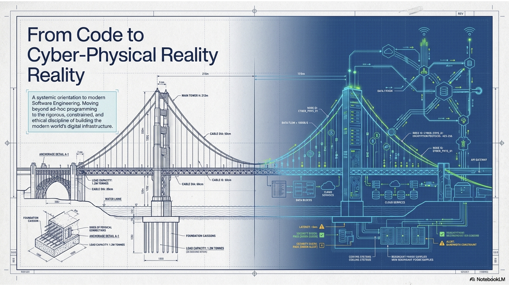
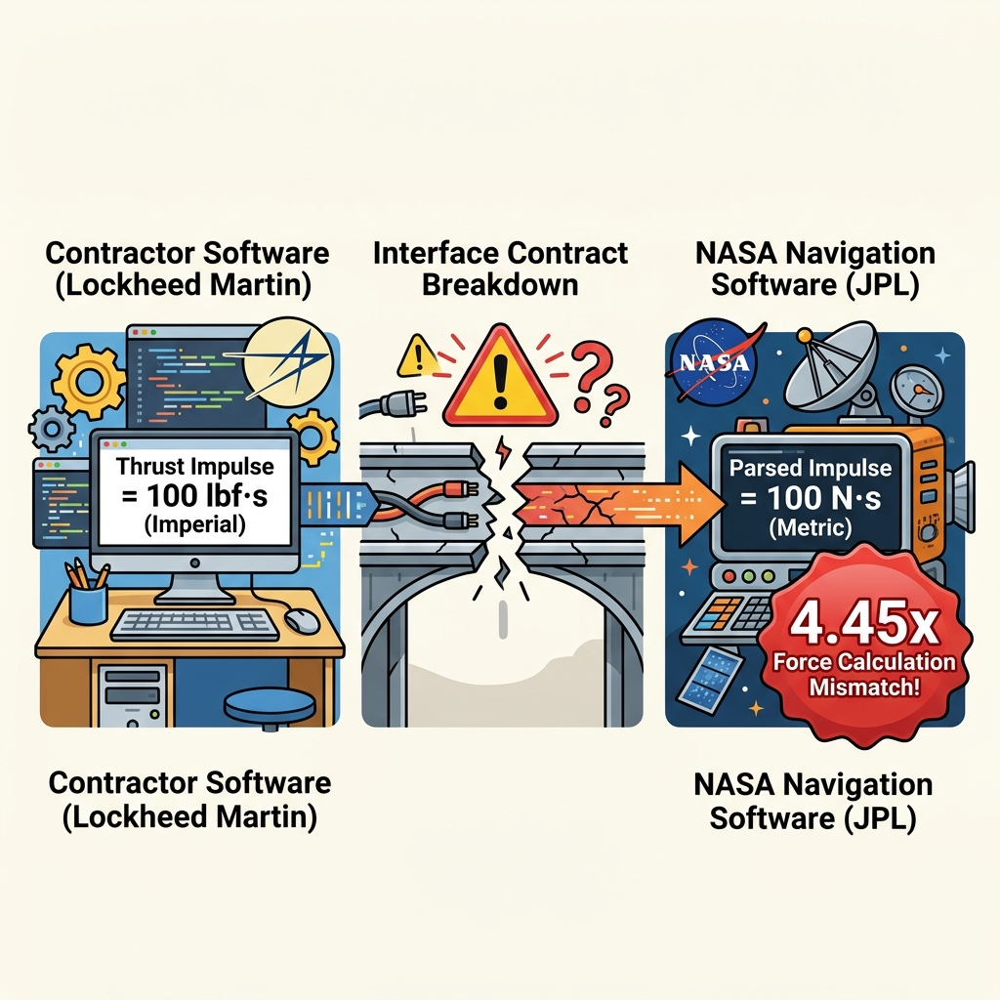

# Software Engineering

### Lecture 1: Introduction to Software Engineering

**Instructor: Professor Nien-Lin Hsueh (with Gemini AI)**  
Department of Information Engineering and Computer Science  
Feng Chia University

---

## Chapter 1: Roadmap & Key Topics

* **1.1 The Technological Arc:** From Mechanization to Ubiquitous AI
* **1.2 The Genesis of SE & The "Software Crisis":** NATO 1968 & Catastrophic Failures
* **1.3 Demystifying Software:** Beyond Source Code (Programs, Data, SOP, Docs)
* **1.4 ISO 9126 Quality Model:** 6 Characteristics & Operational Sub-Attributes
* **1.5 Modern Software Landscape:** Web, Mobile, ERP, Embedded, AI/ML
* **1.6 What is SE?:** Definition, Process, Constraints, 4 Core Activities, Principles & Myths
* **1.7 Modern Toolchains & AI:** CI/CD Pipelines & AI Benefits/Risks Matrix
* **1.8 Professional Ethics & Dark Patterns:** ACM/IEEE Code & Monochrome Comic
* **1.9 FAQ & Conceptual Recap**

---
<!-- _class: full-image-slide -->

  

---
<!-- header: '1.1 The Technological Arc' -->
<!-- _class: full-image-slide -->

  

---

## 1.1 The Four Industrial Eras

* **Industry 1.0 — Mechanization (Late 18th - Mid 19th C.):**
  * Steam and water power replace physical muscle; rise of centralized factories.
  * *Software's Role:* Non-existent. Purely physical mechanics.
* **Industry 2.0 — Mass Production (Late 19th - Early 20th C.):**
  * Electricity, moving assembly lines, standardization of manufactured goods.
  * *Software's Role:* Non-existent. Automation was hardwired electro-mechanical.
* **Industry 3.0 — Digital Automation (Mid to Late 20th C.):**
  * Semiconductors, microprocessors, PLCs, and PCs.
  * *Software's Role:* **Emerged as a distinct discipline** to control hardware and process data.
* **Industry 4.0 — Connectivity, Cloud, & AI (21st C. - Present):**
  * Cyber-physical systems, IoT, Cloud, LLMs, and autonomous systems.
  * *Software's Role:* **The central infrastructure** powering modern civilization.

---

## 1.1 Interactive Activity: Classroom Poll & Discussion

  

  **Classroom Poll & Discussion:**
  * **Poll:** What percentage of systems you interact with daily run on deterministic Industry 3.0 logic vs. adaptive, connected Industry 4.0 AI?
  * **Pair Discussion:** Identify one legacy manual system (e.g., campus parking, hospital triage, public transit dispatch). What unique software engineering challenges arise when transitioning it to Industry 4.0?

  

  

    
  

---
<!-- header: '1.2 Genesis of SE & The Software Crisis' -->
<!-- _class: full-image-slide -->

  

---

## 1.2 The Software Crisis of the Late 1960s

  

  * As hardware costs plummeted, software demand and complexity exploded.
  * **The Symptoms of Crisis:**
    * Chronic budget overruns (often 3x–4x initial estimates).
    * Critical project delays and abandoned deliveries.
    * Severe defects, system crashes, and unmaintainability.
  * **The Core Problem:** Informal, craft-like programming does not scale to large teams and complex systems.

  

  

    
  

---

## 1.2 The 1968 NATO Garmisch Conference

* **October 1968 in Garmisch, Germany:**
  * 50 leading computer scientists and industry managers convened.
  * Formally established the term **"Software Engineering"**.
* **The Mission:**
  * Transition software development from an undisciplined, artisanal craft into a **formal engineering discipline**.
  * Establish structured methodologies, rigorous cost estimation, formal verification, and project management.

---

## 1.2 The High Cost of Software Failure

  

  * **Nagoya Airbus A300 Crash (1994):**
    * Autopilot / human flight-control conflict led to 264 fatalities.
  * **Mars Climate Orbiter (1999):**
    * $327M spacecraft lost due to English vs. Metric force unit mismatch.
  * **Ariane 5 Flight 501 (1996):**
    * 64-bit float to 16-bit integer overflow destroyed a $370M rocket in 37 seconds.

  

  

    
  

---

## Concept Check: The Software Crisis (CCQ 1)

  

**Why couldn't the 1968 Software Crisis be solved simply by purchasing faster computer hardware or larger memory?**

* **A.** Hardware manufacturing stopped advancing in the late 1960s.
* **B.** The crisis was fundamentally a problem of cognitive complexity, communication overhead, and lack of engineering discipline.
* **C.** Programming languages lacked mathematical calculation capabilities.
* **D.** Hardware was incompatible with cloud infrastructure.

  

  

    
  

---
<!-- header: '1.3 Demystifying Software' -->
<!-- _class: full-image-slide -->

  

---

## 1.3 The IEEE Anatomy of Software

> **Software (IEEE Standard):** Computer programs, procedures, and possibly associated documentation and data pertaining to the operation of a computer system.

* **1. Programs:** Executable binaries and source code files (Python, Java, C++, TypeScript).
* **2. Data & Schemas:** Database tables, migration scripts, configuration files, and AI model weights.
* **3. Operational Procedures:** Deployment scripts, CI/CD pipelines, backup routines, and runbooks.
* **4. Documentation:** Architecture Decision Records (ADRs), API specs (OpenAPI), user guides, and SRS.

---

## 1.3 Interactive Activity: Pair Discussion

  

  **Pair Discussion: The Software Iceberg in Action**
  * Select a popular service: **Google Maps**, **Uber**, or **Spotify**.
  * Identify at least one specific artifact for each of the 4 pillars:
    1. *Program* | 2. *Data* | 3. *Procedure* | 4. *Documentation*
  * **Debate:** If an engineering team lost all database schemas and operational runbooks, could they restore production using only source code?

  

  

    
  

---
<!-- header: '1.4 ISO 9126 Quality Model' -->
<!-- _class: full-image-slide -->

  

---

## 1.4 ISO 9126: 6 Characteristics & Sub-Attributes

* **Functionality:** Suitability, Accuracy, Interoperability, Security, Compliance.
* **Reliability:** Maturity, Fault Tolerance, Recoverability, Compliance.
* **Usability:** Understandability, Learnability, Operability, Attractiveness.
* **Efficiency:** Time Behavior (Latency / Throughput), Resource Utilization.
* **Maintainability:** Analyzability, Changeability, Stability, Testability.
* **Portability:** Adaptability, Installability, Co-existence, Replaceability.

---

## 1.4 ISO 9126 Sub-Attributes & Practical Examples

* **Fault Tolerance (Reliability):** Primary payment gateway times out $\rightarrow$ system automatically retries with backup gateway without crashing.
* **Recoverability (Reliability):** Database server crashes $\rightarrow$ Write-Ahead Log restores transactional consistency in $<30$ seconds.
* **Time Behavior (Efficiency):** E-commerce search API returns 99% of query responses in $<80$ ms (p99 latency).
* **Testability (Maintainability):** Code structured with Dependency Injection so external APIs can be mocked easily in unit tests.
* **Installability (Portability):** Complete local microservices stack spins up in 60s via `docker compose up`.

---

## Concept Check: Software Quality (CCQ 2)

  

**A backend service uses Dependency Injection and structured JSON logging. When a production bug occurs, developers locate and fix the defect within 5 minutes without side effects. Which quality dimension is showcased?**

* **A.** Portability
* **B.** Maintainability (Analyzability & Changeability)
* **C.** Usability
* **D.** Functionality Compliance

  

  

    
  

---

## 1.4 Interactive Activity: Quality Trade-Off Poll

  

  **Quality Trade-off Poll & Discussion:**
  * **System A:** Hospital ICU Automated Insulin Pump Controller
  * **System B:** Mobile Casual Viral Game
  * **Poll:** What are the top 2 non-negotiable ISO 9126 attributes for System A vs. System B?
  * **Key Question:** Why is prioritizing *Time to Market* over *Fault Tolerance* fatal for System A, but acceptable for System B?

  

  

    
  

---
<!-- header: '1.5 Modern Software Landscape' -->
<!-- _class: full-image-slide -->

  

---

## 1.5 Key Application Domains

* **Web & SaaS Platforms:** Elastic cloud, high availability, microservices (Slack, Netflix).
* **Mobile Applications:** Constrained battery, touch UI, intermittent networks (iOS/Android).
* **Enterprise ERP / CRM:** ACID transactions, complex business logic, data governance (SAP, Salesforce).
* **Embedded & IoT Firmware:** Strict real-time constraints, limited memory, zero-fail avionics & automotive.
* **AI & Machine Learning:** Data pipelines, vector databases, GPU acceleration, LLM inference.
* **Scientific & CAD:** Floating-point precision, simulation physics, hardware acceleration.

---

## 1.5 Interactive Activity: System Classification

  

  **System Classification & Hybrid Architectures:**
  * Consider a modern **Connected Electric Vehicle (e.g., Tesla)**.
  * Which application domains does it encompass?
    * Real-time embedded firmware for braking / motor control.
    * Touchscreen UI for navigation & entertainment.
    * Cloud-native backend for fleet telemetry and OTA updates.
    * Edge AI models for autonomous vision.
  * **Discussion:** Why do update cadences differ dramatically across these subsystems?

  

  

    
  

---
<!-- header: '1.6 What is Software Engineering?' -->
<!-- _class: full-image-slide -->

  

---

## 1.6 What is Software Engineering?

> **Software Engineering:** An engineering discipline concerned with all aspects of software production—from initial specification through to system maintenance and evolution.

* **1. Engineering Discipline (Work Under Constraints):** Engineering applies scientific rigor and heuristics to solve real human problems under **strict constraints using finite resources**.
* **2. All Aspects of Production (The Software Process):** Governed by a systematic **Software Engineering Process (SE Process)** that guides activities, roles, and deliverables reliably from inception to evolution.

---
<!-- _class: full-image-slide -->

  

---

## 1.6 The Engineering Equation: Constraints vs. Resources

* **Constraints (The Limitations):**
  * **Time:** Hard deadlines, release windows.
  * **Budget:** Developer salaries, cloud hosting bills, license fees.
  * **Technology & Platform:** Legacy databases, mobile OS limits.
  * **Regulations:** GDPR data privacy, HIPAA, PCI-DSS.
* **Resources (The Assets):**
  * **Human:** Developer skill, QA engineers, UX designers.
  * **Tools & Infrastructure:** Cloud compute, CI/CD pipelines, open-source libraries.
  * **Domain Knowledge:** Understanding user workflows and business logic.

---

## 1.6 Case Study: Healthcare Startup MVP

* **Problem:** Launch a HIPAA-compliant telemedicine app in 6 months on a tight $80k budget.
* **The Engineering Balancing Solution:**
  1. **Scope Prioritization:** Build an MVP for video consults and booking; postpone insurance billing to Phase 2.
  2. **Cross-Platform Tooling:** Use **Flutter** / **React Native** to maintain a single codebase for iOS and Android (saves 40% effort).
  3. **Managed Backend:** Use HIPAA-compliant cloud BaaS (Supabase/Firebase) instead of bare-metal servers.
  4. **Automated CI/CD:** **GitHub Actions** runs unit tests on every PR, keeping QA overhead low for a 3-person team.

---
<!-- _class: full-image-slide -->

  

---

## 1.6 The 4 Universal Lifecycle Activities

| Activity | Key Artifacts | Risk If Neglected |
|:---|:---|:---|
| **1. Specification** (Requirements) | User Stories, SRS, Use Cases, Acceptance Criteria | Building the wrong product; 100x rework cost |
| **2. Design & Implementation** | Architecture ADD, ERD, API Specs, Codebase | Spaghetti code, unscalable architecture, technical debt |
| **3. Validation** (Testing / V&V) | Unit/Integration Tests, CI Reports, Bug Trackers | Critical production outages, data loss, security breaches |
| **4. Evolution** (Maintenance) | Release Notes, DB Migrations, Post-Mortems | Software rot, security vulnerabilities, obsolescence |

---

## 1.6 Interactive Activity: Scenario Analysis

  

  **Interactive Scenario: Which Activity Failed?**
  * *Scenario:* A startup built a lightning-fast in-app crypto wallet for a community grocery delivery app. The code had 100% test coverage and zero crashes. After launch, zero users adopted it because community shoppers exclusively preferred cash-on-delivery.
  * **Question:** Which fundamental activity failed: *Specification*, *Design*, *Validation*, or *Evolution*?
  * **Key Lesson:** Why can 100% code test coverage never compensate for a failure in Requirements Specification?

  

  

    
  

<!-- _class: full-image-slide -->

  

---

## 1.6 Elements Encompassed by Software Engineering

* **Disciplines (Best Practices):** Spec before design, Design before code, Interface-based, Change management, ADRs, Code reviews, ...
* **Principles (Foundations):** Abstraction, Modularity, Anticipation of Change, Open-Closed (OCP), KISS, POLA, ...
* **Methods & Methodologies:** Waterfall, Agile / Scrum, Spiral, TDD, CI/CD & DevOps, ...
* **Heuristics & Guidelines:** Nielsen's 10 UX Heuristics, SOLID design, Clean Code, DRY, YAGNI, ...

---

## 1.6 Dispelling Common Software Myths

* **Myth 1: "We're behind schedule—let's add 5 developers to catch up."**
  * **Reality (Brooks's Law):** Adding manpower to a late project makes it later ($O(n^2)$ communication overhead).
* **Myth 2: "Software is digital, so changing requirements late is cheap."**
  * **Reality:** Late changes invalidate schemas and architectures, costing up to 100x more.
* **Myth 3: "Outsource the coding and we don't need technical management."**
  * **Reality:** Outsourcing requires rigorous technical governance.

---
<!-- _class: full-image-slide -->

  

---

## Concept Check: Brooks's Law (CCQ 3)

  

**A project is 3 weeks behind schedule with 2 weeks remaining before release. The manager hires 4 junior programmers to speed up progress. What will happen according to Brooks's Law?**

* **A.** The project will finish 1 week early.
* **B.** The project will be delayed further because senior engineers must spend time onboarding and mentoring new hires.
* **C.** The existing developers will code twice as fast.
* **D.** Communication complexity remains unchanged.

  

  

    
  

---
<!-- header: '1.7 Modern Toolchains & AI' -->
<!-- _class: full-image-slide -->

  

---

## 1.7 The Modern Engineering Toolchain

* **Version Control (Git):** Branching strategies, pull requests, collaborative code review.
* **Modern IDEs (VS Code, IntelliJ):** Real-time linting, static analysis, refactoring.
* **CI/CD Pipelines (GitHub Actions, GitLab CI):** Automated building, testing, security scanning, and containerized deployment upon every commit.
* **Automated Testing:** Unit (PyTest/JUnit), Integration, E2E (Playwright).
* **Observability & APM:** Telemetry, structured logs, OpenTelemetry, Sentry.
* **AI Coding Assistants:** Copilot, Cursor, Gemini AI for intelligent pair programming.

---

## 1.7 AI in SE: Benefits vs. Risks Matrix

| Phase | Benefits of AI | Risks & Drawbacks |
|:---|:---|:---|
| **Requirements** | Drafts user stories, finds ambiguity | Hallucinates constraints, misses tacit context |
| **Architecture** | Recommends patterns, drafts ERDs | Over-engineering, ignores latency/security SLAs |
| **Coding** | Fast boilerplate, algorithm suggestions | "Vibe coding" bugs, security vulnerabilities |
| **Testing** | Generates synthetic edge-case tests | Echo-chamber tests (validating buggy code) |
| **Maintenance** | Explains legacy code, drafts docs | Silent regression bugs during refactoring |

---

## 1.7 Interactive Activity: The "Vibe Coding" Challenge

  

  **Classroom Poll & Discussion: AI in Practice**
  * **Poll:** When using GitHub Copilot or ChatGPT, how often do you inspect and understand every line before committing?
    *(Always / Usually / Rarely / Never)*
  * **Discussion:** Suppose an AI assistant writes a 200-line asynchronous database handler that passes 2 basic tests. Is it safe to deploy? What verification steps must a professional engineer execute?

  

  

    
  

---
<!-- header: '1.8 Ethics, Social Responsibility & Dark Patterns' -->
<!-- _class: full-image-slide -->

  

---

## 1.8 ACM/IEEE Code of Ethics: 8 Core Principles

1. **Public:** Prioritize public safety, health, and welfare above all.
2. **Client & Employer:** Act in their best interest, consistent with public interest.
3. **Product:** Ensure software meets high professional standards.
4. **Judgment:** Maintain integrity and independence in technical evaluation.
5. **Management:** Promote ethical management and realistic project estimates.
6. **Profession:** Advance the integrity and reputation of software engineering.
7. **Colleagues:** Be fair to, support, and mentor peers.
8. **Self:** Participate in lifelong learning and ethical practice.

---
<!-- _class: full-image-slide -->

  

---

## 1.8 High-Profile Ethical Breaches

* **Volkswagen "Dieselgate" (2015):**
  * Engineers wrote engine software to detect laboratory test cycles and hide toxic $NO_x$ emissions (up to 40x legal limit on the road).
  * Resulted in billions in fines, criminal convictions, and severe environmental harm.
* **Cambridge Analytica (2018):**
  * Improper harvesting of personal data for covert political manipulation.
* **Planned Obsolescence:**
  * Software updates engineered to artificially degrade legacy device performance.

---
<!-- _class: full-image-slide -->

  

---

## 1.8 Deceptive "Dark Patterns" in UI/UX Design

* **1. Roach Motel (Subscription Labyrinth):**
  * Signing up takes 1 click; cancelling requires navigating hidden menus or making a phone call.
* **2. Confirmshaming:**
  * Emotionally manipulative text on decline buttons (*"No thanks, I hate saving money"*).
* **3. Hidden Costs & Sneak into Basket:**
  * Pre-ticking add-on insurance or fees at the final checkout step.
* **4. Fabricated Urgency & Scarcity:**
  * Fake countdown timers (*"Only 2 minutes left!"*) and fabricated demand alerts.

---

## Concept Check: Engineering Ethics (CCQ 4)

  

**Under the ACM/IEEE Code of Ethics, if an employer directs an engineer to implement an algorithm that falsifies safety compliance reports, what is the engineer's obligation?**

* **A.** Comply, because the employer pays the engineer's salary.
* **B.** Refuse and escalate, because the Public Interest takes precedence over Employer loyalty.
* **C.** Implement the code but omit documentation.
* **D.** Outsource the code to an external vendor.

  

  

    
  

---

## 1.8 Interactive Activity: Dark Pattern Detective

  

  **Dark Pattern Detective Activity:**
  * **Identify:** Recall a deceptive dark pattern you encountered on a real-world app or e-commerce platform.
  * **Analyze:** Which ACM/IEEE ethical principle (Public Interest, Product Quality, Professional Judgment) was violated?
  * **Redesign:** How would you redesign that interaction to achieve legitimate business conversion while remaining transparent and user-respecting?

  

  

    
  

---
<!-- _class: full-image-slide -->

  

---

## 1.8 Mindset: Data, Developers, and Users

  

  * **Developer & User Entanglements:**
    * Software is not created in isolation—it directly impacts real human workflows, livelihoods, and safety.
  * **Data is Gold:**
    * Data integrity, privacy governance, and algorithmic fairness are core engineering responsibilities.

  

  

    
  

---
<!-- header: '1.9 FAQ & Recap' -->

## 1.9 Frequently Asked Questions (FAQ)

* **Q: Computer Science vs. Software Engineering?**
  * *CS:* Mathematical and theoretical foundations (algorithms, automata, complexity).
  * *SE:* Practical engineering of reliable software under time, cost, and human constraints.
* **Q: Where do software costs go?**
  * Initial build: $\approx 60\%$ development, $\approx 40\%$ testing.
  * Total lifecycle: Evolution/maintenance accounts for **$70\% - 80\%$** of total costs.
* **Q: Is there one universal "best" language or methodology?**
  * No. Tool and process selection depends on application domain, safety constraints, and business goals.

---

## Recap: Fill-in-the-Blank Quiz

  

Test your mastery of Chapter 1 fundamentals:

1. According to the IEEE definition, software consists of programs, data, operational procedures, and **[ _________ ]**.
2. Adding manpower to a late software project makes it later is known as **[ _________ ]** Law.
3. The **[ _________ ]** Quality Model defines 6 characteristics including Functionality, Reliability, Usability, Efficiency, Maintainability, and Portability.
4. The first principle of the ACM/IEEE Code of Ethics prioritizes the **[ _________ ]** interest.

  

  

    
  

---

## References & Further Reading

* Sommerville, Ian. *Software Engineering* (10th Edition). Pearson. [Official Website](https://software-engineering-book.com/)
* Brooks, Frederick P. *The Mythical Man-Month: Essays on Software Engineering*. Addison-Wesley.
* ISO/IEC 9126-1:2001. *Software engineering — Product quality — Part 1: Quality model*.
* ACM/IEEE Joint Task Force on Software Engineering Ethics. *Software Engineering Code of Ethics*. [IEEE CS](https://www.computer.org/education/code-of-ethics)
* Brignull, Harry. *Deceptive Patterns: Exposing the Tricks Tech Companies Use to Control You*.
