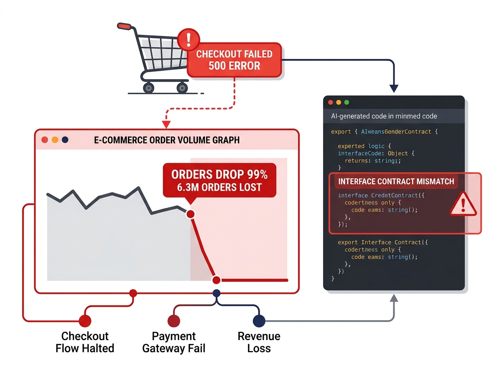

# 軟體工程

### 第一課：軟體工程導論

**授課教師：薛念林 教授 (與 Gemini AI 協作)**  
資訊工程學系  
逢甲大學

---
## 第一章：課程大綱與核心概念

* **1.1 軟體改變世界：** 從大型主機到普及化 AI
* **1.2 軟體工程起源與「軟體危機」：** 1968 年 NATO 會議與重大歷史災難
* **1.3 何謂軟體？：** 超越原始碼的四大支柱（程式、資料、程序、文檔）
* **1.4 何謂工程？：** 現實約束 vs. 有限資源的務實權衡天平
* **1.5 何謂軟體工程？：** 定義、四大核心活動、知識體系 (BOK) 與現代工具鏈
* **1.6 軟體品質模型：** 定義、ISO/IEC 25010 八大特徵與實務運作屬性
* **1.7 專業倫理與黑暗模式：** ACM/IEEE 倫理守則與 UI 欺騙模式
* **1.8 軟體工程中的 AI 角色：** 典範轉移、生命週期分析與工程嚴謹性
* **1.9 常見問題 (FAQ) 與核心觀念回顧**

---

## 1.1 軟體改變世界：從大型主機到個人電腦 (1950s–1980s)

* **大型主機與迷你電腦時代 (1950s–1970s)：**
  * *技術典範：* 巨型主機佔據恆溫機房（如 IBM System/360）；軟體透過打孔卡與磁帶進行批次運算。
  * *人類生活影響：* 自動化政府人口普查、國防雷達與銀行核心總帳——過去需要成千上萬人耗費數月的人工作業，縮短至數小時內完成。
* **個人電腦 (PC) 革命 (1980s)：**
  * *技術典範：* 微處理器推動軟體走入每張辦公桌（DOS、Macintosh、Windows、VisiCalc、Lotus 1-2-3）。
  * *為人類帶來的便利：*
    * 將厚重紙本辦公室轉變為互動式數位工作站。
    * 電子試算表與文書處理軟體，將全球上班族從繁瑣的手工重新計算與打字謄寫中徹底解放。

---

## 互聯的世界：網頁與網際網路革命 (1990s–2000s)

* **全球資訊網 (WWW) 的誕生 (1990s)：**
  * *技術典範：* Tim Berners-Lee 發明 HTTP/HTML；瀏覽器（Netscape、IE）將網際網路轉化為大眾皆可點擊的虛擬空間。
  * *人類生活影響：* **全球資訊知識平權化**——世界百科全書、學術研究與全球新聞，透過 Yahoo 與 Google 實現隨手即時搜尋。
* **電子商務與全球平台崛起 (2000s)：**
  * *技術典範：* 安全網路交易 (SSL)、分散式資料庫與 Web API 服務（Amazon、eBay、PayPal、維基百科）。
  * *為人類帶來的便利：*
    * **抹平地理空間距離：** 電子郵件與即時通訊軟體取代了昂貴漫長的國際郵件與長途電話。
    * **24/7 全天候數位生活：** 線上購物、網路轉帳與票務預訂徹底取代了實體櫃檯排隊。

---

## 口袋裡的革命：智慧型手機與隨行雲端 (2010s)

* **智慧型手機與 App 經濟圈 (iOS & Android)：**
  * *技術典範：* 軟體深植於口袋中，與 GPS 定位、高畫質相機、各類感測器及 4G/5G 行動網路深度整合。
  * *人類生活影響：* **軟體成為人類感官與大腦的自然延伸**——全球超過 60 億人口隨身攜帶超級電腦。
* **雲端運算與隨選即用 (On-Demand) 經濟：**
  * *技術典範：* 彈性雲端基礎設施 (AWS, Azure) 隨時隨地串流分發運算、儲存與內容。
  * *為人類帶來的便利：*
    * **無縫日常生活：** 叫車媒合 (Uber)、美食外送、即時串流娛樂 (Netflix, Spotify) 與行動無現金支付。
    * **即時路況導航與遠距協作：** Google Maps 動態路況避開塞車，雲端辦公軟體打破實體辦公室隔閡。

---

## 智慧的躍升：生成式 AI 與自主代理時代 (2020s–Present)

* **從確定性規則邏輯 $\rightarrow$ 機率型認知智慧：**
  * *技術典範：* 大型語言模型 (LLM)、多模態基底模型與自主 AI 代理 (ChatGPT, GitHub Copilot, Gemini)。
  * *人類生活影響：* 軟體不再只是被動執行人類寫死的規則，而是能理解自然語言意圖、推理複雜脈絡、生成代碼與創作內容。
* **環境智慧 (Ambient Intelligence) 與虛實整合：**
  * *技術典範：* AI 全面賦能自動駕駛、智慧機器人、電網能源調度與精準醫療輔助診斷。
  * *為人類帶來的便利：*
    * **認知輔助的邊際成本降至零：** 每個人都擁有全年無休的頂尖個人導師、專業編程副駕駛與即時跨語言翻譯。
    * **大幅加速科學探索：** 蛋白質結構預測 (AlphaFold) 與新藥研發週期，從數年縮短至數週。

---
<!-- _class: quote-slide -->

> **「水能載舟，亦能覆舟」**  
> *(The water that bears the boat is the same that swallows it up.)*

軟體賦能了現代文明；然而失去工程紀律的軟體，也能傾覆文明。

---

## 1.2 1960 年代末期的軟體危機

  

  * 隨著硬體成本大幅下降，軟體需求與系統複雜度呈現爆炸性增長。
  * **危機的具體症狀：**
    * 專案時程嚴重失控與預算嚴重超支（常達原始預估的 3 到 4 倍）。
    * 專案交付延宕甚至最終被迫終止廢棄。
    * 系統充斥嚴重缺陷、頻繁崩潰且難以維護。
  * **根本病因：** 憑個人手藝、缺乏紀律的手工作坊式編程，無法應對大型團隊協作與複雜系統規模。

  

  

    
  

---

## 1968 年 NATO 迦米許會議

* **1968 年 10 月於德國迦米許 (Garmisch)：**
  * 50 位全球頂尖計算機科學家與產業界主管齊聚一堂。
  * 正式創立並確立了 **「軟體工程 (Software Engineering)」** 這一術語。
* **會議的歷史使命：**
  * 促使軟體開發由無規範的工匠手藝，轉型為具備嚴謹規範的 **正式工程學科**。
  * 建立結構化方法論、嚴謹的成本估算、形式化驗證以及系統化專案管理。

---

## 軟體失效的慘痛代價

  

  * **日本名古屋空中巴士 A300 空難 (1994)：**
    * 自動駕駛重飛模式維持啟動，與飛行員手動推桿對抗，導致俯仰配平攻角過大失速墜毀，釀成 264 人罹難。
  * **火星氣候探測者號失聯 (1999)：**
    * 價值 3.27 億美元的探測器墜毀，因地面軟體使用英制單位 ($lbf\cdot s$)，而機載電腦預期公制單位 ($N\cdot s$)。
  * **亞利安 5 號 501 號火箭爆炸 (1996)：**
    * 將 64 位元浮點數水平速度轉換為 16 位元有號整數時產生溢位 ($>32,767$)，發射後 37 秒處理器崩潰引爆。

  

  

    
  

---

### 觀念檢測：軟體危機 (CCQ 1)

<!-- id: ase-ch01-ccq1 -->

  

**為什麼 1968 年的「軟體危機」無法單純透過購買運算速度更快、記憶體容量更大的電腦硬體來解決？**

* **A.** 1960 年代末期電腦硬體製造與記憶體製程完全停滯，無法提供實質的運算效能提升。
* **B.** 危機本質上是系統規模與智力管理帶來的組織複雜度挑戰，更強大的硬體反而刺激並放大了系統規模。
* **C.** 當時的高階程式語言完全缺乏數學計算基底與編譯器記憶體動態配置能力。
* **D.** 早期的真空管與主機架構在物理特性上無法支援多終端機與遠端通訊網絡的共用協定。

  

  

    
  

---

## 我們需要工程方法來開發軟體
* 何謂 **軟體 (Software)** ？
* 何謂 **工程 (Engineering)** ？
* 何謂 **軟體工程 (Software Engineering)** ？

---
<!-- header: '1.3 何謂軟體？' -->
<!-- _class: full-image-slide -->

  

---

## 1.3 IEEE 對軟體的完整剖析

> **軟體 (IEEE 標準定義)：** 與電腦系統運作相關的電腦程式、程序，以及可能伴隨的相關文檔與資料。

* **1. 電腦程式 (Programs)：** 可執行的二進位檔案與原始碼 (Python, Java, C++, TypeScript)。
* **2. 資料與結構 (Data & Schemas)：** 資料庫綱要、設定檔、AI 模型權重（例如：Knight Capital 設定資料錯誤導致破產）。
* **3. 運作程序 (Operational Procedures)：** 部署腳本、備份策略、災害復原 SOP（例如：GitLab 備份復原程序失效）。
* **4. 文檔說明 (Documentation)：** 架構決策記錄 (ADR)、API 規格合約 (OpenAPI)、操作手冊（例如：Therac-25 缺乏文檔掩蓋並行缺陷）。

---

## 軟體冰山陷阱：超越看得見的原始碼

* **業餘者的盲點：**
  * 初學者與短視的管理者常誤將軟體等同於露出水面的冰山頂端——**程式（原始碼）**，並僅以寫了多少行程式碼 (LOC) 來衡量工作進度。
* **隱藏的現實（80% 以上潛藏於水面下）：**
  * 在正式生產系統中，超過 **80% 的工作量、系統複雜度與災難性事故**，皆源自水面下的資料、程序與文檔：
    * *Knight Capital（45 分鐘內損失 4.4 億美元）：* 核心程式運算正確，但因有缺陷的部署**程序**與過期的設定**資料**導致破產。
    * *GitLab 資料庫事故：* 線上服務程式運作良好，但缺乏驗證過的災害復原**程序**導致資料差點永久遺失。
    * *Therac-25 輻射事件：* 缺乏系統架構**文檔**，掩蓋了致命的並行競爭缺陷。
* *若缺乏這四大支柱的協同支撐，系統並不是「工程化軟體」——僅僅是一段脆弱的程式碼。*

---

## 為何四大支柱必然要求「軟體生命週期 (SDLC)」？

> **核心領悟：** **「寫程式」** 是在一個下午敲出程式碼。**「軟體工程」** 則是在完整的 **軟體生命週期 (SDLC)** 中嚴謹治理這四大支柱。

* **1. 文檔 $\longleftrightarrow$ 需求工程與架構設計：**
  * 程式碼只記錄了 *怎麼做 (How)*，而文檔（ADR、OpenAPI、需求規格）才記錄了 *為什麼這麼做 (Why)*。缺乏架構契約，長達數年的團隊協作與系統演化將寸步難行。
* **2. 程式 $\longleftrightarrow$ 開發實作與自動化驗證：**
  * 寫出程式碼只是短暫的起點。軟體工程要求持續單元測試、CI/CD 驗證與持續重構，防止程式腐化並遏止技術債累積。
* **3. 資料與結構 $\longleftrightarrow$ 狀態持久化與長期演化：**
  * 程式碼隨時可以重新發布，但資料必須留存數十年。生命週期治理要求嚴謹的綱要版本控管、向下相容性與無痛資料庫遷移工程。
* **4. 運作程序 $\longleftrightarrow$ DevOps、自動部署與網站可靠性工程 (SRE)：**
  * 跑在 `localhost` 的程式只是玩具。工程化系統需要自動化部署管線、金絲雀發布 (Canary)、災難復原演練與全方位監控告警。

---

## 為何四大支柱至關重要：以 YouBike 微笑單車為例

* **1. 程式（運算執行核心）：**
  * *智慧車柱鎖嵌入式韌體、手機 App、雲端後端微服務架構。*
  * 可靠執行即時借還車通訊協定、GPS 軌跡回傳與海量並行請求處理。
* **2. 資料與結構（系統單一信任源）：**
  * *車輛即時位置、車柱可用狀態、用戶悠遊卡/信用卡餘額與 ACID 租借紀錄。*
  * 資料遺失或同步失敗將導致「幽靈單車」、扣款錯誤與巨大營收損失。
* **3. 運作程序（系統韌性與營運）：**
  * *韌體 OTA 線上升級、車輛調度物流、交易斷線容錯切換與電池定期檢修流程。*
  * OTA 部署程序一旦失誤將導致數萬座戶外車柱變磚，需要極為昂貴的實體現場維修成本。
* **4. 文檔（跨團隊協作合約）：**
  * *OpenAPI 規格、MQTT 遙測通訊協議合約與硬體/軟體介面規格書。*
  * 避免硬體設備商、App 開發團隊與市府交通局後台系統在整合時發生對接災難。

---

### 觀念檢測：軟體定義 (CCQ 2)

<!-- id: ase-ch01-ccq2 -->

  

**依據 IEEE 對「軟體 (Software)」的標準定義，下列何者不屬於軟體的範疇？**

* **A.** 可執行的電腦程式與原始碼檔案。
* **B.** 系統資料庫綱要與組態設定檔。
* **C.** CPU 運算處理器與實體記憶體硬體模組。
* **D.** 軟體安裝步驟與自動化維運部署程序。

  

  

    
  

---
<!-- _class: full-image-slide -->

  

---
<!-- header: '1.4 何謂工程？' -->

## 1.4 何謂工程？

> **工程 (Engineering)：** 創造性地應用科學原理、經驗方法與實務經驗，在**現實世界的約束條件**與**有限資源**下，發明、設計與建造出實用產物。

* **科學家 vs. 工程師（馮·卡門 Theodore von Kármán）：**
  * *「科學家探索已然存在的世界；工程師創造從未有過的世界。」*
  * 科學追求 **客觀真理與自然規律的發現**；工程則追求 **實用價值、可行性與問題的具體解決**。
* **工程實踐的三大核心特徵：**
  * **1. 目標導向的問題解決：** 直接回應人類社會、商業運作或實務生活的需求與挑戰。
  * **2. 約束條件下的最佳化：** 永遠不會在理想真空環境下工作；必須持續在多方衝突的條件中權衡取捨。
  * **3. 系統化的可預測性：** 以嚴謹標準、可重複流程與經過檢驗的安全餘量，取代不可靠的手工直覺。

---

## 工程天平：現實約束 vs. 有限資源

* **約束條件 (Constraints — 外部限制)：**
  * **時程 (Time)：** 嚴格的產品發布期限、市場進入窗口。
  * **預算 (Budget)：** 研發薪資、雲端託管帳單、第三方軟體授權費。
  * **技術與平台 (Technology)：** 既有遺留資料庫相容性、行動作業系統限制。
  * **法律與規範 (Regulations)：** GDPR 個人資料保護、HIPAA 醫療隱私、PCI-DSS 金融支付標準。
* **可用資源 (Resources — 內部資產)：**
  * **人力資源 (Human)：** 開發團隊技術能力、QA 測試工程師、UX 設計師。
  * **工具與基礎建設 (Tools)：** 雲端運算節點、CI/CD 自動化管線、開源成熟函式庫。
  * **領域知識 (Domain Knowledge)：** 對使用者工作流程與商業邏輯的深刻理解。

---

## 實務案例：醫療新創公司 MVP

* **面臨挑戰：** 需在 6 個月時程與僅僅 8 萬美元的有限預算內，上線一款符合 HIPAA 醫療隱私規範的遠距醫療 App。
* **工程權衡的務實決策：**
  1. **範疇排序 (Scope Prioritization)：** MVP 僅專注於核心視訊看診與預約流程；保險理賠與繁複報銷功能延後實作。
  2. **跨平台開發框架：** 採用 Flutter/React Native 單一程式碼基底（相較於分別開發雙平台原生 App，節省約 40% 人力）。
  3. **託管後端服務：** 採用具 HIPAA 認證的雲端 BaaS 服務，免去自建機房與繁瑣底層維運。
  4. **自動化 CI/CD：** 在 Pull Request 上執行自動化單元測試，將人工 QA 成本降至最低。
* **為何不追求理論上「最完美」的技術方案？**
  * 自行開發純原生雙平台 App 與自架微服務在技術極限上更優越，但會直接違反約束（預算超支、嚴重逾期），導致公司倒閉。
  * **滿意化策略 (Satisficing)：** 在嚴格約束下，透過務實的技術權衡找出「足夠好且能成功運作」的解答。
  * **工程必然要求：** 我們需要 **需求工程 (Requirements Engineering)** 來在有限預算下談判界定系統範疇，並需要 **系統設計 (System Design)** 來進行架構權衡，滿足現實世界的嚴格約束。

---
<!-- header: '1.5 何謂軟體工程？' -->
<!-- _class: full-image-slide -->

  

---

## 1.5 何謂軟體工程？

> **軟體工程 (Software Engineering)：** 一門涉及軟體生產所有面向的工程學科——從最初的需求規格說明，直到系統的維護與長期演化。

* **1. 工程學科 (在約束條件下工作)：** 應用科學嚴謹性與工程經驗法則，在**嚴格的約束條件與有限的資源下**，務實解決人類與社會的真實問題。
* **2. 生產的所有面向 (軟體工程流程)：** 由系統化的 **軟體工程流程 (SE Process)** 所規範，引導各項活動、角色與交付成果從專案萌芽一路可靠推進至長期演化。

---
<!-- _class: full-image-slide -->

  

---

## 活動一：軟體規格說明 (Software Specification)

> **明確定義系統「必須做什麼」以及系統運作時所受到的各項約束條件。**

* **核心使命：**
  * 在動手寫程式之前，精確發掘、協商並確立利害關係人的真實需求與系統邊界。
* **生命週期關鍵子活動：**
  * **可行性研究 (Feasibility Study)：** 評估專案在技術與商業經濟上是否可行？
  * **需求發掘與分析 (Requirements Elicitation & Analysis)：** 發掘用戶真正的痛點與需求。
  * **規格撰寫與驗證 (Specification & Validation)：** 將需求轉化為清晰、無歧義且可驗證的合約文件。
* **核心產出物：** 使用者故事 (User Stories)、驗收準則 (Given-When-Then)、需求規格書 (SRS)、使用案例 (Use Cases)。
* **關鍵風險：**
  * 打造出完全錯誤的產品！線上營運階段才發現的需求缺陷，其修復成本通常高達規格階段的 **100 倍以上**。

---

## 活動二：軟體設計與實作 (Design & Implementation)

> **將抽象的需求規格，轉換為可執行的軟體結構與原始程式碼。**

* **核心使命：**
  * 將概念性規格轉變為具備高強韌性、高可維護性與高效能表現的實體軟體系統。
* **生命週期關鍵子活動：**
  * **架構設計 (Architectural Design)：** 規劃整體系統骨架、服務切割與子系統邊界。
  * **介面與資料塑模 (Interface & Data Modeling)：** 制定模組化 API 通訊契約與資料庫綱要。
  * **元件詳細設計與編程 (Component Design & Coding)：** 撰寫具備高度可測性與簡潔的邏輯演算法。
* **核心產出物：** 架構決策記錄 (ADR)、實體關聯圖 (ERD)、OpenAPI 規格、高品質 Clean Code。
* **關鍵風險：**
  * 義大利麵式混亂架構、強烈模組耦合與失控的技術債，導致未來任何微小修改都極為昂貴甚至寸步難行。

---

## 活動三：軟體驗證與確認 (Software Validation)

> **檢驗軟體是否完全符合其規格說明，並確認其是否真正滿足客戶的實際需求。**

* **品質的雙重支柱 (Boehm)：**
  * **Verification (驗證)：** *「我們是否有把產品做對？」*（嚴格符合設計與規格要求）。
  * **Validation (確認)：** *「我們是否有做對產品？」*（真正解決客戶的實質問題）。
* **生命週期關鍵子活動：**
  * **單元與元件測試 (Unit & Component Testing)：** 隔離單一模組並徹底檢驗邊界條件。
  * **整合與系統測試 (Integration & System Testing)：** 驗證服務間的 API 呼叫契約與端對端完整流程。
  * **驗收測試與同儕審查 (Acceptance Testing & Code Review)：** 團隊審查把關與使用者最終簽核。
* **核心產出物：** 自動化測試套件 (PyTest, JUnit)、CI 管線建置報告、程式碼覆蓋率指標。
* **關鍵風險：**
  * 線上系統全面崩潰、災難性資安漏洞外洩、核心資料損毀與沉重的法律賠償責任。

---

## 活動四：軟體演化 (Software Evolution)

> **對已上線運作的軟體進行修改與調適，以持續因應改變中的商業環境與使用者需求。**

* **軟體經濟學的殘酷現實：**
  * 真實世界的軟體永遠不會真正「寫完」。軟體生命週期總成本中有 **60% 至 80% 以上** 發生在初次上線後的演化與維護階段！
* **維護的四大經典型態：**
  * **改正性維護 (Corrective)：** 修復線上營運中爆發的潛在缺陷、崩潰 Bug 與邊界異常。
  * **適應性維護 (Adaptive)：** 因應雲端環境升級、行動作業系統改版或新法規遵循而進行調整。
  * **完善性維護 (Perfective)：** 提升系統吞吐量、降低延遲、改善 UI 互動體驗並擴充新業務功能。
  * **預防性維護 (Preventive)：** 持續重構程式碼結構以消除技術債，防患於未然。
* **核心產出物：** 資料庫遷移腳本 (Migration Scripts)、發布日誌 (Release Notes)、事故檢討報告 (Post-Mortems)。
* **關鍵風險：**
  * 軟體架構嚴重腐化、技術堆疊遭時代淘汰、爆發不可防範的安全漏洞，最終被迫全面報廢。

---

### 觀念檢測：核心活動 (CCQ 3)

<!-- id: ase-ch01-ccq3 -->

  

**下列哪一組選項正確地將具體的軟體工程實踐行為，對應到其所屬的四大通用核心活動？**

* **A.** 與利害關係人進行訪談以梳理使用者故事 $\rightarrow$ 軟體規格說明 (Specification)
* **B.** 撰寫自動化單元測試以模擬資料庫回應 $\rightarrow$ 軟體設計與實作 (Design & Implementation)
* **C.** 重構資料庫綱要以提升查詢執行效能 $\rightarrow$ 軟體驗證 (Validation)
* **D.** 將老舊的第三方支付 API 抽換為全新閘道服務 $\rightarrow$ 軟體規格說明 (Specification)

  

  

    
  

---
<!-- _class: full-image-slide -->

  

---

## 軟體工程知識體系 (Body of Knowledge, BOK)

* 軟體工程奠基於一套結構化的 **知識體系 (BOK)**——匯集了經過時間驗證的 **工程經驗法則 (Heuristics)** 與核心原則，旨在克服規模複雜度：
  * **實踐紀律 (Disciplines)：** 團隊必須遵守的專業常規與操作規範（*「先做規格再做設計」、「先做設計再寫程式」、架構決策記錄、程式碼同儕審查*）。
  * **核心原則 (Principles)：** 歷久彌新的軟體本質基石（*抽象化、模組化、關注點分離、預應變更*）。
  * **方法與方法論 (Methods & Methodologies)：** 結構化且具可重複性的開發流程框架（*敏捷/Scrum、極限編程、測試驅動開發 TDD、CI/CD 管線、DevOps*）。
  * **經驗法則與指引 (Heuristics & Guidelines)：** 數十年實務淬鍊而成的直覺法則與設計準則（*SOLID 原則、Clean Code、KISS、DRY、YAGNI、最少驚訝原則 POLA*）。

---

## 將知識體系貫徹於四大核心活動

* 知識體系絕非空洞理論——它具體指引了**四大生命週期通用活動**的落實方式：
* **1. 軟體規格說明（需求）：**
  * *實踐紀律與核心原則：* **「先規格後設計」**、抽象化、關注點分離。
  * *經驗法則：* **YAGNI**（避免過早實作臆測需求）、明確無歧義的驗收準則。
* **2. 軟體設計與實作：**
  * *實踐紀律與核心原則：* **「先設計後編程」**、模組化、資訊隱藏、架構決策記錄 (ADR)。
  * *經驗法則：* **SOLID 原則**、整潔架構 (Clean Architecture)、GoF 設計模式、**DRY**、**KISS**。
* **3. 軟體驗證（測試與品管）：**
  * *實踐紀律與核心原則：* **TDD 測試驅動**、獨立驗證機制、強制性同儕代碼審查 (PR Review)。
  * *經驗法則：* 邊界值分析、深度防禦機制、自動化回歸測試安全網。
* **4. 軟體演化（維護與重構）：**
  * *實踐紀律與核心原則：* **預應變更 (Anticipation of Change)**、語意化版本號 (SemVer)、技術債務追蹤。
  * *經驗法則：* **童子軍法則**（*隨時讓程式碼比你發現它時更乾淨*）、零停機無痛滾動發布。

---

## 原則為何重要：破解軟體常見迷思

> **當工程原則遭到忽視，盲目的直覺往往會導致代價極為昂貴的錯誤假設。**

* **迷思 1：「專案進度落後了——趕快加派 5 位工程師進來趕工！」**
  * *違反原則：* **模組化與通訊邊界限制**。
  * *真實法則 (布魯克斯法則 Brooks's Law)：* 在已延誤的專案中增加人手只會使專案更加延誤，因溝通路徑呈 $O(n^2)$ 爆炸性暴增。
* **迷思 2：「軟體是數位化的，所以在開發後期修改需求非常便宜。」**
  * *違反原則：* **「先規格後設計」與架構耦合控制**。
  * *真實法則：* 後期變更將衝擊資料庫綱要、破壞 API 契約與既有測試，修復成本呈指數級劇增至 **100 倍**。
* **迷思 3：「把寫程式外包出去，我們內部就不需要懂技術的工程管理。」**
  * *違反原則：* **軟體冰山（資料、程序與文檔）**。
  * *真實法則：* 缺乏內部架構治理與程序掌控的裸程式碼，只會製造無法維護的巨大技術債務。

---
<!-- _class: full-image-slide -->

  

---

### 觀念檢測：布魯克斯法則 (CCQ 4)

<!-- id: ase-ch01-ccq4 -->

  

**某個軟體專案目前落後進度 3 週，距離正式交付期限僅剩 2 週。專案經理決定緊急招募 4 位初階程式設計師加入以期加速進度。根據「布魯克斯法則 (Brooks's Law)」，最可能的結果是什麼？**

* **A.** 專案將因此提前 1 週順利交付。
* **B.** 專案進度將進一步嚴重延宕，因為資深工程師必須耗費寶貴時間來指導與培訓新人。
* **C.** 既有開發人員的產出效率將立刻提升一倍。
* **D.** 團隊內部的溝通複雜度將維持不變。

  

  

    
  

---

### 觀念檢測：設計原則 (CCQ 5)
<!-- id: ase-ch01-ccq5 -->

  

**一個電商「訂單處理模組」同時直接處理 HTTP 請求解析、執行信用卡交易、執行 SQL 資料庫查詢，並動態組裝 HTML 收據郵件。此設計最嚴重違反了哪項核心設計原則？**

* **A.** 關注點分離 (Separation of Concerns)：多項互不相干的業務職責緊密糾纏在單一模組中。
* **B.** YAGNI 原則：在客戶尚未提出明確商業需求前，過早實作臆測的未來擴充功能。
* **C.** 布魯克斯法則 (Brooks's Law)：對該訂單模組增加工程人手導致團隊溝通成本呈指數上升。
* **D.** 預應變更 (Anticipation of Change)：系統設定與業務規則被硬編碼寫死在編譯二進位檔中。

  

  

    
  

---

## 規模化落實工程紀律：現代自動化工具鏈

> **工程師無法單靠意志力貫徹紀律——現代工具鏈將知識體系自動化為剛性防線。**

* **版本控制 (Git) $\rightarrow$ *落實團隊協作與審查紀律*：** 分支治理策略、PR 嚴格審核把關、版本可追溯性。
* **CI/CD 自動化管線 (GitHub Actions) $\rightarrow$ *落實持續驗證紀律*：** 提交自動觸發編譯、自動測試與程式碼風格檢驗。
* **靜態代碼分析 (SonarQube) $\rightarrow$ *落實整潔代碼與資安紀律*：** 主動掃描代碼異味 (Code Smells) 與 CVE 已知安全漏洞。
* **自動化測試框架 (PyTest, Playwright) $\rightarrow$ *落實品質標準紀律*：** 單元、整合與 E2E 端對端全方位防護網。
* **系統可觀測性 (OpenTelemetry, APM) $\rightarrow$ *落實軟體演化反饋*：** 即時線上效能遙測、分散式追蹤與異常告警。

---
<!-- _class: full-image-slide -->

  

---
<!-- header: '1.6 軟體品質模型' -->

## 1.6 何謂軟體品質模型？

> **軟體品質 (Software Quality) 是指軟體產品滿足明示與隱含需求的程度。**

* **為何「品質」絕不能只等於「沒有 Bug」？**
  * 初學者往往誤以為程式只要能順利編譯執行、沒有立即崩潰，就是「高品質」。
  * 一個毫無當前錯誤的系統，可能在架構上**完全無法維護**、運算極為緩慢、充滿安全漏洞，或者對使用者極度不友善。
* **軟體品質模型的核心價值與目的：**
  * **多維度分類體系：** 將抽象的「品質」概念拆解為結構化的**主要特徵 (Characteristics)**、**子特徵 (Sub-characteristics)** 與**具體量化指標**。
  * **弭平利害關係人與工程師的認知鴻溝：** 將模糊的商業期望（*「App 要流暢且安全」*）轉化為具體可測試的工程指標（*$p99 < 100\text{ms}$、零 SQL 注入、系統可用率 $MTBF > 99.99\%$*）。
  * **指引架構取捨與權衡：** 明確指出系統在特定場景中不可退讓的品質重點（例如：*安全性重於搶先上市*，或*跨平台可移植性重於極致效能*）。

---

## 現代標準：ISO/IEC 25010 (SQuaRE)

> **ISO/IEC 25010（軟體產品品質需求與評估標準，SQuaRE）正式取代了早期的 ISO 9126，奠定了現代軟體八大特徵的品質標竿。**

* **從 ISO 9126 演進至 ISO 25010 的核心理由：**
  * **資訊安全 (Security) 躍升為一級特徵：** 在舊版 ISO 9126 中，安全性僅被歸類為「功能性」底下的一個附屬子項；在 ISO 25010 中，安全性被確立為獨立的核心頂層特徵。
  * **新增相容性 (Compatibility)：** 雲端運算、微服務架構與龐大行動生態系的崛起，使得**互通性 (Interoperability)** 與**互存性 (Co-existence)** 成為不可或缺的頂層考量。
* **ISO 25010 定義的兩大品質模型：**
  * **產品品質模型 (Product Quality Model)：** 針對軟體本身的 8 大內在技術特徵（供架構師、開發者與 QA 評估）。
  * **使用品質模型 (Quality in Use Model)：** 軟體在真實環境中對使用者的最終效益（*有效性、效率、滿意度、免於風險度、環境涵蓋度*）。

---

## ISO 25010：產品品質八大特徵 (1/2)

* **1. 功能適合性 (Functional Suitability)：** *功能滿足明確與隱含需求的程度。*
  * *關鍵子屬性：* **完整性 (Completeness)**、**正確性 (Correctness)**、**適切性 (Appropriateness)**。
* **2. 效能效率 (Performance Efficiency)：** *在特定條件下，相對於所使用資源量的效能表現。*
  * *關鍵子屬性：* **時間行為 (Time Behaviour)**（延遲、吞吐量）、**資源利用度 (Resource Utilization)**、**容量上限 (Capacity)**。
* **3. 相容性 (Compatibility)：** *與其他產品在相同環境下共享資訊與運作的能力。*
  * *關鍵子屬性：* **互存性 (Co-existence)**（和平共存無干擾）、**互通性 (Interoperability)**（資料/API 順暢交換）。
* **4. 易用性 (Usability / 互動能力)：** *使用者為了達成目標所感受到的滿意度與順暢度。*
  * *關鍵子屬性：* **可識別性**、**易學性 (Learnability)**、**易操作性 (Operability)**、**防錯性 (User Error Protection)**、**介面美學**、**無障礙親和力 (Accessibility)**。

---

## ISO 25010：產品品質八大特徵 (2/2)

* **5. 可靠性 (Reliability)：** *系統在指定條件與期間內，維持指定效能水準的能力。*
  * *關鍵子屬性：* **成熟度 (Maturity)**（低缺陷率）、**可用性 (Availability)**、**容錯性 (Fault Tolerance)**、**可復原性 (Recoverability)**。
* **6. 資訊安全 (Security)：** *保護資訊與資料，使未授權人員無法讀取或竄改的能力。*
  * *關鍵子屬性：* **機密性 (Confidentiality)**、**完整性 (Integrity)**、**不可抵賴性 (Non-repudiation)**、**可究責性 (Accountability)**、**真實性 (Authenticity)**。
* **7. 可維護性 (Maintainability)：** *軟體能被有效且順利地修改與調適的程度。*
  * *關鍵子屬性：* **模組化 (Modularity)**、**可重複使用性 (Reusability)**、**可分析性**、**可修改性**、**可測試性 (Testability)**。
* **8. 可移植性 (Portability / 彈性)：** *系統從一個硬體、軟體或作業環境轉移到另一個環境的容易程度。*
  * *關鍵子屬性：* **適應性 (Adaptability)**、**易安裝性 (Installability)**、**可替換性 (Replaceability)**。

---

## ISO 25010 子屬性：真實世界實務場景

* **容錯性 (Fault Tolerance · 可靠性)：** 主要線上支付閘道逾時連線失敗 $\rightarrow$ 系統秒級自動重試備份閘道，完全不中斷顧客的結帳流程。
* **完整性與真實性 (Integrity & Authenticity · 資訊安全)：** API 通訊採用 RS256 密碼學演算法簽署 JWT 授權權杖，杜絕傳輸篡改。
* **時間行為與容量 (Time Behavior & Capacity · 效能效率)：** 電商商品搜尋 API 在每秒一萬次並行查詢下 ($10,000\text{ req/s}$)，維持 $p99 < 80\text{ms}$ 超低延遲。
* **互通性 (Interoperability · 相容性)：** 天氣預報系統全面開放標準 OpenAPI 3.0 與 gRPC 介面，供所有外部客戶端無縫介接。
* **可測試性與模組化 (Testability & Modularity · 可維護性)：** 系統架構全面採用相依性注入 (DI)，使各模組在單元測試時能輕鬆模擬資料庫反應。
* **易安裝性 (Installability · 可移植性)：** 開發團隊只要輸入 `docker compose up`，60 秒內即可在任何乾淨機器上完整啟動微服務技術堆疊。

---

### 觀念檢測：軟體品質特徵 (CCQ 6)
<!-- id: ase-ch01-ccq6 -->

  

**下列哪一個選項正確地將真實世界發生的軟體問題，對應到其所屬的 ISO 25010 品質特徵？**

* **A.** 資料庫查詢需要耗費 15 秒才能返回結果 $\rightarrow$ 可維護性 (Maintainability · 可測試性)
* **B.** 當第三方外部 API 離線時，整個系統瞬間全面崩潰停擺 $\rightarrow$ 可靠性 (Reliability · 容錯性)
* **C.** 由於模組間強烈緊密耦合，開發者極難為其撰寫單元測試 $\rightarrow$ 可移植性 (Portability · 適應性)
* **D.** 未加密的 Session Cookie 導致惡意攻擊者輕易竊取身分登入他人帳號 $\rightarrow$ 易用性 (Usability · 易操作性)

  

  

    
  

---

### 互動活動：品質權衡投票

  

  **品質特徵權衡投票與思辨：**
  * **系統 A：** 醫院加護病房 (ICU) 自動化胰島素注射幫浦控制系統
  * **系統 B：** 行動平台病毒式爆紅的休閒消除類小遊戲
  * **投票：** 針對系統 A 與系統 B，請各自選出「最不可妥協、優先級最高」的 2 項 ISO 25010 品質特徵。
  * **關鍵思辨：** 為什麼在系統 A 中，「搶先上市 (Time to Market)」優先於「容錯性」是致命且不可接受的，但在系統 B 中卻是完全合適的策略？你認為有哪些約束或因素會損害軟體品質或使高品質難以達成？

  

  

    
  

---
<!-- _class: full-image-slide -->

  

---
<!-- header: '1.7 專業倫理與社會責任' -->

## 1.7 何謂專業倫理守則？

> **專業倫理守則 (Code of Ethics)：一項正式公約，確立了該專業領域的道德義務、專業標準與對公眾的受託當責責任。**

* **軟體工程沉重的道德分量：**
  * 軟體不再只是螢幕上的代碼——它直接控制著醫療生死、航空飛控、民主選舉與全球金融。
  * 不同於一般業餘程式愛好者，**專業軟體工程師對人類社會負有重大受託人責任 (Fiduciary Duty)**。
* **為何軟體工程師需要明確的倫理守則？**
  * **資訊不對稱性：** 一般大眾與企業主管無法看懂百萬行代碼——他們必須完全信任工程師的專業誠信。
  * **對抗不當妥協的護盾：** 當商業主管強求縮減安全測試、偽造效能數據或秘密植入間諜代碼時，倫理守則提供了強大合法的防禦盔甲。
  * **不可動搖的最高原則：** **公眾的安全、健康與社會福祉，必須永遠置於對雇主的個人忠誠之上！**

---
<!-- _class: full-image-slide -->

  

---

## ACM/IEEE 軟體工程倫理守則：八大核心原則

1. **公眾 (Public)：** 軟體工程師應將公眾的健康、安全與福祉置於最高優先。
2. **客戶與雇主 (Client & Employer)：** 在符合公眾利益的前提下，維護客戶與雇主的最大利益。
3. **產品 (Product)：** 確保產出之軟體與修正成果達到最高專業品質標準。
4. **判斷 (Judgment)：** 在專業評估中保持正直，不受外力干擾並堅守獨立判斷。
5. **管理 (Management)：** 推動具備倫理道德的管理措施，提供合理的專案估算。
6. **專業 (Profession)：** 維護並提升軟體工程專業領域的誠信、榮譽與聲譽。
7. **同儕 (Colleagues)：** 平等對待同事、相互支持並積極提攜同儕成長。
8. **自我 (Self)：** 終生學習進修，持續提升專業能力並實踐倫理道德規範。

---

## 震驚全球的重大倫理越界事件

* **德國福斯汽車「柴油門」事件 (Dieselgate, 2015)：**
  * 軟體工程師編寫引擎控制程式，精準辨識車輛是否處於實驗室檢測狀態，並刻意隱瞞高達法定上限 40 倍的有害氮氧化物 ($NO_x$) 排放量。
  * 招致數百億美元巨額罰款、高層與工程師遭刑事起訴，並對全球公共衛生與環境造成嚴重危害。
* **劍橋分析事件 (Cambridge Analytica, 2018)：**
  * 不當濫用並抓取數千萬用戶社群隱私數據，用於隱密政治心理操縱與選情干預。
* **計畫性淘汰 (Planned Obsolescence)：**
  * 透過特定軟體更新刻意降低舊款硬體效能，強迫消費者淘汰尚可運作的裝置。

---
<!-- _class: full-image-slide -->

  

---

## UI/UX 設計中的欺騙性「黑暗模式 (Dark Patterns)」

* **1. 蟑螂旅館 (Roach Motel · 訂閱容易退訂難)：**
  * 加入付費訂閱只需按一下按鈕；但取消訂閱卻需要深挖十層隱藏選單，甚至強制要求上班時間撥打越洋客服電話。
* **2. 確認羞辱 (Confirmshaming · 情緒勒索)：**
  * 在拒絕按鈕上刻意設計具道德批判或情緒勒索的文案（例如：*「不用了，我討厭省錢」*）。
* **3. 隱藏費用與偷塞購物車 (Sneak into Basket)：**
  * 在結帳流程的最後一步，系統預設替用戶勾選昂貴的附加保險或高額處理費用。
* **4. 偽造緊迫感與稀缺性 (Fabricated Urgency)：**
  * 在網頁上放置隨機倒數計時器（*「優惠僅剩 2 分鐘！」*）或偽造的庫存警報，製造焦慮誘騙下單。

---

### 觀念檢測：工程倫理 (CCQ 7)
<!-- id: ase-ch01-ccq7 -->

  

**依據 ACM/IEEE 軟體工程倫理守則，若雇主或主管強烈指示工程師撰寫一段偽造安全合規報告、隱匿系統危險的演算法時，工程師的最高倫理義務為何？**

* **A.** 服從指示實作，因為雇主支付了工程師薪資，商業利益高於一切。
* **B.** 堅定拒絕並向上呈報，因為保護公眾利益與社會安全的責任絕對高於對雇主的盲目忠誠。
* **C.** 照常撰寫該段偽造邏輯，但刻意省略所有程式碼文檔與註解。
* **D.** 將該段具爭議的代碼偷偷外包給第三方廠商執行以規避內部責任。

  

  

    
  

---

### 互動活動：黑暗模式大偵探

  

  **黑暗模式偵探反思活動：**
  * **指認經驗：** 回想你在日常使用手機 App 或電商網站時，曾遇過哪種令人不適的欺騙性黑暗模式？
  * **倫理分析：** 該設計違反了 ACM/IEEE 倫理守則中的哪一項原則（公眾利益、產品品質或專業誠信判斷）？
  * **重新設計：** 若由你擔任該產品的架構師與設計師，你會如何重新設計該互動流程，在達成正常商業目標的同時，兼顧公開透明並尊重用戶自主權？

  

  

    
  

---
<!-- _class: full-image-slide -->

  

---
<!-- header: '1.8 軟體工程中的 AI 角色' -->

## 何謂「Vibe Programming (感覺式編程)」？

> **「Vibe Coding (感覺編程)」(由 Andrej Karpathy 等人推廣)：一種開發模式，開發者透過提示詞讓 AI 自動生成程式碼，過程中幾乎不檢視、也不理解底層實作細節，「只要跑得起來就憑感覺隨它去」。**

* **「Vibe」編程的致命誘惑力：**
  * **零門檻快速原型驗證：** 任何人只要給予提示詞，完全不用理解框架內部原理，就能在一個下午生出能運作的 Demo 或全端 MVP。
  * **開發速度的虛假繁榮：** 只要終端機沒有報錯、通過了兩個簡單測試，開發者就誤以為系統已經具備上線生產的品質。
* **為何 Vibe Coding 絕不等於「軟體工程」？**
  * **潛藏的極度脆弱性：** 未經驗證的 AI 程式碼充滿了並行競爭 (Race Conditions)、嚴重的安全漏洞 (CVE)，以及幻覺產生的未定邊界。
  * **無法維護的架構技術債：** 當一個靠「感覺」堆砌出來的兩萬行系統在線上營運崩潰時，團隊中沒有任何一個人理解其因果架構來予以修復。

---

## 隱藏的危機：AI 編程的三大實證問題

* **1. 程式碼維護性惡化與高流失率 (GitClear 1.5 億行代碼研究)：**
  * **重複代碼暴增：** 複製貼上風格的代碼顯著增加；主動重構 (*「移動行數」*) 大幅驟減。
  * **高程式碼流失率 (Code Churn)：** 剛提交的代碼在兩週內就被刪除或推翻重寫，累積沉重的**可維護性技術債**。
* **2. 52% 的高錯誤率與「虛假安全感」(普渡大學 Purdue 實證研究)：**
  * 在 517 個軟體工程問題中，**ChatGPT 給出的解答有 52% 包含代碼錯誤或不實資訊**。
  * 但因 AI 的語氣條理分明、極具說服力且禮貌，高達 **39.3% 的開發者依然採信並採用了錯誤代碼**。
* **3. 40% 的已知資安弱點隱患 (紐約大學 NYU / 史丹佛研究)：**
  * CWE 安全掃描顯示，在缺乏嚴格資安提示引導下，**約 40% 的 AI 生成代碼**包含 CWE Top 25 嚴重安全漏洞（SQL 注入、緩衝區溢位、並行競爭危害）。

---

## Vibe Coding 引發的真實世界災難事件

  

* **1. 線上系統崩潰 (Amazon 結帳中斷)：** AI 生成的修補程式在未經完整驗證下發布，破壞了底層結帳邏輯，導致訂單驟降 99%，**數小時內痛失 630 萬筆訂單**。  
* **2. 套件幻覺搶註投毒 (Slopsquatting)：** LLM 生成程式碼時幻覺捏造出不存在的套件名稱 (`huggingface-cli`)；黑客伺機註冊惡意木馬套件，污染供應鏈 (下載量破 3 萬次)。
* **3. 金鑰擴散與硬編碼憑證：** AI 範例程式常內嵌硬編碼密碼與 Token；GitGuardian 報告指出 AI 代碼洩漏機密憑證的機率是**人類工程師的 2 倍**。

  

  

    
  

---

## 另一面：AI 編程的龐大效益與真實成功案例

* **AI 輔助編程帶來的實質效益：**
  * **1. 消除繁重重複的認知負擔：** 自動化生成樣板代碼、複雜正規表達式、CRUD 模式與基礎骨架，讓工程師能全神貫注於系統架構與核心商業邏輯。
  * **2. 大幅提升開發敏捷度與心流體驗：** 實證研究顯示常規任務完成速度加快達 **55%**，大幅減少查詢瑣碎語法帶來的干擾，保持深度專注。
* **兩項具代表性的業界成功實例：**
  * **實例一：Amazon 30,000 個 Java 應用程式無痛升級 (Amazon Q Developer)：**
    * 亞馬遜利用 AI 程式代理人在數月內將超過 3 萬個線上系統升級至 Java 17，省下相當於 **4,500 人年 (developer-years)** 的繁複勞力，每年帶來 **2.6 億美元** 的效能效益。
  * **實例二：大型企業開發效能躍升 (Accenture 與 GitHub Copilot)：**
    * 針對數萬名企業軟體工程師的研究顯示，常規任務交付速度提升 **55%**；在搭配嚴謹同儕審查下，90% 工程師表示工作專注度與成就感顯著提升。
* **核心工程思維與管理準則：**
  * **善用與管理——既非盲目盲從，亦非抗拒排斥！** 正確的專業態度不是恐懼禁止，也不是憑「感覺」隨性放任，而是以 **工程紀律、嚴謹測試與架構治理** 來好好利用 AI。

---

## 1.8 軟體工程中的 AI：典範轉移 (Software 1.0 $\rightarrow$ 3.0)

* **軟體建構模式的歷史演化：**
  * **Software 1.0 (代碼中心)：** 人類工程師逐行撰寫明確、確定性的演算法邏輯 ($f(x) \rightarrow y$)。
  * **Software 2.0 (提示詞驅動)：** 人類以自然語言撰寫提示詞；LLM 自動生成程式碼、函式與模板程式（如 Copilot, ChatGPT）。
  * **Software 3.0 (自主代理 Agentic)：** 人類工程師定義高階商業目標與架構約束；自主 AI Agent 迭代規劃、呼叫工具、執行測試與自我重構。
* **軟體工程師角色的根本質變：**
  * **AI 使之商品化的部分：** 樣板代碼、標準 CRUD API 接口與語言語法轉換。
  * **無可取代的核心價值：** 業務領域分析、架構折衷權衡、安全防護邊界，以及**評估生成出的方案是否真正符合真實用戶需求**。
  * **工程師的新身分：** 從*語法打字員* $\rightarrow$ 躍升為 **系統架構師、規格設計者與最終驗證把關權威**。

---

## AI 在軟體工程：需求工程與系統架構

* **1. 軟體規格說明（需求工程）：**
  * **賦能優勢 ($\oplus$)：** 極速擬定使用者故事、Given-When-Then 驗收準則與邊界情境；主動辨識規格書中的模糊語意與內部矛盾。
  * **潛在風險 ($\ominus$)：** 憑空幻覺出不存在的外部 API 與虛假業務邏輯；完全缺乏組織隱性經驗、法律賠償意識與人類同理心。
* **2. 系統與架構設計：**
  * **賦能優勢 ($\oplus$)：** 系統化比較不同架構模式的優缺點；極速搭建資料庫實體關係圖 (ERD)、綱要與 OpenAPI 介面合約骨架。
  * **潛在風險 ($\ominus$)：** 容易過早推動過度工程化與微服務過度膨脹；對網路傳輸延遲、雲端基礎設施帳單上限與安全 SLA 缺乏敏銳度。

---

## AI 在軟體工程：程式碼建構與實作

* **3. 編程與開發實作：**
  * **賦能優勢 ($\oplus$)：**
    * **消滅樣板程式：** 自動化生成重複的基礎樣板、CRUD 端點與複雜的正則表達式 (Regex)。
    * **多語言極速切換：** 在不同程式語言之間無縫轉譯演算法與業務邏輯。
    * **即時黃色小鴨偵錯：** 數秒內精確解讀晦澀的編譯器報錯，並提供多種實作優化建議。
  * **潛在風險 ($\ominus$)：**
    * **Vibe Coding 陷阱：** 開發者輕信語法看似正確的代碼，卻對執行期因果機制一無所知。
    * **資安防線崩潰：** NYU 與史丹佛研究顯示，約 40% 的 AI 生成代碼包含 CWE Top 25 嚴重漏洞（SQL 注入、緩衝區溢位、並行競爭）。
    * **供應鏈投毒威脅：** 意外引入幻覺生成的惡意套件、廢棄 API 或具高傳染性的開源授權 (Copyleft)。

---

## AI 在軟體工程：軟體驗證、測試與演化

* **4. 軟體驗證（測試與 QA）：**
  * **賦能優勢 ($\oplus$)：** 自動合成大量邊界假資料 (Mock Data)、邊界單元測試與基於屬性的模糊測試 (Fuzzing) 套件。
  * **潛在風險 ($\ominus$)：** **「同溫層測試 (Echo-Chamber Testing)」**——AI 寫出的測試只驗證了它自己有缺陷的假設（*「誰來測試測試者？」*）；單元測試在 `localhost` 通過，卻在真實高並行環境下崩潰。
* **5. 軟體演化（維護與重構）：**
  * **賦能優勢 ($\oplus$)：** 數秒內剖析並解釋傳承十年的遺留義大利麵代碼；自動化生成變更日誌、函式說明文檔與資料庫遷移腳本。
  * **潛在風險 ($\ominus$)：** 在重構過程中引入**隱性回歸缺陷 (Silent Regressions)**；生成極具說服力但內容失真的文檔（描述程式「應該」做什麼，而非「實際」在做什麼）。

---

## AI 時代的工程嚴謹性：信任與驗證

> **「永遠不要合併你無法理解、且無法為其辯護的程式碼。」**

* **「自動化偏誤 (Automation Bias)」的重大陷阱：**
  * 過度盲信 AI 流暢、自信的輸出，而忽視了對邊界條件、並行競爭或底層安全合約的審慎驗證。
* **AI 賦能時代的工程三大鐵則：**
  * **1. 規格優先（契約驅動）：** 在缺乏形式化介面定義、型別簽章與清晰驗收準則之前，絕不盲目生成程式碼。
  * **2. 獨立驗證防護網：** AI 絕不能在缺乏監督下同時包辦實作與自身測試（*「誰來測試測試者？」*）。強制要求以確定性的 CI 自動化回歸套件把關。
  * **3. 人類專業當責性：** AI 提供的是草稿，但人類軟體工程師必須為線上運行的每一行程式碼負起 **100% 的法律、倫理與架構責任**。

---

### 觀念檢測：AI 編程與代碼流失 (CCQ 8)
<!-- id: ase-ch01-ccq8 -->

  

**在評估 AI 輔助開發的實證研究中（如 GitClear 分析 1.5 億行代碼），「程式碼流失率 (Code Churn)」是關鍵品質指標。高 Code Churn 在 AI 開發環境中反映出何種核心問題？**

* **A.** 新提交的程式碼在極短時間內就被頻繁修改、刪除或推翻重寫，反映出 AI 代碼看似產出快速但本質脆弱且未經深思。
* **B.** 編譯器與打包工具在持續部署管線中，主動且有效率地從發布二進位檔案中自動剔除未引用的死碼。
* **C.** 軟體開發團隊因為具備多語言自動轉譯工具，而在專案中頻繁更換底層核心程式語言與技術架構。
* **D.** 自動化測試案例執行速度過快，導致雲端 CI/CD 伺服器的虛擬機器運算配額在短時間內迅速耗盡。

  

  

    
  

---

### 觀念檢測：AI 驗證與同溫層測試 (CCQ 9)
<!-- id: ase-ch01-ccq9 -->

  

**工程師請 AI 生成一套複雜的計費結帳模組，並在未提供形式化規格契約下，直接請同一個 AI 自動生成單元測試。測試全部綠燈通過。此時最大的工程風險為何？**

* **A.** 同溫層盲點驗證：AI 生成的測試僅是在驗證自身有缺陷的錯誤假設，無法證明符合真實的業務規格。
* **B.** 執行效能瓶頸：AI 生成的測試斷言在執行期需要耗費比人類手寫測試多出數十倍的記憶體運算資源。
* **C.** 編譯語法失敗：既有的主流自動化測試框架無法成功解析大型語言模型所合成的 Mock 假資料結構。
* **D.** 技術版本鎖定：該測試套件會與特定單一雲端供應商的執行時期環境產生強烈且無法抽換的緊密耦合。

  

  

    
  

---

### 互動活動：Vibe Coding 實務大挑戰

  

  **課堂投票與思辨：AI 時代的開發實踐**
  * **課堂投票：** 在你日常使用 AI 編程輔助工具時，有多大比例你會在 Commit 提交前逐行徹底檢視並完全理解每一行程式碼？
  * **小組思辨：** 假設 AI 助手為你寫出了一段 200 行的非同步資料庫處理常式，且順利通過了 2 個基本單元測試。這樣可以直接部署上線嗎？一位專業的軟體工程師必須執行哪些關鍵的驗證步驟？

  

  

    
  

---
<!-- header: '1.9 FAQ 與觀念檢測' -->

## 1.9 常見問題解答 (FAQ)

* **Q1：寫程式 (Programming) 與軟體工程 (Software Engineering) 有何本質區別？**
  * *解答：* 寫程式是在某個當下產出程式碼。軟體工程則是將寫程式置於時間軸與團隊規模中，全面治理約束條件（時程、預算）、多維度品質屬性，以及長期的系統演化。
* **Q2：為什麼測試覆蓋率 100% 且運作正確的程式，依然可能面臨系統崩潰？**
  * *解答：* 軟體是由程式、資料、運作程序與文檔四大支柱構成。缺乏穩固的資料綱要、經過驗證的運維 SOP，或在需求規格階段就發生理解偏差，都會導致系統失效。
* **Q3：滿意化策略 (Satisficing) 與極致最佳化 (Optimizing) 如何取捨？**
  * *解答：* 現實世界的資源與時程皆有限。工程師必須在滿足所有約束條件的前提下，採取能解決實際問題的務實折衷（滿意化），而非不計代價追求理論上的極致完美。
* **Q4：在 AI 時代，面對 Vibe Coding 的風險該如何防範？**
  * *解答：* 堅守工程紀律：堅持代碼審查把關、落實「規格優先」的測試驗證，並始終將 AI 生成內容視為需要嚴格審核的初稿。

---

## 觀念檢測：填空挑戰

  

檢驗你對第一章核心觀念的掌握程度：

1. 依據 IEEE 定義，軟體是由電腦程式、資料、運作程序以及 **[ _________ ]** 四大要素所構成。
2. 在落後的專案中增加人手只會使專案更加落後，被稱為 **[ _________ ]** 法則。
3. **[ _________ ]** 軟體產品品質模型定義了包括功能適合性、相容性、資訊安全與可維護性在內的 8 大特徵。
4. ACM/IEEE 軟體工程倫理守則的第一項最高原則，強調必須將 **[ _________ ]** 利益置於最優先。

  

  

    
  

---

## 參考文獻與進階閱讀

* Sommerville, Ian. *Software Engineering* (10th Edition). Pearson. [官方網站](https://software-engineering-book.com/)
* Brooks, Frederick P. *The Mythical Man-Month: Essays on Software Engineering* (人月神話). Addison-Wesley.
* ISO/IEC 25010:2011. *Systems and software engineering — Systems and software Quality Requirements and Evaluation (SQuaRE) — System and software quality models*.
* ACM/IEEE Joint Task Force on Software Engineering Ethics. *Software Engineering Code of Ethics*. [IEEE CS](https://www.computer.org/education/code-of-ethics)
* Brignull, Harry. *Deceptive Patterns: Exposing the Tricks Tech Companies Use to Control You*.
