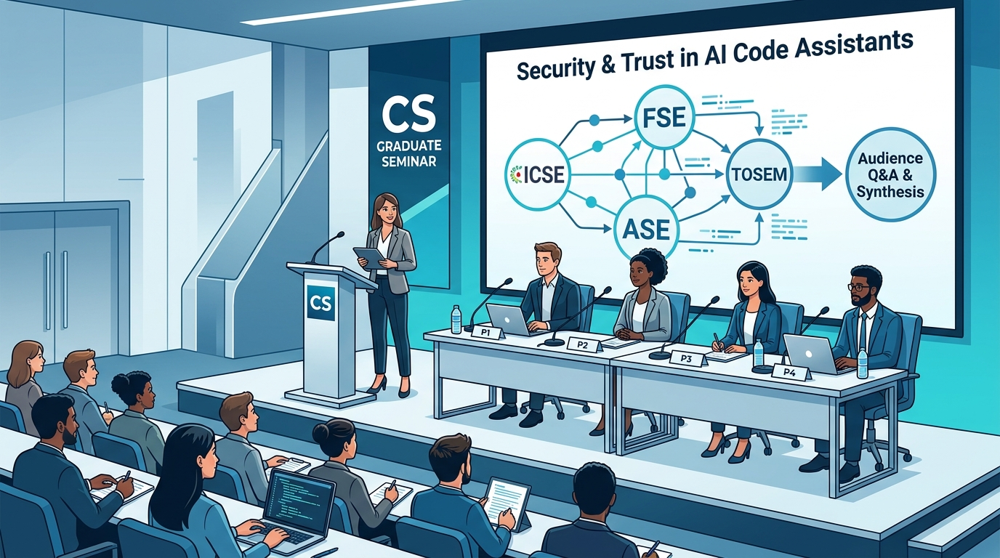

# Advanced Software Engineering

### Course Syllabus & Roadmap — Fall 2026 (115-1)

**Graduate Seminar (進階軟體工程)**  
Instructor: Prof. Nien-Lin Hsueh (薛念林 教授)  
Department of Information Engineering and Computer Science  
Feng Chia University

<!--
Good morning, everyone! Welcome to Advanced Software Engineering for Fall 2026.

My name is Nien-Lin Hsueh, and I am a professor in the Department of Information Engineering and Computer Science here at Feng Chia University.

Whether you are a graduate student starting thesis research or an ambitious senior undergraduate, I am thrilled to have you in this class.

Over the next eighteen weeks, we will explore how modern software systems are architected, tested, verified, and continuously evolved.

Let's flip over to our next slide to look at the course philosophy.
-->
---
## Course Overview & Philosophy

* **Bridging Theory, Modern Toolchains, and AI:**
  * Software Engineering is evolving rapidly from manual implementation to **AI-assisted & spec-driven engineering**.
  * This course balances **classical engineering rigor** (processes, architecture, quality assurance) with **modern paradigms** (generative AI, automated pipelines, empirical analysis).
* **Key Course Attributes:**
  * **Target Audience:** Graduate students and motivated senior undergraduates.
  * **Language of Instruction:** English-friendly / bilingual materials.
  * **Interactive Pedagogy:** Concept Check Questions (CCQ) with real-time polling, architectural critiques, and collaborative discussions.

<!--
Now, let's look at the core philosophy of this course.

Software engineering is changing fast. We are moving from manual coding to AI-assisted and specification-driven engineering.

However, AI tools do not replace fundamentals. In fact, they demand even greater engineering rigor!

That is why this course balances classical foundations—like lifecycles, architecture, and quality assurance—with modern paradigms like generative AI coding agents and automated CI/CD pipelines.

Our materials are English-friendly. We will also use interactive Concept Check Questions—or CCQs—for live polling and classroom discussions.

Here is an important message for everyone: in our discussions, English grammar does not matter at all! Ideas and critical thinking come first. To our Taiwanese students: please don't be shy—speak up and share your thoughts. And to our international students: please have patience, listen actively, and support each other. Let's create a welcoming, collaborative learning environment together!

Let's move ahead to our course learning objectives.
-->
---
## Course Learning Objectives (CLOs)

* **1. Master Core SE Disciplines:**
  * Deeply understand software lifecycles, requirement engineering, object-oriented modeling, and architectural styles.
* **2. Quality-First & Empirical Mindset:**
  * Internalize testing methodologies (black-box, white-box), CI/CD automation, and empirical experimentation.
* **3. Responsible & Rigorous AI Integration:**
  * Learn how to effectively steer AI coding agents, validate AI-generated code, and mitigate hallucinations and technical debt.
* **4. Scholarly & Professional Communication:**
  * Deconstruct peer-reviewed SE literature, run conference-style panels, and deliver production-ready software engineering post-mortems.

<!--
Here are our four main Course Learning Objectives.

First, master core software engineering disciplines. You will deeply understand software lifecycles, requirements engineering, object-oriented UML modeling, and architectural styles.

Second, build a quality-first and empirical mindset. Code without tests is just wishful thinking. You will practice black-box and white-box testing, coverage criteria, and automated CI/CD pipelines.

Third, responsible and rigorous AI integration. Learn how to steer AI coding agents with precise specifications, validate generated code, and catch hallucinations and security bugs.

Fourth, scholarly and professional communication. Through research paper panels and engineering post-mortems, you will learn to articulate and defend technical decisions like practicing software architects.

Let's see our semester roadmap on the next slide.
-->
---
## Curriculum Roadmap: Five Core Modules

* **Module 1: Foundations (Weeks 1)**
  * From the 1968 Software Crisis to Software Engineering; From Software to Qualified Software. 
* **Module 2: Processes & Requirements (Weeks 2–4)**
  * Agile Methodologies, Scrum, DevOps, Spec-Driven AI workflows.
  * Requirements Engineering (Functional/Non-Functional Specs, AI Spec)
* **Module 3: Software Design & Modeling (Weeks 5–9)**
  * Design Principles & Patterns, UML Modeling, Software Architectures.
  * Mid-term exam.
* **Module 4: Quality Assurance & Testing (Weeks 10–13)**
  * Testing Fundamentals & Practices: Black-box testing, white-box testing, coverage criteria.
  * Quality Assurance Model & Process Improvement Model
* **Module 5: Empirical Software Engineering & Capstone Execution (Weeks 14–16)**
  * Controlled experiments, final capstone demos and panel debates.

**Week 3 (09/28) & Week 7 (10/26): National Holiday**

<!--
Take a look at our curriculum roadmap across five core modules.

Module 1 is Foundations. Today, we trace the journey from the 1968 Software Crisis to modern software engineering.

Module 2 covers Processes and Requirements in Weeks 2 to 4. We will explore Agile, Scrum, DevOps, and spec-driven AI workflows.

Module 3 is Software Design and Modeling in Weeks 5 to 9. We will study SOLID design patterns, UML diagrams, and software architectures, leading up to the Midterm Exam.

Module 4 focuses on Quality Assurance and Testing in Weeks 10 to 13. You will master testing fundamentals, coverage metrics, and quality models.

Module 5 is Empirical Software Engineering and Capstone Execution in Weeks 14 to 16. Here, you will conduct experiments and present your final projects.

Please note: Week 3 on September 28th and Week 7 on October 26th are National Holidays. There will be no class on those two days.

Next, let's look at the grading scheme.
-->
---
## Grading Scheme

* **25% — Midterm Exam**
  * Part I Evaluation (25%)
* **25% — Final Exam**
  * Part II Evaluation (25%)
* **20% — In-Class Engagement & QA**
  * Active questioning during panel and pitches
* **30% — Final Capstone Project**
  * Execution of Track 1, Track 2, or Track 3

<!--
Here is the grading breakdown for this semester.

We believe in continuous evaluation across the term rather than relying on a single exam.

Twenty-five percent goes to the Midterm Exam, evaluating Part 1 concepts up through software design.

Twenty-five percent goes to the Final Exam, covering testing, quality models, and empirical methods.

Twenty percent is for In-Class Engagement and Q&A. This includes active participation in CCQ polls and asking thoughtful questions during panel debates.

And thirty percent is dedicated to your Final Capstone Project, which is the major team deliverable of the course.

Now, let's look at the three flexible tracks for your capstone project.
-->
---
## Final Capstone Project: Three Flexible Tracks

* **Team-Based Project:** Performed by teams of **~4 members**.
* **Presentation Duration:** Time period = **25 min × number of members** (e.g., ~100 min for 4 members).
* **Track 1: Academic Paper Panel Discussion**
  * Conducted in a **panel discussion style** to present peer-reviewed papers (*ICSE, FSE, ASE, TSE, TOSEM*).
  * The team acts as panelists (~4 persons) deconstructing papers, synthesizing trade-offs, and running Q&A.
* **Track 2: Software System Prototype & SE Post-Mortem**
  * Live demo + in-depth SE post-mortem focusing on a **thin vertical slice**.
  * Architectural separation, AI-assisted workflow logs, CI/CD pipeline, and automated tests.
* **Track 3: Empirical Software Engineering Experiment**
  * Scientific presentation + replication package (dataset & benchmark scripts).
  * Formulate research questions ($RQ_1$, $RQ_2$), evaluate tools/models, and analyze threats to validity.

<!--
Let's examine your options for the Capstone Project.

This is a team project with about four members per team.

Presentations will be held in a conference style. Each team receives about 25 minutes per member—so roughly 100 minutes for a four-person team.

You can choose from three flexible tracks:

Track 1 is an Academic Paper Panel Discussion. Your team acts as expert panelists deconstructing peer-reviewed papers from top conferences.

Track 2 is a Software System Prototype and SE Post-Mortem. You build a thin vertical slice of a system with automated CI/CD and production-grade rigor.

Track 3 is an Empirical Software Engineering Experiment. You formulate research questions, benchmark tools or LLMs scientifically, and provide a replication package.

Let's look at examples for each track on the following slides.
-->
---
## Track 1: Academic Paper Panel — How It Works

* **What is an Academic Paper Panel?**
  * Similar to paper presentations, but with a **unified theme and strong narrative coherence**.
  * Four panelists present four related papers (*ICSE, FSE, ASE, TSE, TOSEM*).
  * A **Student Moderator** opens with a theme overview, connects the presentations, provides a final synthesis, and leads audience Q&A.
* **Theme Example: "Security & Trust in Generative AI Code Assistants"**
  * **Moderator Intro:** Why AI code security matters to enterprise systems.
  * **Panelist 1 (*ICSE*):** Prevalence and taxonomy of CWE flaws in Copilot code.
  * **Panelist 2 (*FSE*):** Automated hallucination detection in generated tests.
  * **Panelist 3 (*ASE*):** Developer over-reliance & cognitive bias in AI code reviews.
  * **Panelist 4 (*TOSEM*):** Code licensing contamination and privacy leakages.
  * **Moderator Synthesis & Q&A:** Synthesizing trade-offs and moderating class debate.

<!--
Moving on to Slide 7, let's understand how Track 1 works.

A panel discussion is very similar to a research paper presentation. But here is the key difference: it is not four disconnected talks. The papers must share a unified theme and a coherent story.

Your team acts as a professional conference panel. One member serves as the Moderator, and the other members serve as Panelists.

The Moderator opens the session, introduces the central theme, connects the papers together, and at the end, synthesizes the takeaways and moderates questions from the audience.

Look at the theme example on the slide: Security and Trust in AI Code Assistants.

The Moderator introduces why AI code security is critical.
Panelist 1 presents security vulnerabilities from an ICSE paper.
Panelist 2 covers hallucination detection from FSE.
Panelist 3 explains developer cognitive bias from ASE.
And Panelist 4 discusses licensing and privacy risks from TOSEM.
Finally, the Moderator leads an interactive Q&A session with the class.

This track is fantastic for building critical thinking and research presentation skills.

Now, let's advance to Track 2 on the next slide.
-->
---
<!-- _class: title-image-slide -->

## Track 1: Academic Paper Panel — Visual Setup & Flow

  

<!--
Take a look at this illustration on the screen. It shows exactly how your panel discussion should look and feel.

On stage, your team sets up like a formal conference panel.

One member serves as the Student Moderator at the podium. The Moderator opens the session, introduces the central theme, and connects the papers together.

The four panelists sit at the panel table, each presenting their chosen paper from premier conferences like ICSE, FSE, ASE, or TOSEM.

Notice the large presentation screen behind them: all four papers connect to a single unified research theme.

And at the end, the Moderator leads an interactive Q&A session with the class.

This visual gives you a clear mental model of how your team will present Track 1!
-->
---

## Track 2: System Prototype & Post-Mortem — Examples

* **System Example: "Smart Food Ordering & Real-Time Delivery Service"**
  * **Thin Vertical Slice:**
    * Customer cart & order placement $\rightarrow$ Real-time kitchen dispatch webhook $\rightarrow$ Driver location tracking simulation $\rightarrow$ Order fulfillment status (secondary billing, reviews, and catalog mocked).
  * **Engineering Rigor:**
    * **Clean Architecture:** Strict separation between Domain entities, Use Cases, and Web/DB adapters.
    * **Event-Driven & Async:** Message queues for order events, schema validation with Pydantic/Zod.
    * **Automated CI/CD & Testing:** Dockerized testing environment with >85% unit and integration test coverage.
  * **SE Post-Mortem Presentation:**
    * Live vertical-slice demo, followed by an in-depth engineering post-mortem:
    * Concurrency bottlenecks, AI coding logs, prompt reproducibility, and architectural trade-offs.

<!--
Track 2 is designed for software builders who want to create a real system.

You do not need to build a massive, unfinished toy application. Instead, build a thin vertical slice with production-grade engineering rigor.

Let's take a Food Ordering and Delivery System as an example.

What is a thin vertical slice? You don't build everything from scratch. You mock payment gateways and restaurant catalogs. Instead, you focus deeply on one core flow: customer places an order, a webhook dispatches it to the kitchen, a message queue triggers driver dispatch simulation, and order status updates in real time.

Here is what we look for in engineering rigor:
Clean Architecture separating domain rules from databases.
Event-driven asynchronous queues.
And an automated CI/CD pipeline with strong unit and integration tests.

In your final presentation, you give a quick live demo, and then spend the rest of the time on an engineering post-mortem. You explain what failed, what concurrency trade-offs you made, how you used AI tools, and what you learned.

Next, let's look at Track 3 on Slide 9.
-->
---
## Track 3: Empirical SE Experiment — Examples

* **Study Example A: "Benchmarking Open-Source vs. Commercial Coding LLMs"**
  * **Objective:** Controlled benchmark evaluating code correctness and security across models.
  * **Research Questions:**
    * $RQ_1$: Do open-source models (e.g., DeepSeek-Coder, Llama-Code) inject higher rates of CWE flaws than GPT-4o on HumanEval-Security?
    * $RQ_2$: How does test-driven iterative prompting affect pass@k accuracy and token costs?
  * **Deliverables:** Curated benchmark datasets, automated evaluation scripts, and replication Docker repo.
* **Study Example B: "Empirical Evaluation of Automated Program Repair (APR) in CI"**
  * **Objective:** Measure real-world patch correctness vs. plausible test-overfitting across APR tools.
  * **Research Questions:**
    * $RQ_1$: What percentage of LLM-generated bug fixes are semantically sound vs. merely overfitting?
    * $RQ_2$: How does token context window depth impact multi-file bug repair success?
  * **Deliverables:** Defects4J benchmark replication suite, execution telemetry logs, and threat analysis.

<!--
Track 3 is for students interested in empirical data and scientific validation.

Take a look at Study Example A: Benchmarking open-source versus commercial coding models.

You formulate formal Research Questions. For example, RQ1: Do open-source models introduce higher defect rates than proprietary models on security benchmarks? And RQ2: How does test-driven iterative prompting affect accuracy and token costs?

You run automated benchmark scripts, collect statistical telemetry, analyze threats to validity, and package everything in a Docker replication repository.

This is one of the hottest and most important research directions in software engineering today! If you are interested in this track, please come talk to me—I will be happy to share relevant research papers, datasets, and benchmark suites with you.

Now, let's discuss an essential policy on Slide 10: academic integrity in the AI era.
-->
---
## Academic Integrity & Generative AI Policy

* **Generative AI is Welcomed, but Must Be Steered Responsibly:**
  * You are encouraged to use AI tools (e.g., Claude, ChatGPT, GitHub Copilot, Cursor).
  * **Rule of Transparency:** Document where and how AI was utilized (prompts, edits, test generation).
* **The "Accountability" Rule:**
  * **You are 100% responsible** for the correctness, security, and architectural integrity of your submissions. Blindly accepting hallucinated code or fabricated paper citations results in severe penalties.
* **Plagiarism & Authorship:**
  * Uncredited copying of text, diagrams, or code from external repositories or human authors is strictly prohibited.

<!--
Please give this slide your full attention.

In this course, generative AI tools—like Claude, ChatGPT, GitHub Copilot, and Cursor—are not forbidden. In fact, they are welcomed!

However, you must follow two fundamental rules:

First, the Rule of Transparency. Whenever you use AI to draft code, generate tests, or write text, document where and how you used it in your report or commit messages.

Second, the Accountability Rule. You are 100% responsible for every line of code and every claim in your report. You cannot blame the AI for bugs, security holes, or fake citations. If you submit it, you own it!

And naturally, traditional plagiarism—copying external work without proper attribution—remains strictly prohibited.

Let's look at our course resources on Slide 11.
-->
---
## References & Recommended Resources

* **Core References:**
  * Ian Sommerville, *Software Engineering*, 10th Edition, Pearson.
  * Robert C. Martin, *Clean Architecture: A Craftsman's Guide to Software Structure and Design*.
  * Selected top-tier research papers from *ACM/IEEE ICSE, IEEE TSE, ACM TOSEM*.
* **Digital Toolchains:**
  * **Version Control & CI/CD:** GitHub, GitHub Actions, Docker.
  * **Interactive Polling:** NickEduPocket CCQ System (`nickedupocket`).
  * **Slide & Handout Toolchain:** Marp Markdown Slide Engine.

<!--
Looking at Slide 11, here are our primary course resources and tools.

Our core textbook is Ian Sommerville's classic *Software Engineering*, 10th Edition. For software design, we also reference Uncle Bob's *Clean Architecture*.

We will also read selected papers from top-tier venues like ICSE, TSE, and TOSEM.

For our digital toolchains:
All project collaboration and CI/CD pipelines will use GitHub, GitHub Actions, and Docker.
For live classroom polling, we use our own NickEduPocket CCQ system.
And all slides and handouts are built with the Marp Markdown Slide Engine.

Now, let's look at your action items for Week 1 on Slide 12.
-->
---
## Getting Started & Action Items for Week 1

* **Immediate Next Steps:**
  1. Review the Three Capstone Tracks (Academic Panel, System Prototype, Empirical Study).
  2. Brainstorm topics and start reaching out to potential teammates (teams of ~4).
  3. Bring your laptop/mobile device to class for interactive CCQ polls.
* **Course Inquiries & Office Hours:**
  * **Instructor:** Prof. Nien-Lin Hsueh (薛念林 教授)
  * **Office:** Department of Information Engineering and Computer Science
  * **Contact & Appointments:** Via course LMS or email

<!--
Here are your immediate action items for this week:

First, review the three Capstone tracks with your classmates and decide which track fits your interests.

Second, begin team formation. Target teams of approximately four members and start discussing topics.

Third, bring your laptop, tablet, or smartphone to every class so you can participate in our interactive CCQ polls.

Finally, my door is always open. You can find me in the Department of Information Engineering and Computer Science, or reach out by email or the course LMS.

Let's wrap up on our final slide!
-->
---
# Questions & Discussion

### Welcome to Advanced Software Engineering!

Let's build reliable, elegant, and impactful software systems together.

<!--
And that brings us to the end of our course syllabus presentation!

Does anyone have any questions regarding the grading scheme, the project tracks, or teaming rules? Please feel free to ask now!

Once again, welcome to Advanced Software Engineering. I am excited to work with you this semester.

Let's build reliable, elegant, and impactful software systems together.

Thank you everyone, and let's dive into Chapter 1!
-->

