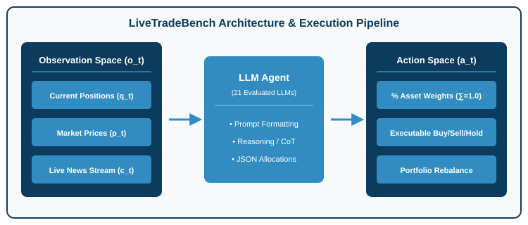
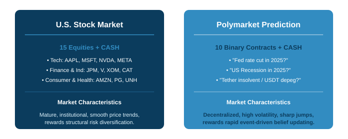
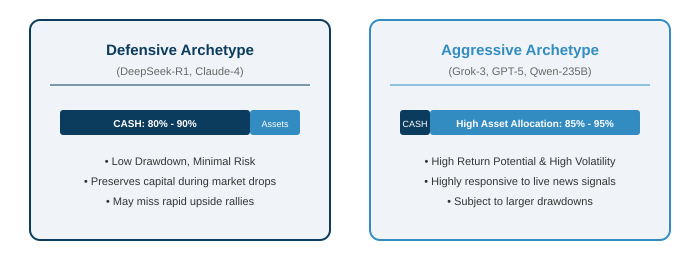

# LiveTradeBench: Seeking Real-World Alpha with LLMs

### Evaluating Large Language Model Agents in Evolving Financial Markets

**Haofei Yu, Fenghai Li, Jiaxuan You**
University of Illinois, Urbana-Champaign (UIUC)
*arXiv:2511.03628 (Nov 2025)*

---

## Focus Questions & Key Topics

* Why do static LLM benchmarks (MMLU, GSM8K, Chat LMArena) fail to evaluate **sequential decision-making under uncertainty**?
* What are the **3 core design principles** of the LiveTradeBench environment?
* How do **U.S. Stock Markets** and **Polymarket Prediction Markets** differ as evaluation testbeds?
* What trading performance metrics (Cumulative Return, Sharpe Ratio, Max Drawdown) emerge across **21 LLMs evaluated over 50 live trading days**?
* Why does a high Chat benchmark score **not imply superior trading returns (Alpha)**?
* What behavioral archetypes (**Defensive vs. Aggressive**) and reasoning dynamics do LLMs display?

---

## Motivation: Beyond Static Evaluation

* **Limitations of Existing LLM Benchmarks:**
  * Knowledge quizzes and math tests evaluate models on *static, single-turn inputs*.
  * Interactive web/computer agents operate in *controllable, deterministic environments*.
* **The Financial Trading Challenge:**
  * Financial markets are **continuous, autonomous, and non-stationary**.
  * The world evolves independently of the agent; actions adjust portfolio allocations under **real-time live uncertainty**.
  * Demands sequential decision-making, risk management, and cross-asset reasoning.

---

## LiveTradeBench vs. Existing Trading Benchmarks

| Benchmark | Sequential Decision | Portfolio Management | Live Data Test | Multi-Market |
| --- | :---: | :---: | :---: | :---: |
| **FinQA** (Chen et al.) | ❌ | ❌ | ❌ (Static) | ❌ (Single) |
| **FLUE** (Shah et al.) | ❌ | ❌ | ❌ (Static) | ❌ (Single) |
| **FinAgentBench** (Bigeard et al.) | ❌ | ❌ | ❌ (Static) | ❌ (Single) |
| **StockBench** (Chen et al.) | 1-Asset | ❌ | ❌ (Backtest) | ❌ (Single) |
| **LiveTradeBench (Ours)** | **✓** | **✓ (Multi-Asset)** | **✓ (Live Stream)** | **✓ (Dual)** |

---

## LiveTradeBench Design & Execution Pipeline

  

---

## Observation & Action Space Formulation

* **Observation Space $o_t = (q_t, p_t, c_t)$:**
  * **Position $q_t$:** Continuous holdings across all assets + CASH.
  * **Market Price $p_t$:** Real-time price stream for equities and binary contracts.
  * **Market Context $c_t$:** Live news feeds collected from Google News.
* **Action Space $a_t$ (Portfolio Allocation Abstraction):**
  * Output percentage weights $a_t = [a_t^{(1)}, \dots, a_t^{(K)}, a_t^{(\text{CASH})}]$ where $\sum a_i = 1.0$.
  * Direct mapping from high-level allocation to executable **BUY / SELL / HOLD** trades without low-level execution complexity.

---

## Dual Market Environments

  

---

## Live Test Experimental Setup

* **50-Day Live Test Period:** August 18, 2025 to October 24, 2025.
* **21 Evaluated LLMs Across 6 Major Model Families:**
  * **OpenAI:** GPT-4o, GPT-4.1, GPT-5, GPT-o3
  * **Anthropic:** Claude-3.5-Sonnet, Claude-3.5-Opus, Claude-4, Claude-4.1
  * **xAI:** Grok-3, Grok-4
  * **Alibaba:** Qwen-2.5-72B, Qwen-2.5-235B, Qwen-2.5-235B-Thinking
  * **Meta / DeepSeek / Moonshot:** Llama-3.3, Llama-4, DeepSeek-V3.1, DeepSeek-R1, Kimi K2
* **5 Evaluation Metrics:** Cumulative Return (CR), Sharpe Ratio (SR), Maximum Drawdown (MDD), Win Rate (WR), Volatility (Vol).

---

## Finding 1: Disconnect Between Chat Scores & Alpha

* **High Chat Scores $\neq$ Superior Trading Alpha:**
  * Models with top rankings on **LMArena** (e.g., GPT-4o, Claude-3.5-Sonnet) do *not* automatically generate positive trading returns.
* **Why the Disconnect?**
  * Chat benchmarks reward conversational fluency, whereas trading rewards **discipline, risk control, and dynamic adaptation**.
  * High-scoring chat LLMs often **over-trade**, react to noise, or hallucinate short-term sentiment trends.

---

## Finding 2: LLM Portfolio Archetypes & Cash Dynamics

  

---

## Finding 3: The Cross-Market Generalization Gap

* **Market Non-Generalizability:**
  * A model's trading performance on U.S. Stocks does **not** correlate with its performance on Polymarket prediction markets.
* **Key Structural Differences:**
  * **U.S. Stocks:** Mature institutional consensus; rewards long-term structural analysis and sector diversification.
  * **Polymarket:** High volatility, speculative sentiment, sharp discrete price jumps; rewards **rapid event-driven belief updating**.

---

## Rebalancing Frequency & News Sensitivity

* **Rebalancing Interval ($k$):**
  * Rebalancing too frequently ($k=1$ day) leads to **over-reaction to market noise** and transaction penalty.
  * Rebalancing too slowly ($k=5$ days) fails to adapt to sudden market inflections.
* **News Sensitivity:**
  * Live news signals act as critical catalysts. Models that integrate news context exhibit superior risk-adjusted returns (higher Sharpe Ratio).

---

## Case Study: Belief-Based Reasoning in Action

* **Reasoning Dynamics (e.g., DeepSeek-R1 & Grok-3):**
  * When fed news of unexpected Fed rate shifts, **DeepSeek-R1** explicitly re-evaluates risk metrics in its reasoning trace before altering allocations.
  * **Grok-3** dynamically shifts capital between Tech stocks and CASH based on macro employment data signals.
* **Conclusion:** Explicit Chain-of-Thought (CoT) reasoning improves decision consistency under market uncertainty.

---

## Concept Check Question 1

  

What is a key design principle of LiveTradeBench that distinguishes it from traditional offline backtesting benchmarks?

* **A.** It uses historical static price datasets from 2010.
* **B.** It streams live market prices and news in real-time, eliminating data leakage and offline backtesting bias.
* **C.** It limits agent actions to single-asset discrete buy/sell commands.
* **D.** It evaluates models exclusively on single-turn conversational quizzes.

  

  

    
  

---

## Concept Check Question 1: Answer

  

What is a key design principle of LiveTradeBench that distinguishes it from traditional offline backtesting benchmarks?

* **Correct Answer: B**
* **Explanation:** LiveTradeBench streams live real-time market data and news, preventing offline data leakage and evaluating LLMs under true live uncertainty.

  

  

    
  

---

## Concept Check Question 2

  

What did the 50-day live evaluation of 21 LLMs reveal regarding Chat benchmark rankings (LMArena) and real-world trading returns?

* **A.** High LMArena scores perfectly predict high trading Alpha.
* **B.** High LMArena scores do not imply superior trading returns, as chat metrics ignore risk control and sequential decision-making.
* **C.** All LLMs achieved identical trading returns regardless of model family.
* **D.** Stock market performance perfectly generalizes to prediction market performance.

  

  

    
  

---

## Concept Check Question 2: Answer

  

What did the 50-day live evaluation of 21 LLMs reveal regarding Chat benchmark rankings (LMArena) and real-world trading returns?

* **Correct Answer: B**
* **Explanation:** Chat benchmarks evaluate single-turn conversational fluency, which fails to capture real-world risk management, asset allocation, and decision consistency.

  

  

    
  

---

## Recap: Fill-in-the-blank Quiz

  

Test your understanding of the core findings in LiveTradeBench:

1. LiveTradeBench formulates agent decisions as multi-asset **`___`** management rather than single-asset buy/sell orders.
2. The benchmark evaluates agents across two distinct environments: U.S. **`___`** and Polymarket **`___`** markets.
3. Models like DeepSeek-R1 adopt a **`___`** portfolio style by holding high CASH percentages to minimize drawdown.
4. Evaluating LLMs in live continuous markets exposes the gap between static benchmark scores and real-world **`___`**.

  

  

    
  

---

## Recap: Answers & Summary

  

Here are the completed concepts:

1. LiveTradeBench formulates agent decisions as multi-asset **portfolio** management rather than single-asset buy/sell orders.
2. The benchmark evaluates agents across two distinct environments: U.S. **stocks** and Polymarket **prediction** markets.
3. Models like DeepSeek-R1 adopt a **defensive (cautious)** portfolio style by holding high CASH percentages to minimize drawdown.
4. Evaluating LLMs in live continuous markets exposes the gap between static benchmark scores and real-world **competence (Alpha)**.

  

  

    
  

---

## Conclusion & Key Takeaways

* **Live Benchmarking Necessity:**
  * Evaluating LLM agents requires dynamic, non-stationary live environments to test true sequential decision-making under uncertainty.
* **Portfolio Management Abstraction:**
  * Multi-asset allocation ($a_t$) naturally forces models to balance risk vs. return and manage cash reserves.
* **Future Directions:**
  * Integrating explicit risk constraints, multi-agent communication, and long-horizon memory in financial LLM architectures.
